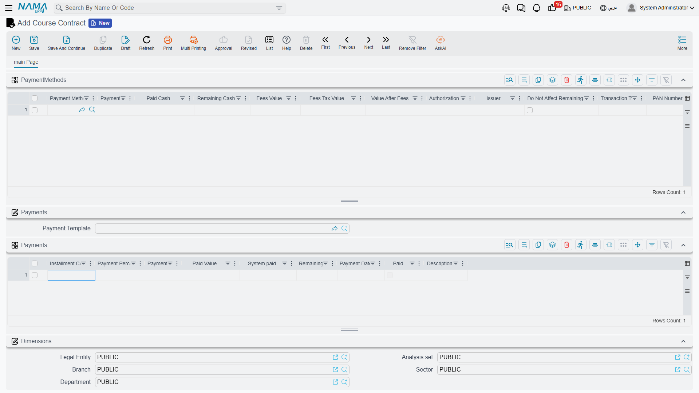

# Payment Schedules and Collection

Very few families pay a year of tuition in one go, and very few companies pay for a training
programme up front. So the [Course Contract](./education-course-contracts) carries two more grids
beside its student lines: **Payments**, which is the promise — the instalment plan the parties agreed
to — and **Payment Methods**, which is the reality — the money that has actually come in.

Keeping those two apart is the whole idea. The schedule says what is due and when; the payment lines
say what was received and how. This page covers both.

## Three ways a schedule comes into being

You can build the plan by hand, let a saved template build it, or let a dialog build it. All three
end up writing lines into the same **Payments** grid.

### Typing the lines yourself

The grid is fully editable. Add a line, give it a **Payment Value** and a **Payment Date**, and
that is a valid instalment. You can leave the **Installment Code** blank — the system fills it in
when you save (see below).

This is the right approach for the awkward cases: a family that pays half in September and half in
February, a company that insists on paying against milestones, a plan that was negotiated line by
line. It is also the slowest, which is why the other two options exist.

### Choosing a Payment Template

The header field **Payment Template** points at a saved plan — *four equal monthly instalments after
a 20% down payment*, say — that your organisation set up once and reuses on every contract. Picking
one on the contract immediately builds the schedule.

The template works in two steps. First it applies its **down payment**, either as a fixed amount or
as a percentage; that amount is set aside as paid at signing and comes off the top. Then it spreads
what is left:

- An **equal-payment** template produces the number of instalments it specifies, each worth the
  balance divided by that count, with dates marching forward one period at a time. Rounding is
  handled by letting the **last** instalment absorb the difference, so the lines always add back up
  to the exact balance. The template decides whether the first instalment sits on the contract's
  value date or one full period after it.
- A **variable-payment** template produces one instalment per line in the template, each either a
  fixed amount or a percentage of the balance, with its own interval and its own description carried
  across.

If the template specifies a rounding approximation, every instalment except the last is rounded to
that multiple and the last one takes the balance — which keeps the plan tidy without losing a
piastre.

::: warning Choosing a template replaces the schedule
The template does not merge with what is already in the Payments grid; it **rebuilds it**. Anything
you had typed there by hand is gone. So set the template first, and hand-adjust afterwards — never
the other way round.
:::

Payment templates are a platform-wide feature and are set up outside the Education menu; the
[Payment Schedules User Guide](/modules/invoicing/payment-schedules-user-guide) covers building them.

### The Generate Payments button

When the plan is a one-off and does not deserve a saved template, use the **Generate Payments**
button on the contract's toolbar. It asks the same questions a template would answer, but asks them
now:

- **How many instalments** to produce.
- **The period between them** — a number plus a unit (Day, Week, Month, Year; Month is the default).
  "1 Month" gives monthly instalments, "3 Month" gives quarterly ones.
- **Where to start** — the date the first instalment is measured from — plus an optional **grace
  period**, again a number and a unit, that pushes the first due date out before the count begins.
  A one-month grace on a course starting in September means the first instalment falls in October.
- **Rounding** — an approximation to round each instalment to, and whether to round up, down or to
  the nearest.
- Optional **down payment**, and optional overrides for the **first**, **second** and **last**
  instalment when those need to differ from the rest.
- A **day of the week** to align the due dates on, when a collection run happens on a fixed weekday.

Generate Payments needs the contract to be worth something first — it refuses to run against a
contract whose lines have not been filled in.

## A worked example

Take a professional training course sold at **24,000**, paid over **eight monthly instalments after
a 4,000 down payment**, on a contract whose value date is 1 September.

The down payment of 4,000 is taken off the top, leaving **20,000** to schedule. Eight equal
instalments of **2,500** are written into the Payments grid, dated one month apart — 1 October,
1 November, and so on to 1 May. Together the eight lines add up to exactly the 20,000 that remains,
which is what the system checks when you commit.

Now make it less tidy. Suppose the fee were **24,500** instead. After the same 4,000 down payment
the balance is 20,500, and 20,500 ÷ 8 is 2,562.50. The system writes seven lines of 2,562.50 and
lets the **eighth** absorb the remainder, so the plan still totals exactly 20,500.

Add a rounding approximation of 100 rounding down, and it gets tidier again: seven instalments of
2,500 and a final instalment of 3,000 (20,500 − 7 × 2,500). Round-number instalments for the family,
exact total for the ledger.

::: tip When the totals do not match
"Payments total is not equal to remaining" means the schedule and the contract disagree. It almost
always happens because someone edited a student line — changed a price, added a student, applied a
discount — **after** the schedule was generated. Regenerate the schedule, or adjust a line by hand,
so the instalments add back up to what is left to pay.
:::

## Instalment codes

Every instalment carries an **Installment Code**, and it has to be unique within the contract.
You rarely type one: **when you save, the system fills in any code left blank.** How it builds them
is a system-wide setting, so all documents in your installation behave the same way. Out of the box
the code is the contract's value date followed by a two-digit line number — a contract dated
1 September 2026 produces `2026090101`, `2026090102`, and so on. Installations can switch that to the
document code plus the line number, or to a formula of their own.

The codes matter more than they look, because they are how anything else refers to a specific
instalment: the [cancellation document](./education-contract-cancellation) settles instalments by
code, and so does any payment document that pays one off.

## Reading the Payments grid

| Column | What it tells you |
|---|---|
| **Installment Code** | The instalment's unique reference within the contract |
| **Payment Percentage** | The instalment's share of the plan, when it was built from percentages |
| **Payment Value** | What is due |
| **Paid Value** | What you record as paid against it by hand |
| **System paid** | What the system has settled against it from other documents |
| **Remaining** | What is still owed on this instalment — the value less both paid columns |
| **Payment Date** | When it falls due |
| **Paid** | Ticked by the system once nothing is remaining |
| **Description** | Free text, carried across from a variable-payment template |

**Remaining** and **Paid** are maintained for you and are the two columns to look at when someone
asks whether an instalment is settled. **System paid** is the interesting one: it rises whenever
another document settles this instalment, and the **Installment Payments** button on the contract's
toolbar opens the list of exactly which documents did so and for how much. That list is the answer to
"who paid this, and when?".

If the document term has **Pay Installments In Order** switched on, instalments must be settled
oldest first — a useful guard against a family paying June while May is still open.

## Collecting money on the contract

Money received against a contract is recorded on the contract itself, in the **Payment Methods**
grid. There is no receipt voucher to raise and no separate collection document to chase: you add a
line, and the money is booked as part of the contract's own effect.

Each line names a **Payment Method** — cash, a particular bank, a card terminal, a cheque — and this
is the field that does the accounting work. **The payment method carries its own accounting sides**,
so choosing "Cash — main drawer" books the money to the cash account and choosing "Bank transfer —
Riyad Bank" books it to that bank account, without the document term needing to know anything about
it. That is also why the Payment Method column is mandatory: without it the system has nowhere to put
the money.

Beside the method, a line records:

- **Payment Value** — the amount received on that method. A contract paid partly in cash and partly
  by card is two lines.
- **Paid Cash** and **Remaining Cash** — for the cash-handed-over-and-change-given case.
- **Fees Value**, **Fees Tax Value** and **Value After Fees** — the card or transfer charge, so the
  net that reaches you is visible on the line.
- **Authorization Number** and **Issuer** — the transaction reference and the issuing bank, which is
  what you will be asked for when a payment is disputed weeks later.
- **Transaction Type**, and — for card terminals — a set of terminal fields the payment gateway fills
  in on its own.
- **Do Not Affect Remaining**, for the occasional line that should be recorded without counting
  towards what has been settled.

::: info Cashier entries and shifts
When the contract belongs to an **open shift**, the collection also produces cashier entries, so the
money shows up in that cashier's shift and in the shift reconciliation at the end of the day. A
contract entered outside any open shift books to the ledger exactly the same way, but produces no
cashier entries — there is no shift for them to belong to.
:::

Like every other effect on the contract, the collection is processed in the background as part of the
document's business request, and can be monitored and retried from the **Business Requests** list
view — see
[How documents are processed into accounting effects](/modules/accounting/support/accounting-request-processing).

## When money has to go back

Refunds do not happen on the contract. Money returned to a family is recorded on the
[Course Contract Cancel](./education-contract-cancellation) document, which reverses the contract's
entry and settles the outstanding instalments in one move. Which accounts each side of that reversal
touches is, as always, a question for the [Document Terms](./education-document-terms).
