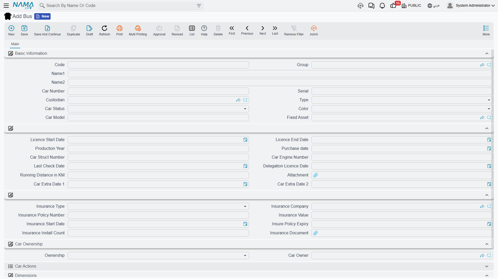
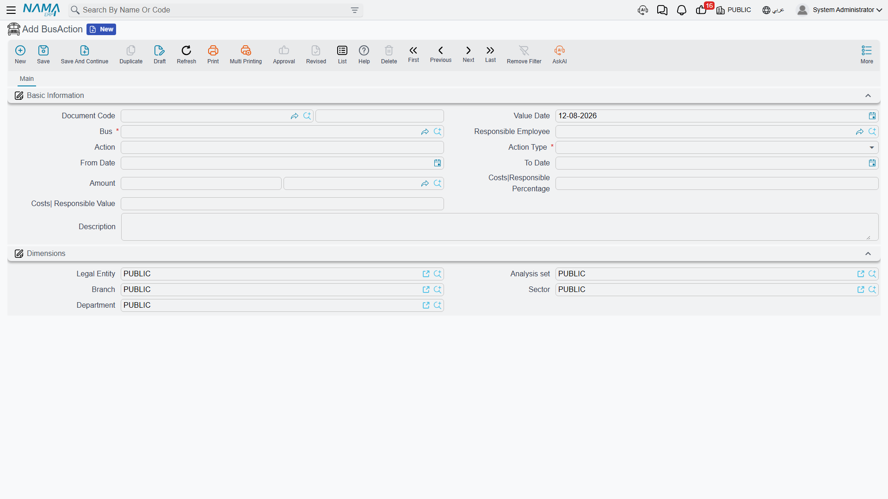
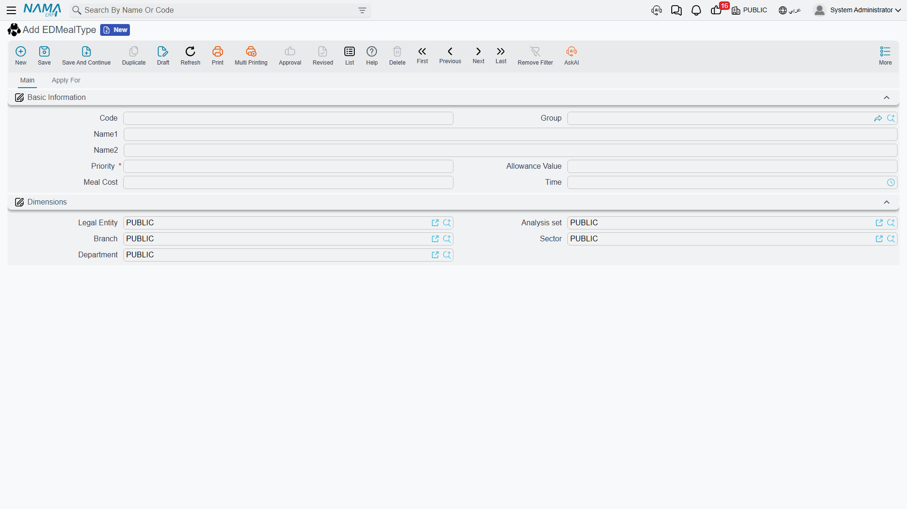
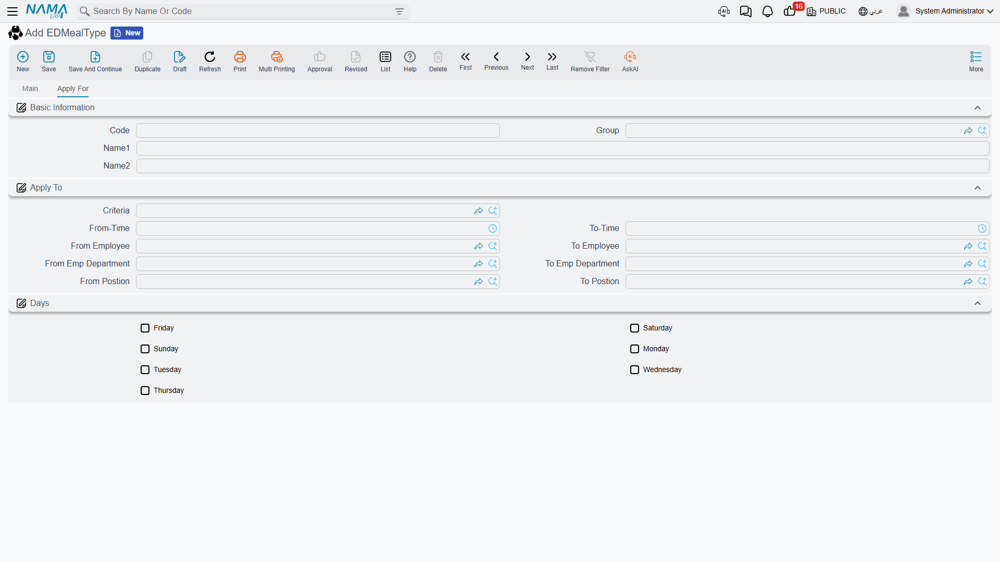
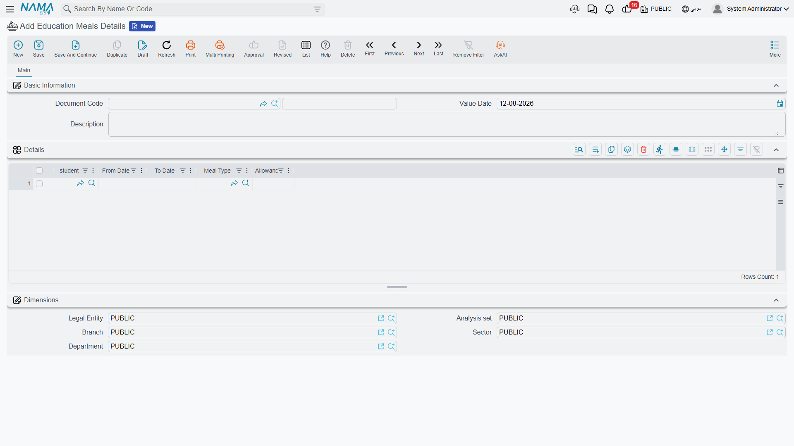
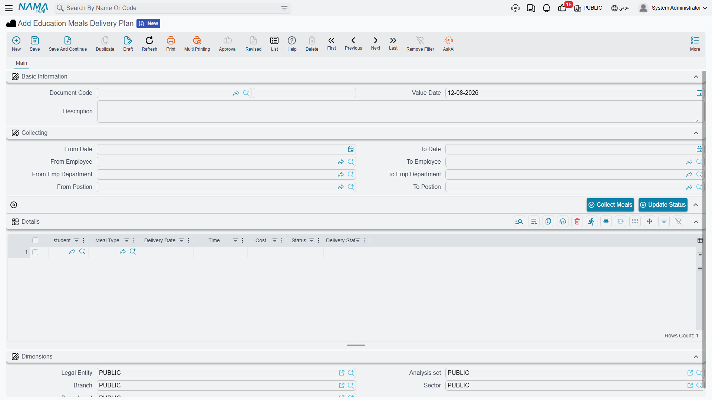
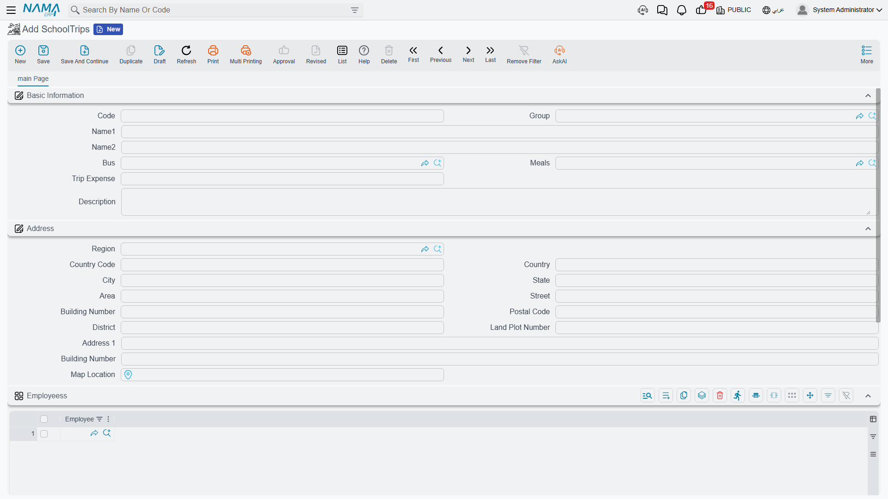

# Buses, Meals and School Trips

A school runs on more than lessons and fees. It owns vehicles that need licences and repairs, it
feeds children at midday, and it takes them out on trips. Education gives you a screen for each of
these, grouped in the menu under **Education → Vehicles**, **Education → Meals** and
**Education → School Trips**.

Before you open any of them, it helps to know exactly what kind of screens these are.

::: info These screens are registers
Everything on this page **records** rather than **moves**. A bus record says what you own, a bus
action says what happened to it and what it cost, a meal plan says what was served to whom, and a
school trip says who went where. None of these screens creates an accounting entry, and none of them
moves stock. The amounts you type on them — a repair cost, a meal cost, a trip expense — are figures
kept for reference and reporting; they never reach the ledger, never become an expense document, and
never appear on a student's fees.

In Education, money reaches the ledger from one place only: the
[Course Contract](./education-course-contracts) and its cancellation.
:::

That is not a limitation to work around; it is what these screens are for. A school secretary who
needs to answer "when does bus 4's licence expire?", "how much did last term's accidents cost us?",
"which children get the vegetarian meal?" or "who escorted the museum trip?" has a place to keep
that information, and the ordinary list-view search, export and audit-trail tools apply to it like
any other Nama screen.

Two of these screens are **master files** (Bus, Meal Type, School Trip) — permanent cards with a
code and a name that you create once and reuse. Three are **documents** (Bus Action, Education Meals
Details, Education Meals Delivery Plan) — they carry a document book, a code and a value date, and
they follow the usual draft-then-commit lifecycle. All of them carry the standard **Dimensions**
group (legal entity, analysis set, branch, sector, department), so a school with three branches can
keep each branch's vehicles and meals apart and report on them separately.

## The vehicle register (Bus)

**Education → Vehicles → Bus** is one card per vehicle. Despite the name, it suits any vehicle the
school runs — a 50-seat bus, a minivan, the principal's car.

The identity part of the card is what you would read off the vehicle and its papers: the **code**
and a **group** for filing, the **Arabic and English names** you want to see in dropdowns
("Bus 4 — Morning Route" reads better in a reference field than a plate number), the **car number**
(the plate), the **serial**, the **chassis number** and **engine number**, the **car model** and
**production year**, the **colour**, and a **type** and **status** you pick from short lists you can
adapt to your own fleet conventions.

Next comes the paperwork you actually need reminding about: **purchase date**, **licence start date**
and **licence end date**, **last check date**, the **expiry of the driving delegation**, the
**distance covered** (the odometer reading in kilometres), an **attachment** for a scanned licence
or inspection certificate, and two spare dates for anything else your traffic authority makes you
track. Because these are ordinary fields, a list view filtered on licence end date within the next
30 days is the renewal reminder most schools end up building.

The insurance block sits with them: **insurance type**, the **insurance company** (a third party
from your own party file), the **policy number**, the **insurance value**, the **start date** and the
**policy expiry date**, the **number of insurance instalments**, and a slot for the **insurance
document** itself.

### Who holds the bus, and who owns it

Two different questions, two different fields.

**Custodian** points at an **employee** — the person the vehicle is entrusted to, in the same custody
sense the rest of the system uses. It is the name you call when the bus is not where it should be.

**Ownership** answers the second question: the ownership type says whether the vehicle is
**company-owned**, **fully leased** or **partially leased**, and **car owner** points at the third
party you lease it from when it is not yours. A school running eight owned buses and two hired for
the exam season records exactly that, and can list the hired ones at a glance.

### Linking a bus to its fixed asset record

If the vehicle is capitalised, it also exists in [Fixed Assets](../fixedassets/) as an asset with a
depreciation schedule. The bus card carries an optional **Fixed Asset** reference so the two records
can be tied together, letting anyone looking at the bus jump straight to the asset it corresponds to.

The link is informational and points in one direction: it tells a reader "this bus is that asset". It
does not copy anything between the two records, so keep the fields you care about on the card you
actually work in — depreciation and disposal on the asset, plates, licences and custody on the bus.

::: tip Find a bus the way your staff think of it
The Bus list screen lets you search by **custodian** and by **car number**, and shows custodian, car
number, model and colour as columns. Someone who only remembers "the white one Ahmed drives" can
still find the record.
:::

## Logging what happens to a bus (Bus Action)

**Education → Vehicles → Bus Action** is the incident and maintenance log. Each document is one
event on one bus, so a vehicle's history is simply its list of bus actions, filtered by bus.

The **bus** and the **action type** are the two things you must fill in. The action type is what
happened:

| Action type | Typical use |
|---|---|
| License Renewal | The annual licence was renewed |
| Accident | The vehicle was involved in a collision |
| Violation | A speeding or parking fine arrived |
| Regular Maintenance | The scheduled service at 10,000 km |
| Repair | Something broke and was fixed |
| Other 1 / Other 2 / Other 3 | Spare slots for whatever else your school tracks |

Around them you record the story: the **document code** and **value date** that identify the log
entry, an **action** name in free text ("front tyre blowout on the ring road"), the **responsible
employee**, a **from date** and **to date** for events that cover a period — a workshop visit that
kept the bus off the road for four days, a licence valid from one date to another — an **amount**
with its **currency**, and a **description** for the detail that does not fit anywhere else.

### The cost and the responsible person's share

Two more figures sit under a Costs heading: the **responsible percentage** and the **responsible
value** — how much of the cost the responsible person carries.

Say a driver clips a gatepost and the bodywork costs 4,000 to put right. The school decides the
driver bears a quarter of it. You record the amount as 4,000, the responsible percentage as 25 and
the responsible value as 1,000.

::: warning These figures are recorded, not booked
Both figures are numbers you type, exactly as you and the driver agreed them. The system keeps them
on the log entry and reports on them; it does not calculate one from the other, and it does not book
any of them. There is no journal entry for the 4,000, no payable to the workshop, and no payroll
deduction for the 1,000 — if the school really is going to recover that money, it is arranged
through the ordinary accounting and payroll documents, and this log entry stands as the record of
why.
:::

The same is true of a licence renewal of 1,200 or a 300 speeding fine: the bus action is the place
you write down what it cost, and its value is in the history it builds up. After a year you can list
every accident on the fleet, total the repairs by bus, and see which vehicle is costing you the most.

## The meal catalogue (Meal Type)

**Education → Meals → Meal Type** is where you describe the meals themselves, once, so the delivery
screens can refer to them by name.

A meal type carries the usual **code**, **group** and **Arabic and English names** — "Hot Lunch",
"Sandwich", "Vegetarian", "Breakfast Snack" — plus:

| Field | What it holds |
|---|---|
| Priority | A ranking number for the meal, required on every meal type |
| Allowance Value | The cash value of the meal when it is given as an allowance instead of food |
| Meal Cost | What the meal costs the school |
| Time | The time of day the meal is served |

A second page, **Apply For**, describes when the meal is meant to be served: a **from time** and
**to time**, and a checkbox for each of the seven days of the week. A hot lunch served from 12:00 to
13:00 on Sunday through Thursday is described in a few clicks; a Saturday-only activity-day snack
sits beside it as its own meal type.

These values describe the meal. They are reference data for the people running the kitchen and for
whoever prices the catering contract — not a calculation the system performs. The cost you record
here is not carried onto delivery lines and does not become a charge to anyone.

## Who is entitled to which meal (Education Meals Details)

**Education → Meals → Education Meals Details** is the entitlement register — the closest thing in
the module to a meal subscription list. It is a document with the usual code, value date and
description, and a **Details** grid where each line answers "for this student, over this period,
which meal, and in what form?":

| Column | What you record |
|---|---|
| Student | The student the entitlement belongs to |
| From Date / To Date | The period the entitlement runs for |
| Meal Type | Which meal from the catalogue |
| Allowance Type | **Meal** (the child is served food), **Meal Allowance** (the value is given instead) or **Not Applicable** |

One document per term, with a line per subscribed child, is the natural rhythm: 180 children on the
hot lunch from the first day of term to the last, a dozen on the vegetarian meal, and a handful whose
families take the allowance instead. When a child joins in the middle of the term, add a line with
that day as its from date.

The allowance type is a statement about the arrangement — food or cash — kept for the people who run
the kitchen and answer parents' questions. Choosing **Meal Allowance** records that this family takes
the value rather than the food; it does not generate a payment or add anything to the student's
account.

## Recording what was actually delivered (Education Meals Delivery Plan)

Entitlement is one thing; what left the kitchen on a given day is another, and
**Education → Meals → Education Meals Delivery Plan** is where that is kept.

The header is a plain document header — **document code**, **value date** and a **description** — and
the substance is in the **Details** grid, one line per meal handed over:

| Column | What you record |
|---|---|
| Student | Who received it |
| Meal Type | Which meal |
| Delivery Date | The day it was delivered |
| Time | The time it was handed over |
| Cost | The cost you want recorded against this delivery |
| Status | **Planned**, **Delivered** or **Cancelled** |
| Delivery Status | What was actually given: **Meal**, **Meal Allowance** or **Canceled** |

The two status columns answer two different questions, and it is worth agreeing internally how your
school uses them. **Status** tracks the line's own lifecycle — it was planned, then it was delivered,
or in the end it was cancelled. **Delivery Status** records the form the child received it in, which
matters when some families take the allowance: a line can be Delivered with a delivery status of Meal
Allowance, meaning "settled, but as cash rather than food".

A practical way to work is one delivery plan per day or per week: enter the lines for the children
expected, leave them **Planned**, and after the meal service go back and set the ones that were
served to **Delivered** with the right delivery status, and the absentees to **Cancelled**. What you
end up with is an accurate record of the week's service — how many meals of each type actually went
out, and to whom.

The cost column behaves like every other amount on this page: it is a figure kept on the line for
reporting. It does not draw stock from a warehouse, does not create a purchase, and does not reach
any student's fees.

## School trips (School Trip)

**Education → School Trips → School Trip** records the trips themselves. It is a master file, so
each trip is a named card you can point at from anywhere the system offers a reference.

The card opens with the **code**, a **group** for filing trips by kind (day trips, camps, sports
fixtures), and the **Arabic and English names** — "Science Museum, Grade 5" is the sort of name that
earns its keep in a list a year later. Then:

- **Bus** — the vehicle from the bus register that takes the group.
- **Meals** — the meal type from the catalogue that will be served on the day.
- **Trip Expense** — a single figure for what the trip costs, recorded for reference like every other
  amount here.
- **Description** — for the plan, the itinerary or anything the escorts should know.

An **Address** block records where the trip is going, using the standard address fields — region,
country, city, state, area, street, building number, district, postal code and a map location — so
the destination is on the record rather than in someone's memory.

The heart of the screen is the two lists at the bottom. The **Employees** grid names the staff who
went — the teachers and supervisors escorting the group — and the **Students** grid names the
children who went. Between them, the trip card answers the question that matters most after the fact:
who was on that bus.

The bus and meal references are pointers that describe the trip's arrangements. They tell a reader
which vehicle and which meal the trip used; the bus register and the meal screens carry on holding
their own records independently, so nothing you enter on a trip changes them.

::: tip A trip record is a headcount you will be glad to have
The students grid is the register that a parent's question, an insurance query or an incident report
will send you back to. Fill it in properly on the day, from the same list the escorts used at the
door, and file the trips under a sensible group so a year of trips reads as a coherent list.
:::

## How this fits with the rest of Education

These screens sit alongside the school-administration half of the module. The students you pick on a
meal line or a trip come from the same student file described in
[Students, Guardians and the Academic Structure](./education-master-files), and the employees you
name as custodians, responsible drivers or trip escorts are ordinary employee records. Where a child
was on a given day is a matter for
[Attendance, Daily Monitoring and Leave](./education-attendance) — a trip record lists who went, not
who was marked present.

And, to say it once more because it is the question people ask: nothing on this page carries a charge
to a family. Fees live entirely on the [Course Contract](./education-course-contracts) and its
[payment schedule](./education-payment-schedules).
