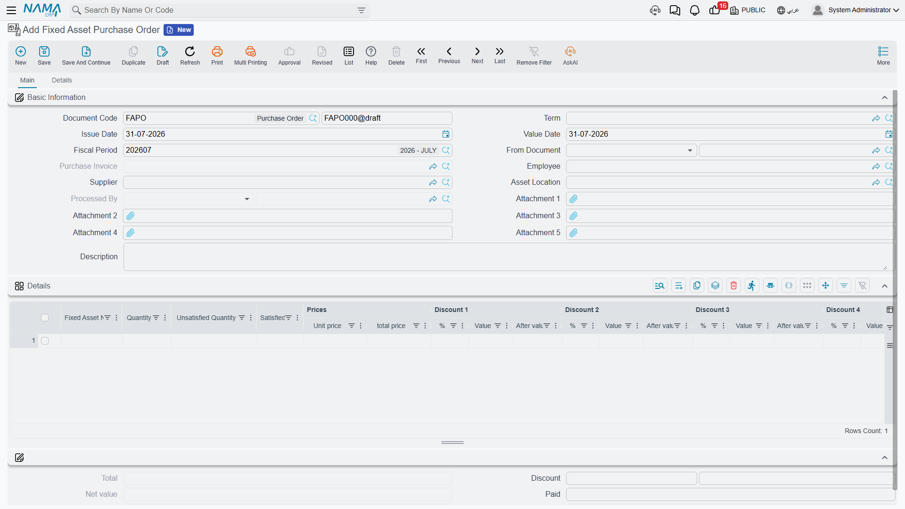
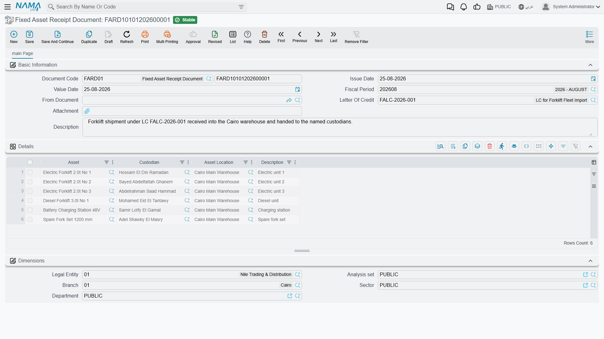

# How an Asset Is Acquired

Buying a machine is not one event. Somebody asks for it, somebody shops for it, somebody signs an
order, the supplier's invoice eventually arrives, and one day a truck turns up at the gate. Fixed
Assets gives each of those moments its own document — but only **one** of them costs money in the
books, and only one of them turns a piece of equipment into a record that can be depreciated.

Get that distinction straight and the whole chain becomes easy. Miss it and you will spend a week
wondering why an approved purchase order never showed up in the general ledger.

## The chain, in one picture

```text
  Fixed Asset Purchase Request        paperwork — what we need
             │
             ├──────────────►  Fixed Asset Offer          paperwork — what it costs
             │                          │
             ├──────────────►  Fixed Asset Purchase Order paperwork — what we committed to
             │                          │
             └──────────────►  Fixed Asset Initial Receipt paperwork — it arrived, no invoice yet
                                        │
                                        ▼
                        Fixed Asset Purchase Document      ★ money and the asset register
                                        │
                                        ▼
                        Fixed Asset Receipt Document       who took it, where it went


  Separate entry point, for assets you already own:

                        Fixed Asset Opening Document       cost + depreciation already taken
                                        │
                        Fixed Asset Opening Document Update  corrections to the above
```

Read from the top, each document is built on the one before it by picking it in the **From Document**
(بناءا على) field. Nothing is compulsory: a small company can go straight to the purchase document
and never raise a request in its life. The chain exists so that larger organisations can separate who
asks, who negotiates, who commits and who pays.

| Document | Arabic name | Does it book anything | What it changes |
|---|---|---|---|
| Fixed Asset Purchase Request | طلب شراء أصل | No | Records the ask; tracks how much of it has been satisfied |
| Fixed Asset Offer | عرض سعر أصل | No | Records a supplier's quotation with prices, discounts and taxes |
| Fixed Asset Purchase Order | أمر شراء أصل | No | Records the commitment; ticks off the request's quantities |
| Fixed Asset Initial Receipt | سند استلام أصل مبدئي | No | Records that the goods arrived before the invoice did |
| **Fixed Asset Purchase Document** | **سند شراء أصل ثابت** | **Yes** | **Capitalises the asset and posts to the ledger** |
| Fixed Asset Receipt Document | مستند استلام أصل | No | Writes the asset's location and adds a row to its custody history |
| Fixed Asset Opening Document | افتتاح أصل ثابت | Yes | Brings an already-owned asset in with its accumulated depreciation |

Everything in that table except the purchase document and the opening document is **paperwork**: it
computes prices, taxes and totals so that people can compare and approve, but no journal entry is
produced and the asset register is untouched. Prices and taxes on an offer, an order or an initial
receipt are there for comparison — nothing is capitalised and nothing is owed until the purchase
document is committed.

::: info Where the accounting actually happens
Both financial documents create their journal entry as a **business request** (طلب أعمال) processed
in the background, so the document saves instantly and the entry appears a moment later. If an entry
is missing, open the Business Requests list view, filter for failures, select the rows and use
**More → Reprocess / Recommit**.
:::

## Where the asset record is born

This is the question that decides how you set the module up, so it is worth being blunt about it.

A fixed asset in Nama is a **master file record** — a code, a name, a type, a set of accounts. The
documents in this chain do not create that record casually. There are exactly two places it can come
into existence during an acquisition:

**Route 1 — the record already exists, and the purchase gives it a value.** Somebody creates the
asset record first (by hand, or — for assets capitalised out of a finished contracting project — with
the [fixed asset creation document](/modules/fixedassets/master-files/fixedassets-creation-document.md)).
A brand-new record sits in status **Initial** (إبتدائى): it has a name and a type but no cost, no
depreciation start date and no instalment. The purchase document's asset picker only offers assets in
that state. When the purchase is committed, the record receives its cost and its dates and moves to
**Running Depreciation** (جارى الإهلاك). This is the default and it is what most installations use,
because it lets you code, classify and account-map assets deliberately rather than in the middle of
typing an invoice.

**Route 2 — the purchase document creates the record itself.** Switch on **Create Asset If Not Found**
(إنشاء الأصول إذا لم تكن موجودة) on the purchase document's
[term](/modules/fixedassets/document-terms/fixedassets-terms-acquisition.md) and a line no longer
needs an asset: it can carry a **fixed asset type** instead, and the record is created for you at the
moment the document is committed. The full story — including the module setting that puts the name,
serial number and classification columns on the grid so there is something to create the asset
*from* — is on the [purchase document](/modules/fixedassets/acquisition/fixedassets-purchase-document.md)
page.

The third possibility is not part of this chain at all: assets you already owned before Nama went
live are registered by hand and then valued by the
[opening document](/modules/fixedassets/acquisition/fixedassets-opening-balances.md),
which brings in both the original cost and the depreciation already taken. Imported machinery has a
fourth route of its own — the [letter of credit chain](/modules/fixedassets/letters-of-credit/fixedassets-lc-overview.md),
where the cost is not known until freight and customs have been distributed.

## Al-Waha buys a CNC machine

Al-Waha Industries runs a plant in Riyadh on monthly fiscal periods. The production manager wants a
CNC cutting machine. Here is the whole chain with the figures that the rest of this documentation
keeps using.

1. **The request.** Production raises a *Fixed Asset Purchase Request* naming "CNC Cutting Machine",
   quantity 1. No prices, no supplier. See
   [purchase requests](/modules/fixedassets/acquisition/fixedassets-purchase-request.md).

   

2. **The offers.** Purchasing collects two quotations. Gulf Machinery Trading quotes **240,000**; a
   competitor quotes 252,000. Each becomes a *Fixed Asset Offer* so the two can be compared on paper.

3. **The order.** Gulf Machinery Trading wins, and a *Fixed Asset Purchase Order* is raised from the
   request. The request's satisfied quantity moves to 1 and its unsatisfied quantity to 0, so nobody
   orders the same machine twice. See
   [offers and orders](/modules/fixedassets/acquisition/fixedassets-purchase-offers-and-orders.md).

   

4. **The invoice.** The machine is delivered and Gulf Machinery Trading invoices. Accounting raises a
   *Fixed Asset Purchase Document* from the order, dated 1 January 2026. The asset record `MCH-0007`
   is picked on the line, useful life **60 months** and salvage value **24,000** come in from the
   asset type, and the depreciation start date is set to 1 January 2026.

   On commit, `MCH-0007` carries a cost of **240,000**, an instalment of
   (240,000 − 24,000) ÷ 60 = **3,600** per period, and its status becomes Running Depreciation. The
   supplier is credited and the machinery cost account is debited.

   

5. **The hand-over.** A *Fixed Asset Receipt Document* records that the machine now stands in
   `LOC-R2 — Riyadh Plant, Hall 2` and that Khaled Al-Mutairi signed for it. Nothing is posted; this
   is the custody and location trail. See
   [receipts](/modules/fixedassets/acquisition/fixedassets-receipts.md).

   

From here the machine belongs to the register: it is
[depreciated](/modules/fixedassets/depreciation/fixedassets-depreciation-document.md) every month,
[upgraded](/modules/fixedassets/depreciation/fixedassets-additions-and-deductions.md) in January
2027, [moved](/modules/fixedassets/movement/fixedassets-transfer-document.md) to another hall, and
finally [sold](/modules/fixedassets/disposal/fixedassets-disposal.md) at the end of 2027.

## How the documents actually link up

Picking a source in **From Document** does two things: it copies header information — supplier,
employee, location, department, shipping address — and it builds the detail lines for you.

One copy rule surprises people, so learn it now. When a purchase document is built from an order,
**each source line is exploded into one line per unit**. An order line for three forklifts at 100,000
each becomes three purchase lines of quantity 1 at 100,000. That is deliberate: a fixed asset record
is one physical thing with one cost, one useful life and one serial number, so three forklifts must
become three asset records, not one line of three.

Downstream documents also leave a trail on their source. A committed order stamps **Processed By**
(تمت معالجتة بواسطة) on the request it came from, and a committed purchase document stamps itself on
the order. When you pick a source on a new purchase document, orders that have already produced one
are filtered out of the list.

::: tip Tracking what has been delivered
The request's **Satisfied Qty** and **Unsatisfied Qty** columns, and the **Total Unsatisfied Qty**
figure in its header, are advanced by the offer, order or initial receipt raised **from the request
itself**. Route your fulfilment tracking through those documents and the counters stay honest.
:::

## The buttons along the chain

Most of this chain is typed rather than generated, so it is worth knowing up front where a button
exists and where one does not:

| Screen | Button of its own | What it does |
|---|---|---|
| Fixed Asset Purchase Request | none | the request is consumed from the next document's **From Document** |
| Purchase Offer, Purchase Order, Initial Receipt | **GeneratePayments** (إنشاء الدفعات) | spreads the outstanding amount across the payment schedule grid |
| Fixed Asset Purchase Document | **GeneratePayments** (إنشاء الدفعات) | the same, on its *Shipping and billing* page |
| Fixed Asset Receipt Document | none | — |

Everything else that looks automatic — a request's satisfied quantities moving, an order exploding
into one line per unit, a receipt pre-filling custodians and locations — happens the moment you pick
a **From Document**, with nothing to press.

## Licences and where to click

Everything above lives under **Assets > Documents** (الأصول > المستندات) and needs only the base
`fixedassets` licence — with one exception worth memorising:

| Document | Licence | Menu folder |
|---|---|---|
| Request, offer, order, initial receipt, purchase document, opening document, opening update | `fixedassets` | Assets > Documents |
| **Fixed Asset Receipt Document** | **`fixedassets-lc`** | Assets > Custody Of Assets |
| Custodies Delivery Receipt Document | `fixedassets-custody` | Assets > Custody Of Assets |

The receipt document sits behind the **letter-of-credit** licence because its header carries a Letter
Of Credit reference — it is the document that signs for a shipment arriving against an LC as well as
one arriving against an ordinary purchase. If a customer with only the base licence cannot find
"Fixed Asset Receipt Document" in the menu, that is why.

The last document in the family, the
[Custodies Delivery Receipt](/modules/fixedassets/acquisition/fixedassets-delivery-receipt.md), is
not really an acquisition document at all — it moves things that are already owned from one employee
to another — but it is the one place where fixed assets and
[custody items](/modules/fixedassets/custody/fixedassets-custody-overview.md) appear on the same
grid, so it is documented alongside them here.
