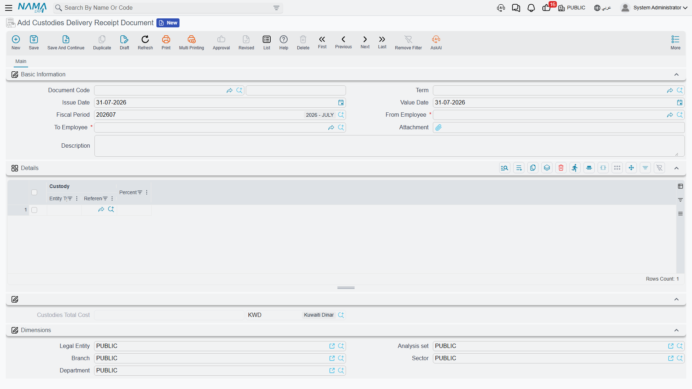

# Custodies Delivery Receipt Document

People leave. They change department, go on long leave, hand a plant over to a successor. And when
they do, somebody has to sign for everything they were holding — the laptop, the phone, the set of
keys, and the forklift parked outside.

The **Custodies Delivery Receipt Document** (سند استلام وتسليم عهد) is that signature. One employee
hands over, another receives, and the document lists everything that changes hands in a single grid —
[custody items](/modules/fixedassets/custody/fixedassets-custody-overview.md) and
[fixed assets](/modules/fixedassets/master-files/fixedassets-asset-master.md) side by side. It is the
only place in the module where those two registers meet on one screen.

It also, unlike most hand-over paperwork, **posts to the ledger**.

Menu: **Assets > Custody Of Assets > Custodies Delivery Receipt Document**
(الأصول > عهد الأصول > سند استلام وتسليم عهد), licence **`fixedassets-custody`**.

## The screen

| Field | Arabic label | Notes |
|---|---|---|
| Document Code | رقم المستند | Book and serial number |
| Term | توجيه المستند | The accounting wiring |
| Issue Date / Value Date / Fiscal Period | تاريخ التحرير / التاريخ الفعلي / الفترة | The value date is the date custody changes |
| **From Employee** | من موظف | **Required** — who is handing over |
| **To Employee** | الي موظف | **Required** — who is receiving |
| Attachment | مرفق | The signed hand-over sheet |
| Description | ملاحظات | Free text |

The **Details** grid has just two columns:

| Column | Arabic label | What it holds |
|---|---|---|
| Custody | عهدة | Either a custody record **or** a fixed asset — the field accepts both |
| Percentage | نسبة | The share of a custody item this employee holds |

Underneath sits **Custodies Total Cost** (إجمالى تكلفة العهد) with its currency, computed by the
system, and then the document's dimensions.

::: tip Let the screen build the list for you
Pick the **From Employee** and the grid fills itself with everything that employee currently holds —
every fixed asset and every custody item where he is the custodian or holds an open custody line —
with the percentage carried across from the open line. For a leaver's hand-over that is the whole
document in one click; you then delete the rows that are staying where they are.
:::

Two rules block a commit, and no more: the grid may not be empty, and the two employees must be
different.

## Actions on this screen

The Custodies Delivery Receipt has no buttons of its own — there is nothing to press to build it.
The grid fills itself the moment you pick the **From Employee**, and everything the document does
happens when it is committed. If the list comes out wrong, change the employee or delete rows; there
is no collect button to hunt for.

## What committing it does

For every line, the document closes the old custody and opens the new one:

- the outgoing employee's open custody line is **closed the day before the document's value date**;
- a new custody line is opened for the receiving employee **from the value date**;
- the item's **Custodian** field is set to the receiving employee — for a fixed asset this happens
  when the term option **Change Custodian In Asset** (تغيير مسؤول العهدة في الأصل) is on, or when the
  asset has no custodian at all, or when its current custodian is the employee handing over.

That last rule is why the document behaves sensibly when the grid was auto-filled: everything on it
was, by definition, held by the outgoing employee, so the Custodian field follows the hand-over
without any configuration. Switch the term option on when you want the field to follow the document
unconditionally.

The document also tidies up after itself: an earlier delivery receipt to the same employee covering
the same items is flagged as having been passed on, so the trail stays readable when an item moves
through three people in a year.

::: info This is the document that sets the Custodian field
The [fixed asset receipt document](/modules/fixedassets/acquisition/fixedassets-receipts.md) adds a
row to an asset's custody history but leaves the **Custodian** field on its main page alone. The
delivery receipt is the document that writes it. If the Custodian field on an asset looks stale, this
is the document that refreshes it.
:::

## What it books

The document produces a journal entry as a business request, and the amount on it is the **Custodies
Total Cost** — the total value of the **custody items** listed. Fixed assets on the document change
custodian without contributing a value to the entry; their cost already sits in the asset accounts and
is not moved by a change of custodian.

The term is organised as two pages — one for the side handing over, one for the side receiving — each
offering a debit and a credit account. All of them carry the same amount, the custodies total. In
practice you configure **the one pair you actually want**: typically a debit on the receiving
employee's custody account and a credit on the outgoing employee's, so that the value of what a person
holds follows the person. Configure both pairs and the value is posted twice.

Because the accounts are resolved per side, the entry can tell the two employees apart: the receiving
employee is the document's counterparty, and the employee handing over is available to the outgoing
side. That is what lets a single document move a balance from one person's custody account to
another's.

::: tip Where the balances end up
The result you are aiming for is that each employee's custody account shows the value of what he is
currently holding. Read those balances from the ledger; the
[custody register](/modules/fixedassets/custody/fixedassets-custody-register.md) shows the items
themselves and who holds each one.
:::

## Khaled hands the hall over

Khaled Al-Mutairi has been the custodian in Hall 2 of Al-Waha's Riyadh plant. He is moving to the
Jeddah site on 1 March 2026, and Sara Al-Harbi takes over from him.

What Khaled holds:

| Item | What it is | Value |
|---|---|---|
| `MCH-0007` — CNC Cutting Machine | a fixed asset | cost 240,000, on the asset accounts |
| `CDY-0033` — Laptop | a custody item | 6,000 |

A Custodies Delivery Receipt is raised, From Employee **Khaled Al-Mutairi**, To Employee **Sara
Al-Harbi**, value date **1 March 2026**. Picking Khaled fills both rows automatically.

**Custodies Total Cost** comes out at **6,000** — the laptop. The CNC machine is on the document and
changes custodian, but its 240,000 of cost is not part of this entry; it stays exactly where the
purchase document put it.

On commit:

- `MCH-0007` — Khaled's custody line is closed on 28 February 2026, a new line opens for Sara from
  1 March, and the asset's Custodian field becomes Sara, because Khaled was the current custodian;
- `CDY-0033` — the same, with the percentage held carried across;
- the entry moves 6,000 between the two employees' custody accounts, as configured on the term.

Khaled walks to Jeddah owing nothing, Sara's custody account carries 6,000, and both the machine and
the laptop show her as the person responsible.

If the laptop were later written off rather than handed on, that is a
[custody disposal](/modules/fixedassets/custody/fixedassets-custody-disposal.md); if the machine
itself moved to Hall 3 or to the Jeddah company, that is a
[transfer document](/modules/fixedassets/movement/fixedassets-transfer-document.md). This document
only changes whose signature is against them.
