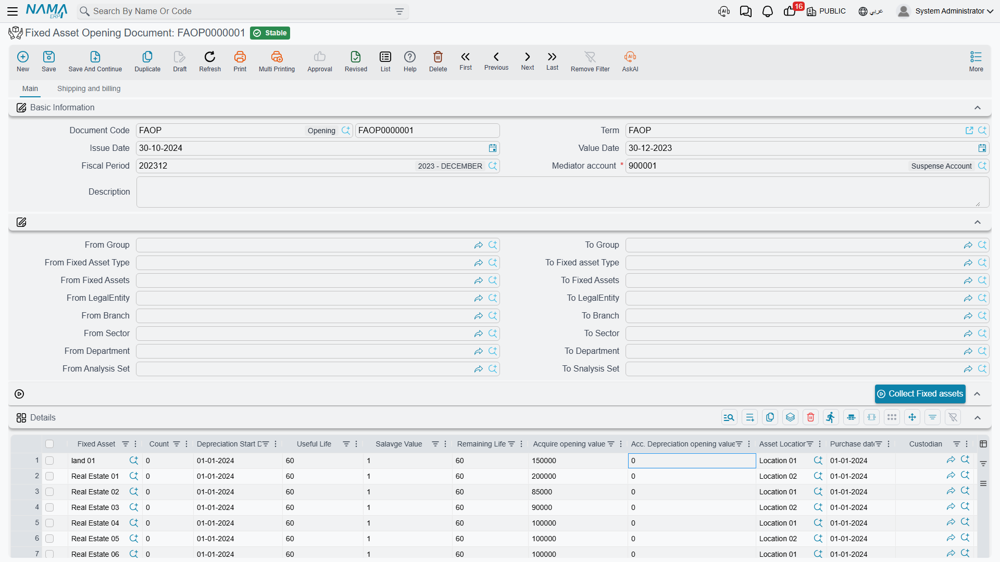
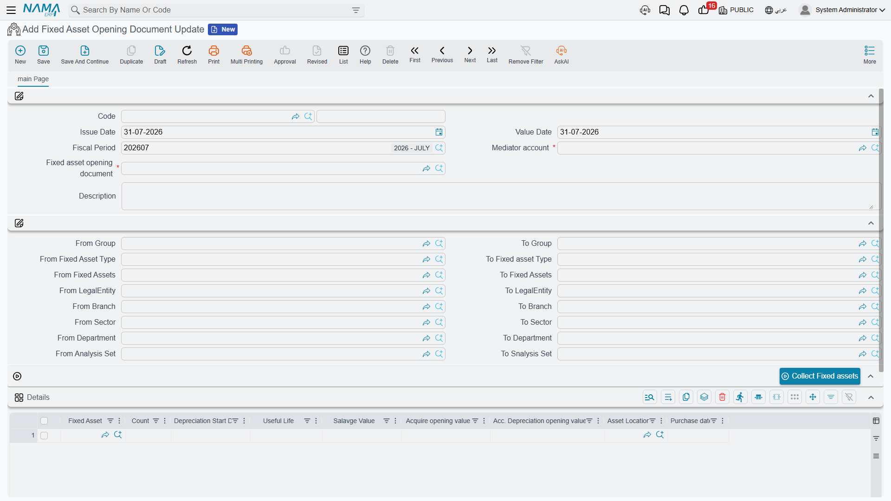

# Opening Balances for Assets You Already Own

Almost nobody starts using Fixed Assets on the day they buy their first machine. They start with four
hundred assets already in the yard, half of them bought years ago and half depreciated, and a legacy
spreadsheet that has to be transplanted into Nama without losing a single figure.

That transplant is the **Fixed Asset Opening Document** (افتتاح أصل ثابت). For each asset you state
what it originally cost, how much depreciation has already been taken, how long it was meant to last,
what it will be worth as scrap and when its depreciation clock started. The system works out where in
its life the asset currently stands, posts the balancing entry against a suspense account, and from
the next period onwards depreciates it as if it had always been here.

It is the single most common go-live task in this module, so it is worth doing slowly and once.

Menu: **Assets > Documents > Fixed Asset Opening Document**
(الأصول > المستندات > أفتتاح أصل ثابت), licence `fixedassets`.

## Before you type anything

Four things have to be in place, and three of them are easy to forget.

**1. The asset records must exist, in Initial status.** The opening document values assets; it does
not invent them. Create them first on the
[Fixed Asset screen](/modules/fixedassets/master-files/fixedassets-asset-master.md) — or, for assets
capitalised out of a finished contracting project, with the
[creation document](/modules/fixedassets/master-files/fixedassets-creation-document.md) — each
with its code, name, type, classifications and location. The asset picker on the opening document
shows only assets in **Initial** (إبتدائى) status.

(If you prefer, the opening document can create the records itself: switch on the module setting
**Add Fixed Assets Creation Columns To Fixed Assets Opening And Purchase** and the grid gains the
name, serial number, type, classification and group columns, exactly as on the
[purchase document](/modules/fixedassets/acquisition/fixedassets-purchase-document.md). For a
go-live of any size, creating the master files first is usually cleaner.)

**2. You need an opening fiscal period.** By default the opening document may only be issued in a
fiscal period of type *opening* — the zero-length period that sits before your first real trading
period. If your chart of periods does not work that way, the module setting **Allow Normal Periods In
Fixed Assets Opening** (السماح بالفترات العادية في افتتاحي الاصول) in the
[Fixed Assets configuration](/modules/fixedassets/fixedassets-configuration.md) lifts the
restriction.

**3. You need a mediator account.** The **Mediator account** (الحساب الوسيط) field in the header is
mandatory, and it must be a detail account. This is the suspense account that absorbs the net book
value of everything you bring in — normally the same opening-balances account the rest of your go-live
uses, so that the fixed asset opening balances net off against the trial balance opening entry.

**4. Decide your period rhythm first.** Life and remaining life in this module are counted in
**months**, and the module depreciates once per fiscal period. Set up monthly fiscal periods before
you open assets, not after.

## The screen

The header is short: document book and code, issue date, value date, fiscal period, the **Mediator
account**, an optional term, and a description.

Below it sits a block of **from / to** range fields — group, fixed asset type, fixed asset, legal
entity, branch, sector, department and analysis set — which are not filters on the document but the
criteria for the **Collect Fixed assets** (تجميع الأصول الثابته) button that sits with them.

::: tip Collect Fixed assets
Set the ranges — say, from asset type `FAT-VEH` to `FAT-VEH` — and press the button. Every asset in
Initial status inside those ranges is appended to the grid as a line, with its useful life brought in
from the asset's type. Assets already on the grid are skipped, so you can press it repeatedly with
different ranges and build the document type by type. Type in each line's salvage value yourself.
:::

Then the **Details** grid, which is where the real work happens:

| Column | Arabic label | What to put in it |
|---|---|---|
| Fixed Asset | الأصل الثابت | The record being opened |
| Count | العدد | For countable assets, how many units the record represents |
| Depreciation Start Date | تاريخ بداية الاهلاك | The date the asset **originally** started depreciating, in the old system |
| Useful Life | العمر الأفتراضي الأفتتاحي | The **original** total life in months |
| Salvage Value | قيمة الأصل كخردة الأفتتاحية | The residual value |
| Remaining Life | العمر المتبقي | Usually left to the system to compute |
| Acquire opening value | قيمة الأقتناء الأفتتاحية | The **original cost**, not the book value |
| Acc. Depreciation opening value | قيمة الأهلاك التراكمي الأفتتاحية | The depreciation **already taken** before go-live |
| Purchase date | تاريخ الشراء | When it was bought |
| Asset Location | موقع أصول | Where it stands |
| Custodian | مسئول العهدة | Who holds it |
| Legal Entity, Branch, Analysis set, Department, Sector | المحددات | The asset's dimensions |

The **Totals** group under the grid adds up the acquisition and accumulated-depreciation columns for
you, and the second page carries addresses and a payment schedule for the rare case where the opening
is also a purchase being settled.

The two columns that matter most are the two value columns, so say it once more plainly:
**Acquire opening value is the original cost of the asset, and Acc. Depreciation opening value is
everything depreciated on it so far.** Do not enter the net book value in the first column. The
system needs both figures separately because it posts them to two different accounts and depreciates
from their difference.

## Worked example: a truck bought in 2023, entered in 2026

Al-Waha Industries goes live on **1 January 2026**, with monthly fiscal periods and an opening period
`2026-OPEN`. Among the assets to bring in is a pickup:

| | |
|---|---|
| Asset | `VEH-0002 — Toyota Hilux` |
| Bought | 1 July 2023 for **250,000** |
| Useful life | **60 months** |
| Salvage value | **10,000** |
| Depreciated in the legacy system | to 31 December 2025 — 30 months at 4,000 = **120,000** |

The mediator account is `299900 — Opening suspense`.

### The line

`Fixed Asset = VEH-0002`, Depreciation Start Date **1 July 2023**, Purchase date 1 July 2023, Useful
Life **60**, Salvage Value **10,000**, Acquire opening value **250,000**, Acc. Depreciation opening
value **120,000**.

### What the system computes on save

**Remaining life.** From the depreciation start date, the asset's life would end on 1 July 2028. The
opening takes effect on 1 January 2026. The gap between them is **30 months** — which is exactly
right, since 30 of the 60 months were used up before go-live. The Remaining Life column fills itself
in.

**Header totals.** Acquire opening value 250,000, Acc. Depreciation opening value 120,000.

### What the system checks on commit

The one check people trip over is this: **accumulated depreciation may not exceed cost minus salvage
value.** Here 120,000 ≤ 250,000 − 10,000 = 240,000, so it passes. An asset whose legacy accumulated
depreciation was recorded down to zero rather than down to its scrap value will fail this check, and
the fix is to correct the salvage value, not the depreciation.

It also insists that every depreciable line has a depreciation start date, a useful life and an
acquisition value; that no asset appears twice; that the salvage value is at least the **Minimum
Salvage Value** from the module configuration and is not equal to the acquisition value; that every
asset is still in Initial status; and that the fiscal period is an opening one unless the
configuration says otherwise.

### What the asset looks like afterwards

| Field on `VEH-0002` | Value |
|---|---|
| Acquisition value | **250,000** |
| Accumulated depreciation | **120,000** |
| Book value | **130,000** |
| Depreciation start date | 1 July 2023 |
| Remaining life | **30** periods |
| Salvage value | 10,000 |
| Current instalment | (250,000 − 120,000 − 10,000) ÷ 30 = **4,000** |
| Status | Running Depreciation |

Notice that the instalment comes out at exactly the 4,000 the legacy system was charging. That is not
a coincidence — it is the module's standard formula,
**(current value − salvage) ÷ remaining life**, applied to an asset that is 30 months into a 60-month
life. If your recomputed instalment does *not* match the figure the old system was charging, one of
the five numbers you typed is wrong, and this is the quickest place to catch it. See
[depreciation concepts](/modules/fixedassets/depreciation/fixedassets-depreciation-concepts.md) for
the formula in full.

### The entry

| | Debit | Credit |
|---|---|---|
| Vehicles cost account (from `VEH-0002`) | 250,000 | |
| Accumulated depreciation account (from `VEH-0002`) | | 120,000 |
| `299900 — Opening suspense` | | 130,000 |
| **Total** | **250,000** | **250,000** |

The two asset-side accounts come from the asset record itself — its main account for the cost and its
second account for accumulated depreciation — which is why the opening document's term carries no
account fields at all. Only the mediator account is chosen, and it is chosen on the document. The
entry is created as a business request processed in the background.

### Where depreciation picks up

The asset is now treated as **depreciated up to the last day of the period before the opening
period** — here, 31 December 2025. The first
[depreciation run](/modules/fixedassets/depreciation/fixedassets-depreciation-document.md) that will
collect this truck is therefore **January 2026**, for 4,000, and the schedule runs on to June 2028.

That default can be shifted. The opening document's
[term](/modules/fixedassets/document-terms/fixedassets-terms-acquisition.md) offers four options that
change how the dates and the remaining life are derived:

| Term option | Arabic label | What it changes |
|---|---|---|
| Make Last Depreciation Date Period End Date | جعل تاريخ آخر إهلاك في الأصول المدرجة هو تاريخ نهاية الفترة المختارة في السند | Treats the assets as depreciated up to the **end of the document's own month**, instead of the end of the previous period |
| Calculate Depreciation Start Date For Depreciated Assets | احتساب تاريخ بداية الإهلاك آليا للأصول المهلكة | For a line that is **fully** depreciated (cost = salvage + accumulated depreciation), forces the remaining life to zero and back-computes the depreciation start date from the useful life |
| Calculate Depreciation Start Date Based On Difference Between Default Useful Life And Remaining Life | احتساب تاريخ بداية الإهلاك بناءا على الفرق بين العمر الافتراضي والعمر المتبقي | Derives the depreciation start date from the two life figures, for legacy data that has lives but no reliable dates |
| Do Not Calc Remaining Life From Dates | عدم حساب العمر المتبقي من التواريخ | Keeps the remaining life you typed instead of recomputing it from the dates |

The last two are the ones to reach for when your legacy data is thin. If the old system recorded
"60 months total, 30 remaining" but no start date, switch on *Calculate Depreciation Start Date Based
On Difference…* and let the system derive the date; if it recorded reliable remaining lives that do
not match the dates, switch on *Do Not Calc Remaining Life From Dates* and your figure wins.

::: info Fully depreciated assets
An asset that has reached the end of its life still belongs in the register — it is still in the
yard, and it will still be disposed of one day. Enter it with its cost and an accumulated
depreciation equal to cost minus salvage, and switch on *Calculate Depreciation Start Date For
Depreciated Assets* on the term so the remaining life is set to zero and no depreciation run picks it
up.
:::

::: info The date the opening carries in the asset's own history
The asset's internal history records the opening as of the line's **depreciation start date**, not
the document date — the 2023 date, not 1 January 2026. That is deliberate: it puts the asset's
starting cost at the point in time it really began. The ledger entry, of course, carries the
document's value date like every other entry.
:::

## Cancelling an opening document

Un-committing reverses everything: the acquisition value, the accumulated depreciation, the
depreciation start date, the instalment, the purchase date and the link to the document are cleared,
each asset goes back to **Initial**, and the journal entry is reversed. It is the clean way out of a
badly typed go-live batch — as long as nothing has depreciated yet.

Once depreciation has run, you no longer cancel. You correct.

## Correcting an opening: the Opening Document Update

**Assets > Documents > Fixed Asset Opening Document Update**
(الأصول > المستندات > تعديل أفتتاح أصل ثابت).

Despite its position in the menu this is not a second opening document. It is an **editor for a
committed opening document** — the supported way to say "the truck's useful life was 72 months, not
60" after the opening has already been posted and depreciated against.

It has no accounting effect of its own. What it does instead is rewrite the original opening document
and replay the asset's figures from it, so the original entry is regenerated rather than supplemented.

How you use it:

1. Open a new update document and pick the committed opening document in the **Fixed Asset Opening
   Document** field. The header — dates, fiscal period, mediator account, the collect ranges,
   dimensions and totals — and the detail lines copy across.
2. Change the lines that need changing. As you save, the system quietly photographs the **previous**
   values of every line it has not seen before: supplier, depreciation start date, purchase date,
   useful life, remaining life, salvage value, disposal date, acquisition opening value, accumulated
   depreciation opening value and location. That photograph is what makes the update reversible.
3. Commit. The header and every matching line are written back into the original opening document,
   its calculations are re-run, and the assets' figures are rebuilt from scratch.
4. If you cancel the update, the photographed values are copied back into the opening document and
   the assets are rebuilt again — back to where they were.

The rules that keep this honest:

- once committed, you may not re-point the update at a different opening document;
- you may not change its value date;
- it must be the **latest** update document for that opening document — you cannot commit or delete an
  older one out of order;
- every line's asset must already exist on the source opening document;
- a line carrying a depreciation value whose depreciation start date falls on or after the start of
  the fiscal period is rejected.

By default an update will not touch an asset whose status has moved on. The module setting **Ignore
Asset Status With Fixed Asset Opening Document Update**
(تجاهل حالة الأصل مع تعديل افتتاح أصل ثابت) lifts that guard for the installations that need it.

### Correcting the truck

A few days after go-live, and before the January depreciation run, the fleet manager produces the
registration papers: the Hilux's useful life should have been 72 months, not 60.

Raise an update document on the **same value date** as the original opening, pick opening document
`FAOD-0001`, and change `VEH-0002`'s useful life from 60 to 72. On commit, the opening document's line
is rewritten, the remaining life is recomputed as 42 months instead of 30, and the instalment falls
from 4,000 to (250,000 − 120,000 − 10,000) ÷ 42 = **2,857.14**. The before-image still holds 60, so
cancelling the update would put the truck back exactly as it was.
