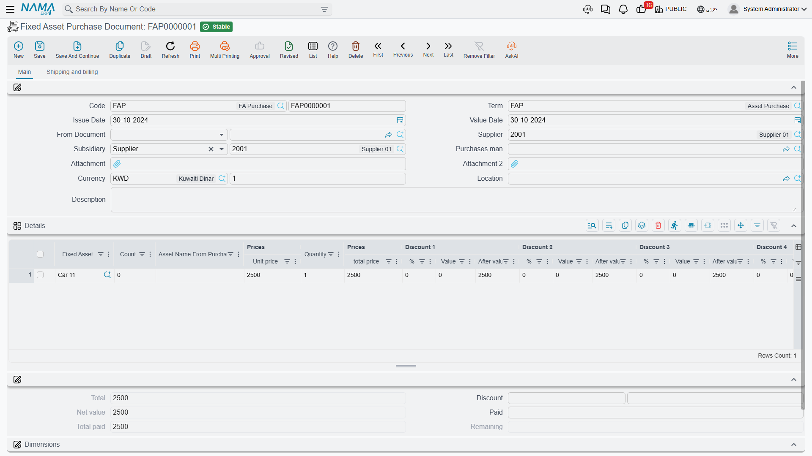
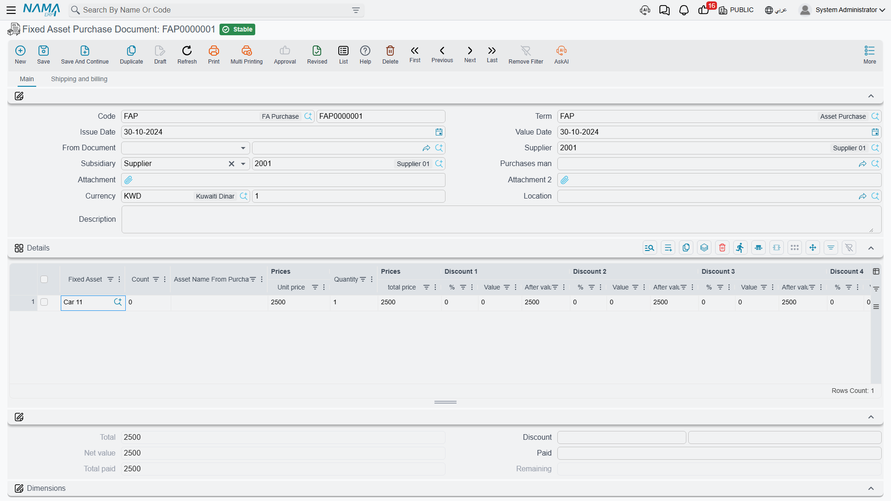
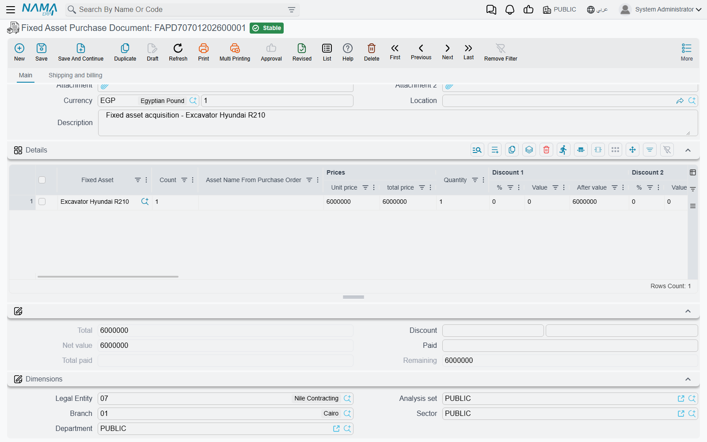
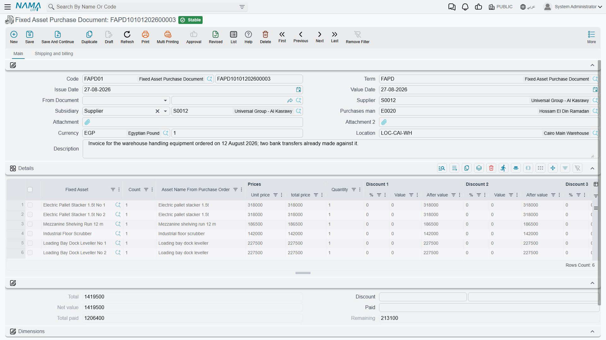
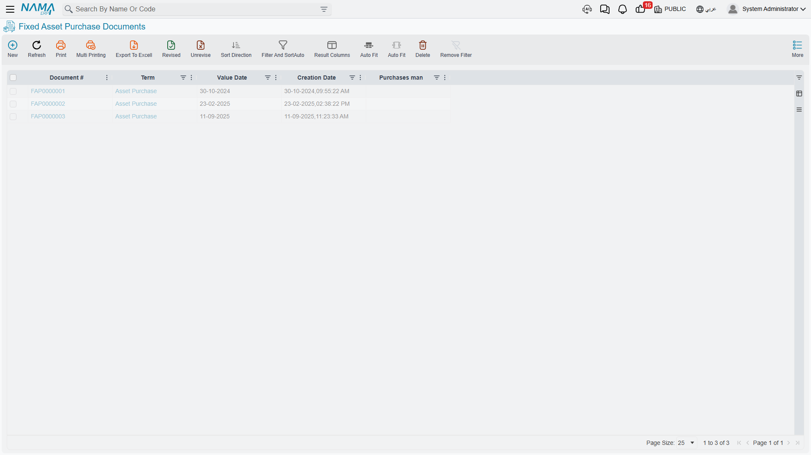

# The Fixed Asset Purchase Document

Everything before this document is paperwork. The Fixed Asset Purchase Document
(سند شراء أصل ثابت) is where the money moves and where an asset record stops being an empty shell and
starts being an asset: it puts the acquisition value on the asset, starts the depreciation clock,
records the supplier's invoice, and posts the journal entry.

It is, in other words, the supplier invoice for a machine — with the difference that the debit does
not go to an expense account chosen on the term. It goes to **the asset's own cost account**, taken
from the asset record you point the line at. That single design decision explains most of what
follows.

Menu: **Assets > Documents > Fixed Asset Purchase Document** (الأصول > المستندات > سند شراء أصل
ثابت), licence `fixedassets`.

## Where the asset record is born

Before walking the screen, settle this, because it decides how you configure the module.

### Route 1 — the asset record exists first (the default)

Somebody creates the asset record beforehand: by hand on the
[Fixed Asset screen](/modules/fixedassets/master-files/fixedassets-asset-master.md), or — for assets
capitalised out of a finished contracting project — with the
[fixed asset creation document](/modules/fixedassets/master-files/fixedassets-creation-document.md).
The record carries a code, a name, a type, classifications and — through its type — its accounts. It
sits in status **Initial** (إبتدائى) with no cost, no depreciation start date and no instalment.

On the purchase document you then pick that record in the line's **Fixed Asset** (الأصل الثابت)
column. The picker deliberately offers **only assets in Initial status**, which is the system's way of
saying: an asset can be purchased once. With this route the Fixed Asset column is mandatory — the
document will not commit with an empty one.

This is the default behaviour and the one most installations keep, because coding, classifying and
account-mapping an asset is a deliberate act that belongs on the master file, not in the middle of
typing an invoice.

### Route 2 — the purchase document creates the record

Switch **Create Asset If Not Found** (إنشاء الأصول إذا لم تكن موجودة) on in the document's
[term](/modules/fixedassets/document-terms/fixedassets-terms-acquisition.md) and the rule relaxes: a
line may carry either a **Fixed Asset** or a **Fixed Asset Type** (نوع الأصل). Fill in the type and
the asset record is created for you at the moment the document is committed — born in Initial status
and immediately promoted, exactly as if you had created it by hand a minute earlier.

For that to produce a usable record the line needs somewhere to hold the asset's descriptive data,
and those columns are hidden by default. Switch on the module setting **Add Fixed Assets Creation
Columns To Fixed Assets Opening And Purchase**
(إضافة أعمدة إنشاء الأصول إلى سندات الشراء و الإفتتاح) in the
[Fixed Assets configuration](/modules/fixedassets/fixedassets-configuration.md) and the grid gains:

**Fixed Asset Type**, **Asset Name (Arabic)**, **Asset Name (English)**, **Serial Number**,
**Market Value**, **Classification 1 to 5** and **Group**.

The new record takes its name, serial number, market value, custodian, location, type and
classifications from those columns, and it takes its accounts, its countable flag, its car-asset and
insurance flags and its "not depreciable" flag from the fixed asset type. Its code is allocated by the
usual numbering rules.

::: warning Choose one route per term, not both
When **Create Asset If Not Found** is on, every line on the document is treated as describing an
asset to be written — including a line that points at an asset record that already exists. That
line's name, serial number, market value, custodian, location, type and classifications are rewritten
from the line's own columns, which are usually empty.

Keep the option **off** on the terms you use for ordinary purchases of pre-created assets, and switch
it on only for a dedicated term used with the creation columns. Two document terms, two clear
purposes, no surprises.
:::

## The screen

The main page holds the invoice header:

| Field | Arabic label | Notes |
|---|---|---|
| Code (Book) | الكود (الدفتر) | Document book and serial number |
| Term | توجيه المستند | The accounting wiring — see [acquisition terms](/modules/fixedassets/document-terms/fixedassets-terms-acquisition.md) |
| Issue Date / Value Date | تاريخ التحرير / التاريخ الفعلي | The value date is the acquisition date written onto the asset |
| From Document | بناءا على | The order, offer, initial receipt or request this invoice answers |
| Supplier | مورد | Who invoiced you |
| Subsidiary | الذمة | Defaults from the supplier; the party the credit side is booked against |
| Purchases man | مندوب المشتريات | Who bought it |
| Attachment, Attachment 2 | مرفق، مرفق 2 | The supplier's invoice scan |
| Currency, Currency Rate | العملة، المعدل | Defaulted from the supplier, with the rate fetched for the value date |
| Location | الموقع المخزني | The location the assets go to |
| Description | ملاحظات | Free text |

Then the **Details** grid, which is the heart of the document.

| Column | Arabic label | What it does |
|---|---|---|
| Fixed Asset | الأصل الثابت | The record being capitalised. Picker shows Initial assets only |
| Count | العدد | For countable assets — how many units this record represents |
| Asset Name From Purchase Order | اسم الاصل من أمر الشراء | Carried down from the order, so you can see what was ordered |
| Unit price, Quantity, total price | سعر الوحدة، الكمية، السعر الكلي | The price block |
| Discount 1 to 8, Taxes 1 to 4, Net value | خصم 1..8، الضرائب، الصافي | The usual invoice arithmetic |
| Useful Life | العمر الإفتراضي | In months; defaulted from the asset's type |
| Salvage Value | قيمة الأصل كخردة | The residual value; defaulted from the asset's type |
| Depreciation Start Date | تاريخ بداية الاهلاك | When the depreciation clock starts |
| Custodian | مسئول العهدة | The employee who will hold it |
| Supplier, Subsidiary | مورد، الذمة | Per-line overrides |
| Asset Location | موقع الأصل | Where this particular asset goes |
| Legal Entity, Branch, Analysis set, Department, Sector | الشركة، الفرع، المجموعة التحليلية، الإدارة، القطاع | The line's [dimensions](/modules/fixedassets/fixedassets-overview.md) |
| Attachment, Attachment 2, Description | مرفق، مرفق 2، ملاحظات | Per-line notes |

Underneath sits the totals block — **Total**, **Discount**, **Net**, **Paid**, **Total paid** and
**Remaining** — and the document's own dimensions. The price, discount, tax, net and total fields are
computed for you and cannot be typed over; you drive them with unit price, quantity and discount
percentages.

The second page, **Shipping and billing** (الشحن و الدفع), carries the shipping and billing
addresses, the **Payment Documents** grid for advances already paid, a **payment schedule template**
with its **GeneratePayments** (إنشاء الدفعات) action and the resulting instalment grid, and a
partial money block.
The **Installment Payments** action in the More menu opens the payment vouchers raised against those
instalments.

## What the screen fills in for you

A great deal, which is why the document is quicker to type than it looks:

- picking the **Supplier** pulls in his default currency and fetches the exchange rate for the value
  date;
- picking a **From Document** copies the supplier and department, and — the important one —
  **explodes each source line into one line per unit**, each of quantity 1 at the source price,
  carrying the ordered name across. Three forklifts on an order become three purchase lines, because
  they will become three asset records;
- picking a **Fixed Asset** pulls **Useful Life** and **Salvage Value** from that asset's type, loads
  the tax percentages from the asset's and the header's tax plans, sets the **Count** to zero when
  the asset is not countable, and proposes a **Depreciation Start Date** of the day after the
  document's fiscal period ends — the natural "starts depreciating next period" default;
- picking a **Fixed Asset Type** (on route 2) pulls the type's default useful life and salvage value;
- clearing the Fixed Asset clears the fields that came with it;
- picking a **Term** copies its tax settings onto the header;
- the **Count** column only accepts input when the asset or type is marked countable.

You are free to overwrite the proposed depreciation start date — with one restriction: it may not be
**earlier** than the document's value date for a depreciable asset. An asset that went into service
the same day the invoice is dated is fine; one that supposedly started depreciating last month is
not, and belongs on an
[opening document](/modules/fixedassets/acquisition/fixedassets-opening-balances.md) instead.

## What has to be true before it will commit

The document checks a lot, and each check protects a number somebody will reconcile later:

1. Every line for a depreciable asset needs a **Depreciation Start Date**, and it may not be before
   the document's value date.
2. Every asset must be in **Initial** status, and the same asset may not appear on two lines.
3. Depending on the route, either the **Fixed Asset** is required, or at least one of Fixed Asset and
   Fixed Asset Type is.
4. **Remaining life must be greater than zero** for a depreciable asset, and the **salvage value may
   not equal the price** — an asset whose scrap value is its whole cost has nothing to depreciate.
   The salvage value must also be at least the **Minimum Salvage Value** set in the module
   configuration.
5. A line may not be edited if the asset has already moved on — if a later entry exists against it
   (a depreciation run, a revaluation, an addition), the purchase behind it is frozen.
6. The payment schedule must reconcile with the remaining amount, instalment codes must be valid, and
   the cash and remaining amounts must be consistent.
7. If the term requires a counterparty, the supplier is mandatory.

::: info Approval on creation, not on modification
The purchase document can be put behind an approval definition, but not one whose *Use With Update*
flag is on. Approve the creation of an asset purchase; do not try to route its later edits through
the same mechanism.
:::

## What commit does

Committing a purchase document is the busiest moment in the module. For each line it:

- writes the document's value date onto the asset as its **purchase date**, and links the asset back
  to this document;
- records the line's location as the asset's current **location** and opens a row in its location
  history;
- moves the asset from **Initial** to **Running Depreciation** — or to **Not Depreciable** if the
  asset is flagged as such;
- writes the line's cost as the asset's **acquisition value**, together with the useful life, the
  remaining life (which starts equal to the useful life), the salvage value and the depreciation
  start date;
- computes the asset's **current instalment** from those figures;
- writes the line's custodian onto the asset, if one was given;
- updates the asset-count register for countable assets;
- copies the line's dimensions onto the asset, if the term option **Update Asset Dimensions From
  Invoice** (تحديث محددات الأصل من الفاتورة) is on and nothing later has touched the asset;
- stamps this document onto the order or offer it came from, so that source can never be invoiced
  twice.

Then it sends the journal entry as a business request.

### The entry

| Side | Account | Amount |
|---|---|---|
| Debit | **the asset's own cost account**, taken from the asset record | the line's net value |
| Debit | the tax accounts configured on the term | the tax on the lines |
| Credit | the supplier / subsidiary account configured on the term | the invoice total |

The debit deserves a sentence of its own. It is not chosen on the term — it always resolves from the
fixed asset on the line, which is why the term screen offers you a credit side but no debit side. The
dimensions on that debit line (sector, branch, department, analysis set) follow the four "affect
accounts" switches in the [module configuration](/modules/fixedassets/fixedassets-configuration.md):
where a switch is on, the dimension is taken from the asset itself.

Discount, cash and additional-cost accounts have their own configurable sides on the term for the
installations that need them.

::: tip Tax and the capitalised cost
By default the tax computed on a line is added to the value capitalised on the asset. Where the tax
is recoverable and should not inflate the asset's cost, switch on the matching **Prevent add tax**
option (منع إضافة ضريبة) — there is one per tax, both in the module configuration and on the
document term, and either one is enough.
:::

## Un-committing

Cancelling a committed purchase document unwinds all of it: the acquisition value, the depreciation
start date, the instalment, the purchase date, the location entry and the link to the document are
all removed, the asset goes back to **Initial**, and the journal entry is reversed. That is exactly
what you want when an invoice was entered against the wrong machine — but note that it is only
possible while nothing later has touched the asset.

## Al-Waha capitalises the CNC machine

Al-Waha Industries uses term `FAPD-01`: taxable at 15 %, **Create Asset If Not Found** off, the credit
side pointing at the suppliers control account, the tax debit at VAT input, and the module's
**Prevent add tax 1** switched on so that recoverable VAT does not inflate asset costs.

The asset record `MCH-0007 — CNC Cutting Machine` already exists, type
`FAT-MCH — Machinery & Equipment`, status Initial, classification 1 = Production Equipment.

Accounting raises purchase document `FAPD-0031` on **1 January 2026** from purchase order `FAPO-0009`:

- the order line explodes into one line of quantity 1 at **240,000**;
- `MCH-0007` is picked; **Useful Life 60** and **Salvage Value 24,000** arrive from the type;
- the proposed depreciation start date is 1 February 2026, but the machine was commissioned on
  1 January, so it is typed back to **1 January 2026** — allowed, because it is not before the
  document's value date;
- the custodian is Khaled Al-Mutairi and the location `LOC-R2 — Riyadh Plant, Hall 2`;
- totals: 240,000 plus 15 % VAT of 36,000 = **276,000** owed to Gulf Machinery Trading.

On commit, `MCH-0007` reads:

| | |
|---|---|
| Status | Running Depreciation |
| Purchase date | 1 January 2026 |
| Acquisition value | **240,000** |
| Useful life / remaining life | 60 / 60 periods |
| Salvage value | 24,000 |
| Depreciation start date | 1 January 2026 |
| Current instalment | (240,000 − 24,000) ÷ 60 = **3,600** |
| Location | LOC-R2 — Riyadh Plant, Hall 2 |

and the entry is:

| | Debit | Credit |
|---|---|---|
| Machinery cost account (from `MCH-0007`) | 240,000 | |
| VAT input | 36,000 | |
| Suppliers control — Gulf Machinery Trading | | 276,000 |
| **Total** | **276,000** | **276,000** |

The first depreciation run for January 2026 takes 3,600. The rest of the machine's life —
depreciation, the January 2027 upgrade, the transfer to another hall, the sale at the end of 2027 —
is told on the [depreciation](/modules/fixedassets/depreciation/fixedassets-depreciation-concepts.md)
and [disposal](/modules/fixedassets/disposal/fixedassets-disposal.md) pages.

::: info If the entry does not appear
The journal is created as a business request processed in the background. Open the Business Requests
list view, filter for failures, select the rows and use **More → Reprocess / Recommit**. For bulk
recovery there are also the
[fixed asset utilities](/admin/reprocessing/fixed-asset-utilities.md).
:::
