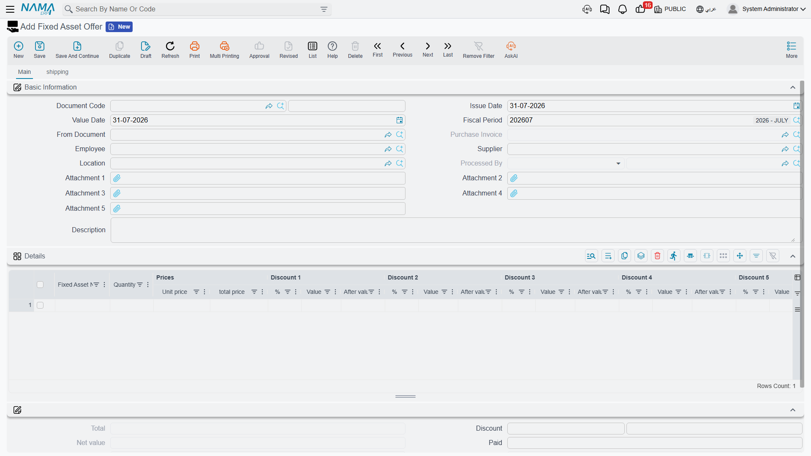

# Offers and Purchase Orders

Between "we need a CNC machine" and "here is the supplier's invoice" sit the two documents where
purchasing does its work: the **Fixed Asset Offer** (عرض سعر أصل), which records what a supplier is
willing to sell for, and the **Fixed Asset Purchase Order** (أمر شراء أصل), which records what you
have agreed to buy.

They are almost the same screen, and for a good reason: an order is usually the winning offer with a
signature on it. Both carry full pricing — unit price, up to eight discount levels, four taxes,
instalment schedules and shipping terms — because a machine costing a quarter of a million is
negotiated in exactly those terms.

Both live under **Assets > Documents** and need only the `fixedassets` licence.

## Neither of them costs anything

This is the first thing to say, because the money on these screens looks so convincing.

**An offer and an order produce no journal entry.** Nothing is owed to the supplier, nothing is
capitalised, nothing appears in the general ledger. The totals, discounts and taxes are computed so
that you can compare quotations, obtain an approval and negotiate — they are decision support, not
accounting. Commitment in the ledger begins with the
[purchase document](/modules/fixedassets/acquisition/fixedassets-purchase-document.md).

The same goes for the asset register. Neither document creates, touches or reserves a fixed asset
record. Both name the wanted asset as **free text**, exactly like the
[request](/modules/fixedassets/acquisition/fixedassets-purchase-request.md) does.

::: tip What the taxes on these screens are for
If you pick a term with a tax plan, the tax columns fill in and the totals include tax. Treat those
figures as informational — they let you compare a quotation inclusive of VAT against one that is not.
The tax that is actually recorded and claimed is the tax on the purchase document.
:::

## The offer

The header carries the document book and code, issue and value dates, the requesting **Employee**,
the **Supplier** who is quoting, the **Asset Location** the equipment is wanted at, up to five
attachments for the quotation PDF itself, and a **From Document** (بناءا على) field for building the
offer from the request that triggered it. **Processed By** and **Purchase Document** are filled in by
the system when something downstream consumes the offer.

The **Details** grid is a price list:

| Column | Arabic label |
|---|---|
| Fixed Asset Name | أسم الأصل |
| Quantity | الكمية |
| Unit price / total price | سعر الوحدة / السعر الكلي |
| Discount 1 to 8 — percentage, value, after value | خصم 1 إلى 8 — % / قيمة / صافي |
| Item Tax and Tax 2 to 4 — percentage and value | ضريبة مبيعات وضرائب 2 إلى 4 |
| Net value | الصافي |
| Description | ملاحظات |

The second page, **Shipping and payment** (الشحن و الدفع), repeats the request's logistics block and
adds the payment side: a **payment schedule template**, the **Generate Payments** action that expands
it into instalment lines, and the schedule grid itself. The schedule has to reconcile with the
document's remaining amount before the offer can be committed — a quotation offering four instalments
that do not add up to the price is rejected.

## The purchase order

Everything the offer has, plus:

- a **Term** (توجيه المستند) field on the main page, which is where the tax plan and the tax
  behaviour come from;
- **Satisfied Qty** and **Unsatisfied Quantity** on the grid, so an order raised from a request shows
  what it consumed;
- a **Payment Documents** grid (سندات الدفع) on the second page — payment document, payment date,
  payment value and a flag for payments that should not reduce the remaining amount — for advances
  paid against the order;
- a standard-terms grid, for the contractual clauses that go with the order.

The second page also repeats the book, code and term, so an order can be completed entirely from
there.

## Consuming a request, and being consumed

The rule that governs the quantity counters is simple and worth stating precisely: **the counters on
a request move when a document is built directly from that request.** An offer, an order or an
[initial receipt](/modules/fixedassets/acquisition/fixedassets-receipts.md) whose **From Document**
points at a purchase request will, on commit, raise that request's Satisfied Qty, lower its
Unsatisfied Quantity, refresh its Total Unsatisfied Qty and stamp Processed By. Un-committing puts it
all back.

An order built from an *offer* copies the offer's lines and prices happily, but it does not tick
anything off — the offer was never a demand to be satisfied in the first place.

In the other direction, an order remembers what became of it. When a purchase document is committed
against it, the order's **Purchase Document** field is filled in, and from then on that order stops
appearing in the From Document picker of new purchase documents. One order, one invoice.

## Gulf Machinery Trading wins the CNC machine

Al-Waha Industries has request `FAPR-0004` open: one CNC cutting machine, two pallet trolleys.
Purchasing invites two suppliers to quote for the machine.

| Offer | Supplier | Unit price | Discount | Net |
|---|---|---|---|---|
| `FAPOF-0011` | Gulf Machinery Trading | 250,000 | 4 % | **240,000** |
| `FAPOF-0012` | Riyadh Industrial Systems | 252,000 | — | 252,000 |

Both offers are built from the request, so both carry the line "CNC Cutting Machine, quantity 1"
without anybody retyping it. Gulf Machinery Trading's quotation also proposes three instalments of
80,000; those are entered on the schedule grid and reconcile against the 240,000.

Purchasing takes the cheaper offer to the plant manager, gets the approval, and raises purchase order
`FAPO-0009` from **the request** — so that the request's counters move — with Gulf Machinery Trading
as the supplier at the agreed 240,000, delivery to `LOC-R2 — Riyadh Plant, Hall 2`, three instalments
and a 12-month warranty clause on the standard-terms grid.

On commit:

- request line 1 shows **Satisfied 1, Unsatisfied 0**; the header's Total Unsatisfied Qty falls from
  3 to 2 (the trolleys are still outstanding);
- the request's **Processed By** shows `FAPO-0009`;
- nothing at all has reached the general ledger, and no asset record exists yet.

The machine is delivered five weeks later. When the invoice arrives, accounting raises the
[purchase document](/modules/fixedassets/acquisition/fixedassets-purchase-document.md) from
`FAPO-0009` — and *that* is the moment `MCH-0007` becomes a live fixed asset carrying 240,000 of
cost.
