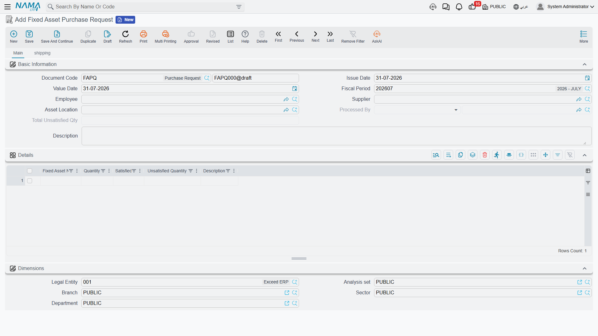

# Fixed Asset Purchase Request

The purchase request is the internal ask: *the paint shop needs a compressor*, *production needs a
CNC cutting machine*. It is written by the people who need the equipment, not by the people who will
buy it, and it deliberately holds almost nothing — a name and a quantity. No supplier is committed
to, no price is quoted, no account is touched.

That poverty of detail is the point. A request that demanded prices would force the requester to go
shopping, and shopping is purchasing's job.

You will find it under **Assets > Documents > Fixed Asset Purchase Request**
(الأصول > المستندات > طلب شراء أصل). It needs only the base `fixedassets` licence.

## Filling one in

The header is the usual document header, plus the people and place involved:

| Field | Arabic label | What it is for |
|---|---|---|
| Document Code (Book, Code) | رقم المستند (الدفتر، الكود) | The document book and its serial number |
| Issue Date | تاريخ التحرير | When the request was written |
| Value Date | التاريخ الفعلي | The date the request counts from |
| Fiscal Period | الفترة | The period the request falls in |
| Employee | الموظف | Who is asking |
| Supplier | مورد | A preferred supplier, if there is one — a suggestion, not a commitment |
| Asset Location | موقع الأصل | Where the equipment is wanted |
| Processed By | تمت معالجتة بواسطة | Filled in by the system: the document that consumed this request |
| Total Unsatisfied Qty | إجمالي الغير مسلم | Filled in by the system: how much of the request is still outstanding |
| Description | ملاحظات | Free text — the place to justify the ask |

Then the **Details** grid (التفاصيل), which is where the request lives:

| Column | Arabic label | Notes |
|---|---|---|
| Fixed Asset Name | أسم الأصل | Free text. You are naming a *thing you want*, not picking an asset record — the record does not exist yet |
| Quantity | الكمية | How many |
| Satisfied Qty | نفذت | System-maintained: how many have been ordered or received against this line |
| Unsatisfied Quantity | الكمية الغير مستلمة | System-maintained: quantity minus satisfied |
| Description | ملاحظات | Per-line note — specification, model, urgency |

Below the grid sit the five [dimensions](/modules/fixedassets/fixedassets-overview.md) — legal
entity, analysis set, branch, sector and department — so the request can be reported by whoever is
asking for the spend.

The second page, **Shipping** (الشحن), carries the logistics wish-list: expected shipping and
delivery dates, shipping method, shipping and arrival ports, the insurance, shipping and customs
parties, an expected delivery period with its unit of measure, contract terms and a shipping
address. All of it is descriptive; it exists so that the information travels down the chain when
purchasing builds an [offer or an order](/modules/fixedassets/acquisition/fixedassets-purchase-offers-and-orders.md)
from the request.

::: info No term, no accounting
The purchase request has **no Term field** on its screen and produces no journal entry of any kind.
Nothing about it reaches the ledger, and nothing about it touches the asset register. It is a piece
of internal correspondence that the system happens to keep tidily.
:::

Nothing blocks a purchase request from being committed — there are no validations of its own. Save
it, commit it, and it is an open ask.

## How the request knows it has been answered

The two quantity columns are the only moving parts, and they are worth understanding because they
are the module's only "open orders" report.

Every time an [offer, an order or an initial receipt](/modules/fixedassets/acquisition/fixedassets-purchase-offers-and-orders.md)
is raised with **From Document** (بناءا على) pointing at this request, the lines that came from the
request carry a hidden link back to the request line they were copied from. When that downstream
document is committed:

- the matching request line's **Satisfied Qty** goes up by the quantity ordered,
- its **Unsatisfied Quantity** is recomputed as quantity minus satisfied,
- the header's **Total Unsatisfied Qty** is refreshed as the sum of the line figures,
- and **Processed By** on the request is stamped with the document that consumed it.

Un-commit that downstream document and every one of those figures is put back. Because the counters
are driven by the link between lines, they only work when the downstream document was genuinely
*built from* the request — typing the same asset name onto an unrelated order proves nothing and
counts for nothing.

::: tip Reading the list screen
Because **Total Unsatisfied Qty** lives in the header, the purchase request list view answers the
question "what has been asked for and not yet ordered" at a glance: sort or filter on that column and
anything above zero is still open.
:::

## Al-Waha asks for the CNC machine

Production at Al-Waha Industries writes request `FAPR-0004` on 5 January 2026:

| Line | Fixed Asset Name | Quantity | Satisfied | Unsatisfied |
|---|---|---|---|---|
| 1 | CNC Cutting Machine | 1 | 0 | 1 |
| 2 | Pallet trolley | 2 | 0 | 2 |

Header **Total Unsatisfied Qty** = 3. The description line explains that the CNC machine replaces a
manual saw and that the trolleys serve the same hall.

Purchasing collects quotations, and Gulf Machinery Trading is chosen for the machine at 240,000. An
order is raised from the request covering the machine only. On commit, line 1 shows Satisfied 1 and
Unsatisfied 0; line 2 is untouched; the header total drops to 2. The request stays open, correctly,
because the trolleys have not been ordered.

When the machine's supplier invoice arrives it becomes a
[purchase document](/modules/fixedassets/acquisition/fixedassets-purchase-document.md), the asset
record `MCH-0007` receives its 240,000 of cost, and the acquisition is complete — while the request
still politely reminds purchasing about two pallet trolleys.
