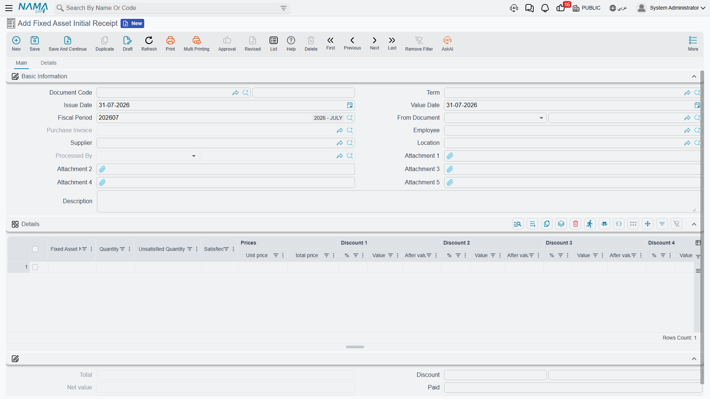

# Taking Delivery: Initial Receipt and Receipt Document

Two documents in this module have "receipt" in their name, they sit in different menu folders, they
need different licences, and they do completely different jobs. Sorting them out takes one paragraph
each.

**Fixed Asset Initial Receipt** (سند استلام أصل مبدئي) says: *the equipment has arrived but the
supplier has not invoiced us yet*. It is a priced receiving note, and it is paperwork.

**Fixed Asset Receipt Document** (مستند استلام أصل) says: *this asset is now standing here, and this
person signed for it*. It is a custody and location note, raised after the purchase, and it is also
paperwork — but paperwork that writes on the asset record.

Neither of them books a journal entry, and neither of them creates or values an asset. Value comes
from the [purchase document](/modules/fixedassets/acquisition/fixedassets-purchase-document.md).

## Fixed Asset Initial Receipt

Menu: **Assets > Documents > Fixed Asset Initial Receipt**
(الأصول > المستندات > سند استلام أصل مبدئي), licence `fixedassets`.

Think of it as the goods-received note for equipment: the crates are on site, the store has counted
them, but nothing can be capitalised until the supplier's invoice arrives with a final price, a
delivery charge and a tax treatment. Rather than leave the arrival unrecorded for three weeks, you
enter an initial receipt.

The screen is the
[purchase order screen](/modules/fixedassets/acquisition/fixedassets-purchase-offers-and-orders.md)
in every respect: the same header with supplier, employee, asset location and **From Document**; the
same detail grid naming the asset in **free text** with a quantity and a price block of eight
discount levels and four taxes; the same second page with shipping information, payment schedule
template, payment documents grid and standard terms.

What follows from that shape is worth being explicit about:

- the lines **name** assets, they do not point at asset records — there is no Fixed Asset column;
- the asset register is untouched: nothing is created, no status changes, no location or custody is
  written;
- nothing reaches the general ledger, and the computed taxes are informational;
- if it was built from a purchase request, committing it does advance that request's satisfied
  quantities, the same as an offer or an order does.

Its real value comes later. When the invoice finally arrives, raise the
[purchase document](/modules/fixedassets/acquisition/fixedassets-purchase-document.md) with **From
Document** pointing at the initial receipt, and the lines and prices come across ready to be matched
against the asset records.

::: tip Which one do I raise?
If the invoice is in your hand, skip the initial receipt and raise the purchase document. The initial
receipt earns its keep only when arrival and invoicing are separated in time — imports, staged
deliveries, equipment released against an order while the paperwork travels.
:::

## Fixed Asset Receipt Document

Menu: **Assets > Custody Of Assets > Fixed Asset Receipt Document**
(الأصول > عهد الأصول > مستند أستلام أصل).

::: info It needs the letter-of-credit licence
This document is gated behind the **`fixedassets-lc`** licence, not the base one and not the custody
one — even though it sits in the *Custody Of Assets* menu folder. The reason is its header: the
receipt document carries a **Letter Of Credit** reference, so it doubles as the document that signs
for a shipment arriving against an
[asset letter of credit](/modules/fixedassets/letters-of-credit/fixedassets-lc-overview.md).

If a customer holding only `fixedassets` cannot find "Fixed Asset Receipt Document" in the menu, this
is why. There is nothing to fix on the screen — it is a licensing question.
:::

The screen is short, because it only answers two questions. The header carries the document book and
code, issue date, value date, fiscal period, **From Document** (بناءا على), the **Letter Of Credit**
reference, an attachment and a description. There is **no Term field** — this document has no
accounting to wire.

The **Details** grid is four columns:

| Column | Arabic label | What it does |
|---|---|---|
| Asset | الأصل | The asset being received |
| Custodian | مسئول العهدة | The employee signing for it |
| Asset Location | موقع الأصل | Where it is being put |
| Description | ملاحظات | Per-line note |

Below the grid are the document's dimensions.

Two conveniences save typing. Picking **From Document** on a receipt raised from a purchase document
builds one line per purchased asset, pre-filled with the asset, its location and its current
custodian. And picking an asset directly on a line pulls in that asset's current custodian and
location, so you only change what has actually changed.

### What committing it writes

Committing the receipt document does exactly two things per line:

1. the line's location becomes the asset's **current location**;
2. a row is added to the asset's **custody history** — the employee, the date the document takes
   effect from, and the share of custody held.

That is all. No journal entry, no inventory movement, no status change, no effect on cost or
depreciation. Nothing blocks the commit either — there are no validations of its own. Cancelling the
document removes the custody history row again.

::: info The custody history row, not the Custodian field
The receipt document adds to the asset's **custody history grid**; it does not change the
**Custodian** field on the asset's main page. The document that sets that field is the
[Custodies Delivery Receipt](/modules/fixedassets/acquisition/fixedassets-delivery-receipt.md), which
is designed around handing things from one named employee to another. So after a receipt document,
read the history grid — that is where the answer is.
:::

## Al-Waha signs for the CNC machine

The CNC machine arrives at the Riyadh plant on 8 January 2026, a week after purchase document
`FAPD-0031` was committed and `MCH-0007` became a live asset at 240,000.

The store raises receipt document `FARD-0018` with **From Document** = `FAPD-0031`. One line appears
automatically: `MCH-0007`. The storekeeper sets the custodian to **Khaled Al-Mutairi** and the
location to `LOC-R2 — Riyadh Plant, Hall 2`, and commits.

`MCH-0007` now shows Hall 2 as its location, and its custody history carries a row for Khaled from
8 January 2026. The machine's cost, instalment and status were all settled by the purchase document
a week earlier and are entirely unaffected.

When the machine is later moved to Hall 3, that is a
[transfer document](/modules/fixedassets/movement/fixedassets-transfer-document.md), not another
receipt.
