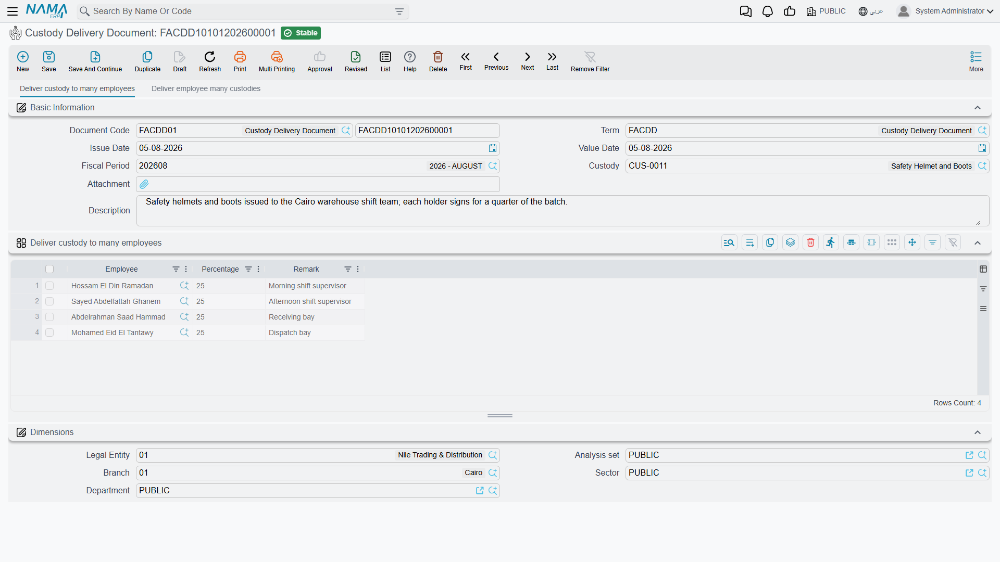
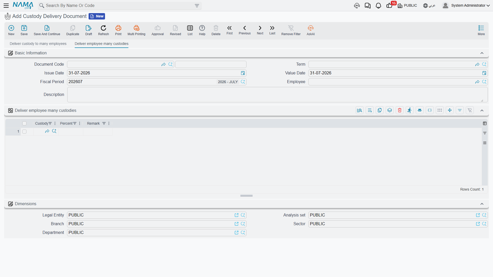
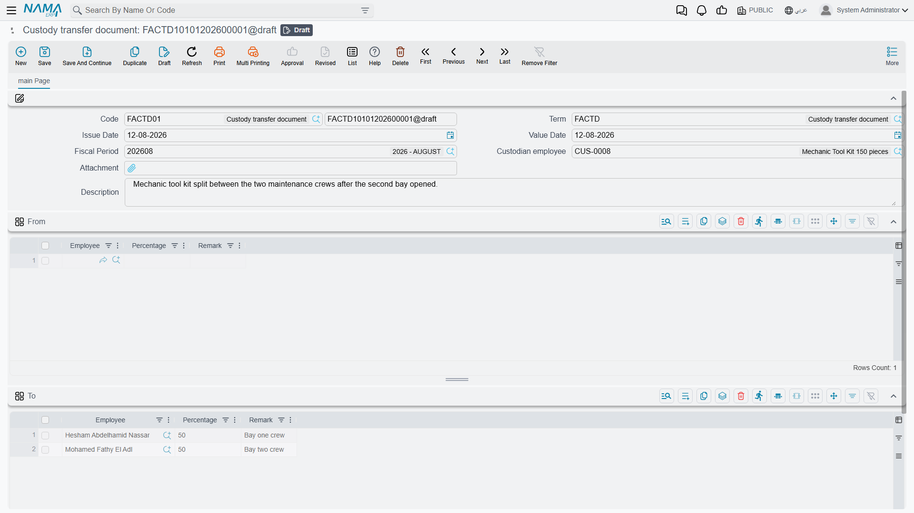

# Delivering and Transferring Custody

A custody item that nobody is holding is just stock. The point of the register is the moment it
leaves the store and becomes somebody's responsibility — and the two documents on this page are the
two ways that happens: **delivery** (تسليم عهدة) puts an item into an employee's hands for the first
time, and **transfer** (نقل عهدة) moves it from whoever holds it now to somebody else.

Both live under **Assets > Custodys**, both need a book and a
[document term](/modules/fixedassets/document-terms/fixedassets-terms-custody-and-lc.md), and both
need the `fixedassets-custody` licence.

::: info The holder is always an employee
Everywhere in the custody family — the header of a delivery, every grid line, the *From* and *To*
sides of a transfer, the holding history on the record — the person is picked from the **HR employee
file**. Not a supplier, not a third party, not a free-text name. If somebody is to hold company
property, they need an employee record, and that is what makes an employee's holdings listable and
a stocktake by custodian possible.
:::

## Delivery: the first hand-over

Al-Waha Industries has bought the laptop `CDY-0033`; it is in status *Purchased* with a price of
6,000 on it. The delivery document is what puts it in Khaled Al-Mutairi's hands.

The screen has **two pages, and you use one or the other** — they are the same document seen from
two directions, and filling in one side disables the other.

### Page 1 — one item, one or more employees

The header carries the document code and book, the term, issue date, value date, fiscal period, an
attachment and remarks — plus the **Custody** (عهدة) field naming the single item being handed over.
The grid underneath names the people:

| Column | Arabic | Notes |
|---|---|---|
| Employee | الموظف | Who is taking it |
| Percentage | نسبة | Their share of the item |
| Remark | ملحوظة | Free note, carried onto the holding line |

For the laptop that is one line:

| Employee | Percentage | Remark |
|---|---|---|
| Khaled Al-Mutairi | 100 | Primary work machine |

**The shares must add up to exactly 100.** That is not a formality — it is the rule that makes the
register meaningful, because the item's value is split between the holders in those proportions.
Al-Waha's workshop toolkit `CDY-0050`, worth 3,000, is issued to two technicians at 50 % each; both
are answerable for it, and the accounting puts 1,500 against each name.

The **Custody** picker only offers items in status *Purchased* — an item that has not been bought
yet has no value to hand over. The exception is an item marked **Priceless**
(عينية بدون سعر): those are offered whatever their status, so a safety kit or an access badge can go
straight out without a purchase document ever existing for it.

### Page 2 — one employee, several items

The second page is the joining kit. The header names an **Employee** (الموظف) instead of a custody,
and the grid lists the items:

| Column | Arabic | Notes |
|---|---|---|
| Custody | عهدة | The item |
| Percentage | نسبة | The share this person takes of it — normally 100, since they take the whole item |
| Remark | ملحوظة | Free note |

When Nouf Al-Harbi joins in September 2027, one document hands over the mobile phone `CDY-0034`
(1,800) and the safety kit `CDY-0035` (priceless), each at 100 %. No item may appear twice on the
same document — one line per item.

Which page you are working on is decided by which field you fill first: name a custody and the
employee field and its grid switch off; name an employee and the custody field and its grid switch
off. There is no way to mix the two on one document, and no reason to want to — raise two documents.

### What committing a delivery does

Three things, whichever page you used:

1. **The item's status moves to *Delivered***, and stays there through any number of later
   transfers.
2. **A holding line opens on the custody record** for each employee — their name, their share, the
   value date as its *From Date*, an empty *To Date*, and this document as the line's creator. If
   an earlier line was still open, it is closed off on the same date.
3. **The accounting entry is created**, as a business request processed in the background.

That entry is the interesting part, and it is worth being precise about what it does *not* do: it
does not expense the item. It **moves the value onto the person**. Each line produces one debit and
one credit for that line's share of the item's price:

> line value = custody price × percentage ÷ 100

For Khaled's laptop, 6,000 × 100 ÷ 100 = 6,000:

| | Debit | Credit |
|---|---|---|
| Custodies with employees — Khaled Al-Mutairi | 6,000 | |
| Custodies in store | | 6,000 |

The debit side is normally set up with an account source of type *Employee*, so each person's
holdings collect on their own subsidiary account and "what is Khaled carrying?" becomes a balance
you can read. For the toolkit at 50/50 the same term produces two lines of 1,500 each, against two
different employee accounts. A priceless item has no price, so its entry carries no value — the
document still records the hand-over, it simply has no money to move.

### Undoing a delivery

Un-commit it and — provided nothing has touched the item since — the status drops back to
*Purchased*, the holding lines it created are cleared, and the accounting entry is cancelled. If a
transfer has happened in the meantime, the delivery cannot be deleted at all: the message tells you
a later movement exists on the item. Undo that transfer first, then come back to the delivery.

## Transfer: moving it to somebody else

Khaled Al-Mutairi moves to another site in September 2027 and the laptop goes to Nouf Al-Harbi.
That is a transfer: **one custody item per document**, from its current holders to its new ones.

The header is the familiar set — book and code, term, issue date, value date, fiscal period,
attachment, remarks — plus the field that names the item being moved. Its picker offers only items
in status *Delivered*, which is exactly right: you cannot move on something nobody is holding.

Then two grids, each with employee, percentage and remark:

- **From** (من) fills itself. The moment you pick the item, its current holding lines are copied in
  — for the laptop, Khaled Al-Mutairi at 100 %. You are not meant to edit this side; it is the
  system showing you what it is about to take away.
- **To** (إلي) is yours to fill, and the shares here must add up to exactly 100 again.

| From | | | To | |
|---|---|---|---|---|
| Khaled Al-Mutairi | 100 % | → | Nouf Al-Harbi | 100 % |

A transfer is also how you re-divide an item. The workshop toolkit held 50/50 by two technicians can
be transferred to three at 40/30/30, and the shares simply have to total 100 on the *To* side.

### What committing a transfer does

The status does **not** change — the item was out with somebody and it still is, so it stays
*Delivered*. What changes is who: the item's holding lines are cleared and rebuilt from the *To*
grid, dated the document's value date.

The accounting entry has two halves, and the term carries two pairs of accounts for exactly this
reason — one pair for the outgoing holders and one for the incoming ones. Each *From* line reverses
that holder's share off them; each *To* line charges the new holder's share:

| | Debit | Credit |
|---|---|---|
| Custodies with employees — Nouf Al-Harbi | 6,000 | |
| Custodies with employees — Khaled Al-Mutairi | | 6,000 |

Khaled's balance is clean again; Nouf now carries the laptop. Had the laptop gone to two people at
50 % each, the *To* half would have produced two lines of 3,000 instead of one of 6,000, and the
*From* half would still have been a single 6,000 off Khaled.

### Undoing a transfer

Un-committing a transfer does something slightly cleverer than the delivery: it looks back for the
document that held the item before this one — the previous transfer, or failing that the delivery —
and rebuilds the holding lines from *that* document. The laptop goes back to Khaled at 100 %, and
the accounting entry is cancelled. If nothing came before it at all, the item is simply left with no
holding lines.

As always, the newest document has to be undone first. If the item has been transferred again since,
or disposed of, deal with that document before coming back to this one.

## Actions on these screens

Neither the delivery document nor the transfer document carries a button of its own. Both are filled
in and saved, and everything they do — writing the holding lines, stamping the custodian, raising the
accounting entry — happens on commit and is undone by un-committing. The delivery screen's one piece
of behaviour worth knowing is not a button either: the two pages lock each other out. Fill in the
**Custody** field on page 1 and the employee and lines of page 2 grey out; fill in the **Employee**
on page 2 and the custody and details of page 1 grey out. Clear the field you filled first and the
other side comes back.
