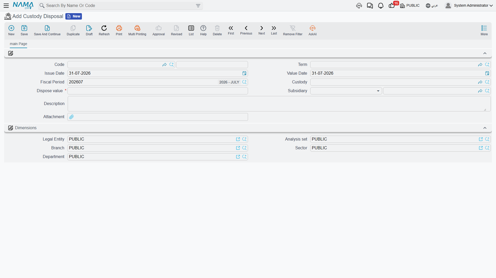

# Disposing of a Custody Item

Eventually the laptop stops being worth keeping. It is scrapped, or sold for whatever it will fetch,
or the employee who lost it pays for it, or it is simply written off. Whichever of those happened,
one document ends the item's life and takes its value back off whoever was holding it.

**Assets > Custodys > Custody Disposal** (`الأصول > عهد > تخلص من العهدة`), licence
`fixedassets-custody`, with a book and a
[document term](/modules/fixedassets/document-terms/fixedassets-terms-custody-and-lc.md) like every
other document here.

## The screen is short on purpose

One page, one item, and one number that matters:

| Field | Arabic | Notes |
|---|---|---|
| Code (book / code) | الكود (الدفتر / الكود) | |
| Term | توجيه المستند | Where the accounts come from |
| Issue date / Value date | تاريخ التحرير / التاريخ الفعلي | |
| Fiscal Period | الفترة | |
| Custody | عهدة | The item being disposed of. The picker offers items in status *Initial*, *Purchased* or *Delivered* — anything that has not already been disposed of |
| Dispose value | قيمة التخلص | **Required.** What the disposal is worth: the sale proceeds, the amount recovered from the employee, or 0 for a pure write-off |
| Subsidiary | الذمة | The counterparty the dispose value is booked against — the buyer, the employee paying for it, the cash account, the write-off account |
| Description | ملاحظات | Why it was disposed of — the useful place to record "screen broken beyond repair" or "not returned on leaving" |
| Attachment | مرفق | |

Note what is *not* on this screen: there is no reason list, no gain or loss field and no method
picker. What kind of disposal this is comes out of two things only — **the term you choose**, which
decides which accounts are hit, and **the dispose value you type**. Scrap, sale and write-off are
the same document with different numbers and, if you want the accounting separated, different terms.

## Al-Waha's laptop, three years on

`CDY-0033` was bought for 6,000, delivered to Khaled Al-Mutairi, then transferred to Nouf Al-Harbi,
who holds 100 % of it. In December 2028 Nouf leaves and buys the laptop from the company for 1,200.

Disposal document `CDS-2028-004`, value date 20 December 2028, custody `CDY-0033`, dispose value
1,200, subsidiary = the departing employee.

Committing it does two things. **The item's status becomes *Disposed***, which takes it out of every
picker — it can never be delivered or transferred again. And **the accounting entry is created**, as
a business request processed in the background, in two distinct halves:

**The holder half.** For each of the item's current holders, their share of the item's price is
taken off them. Nouf holds 100 % of an item priced at 6,000, so:

| | Debit | Credit |
|---|---|---|
| Custody disposal (from the term) | 6,000 | |
| Custodies with employees — Nouf Al-Harbi | | 6,000 |

Had the item been the workshop toolkit held 50/50, this half would have produced two lines of 1,500,
one against each technician.

**The value half.** One further pair for the dispose value, against the subsidiary you named:

| | Debit | Credit |
|---|---|---|
| Departing employee (receivable) | 1,200 | |
| Custody disposal (from the term) | | 1,200 |

::: info The difference is yours to place
This is the one thing to understand before setting the term up. The document does **not** work out a
gain or a loss for you — unlike the [fixed asset disposal](/modules/fixedassets/disposal/fixedassets-disposal.md),
whose term carries separate gain and loss accounts, the custody disposal term has two account pairs
and nothing else. The 6,000 that comes off the holder and the 1,200 that comes in from the buyer are
booked independently.

So the difference — 4,800 here — has to land somewhere by construction. The usual way to arrange it
is to point both halves at the same clearing account, as in the entries above: the 6,000 goes in as
a debit, the 1,200 comes out as a credit, and what remains on that account is the 4,800 written off.
Review that account periodically and clear it to the expense account you want the write-offs to
appear in.
:::

A pure write-off is the same document with **0** as the dispose value: the holder half takes the
6,000 off the employee, the value half books nothing, and the whole carried value stays on the
clearing account as the loss.

## Returning an item is not a disposal

If somebody hands an item back and it is going out again to the next person, do not dispose of it —
raise a [transfer](/modules/fixedassets/custody/fixedassets-custody-delivery-and-transfer.md) to the
new holder. The transfer takes the value off the old holder in exactly the same way, and the item
keeps its history and its status of *Delivered* so it can be issued again. Disposal is for items
that are leaving the company altogether: sold, scrapped, lost, or written off. Once an item is in
the *Disposed* status, nothing brings it back into circulation except un-committing the disposal.

There is also the [Delivery/Receipt of Custodies
document](/modules/fixedassets/acquisition/fixedassets-delivery-receipt.md), which records
hand-overs between employees and can carry fixed assets on the same lines. It is the natural choice
when the movement being recorded is a physical hand-over rather than a change of accountability.

## Undoing a disposal

If a disposal was raised in error, un-committing it cancels the accounting entry and works the
item's status out again from its own history: if it has ever been delivered or transferred it goes
back to *Delivered*, otherwise back to *Purchased* if it was bought, otherwise back to *Initial*.
You do not have to remember where the item was in its life — the document reconstructs it.

Editing a committed disposal to point at a different item behaves the same way: the item it used to
name gets its old status back and the new one is marked disposed.

## Where the leftovers show up

Two places are worth checking after a round of disposals. The custody list screen filtered on status
*Disposed* is the register's own answer to "what did we write off this year". And the
[stocktaking document](/modules/fixedassets/movement/fixedassets-stocktaking.md) ignores disposed
items entirely when it builds its expected list — which is exactly why a disposal should be raised
promptly for anything genuinely gone, rather than left to surface as a shortage at every count.
