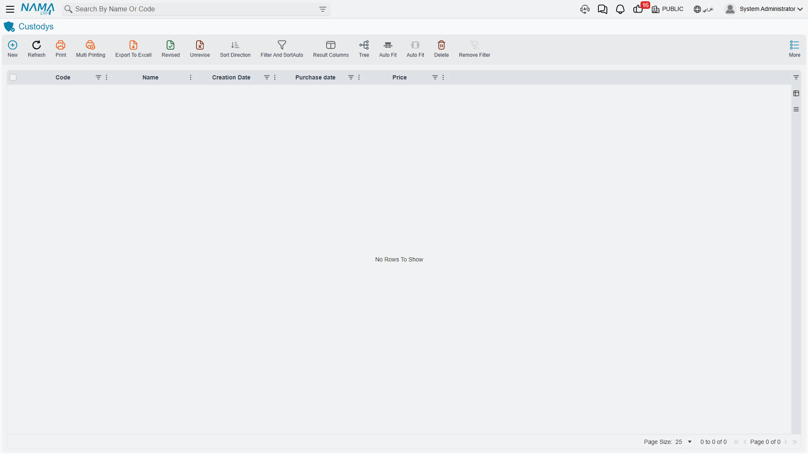
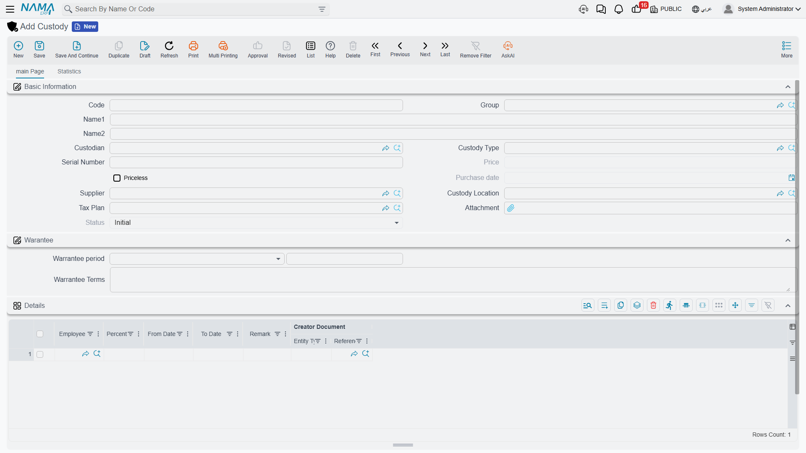

# Custody — Items Handed to Staff

In the same week, Al-Waha Industries buys two things. One is a CNC cutting machine that costs
240,000 and will sit on the shop floor for five years. The other is a laptop that costs 6,000 and
goes home in a bag every evening with the production engineer who uses it.

Both are company property. Both are handed to somebody. Both have to be accounted for. Only one of
them belongs in the fixed-asset register.

## Custody is a register of its own

This is the single thing to settle before anything else on these pages makes sense: **custody
(عهدة) is not a kind of fixed asset**. It is not a flag on the asset record, not a subtype, not a
filtered view of the asset list. It is a separate master file with its own screens, its own
purchase, delivery, transfer and disposal documents, its own status ladder, and its own licence.

The two registers never meet in the numbers:

| | Fixed asset (أصل ثابت) | Custody (عهدة) |
|---|---|---|
| What it holds | A capitalised asset with a cost, an accumulated depreciation figure and a book value | One physical item the company issued and expects back |
| Depreciation | Yes — a method, a useful life, a monthly instalment | **Never.** There is no depreciation method, no useful life and no accumulated depreciation anywhere on a custody |
| Accounts on the master file | Every asset carries its own account set | None — every custody entry takes its accounts from the [document term](/modules/fixedassets/document-terms/fixedassets-terms-custody-and-lc.md) of the document that moves it |
| Statuses | Initial, Running Depreciation, Depreciated, Not Depreciable, Disposed | Initial, Purchased, Delivered, Disposed |
| Quantity | A countable asset can hold ten identical desks in one record | One record = one item. Five identical chairs are five custody records |
| Who holds it | A custodian and a location | One or more named employees, each with a **percentage share** of the item |
| Documents | Purchase, opening, depreciation, revaluation, transfer, disposal… | Purchase, delivery, transfer, disposal — four, and that is the whole family |

A custody never appears in a depreciation run. It is not that the module skips it or that you have
to switch something off — there is simply nowhere on a custody record to put a life or a method, and
the depreciation document only ever collects fixed assets. If an item needs to be depreciated, it
needs to be an asset.

## So which one is it?

Ask two questions about the thing you have just bought.

**Does its cost need to be spread over the years it will be used?** If yes, it is a fixed asset —
that is what the asset register is for, and everything on
[Depreciation, in Principle](/modules/fixedassets/depreciation/fixedassets-depreciation-concepts.md)
applies to it. The CNC machine at 240,000 is that case: it is written down over 60 months and its
book value is reported every period.

**Is it a low-value item issued to a named person, that the company expects to get back?** If yes,
it is a custody. The 6,000 laptop is that case. Nobody wants a five-year depreciation schedule for a
laptop; what the company actually wants to know is *who has it*, *what it was worth*, and *whether
it comes back when that person leaves*. That is precisely the question the custody register answers,
and it answers it by carrying the item's value against the employee holding it until the item is
returned, passed on, or disposed of.

The boundary is not a fixed amount — you draw it yourself when you decide what to register where.
In practice it falls around the point where an item stops being worth a depreciation schedule:
laptops, phones, tablets, SIM cards, hand tools, toolkits, uniforms, safety equipment, pool cars,
badges and keys are the classic custody population. Machinery, vehicles you capitalise, plant,
furniture sets and buildings are assets.

::: tip One item, one record, one clear owner
Because a custody record is one physical item, the serial number on it means something — it is *the*
laptop, not "a laptop". That is what lets a stocktake say "the item with this serial number is
supposed to be with this person" and what lets an employee's holdings be listed with any confidence.
:::

## One licence, six screens

Everything on these pages needs the `fixedassets-custody` licence. Without it, the whole
**Custodys** menu group disappears — the register and all four documents go with it, and the rest of
the Fixed Assets module carries on unaffected.

The menu group sits under **Assets > Custodys** (`الأصول > عهد`) and holds exactly six entries, in
this order:

| Screen | Arabic | What it is |
|---|---|---|
| Custody Type | نوع العهدة | The classification you set up first — see [Custody Types](/modules/fixedassets/custody/fixedassets-custody-types.md) |
| Custody | عهدة | The register itself — see [The Custody Record](/modules/fixedassets/custody/fixedassets-custody-register.md) |
| Custody purchase document | شراء عهدة | The invoice that buys it and stamps its value — see [Buying Custody Items](/modules/fixedassets/custody/fixedassets-custody-purchase.md) |
| Custody Delivery Document | تسليم عهدة | The hand-over to one or more employees |
| Custody transfer document | نقل عهدة | Moving it from the current holders to different ones |
| Custody Disposal | تخلص من العهدة | The end of its life — see [Disposing of a Custody Item](/modules/fixedassets/custody/fixedassets-custody-disposal.md) |

Delivery and transfer share a page: [Delivering and Transferring
Custody](/modules/fixedassets/custody/fixedassets-custody-delivery-and-transfer.md).

Two screens outside this group also accept custody items. The **Delivery/Receipt of Custodies**
document (سند استلام وتسليم) hands things between employees and can carry fixed assets and custody
items on the same lines — see [The Delivery and Receipt
Document](/modules/fixedassets/acquisition/fixedassets-delivery-receipt.md). And the **Fixed Asset
Taking** document (جرد الأصول) counts custody items alongside assets and reports shortages and
surpluses for both — see [Stocktaking Assets and
Custodies](/modules/fixedassets/movement/fixedassets-stocktaking.md).

## The life of one laptop

Here is the whole chain, on the item this section uses everywhere: **`CDY-0033` — Laptop /
حاسب محمول**, worth 6,000, issued to **Khaled Al-Mutairi**, a production engineer at the Riyadh
plant.

1. **Somebody sets up the type.** A custody type `CDY-LAP — Laptops` exists, which mostly decides
   whether items of this kind carry a money value at all.
2. **The record is created.** A custody record `CDY-0033` is typed in by hand: name, custody type,
   serial number `5CG3210XYZ`, location `LOC-R2 — Riyadh Plant, Hall 2`. It saves in status
   **Initial** with no price — nothing has told it what it is worth yet.
3. **The purchase document is committed.** Dated 1 February 2026, from Riyadh IT Supplies, one line
   pointing at `CDY-0033` for 6,000. Committing it stamps 6,000 as the item's price and 1 February
   2026 as its purchase date, and moves it to status **Purchased**. The accounting entry is an
   ordinary purchase invoice: the value lands in a custody account, the supplier is credited.
4. **The delivery document hands it over.** Dated 5 February 2026, custody `CDY-0033`, one line:
   Khaled Al-Mutairi at 100 %. The item moves to status **Delivered**, a holding line opens on the
   custody record dated 5 February, and the accounting entry moves the 6,000 out of the custody
   account and onto Khaled's own subsidiary account. The laptop is now, in the books, *with* that
   person.
5. **A transfer moves it on.** In September 2027 Khaled moves to another site and the laptop goes to
   Nouf Al-Harbi. The transfer document lists Khaled at 100 % on the *From* side and Nouf at 100 %
   on the *To* side; the entry takes 6,000 off one and puts 6,000 onto the other. The status stays
   **Delivered** — the item is still out with somebody, just a different somebody.
6. **The disposal ends it.** In December 2028 the laptop is sold to the departing employee for
   1,200. The disposal document takes the 6,000 back off the holder and books the 1,200 against the
   buyer, and the item goes to status **Disposed**. It cannot be delivered or transferred again.

## The status ladder

Those four statuses are not decoration — the pickers on each document read them, so the status is
what decides which document will even offer you the item.

| Status | Arabic | Set by | What can happen next |
|---|---|---|---|
| Initial | مبدأي | Saving a new custody record | The purchase document can buy it; the disposal document will offer it |
| Purchased | تم شراؤة | Committing a custody purchase document | The delivery document will offer it |
| Delivered | تم تسليمه | Committing a delivery document | The transfer document will offer it; further transfers keep it here |
| Disposed | تم التخلص منه | Committing a disposal document | Nothing — the item's life is over |

There is one shortcut worth knowing. An item marked **Priceless** (عينية بدون سعر) — something with
no money value, a badge or a uniform — is offered by the delivery picker whatever its status, so it
can be handed straight out without a purchase document ever being raised for it. That flag is set up
on the [custody type](/modules/fixedassets/custody/fixedassets-custody-types.md) and copied onto
each new record.

## Undo happens in reverse order

Each custody remembers the last document that touched it. That single marker is what keeps the chain
honest: if you try to un-commit the delivery of `CDY-0033` after a transfer has already moved it on,
the system refuses, because the delivery is no longer the last word on that item. It tells you a
later document exists.

So the rule for correcting a custody chain is simply: **undo the newest document first, then work
backwards**. Un-commit the transfer, and the holding lines it built are rebuilt from whatever
document came before it; un-commit the delivery after that, and the item drops back to *Purchased*
with its holding lines cleared. The same marker also refuses to let you swap the custody on a
document that has already been committed — cancel it, or raise a new document.
