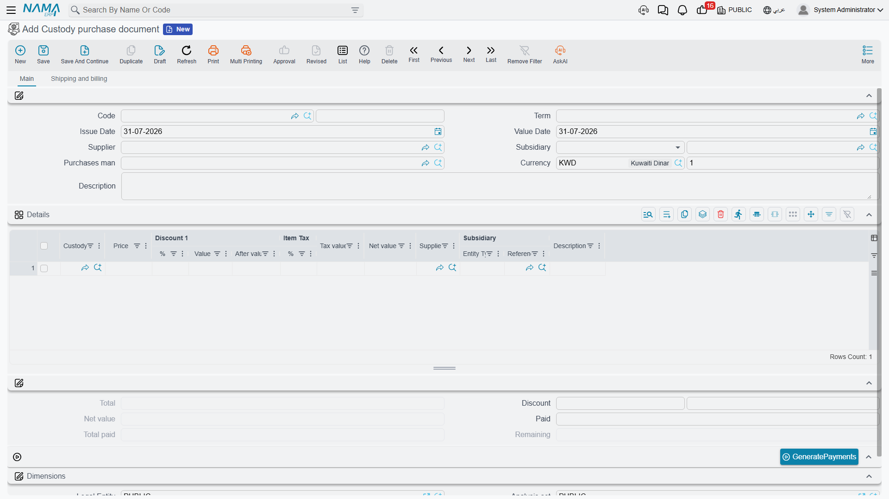

# Buying Custody Items

Al-Waha Industries buys a laptop for 6,000 from Riyadh IT Supplies. The obvious accounting treatment
— charge 6,000 to office expenses and move on — is exactly what the custody register is designed to
*avoid*, and understanding why explains the shape of this document.

## Why the 6,000 does not simply become an expense

If the laptop is expensed on the day it is bought, the ledger forgets about it immediately. Six
months later, when the engineer holding it leaves the company, there is no figure anywhere that says
what the company is owed if the laptop does not come back, and no balance to reconcile a stocktake
against.

So the custody purchase document does what a purchase document does for any asset: it puts the value
somewhere it can be seen. The 6,000 lands in an account that means *custody items we own but have
not issued yet* — a stock of issuable items. It sits there until the
[delivery document](/modules/fixedassets/custody/fixedassets-custody-delivery-and-transfer.md) hands
the laptop to a named person, at which point the same 6,000 moves out of that account and onto that
person's own subsidiary account. From then on the ledger can answer "how much are our employees
holding, and who is holding it" by reading account balances, and the answer will agree with the
register. The value is only released — written off, sold, or charged to a loss — when the item is
[disposed of](/modules/fixedassets/custody/fixedassets-custody-disposal.md).

That is the whole design: **the value follows the item, and the item follows a person.**

## The custody record comes first

The document buys an item that already exists in the register. So the order is: create the custody
record (it saves in status *Initial* with no price), then raise the purchase document and point a
line at it. There is no option here that creates the record for you — this is one of the ways the
custody family differs from the
[fixed asset purchase document](/modules/fixedassets/acquisition/fixedassets-purchase-document.md),
which can create the asset it capitalises.

**Assets > Custodys > Custody purchase document** (`الأصول > عهد > شراء عهدة`), licence
`fixedassets-custody`. Like every document in the module it needs a book and a
[document term](/modules/fixedassets/document-terms/fixedassets-terms-custody-and-lc.md).

## The screen is a full purchase invoice

This is not a stripped-down internal form. The custody purchase document is a proper invoice and
carries the whole invoice machinery: supplier, currency and rate, line discounts, tax, a header
discount, cash paid and remaining, external payment vouchers, and an instalment schedule with a
*GeneratePayments* action. If you know the supply-chain purchase invoice, you already know this
screen.

**The header** (page *Main*) asks for the book and code, the term, issue date and value date, the
**Supplier** (مورد) and the **Subsidiary** (الذمة) that the entry will be booked against, the
purchases man (مندوب المشتريات), the currency and its rate, and remarks.

**The Details grid** is where the custody items go:

| Column | Arabic | Notes |
|---|---|---|
| Custody | عهدة | The record being bought — `CDY-0033` |
| Price | السعر | What the supplier is charging for it |
| Discount 1 — % / Value / After value | خصم 1 — % / قيمة / صافي | Line discount |
| Item Tax — % / Tax value | ضريبة مبيعات — % / القيمة | Tax on the line, driven by the item's tax plan |
| Net value | الصافي | **The important one** — what the line is finally worth |
| Supplier, Subsidiary, Remarks | مورد، الذمة، ملاحظات | Line-level overrides of the header |

Under the grid, the totals: total, header discount, net value, paid in cash, total paid and
remaining. The second page (*Shipping and billing*) holds the shipping and billing addresses, the
grid of payment vouchers already raised against this invoice, the payment template, and the
instalment schedule — code, description, percentage, amount, due date, what has been paid and what
remains.

## What committing it does

Al-Waha's document `CPD-2026-014`, value date 1 February 2026, supplier Riyadh IT Supplies, one line:
custody `CDY-0033` at 6,000, no discount, no tax — net value 6,000.

Committing it does three things.

1. **It stamps the price.** The line's **Net value** is written onto the custody record as its
   Price. Note *net value*, not the price you typed: if the line had carried a 5 % discount and 15 %
   tax, the figure landing on the register would be the one in the Net value column, not the 6,000.
   This is the number every later custody entry works from, so it is worth a glance before you
   commit.
2. **It stamps the purchase date** from the document's value date — 1 February 2026 — and moves the
   item from **Initial** to **Purchased**. That status change is what makes the item visible to the
   delivery document's picker.
3. **It creates the accounting entry**, as a business request processed in the background. The entry
   is an ordinary purchase invoice entry: the debit side named on the term (in Al-Waha's setup, the
   custodies-in-store account) takes the value, the supplier is credited, and the tax, discount and
   cash sides behave exactly as they do on any invoice.

For `CPD-2026-014` that is simply:

| | Debit | Credit |
|---|---|---|
| Custodies in store | 6,000 | |
| Riyadh IT Supplies | | 6,000 |

If the request fails — a closed period, a missing account — the document is still saved. Find it in
the Business Requests list view, filter for failed rows, select them and use **More → Reprocess**.

::: tip One document, many items
There is no reason to raise a document per item. A single custody purchase can carry every laptop,
phone and toolkit on one supplier invoice, one line per custody record, and each line stamps its own
line's net value onto its own record. Al-Waha buys ten laptops on one invoice as ten lines pointing
at ten custody records.
:::

## Paying for it

Because this is a real invoice, the money side works the way it does everywhere else: enter what was
paid in cash on the document, or leave the whole amount as remaining and settle it later with
payment vouchers, or build an instalment schedule with **GeneratePayments** (إنشاء الدفعات) and
settle the instalments as they fall due. Vouchers already raised against the invoice appear in the payment documents grid
on the second page, and the *Remaining* figure moves as they are recorded.

## Correcting one

Un-committing a custody purchase reverses its accounting entry and clears the price the document
stamped on the item. If several items were on the document and you remove one line and re-commit,
that item's price is cleared too while the others keep theirs.

Because each custody remembers the last document that touched it, the usual ordering rule applies:
if the item has since been delivered or transferred, un-commit those documents first and work
backwards. See [Custody — Items Handed to
Staff](/modules/fixedassets/custody/fixedassets-custody-overview.md) for the full ordering rule.
