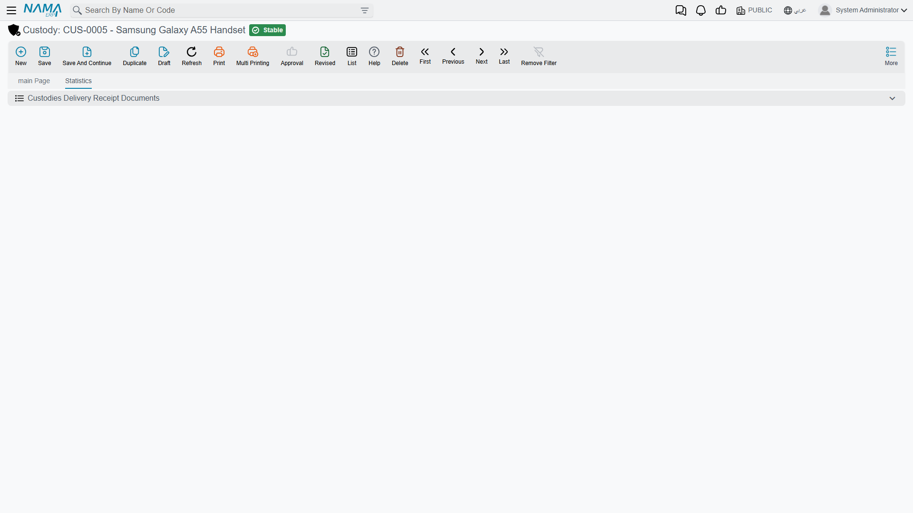

# The Custody Record

The custody record is the register itself — one record for one physical item that Al-Waha Industries
has handed out, or is about to. `CDY-0033` is *the* laptop with serial `5CG3210XYZ`, not "a laptop".
Five identical office chairs are five records, because five people can be holding them in five
different places, and the point of the register is to know which is where.

**Assets > Custodys > Custody** (`الأصول > عهد > عهدة`), licence `fixedassets-custody`.

## You create it; the documents fill it in

Nothing generates a custody record. You type it in — code, name, type, serial number, location —
and it saves in status **Initial** with no price. From that moment on the record is largely a
*report*: the purchase document writes its price and purchase date, the delivery and transfer
documents write who is holding it, and each of them moves its status. That division is worth holding
on to while reading the screen, because it explains why several of the most interesting boxes cannot
be typed into.

### The identity fields — the ones you fill

| Field | Arabic | Notes |
|---|---|---|
| Code | الكود | `CDY-0033` |
| Group | المجموعة | The usual master-file grouping field |
| Name1 / Name2 | الاسم العربي / الاسم الإنجليزي | Arabic name and English name — حاسب محمول / Laptop |
| Custody Type | نوع العهدة | `CDY-LAP — Laptops`; picking it copies the type's *Priceless* setting onto this record |
| Serial Number | الرقم المسلسل | Free text. On a register of individually issued items this is what makes a stocktake meaningful |
| Priceless | عينية بدون سعر | Whether this item carries a money value at all — see [Custody Types](/modules/fixedassets/custody/fixedassets-custody-types.md) |
| Supplier | مورد | Who it came from |
| Custody Location | موقع العهدة | Where the item belongs. The picker offers only the lowest level of the [location tree](/modules/fixedassets/master-files/fixedassets-locations.md) — a specific hall or floor, not "Riyadh Plant" as a whole |
| Tax Plan | سياسة الضريبة | The tax policy applied when this item is bought; the purchase document's line picks it up from here |
| Attachment | مرفق | The invoice scan, the hand-over form, the photo of the serial plate |

Below these sits a **Warranty** group (`الضمان`) where the warranty period and its terms are
recorded for reference, and the usual Dimensions group (`المحددات`) — legal entity, analysis set,
branch, sector and department.

### The fields the documents write

| Field | Arabic | Written by |
|---|---|---|
| Price | السعر | The [custody purchase document](/modules/fixedassets/custody/fixedassets-custody-purchase.md) — it stamps the line's net value here. For `CDY-0033` that is **6,000** |
| Purchase date | تاريخ الشراء | The same document, from its value date — 1 February 2026 |
| Status | الحالة | Initial → Purchased → Delivered → Disposed, each moved by the corresponding document |
| Custodian | المسئول عن العهدة | The named holder recorded by the [Delivery/Receipt of Custodies document](/modules/fixedassets/acquisition/fixedassets-delivery-receipt.md) |
| Details grid | التفاصيل | The holding history, built by the delivery and transfer documents |

The **Price** is the one people ask about most. It is not a list price you maintain — it is what the
purchase document worked out for that line, after its discount and tax, and it is the figure every
later entry uses. When the delivery document moves 6,000 onto Khaled Al-Mutairi's account and the
disposal takes 6,000 back off it, that 6,000 comes from here.

## The Details grid — who holds it, and how much of it

The grid at the bottom of the main page is the item's holding history, and it is the part of the
screen worth learning to read:

| Column | Arabic | What it says |
|---|---|---|
| Employee | الموظف | Who holds (or held) the item — always an employee record from HR |
| Percentage | نسبة | Their share of it |
| From Date | من تاريخ | When they took it |
| To Date | إلى تاريخ | When they stopped holding it. **Empty means they still hold it** |
| Remark | ملحوظة | Whatever the document line said |
| Creator Document | المستند المنشئ | Which delivery or transfer document opened this line |

Two things about it. First, **you never type in this grid** — every line arrives from a document,
which is why the Creator Document column can always tell you where a line came from. Second, the
**Percentage** column is not a quantity. A custody record is one item; the percentage is the *share
of that one item* each person is answerable for. Hand a laptop to one person and the grid holds one
line at 100 %. Give a pool car to two supervisors and it holds two lines at 50 % each — and the
accounting follows the shares, putting half the value against each name. Shares on a delivery are
required to add up to 100.

After `CDY-0033` is delivered on 5 February 2026, the grid reads:

| Employee | Percentage | From Date | To Date | Creator Document |
|---|---|---|---|---|
| Khaled Al-Mutairi | 100 | 05/02/2026 | | CDD-2026-031 |

and after the September 2027 transfer to Nouf Al-Harbi it reads:

| Employee | Percentage | From Date | To Date | Creator Document |
|---|---|---|---|---|
| Nouf Al-Harbi | 100 | 01/09/2027 | | CTR-2027-009 |

## The second page

The custody's second page lists the **Delivery/Receipt of Custodies** lines that name this item —
the hand-over documents that passed it from one person to another outside the four custody
documents. If your organisation uses that document rather than the custody delivery document, this
page is where the item's movements show up.

## Actions on this screen

The custody record has no buttons of its own. That is the point of it: it is a register, and the four
custody documents — purchase, delivery, transfer and disposal — are what write to it. If a custody's
holder or quantity looks wrong, the fix is on the document that last touched it, never on this screen.

## Reading what one employee is holding

Three routes, in the order you will actually use them.

**The custody list screen** is the workhorse. It has the register's own fields as criteria — custody
type, status, location, supplier, dimensions — so "every laptop in Hall 2" or "everything not yet
delivered" is a filter away.

**The employee's own screen** carries a Fixed Assets page with a **Common Custodies** (عهد مشتركة)
list on it. That list is built from the holding lines described above — every custody line naming
that employee — so it is the direct answer to "what has this person been given?", including items
they share with somebody else.

**The stocktaking document** is what you use when the question is not "what should this person have"
but "what do they actually have". Run it for a custodian and it collects every custody not yet
disposed of that names them, so you can count against the list and read off shortages and
surpluses — see [Stocktaking Assets and
Custodies](/modules/fixedassets/movement/fixedassets-stocktaking.md).

::: tip Nothing on the record itself blocks a save
The custody record has no validation of its own to satisfy — the discipline lives in the documents,
not here. A half-filled record will save quite happily, which is convenient when you are loading a
register in bulk but means the quality of the register is entirely down to how carefully the codes,
serial numbers and locations are entered.
:::
