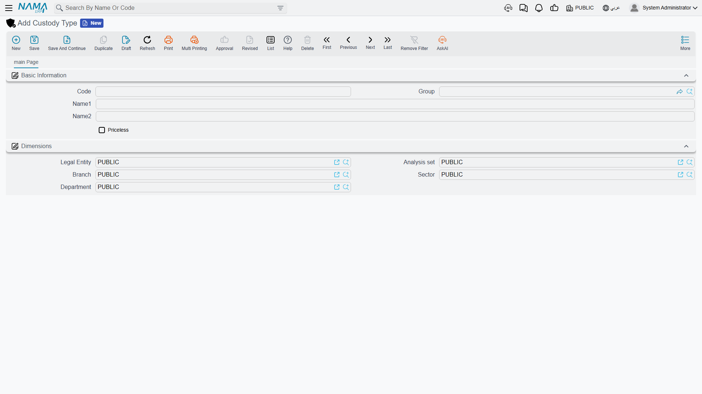

# Custody Types

Before Al-Waha Industries can register its first laptop, somebody has to answer a question the
system will otherwise ask on every single record: *do items of this kind have a money value?*

That is what a custody type is for. It is a short classification — Laptops, Mobile Phones, Hand
Tools, Uniforms, Access Badges — and its practical job is to carry the answer to that question so
the person creating a custody record does not have to remember it.

**Assets > Custodys > Custody Type** (`الأصول > عهد > نوع العهدة`), licence
`fixedassets-custody`.

## The screen

One page, and almost nothing on it:

| Field | Arabic | What it is for |
|---|---|---|
| Code | الكود | The short code you will pick by — `CDY-LAP`, `CDY-PHN`, `CDY-TLS` |
| Group | المجموعة | The usual master-file grouping field, for filtering long lists |
| Name1 | الاسم العربي | The Arabic name — أجهزة محمولة |
| Name2 | الاسم الإنجليزي | The English name — Laptops |
| Priceless | عينية بدون سعر | The one field that does anything: tick it for kinds of item that carry no money value |

Below that sits the usual Dimensions group (`المحددات`) — legal entity, analysis set, branch,
sector and department — so types can belong to one company or one branch in a multi-company
database.

## What Priceless actually changes

Tick **Priceless** and you are saying: items of this kind are handed out but are not carried at a
value. A visitor badge, a uniform, a SIM card, a set of keys — things the company wants to know the
whereabouts of without wanting a figure against anybody's name.

Two things follow from the flag, and they are both about getting such an item out of the door
quickly:

- The delivery document will offer a priceless item **whatever its status**, so it can be handed
  straight to an employee without a purchase document ever being raised for it. An item that carries
  a value, by contrast, has to be bought first — the delivery picker only offers items in the
  *Purchased* state.
- Because a priceless item has no price, the accounting lines that delivery and transfer produce
  have nothing to move, and the entry carries no value.

Leave the flag clear and you get the normal life described in
[Custody — Items Handed to Staff](/modules/fixedassets/custody/fixedassets-custody-overview.md):
buy it, hand it over, and the item's value follows the person holding it.

::: info The flag is copied, not linked
When you pick a custody type on a new custody record, the type's *Priceless* setting is **copied
onto that record** there and then. It is a starting value, not a live link — changing the type
afterwards does not go back and change the records already created from it, and a single record can
be made priceless (or not) on its own regardless of what its type says. Al-Waha can therefore mark
one demonstration laptop as priceless without touching the Laptops type.
:::

## What a custody type does *not* do

It is worth being explicit, because the equivalent master file on the asset side does much more.
A [fixed asset type](/modules/fixedassets/master-files/fixedassets-asset-types.md) supplies default
accounts, depreciation defaults and numbering to every asset built from it. A custody type does
none of that. It supplies the *Priceless* default and nothing else — no accounts, no useful life
(custody items are never depreciated), no term, no numbering rule.

The accounts a custody's movements hit come from the
[document terms](/modules/fixedassets/document-terms/fixedassets-terms-custody-and-lc.md) of the
purchase, delivery, transfer and disposal documents, not from the type. So you can keep the type
list short and descriptive: it is there to make the register readable and to answer the priceless
question, not to drive the accounting.

A workable starting set for a manufacturer like Al-Waha is five or six types — Laptops, Mobile
Phones and SIMs, Hand Tools, Safety Equipment, Uniforms, Access Badges — with the last three marked
priceless.
