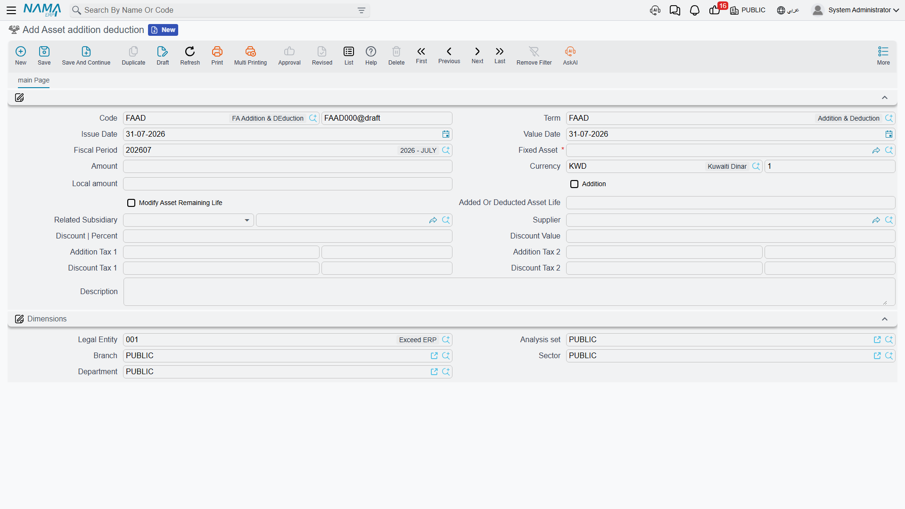
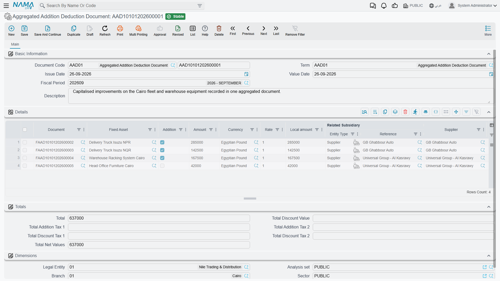

# Additions and Deductions

In January 2027 Al-Waha's CNC machine gets a new control unit. It is not a repair — the machine is
more capable afterwards and the unit will last as long as the machine will — so the 30,000 the
supplier charged belongs in the machine's cost, not in this month's expenses.

The **asset addition deduction document** is how that reaches the asset. It is the module's tool for
changing an asset's **cost** after the fact: capitalising an improvement, or writing a slice of value
off. One document, one asset, one amount, in one direction or the other.

**Assets → Documents → Asset addition deduction** (`الأصول > المستندات > سند الإضافة و الإستبعاد`),
licence `fixedassets`.

## What It Changes, and What It Does Not

It changes the asset's **cost**. It never touches accumulated depreciation, and it books nothing to
the accumulated depreciation account — the entry hits the asset's own cost account (حساب الأصل).

So after `MCH-0007`'s upgrade the machine's cost is 270,000 rather than 240,000, and its accumulated
depreciation is still the 43,200 charged over 2026. Its book value moves from 196,800 to 226,800,
because 30,000 of new value has been added to it.

What it does **not** do is change history. No entry is restated and no catch-up charge is created.
The effect is entirely on the future, through the instalment.

## The Arithmetic

This is the part worth reading slowly, because it is where people expect a schedule and there isn't
one.

At the end of December 2026, after twelve monthly runs, `MCH-0007` stands at:

| | |
|---|---|
| Cost | 240,000 |
| Accumulated depreciation | 43,200 |
| Book value | **196,800** |
| Salvage value | 24,000 |
| Remaining life | **48** periods |
| Instalment | 3,600 |

The addition document is committed for **+30,000**. The next depreciation run does not add anything
to 3,600; it evaluates the formula again from the new position:

> (196,800 + 30,000 − 24,000) ÷ 48 = 202,800 ÷ 48 = **4,225**

From January 2027 each run books **4,225** instead of 3,600. The remaining life has not changed, so
the machine still finishes on the same date — it just depreciates faster to get there. The twelve
entries of 2026 stay at 3,600.

A deduction works identically in the other direction: subtract instead of add, and the instalment
comes down.

## You Have to Be Caught Up First

Before it will accept an addition or a deduction, the module insists the asset is depreciated right
up to the document's period. If `MCH-0007` had only been depreciated to October and you dated the
upgrade in January, the commit would be refused, telling you the asset is not depreciated until that
date.

This is not obstruction for its own sake. The instalment is derived from the asset's position at a
moment in time, so letting a value change slip in behind an un-run period would produce a figure
that was never true. Run the outstanding depreciation, then enter the addition.

The same forward-only discipline applies to the value date: the document cannot be dated before a
later document that has already touched the asset, and you will be told which document is in the
way.

The one recognised exception is on the depreciation side — the depreciation term option that allows
a depreciation document to be dated before an existing addition, deduction, transfer or partial
disposal, described on
[The Depreciation Document](/modules/fixedassets/depreciation/fixedassets-depreciation-document.md),
which lets a depreciation run be dated behind an existing addition or deduction. That is the setting
to reach for when a late invoice has to be capitalised into a month you have not yet closed.

## Filling the Document In

| Field | |
|---|---|
| **Code** / **Book** (الكود / الدفتر), **Term**, **Issue Date**, **Value Date**, **Fiscal Period** | the usual document header |
| **Fixed Asset** (الأصل الثابت) | required — one asset per document |
| **Amount**, **Currency**, **Rate**, **Local amount** | the value being added or deducted |
| **Addition** (إضافة) | the direction switch: ticked = addition, cleared = deduction |
| **Modify Asset Remaining Life** (تعديل العمر المتبقي للأصل) | see below |
| **Added Or Deducted Asset Life** (العمر الافتراضي المٌضاف او المٌستبعد) | see below |
| **Related Subsidiary** (الذمة المتعلق), **Supplier** (مورد) | who the other side of the entry is |
| **Discount \| Percent**, **Discount Value** | a discount on the amount |
| Two addition-tax pairs and two discount-tax pairs, each as a percentage and a value | tax handling |
| **Description** (ملاحظات), **Dimensions** | as everywhere |

The percentage and value fields keep each other in step as you type — enter a discount percentage
and the value fills itself, and the same for every tax pair.

The value that actually reaches the asset's cost is the amount you entered, adjusted by the taxes
and the discount according to the term: each addition tax is capitalised only if the term says it
should be, the discount taxes come off the capitalised value only if the term says so, and on an
**addition** the discount you entered reduces what is capitalised. Which is a long way of saying:
the term decides how much of the tax and discount belongs in the asset, and the ledger entry covers
all of it regardless.

## What Committing Books

An accounting business request is created and processed in the background. For an **addition**:

| Account | Debit | Credit |
|---|---|---|
| The asset's own cost account (حساب الأصل) | 30,000 | |
| The account named on the term — the supplier or payable side | | 30,000 |

For a **deduction** the two swap over. Taxes and the discount produce their own additional lines from
the accounts configured on the term, and identical accounts are collapsed into one line if the term
asks for a shortened entry.

The line's subsidiary is the *Related Subsidiary*, the supplier is the *Supplier*, and the entry's
dimensions always come from the **asset** — this document has no "dimensions from document" option.

The document is also a tax document, so where taxes are involved it produces the invoice data the
tax and e-invoicing machinery needs.

The accounts themselves are set on the term; see
[Depreciation and Disposal Terms](/modules/fixedassets/document-terms/fixedassets-terms-depreciation-and-disposal.md).

## Changing the Remaining Life at the Same Time

Sometimes an improvement does not just add value, it adds years. Tick **Modify Asset Remaining Life**
and enter a number of periods in **Added Or Deducted Asset Life**, and the same document adjusts the
divisor as well as the numerator:

- on an **addition**, the periods are **added** to the asset's remaining life;
- on a **deduction**, they are **subtracted** from it.

If Al-Waha's upgrade had also bought the machine twelve more months, the instalment from January
2027 would have been (196,800 + 30,000 − 24,000) ÷ 60 = **3,380** rather than 4,225 — more value,
spread over more periods.

The field is required when the switch is ticked and must be left empty when it is not.

Two things follow from using it, and both matter:

**The asset's next depreciation must be in the same fiscal period as this document.** Once a
life-adjusting addition or deduction exists in a period, the run will depreciate that asset in that
period and no other. Enter the document in the period you intend to depreciate in.

**An asset whose life had run out can be brought back.** Adding life to an asset that had reached
zero remaining life restarts its depreciation series from the period of the document — which is the
supported way to extend the life of something that was fully written down but is still in service.

## Doing Many at Once

When a single invoice has to be spread over twenty assets — an insurance uplift, a fleet-wide
retrofit — the **aggregated addition deduction document**
(`الأصول > المستندات > مستند إضافة واستبعاد مجمع`) is the batch-entry version.

It is a grid of the same fields: asset, the Addition switch, amount, currency, rate, local amount,
related subsidiary, supplier, discount percentage and value, the four tax pairs, net value, and the
two life fields. A **Totals** group at the bottom sums the values, the discount and each tax, and
gives a final net total.

On commit, **each line becomes one real addition or deduction document** — with its own code, its
own accounting entry, and its own validation — and the generated document's reference is written
back into the line's **Document** column so you can open any child straight from the grid. Unlike
the [aggregated depreciation document](/modules/fixedassets/depreciation/fixedassets-aggregated-depreciation.md),
this one does not span periods: every child shares the aggregate's period and value date.

The aggregate itself books nothing of substance; all the entries come from its children. Cancelling
it deletes them all, and removing a line and re-committing deletes just that line's child.

## Actions on This Screen

Neither the single-asset document nor the aggregated one carries a button of its own. There is no
*collect* here — you name the asset, type the value, and the new instalment is worked out for you as
the fields are filled. Everything else follows from committing the document, and is undone by
un-committing it.

## This Is Not the Document for Maintenance

A repair keeps an asset working; an improvement makes it worth more. Only the second one belongs
here.

Routine maintenance is recorded on a
[maintenance record](/modules/fixedassets/maintenance/fixedassets-maintenance-records.md), whose cost
field is there for history and analysis. It does not capitalise, it does not change the machine's
depreciation, and it does not reach the ledger through the Fixed Assets module. If your engineers
have done something that genuinely increases the asset's value or its remaining life, that is when
you raise an addition — and then the maintenance record and the addition document sit side by side,
one describing the work and the other carrying the money.
