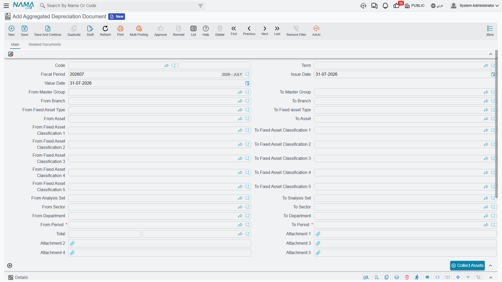
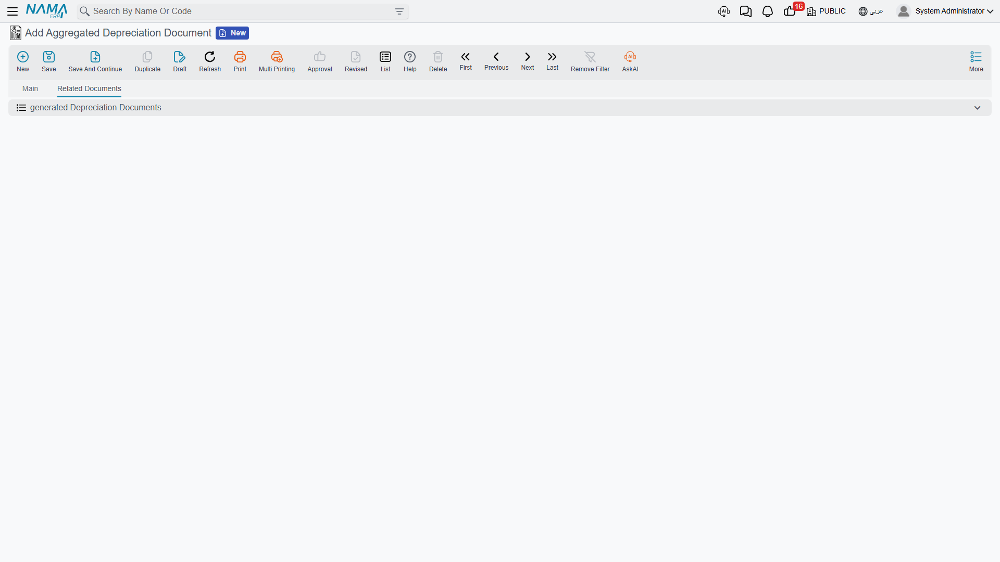

# The Aggregated Depreciation Document

Al-Waha Industries goes live on Nama in November, backdated to the start of the year. Ten months of
depreciation have to be recorded before the first real month-end, and the
[depreciation document](/modules/fixedassets/depreciation/fixedassets-depreciation-document.md) does
one fiscal period at a time. Creating ten of them by hand, in order, each with the right period and
the right value date, is exactly the sort of task that goes wrong at document seven.

The aggregated depreciation document exists for that. You give it a **range of periods**, collect
the assets once, and commit — and it creates the individual depreciation documents for you, one per
period, each already committed.

Find it at **Assets → Documents → Aggregated Depreciation Document**
(`الأصول > المستندات > سند إهلاك مجمع`), under the `fixedassets` licence.

## It Is a Driver, Not a Container

This is the thing to understand before you use it: the aggregate does not *hold* the depreciation.
It **produces documents that do**.

When you commit it, the system walks the period range from start to end and, for each normal fiscal
period in it, creates a real depreciation document — with its own book, its own code, its own value
date on that period's last day — carrying only the assets that are actually due in that period. Each
of those documents is committed in its own right, and each books its own accounting entry in the
usual way: debit the asset's depreciation account, credit its accumulated depreciation account.

The aggregate itself books **nothing**. Its total is simply the sum of what its children produced,
and it is there so you can see at a glance what the batch came to.

## Setting One Up

The screen is the depreciation document's screen with one addition: **From Period** (من فترة) and
**To Period** (الي فترة) sit alongside the single Fiscal Period field. Everything else is familiar —
the same paired *from … to* code ranges for asset, type, master group, branch, sector, department,
analysis set and classifications, the same *Collect Assets* button, the same locked details grid
where the only editing action is deleting a line. There are also five attachment slots on the
header, which the single document does not have.

The one piece of setup it does need is a **term**, and the term is not optional here. It carries two
fields and both must be filled:

| Term field | |
|---|---|
| **Aggregated Depreciation Book** (دفتر سند إهلاك) | the document book the generated depreciation documents are written into |
| **Aggregated Depreciation Term** (توجيه سند إهلاك) | the term applied to those generated documents |

Without them the commit stops and tells you to fill the book and term inside the term. This is worth
doing once, properly, when the module is set up — see
[Depreciation and Disposal Terms](/modules/fixedassets/document-terms/fixedassets-terms-depreciation-and-disposal.md).

Three more rules are checked before anything is generated:

- From Period must not be after To Period;
- both must be **normal** periods — not opening, adjustment or closing periods;
- both must belong to the same calendar.

## What Al-Waha's Catch-Up Looks Like

Say the range is January to October 2026 and the filters are left empty.

1. *Collect Assets* fills the grid with every asset that is due somewhere in the range.
2. On commit, the system works period by period. For January it takes the assets whose next due
   period is January — including `MCH-0007`, whose depreciation start date is 1 January — and writes
   them into a January depreciation document dated 31 January, then commits it. `MCH-0007`'s line
   reads 3,600.
3. February's document is built next, from the same list, now that January has moved everybody's
   position on by one period. `MCH-0007` appears again, at 3,600.
4. …and so on to October. An asset bought in June only appears from June onwards; an asset disposed
   of in August stops appearing after August. Each period's document contains exactly the assets that
   belong in it.
5. The ten totals roll up into the aggregate's total.

The generated documents are listed on the aggregate's second tab, **Related Documents**
(المستندات المرتبطة), so you can open any one of them and see the period it covers. They are
ordinary depreciation documents in every respect — they show up in the depreciation list view, they
print, and they can be reported on.

## One Extra Convenience

The single depreciation document simply skips an asset whose computed instalment is not above zero.
The aggregate, because it knows a range, does something more useful: when an asset's instalment
comes out at zero or below for the period it is looking at, it scans forward through the range
looking for the first period where the instalment turns positive, and picks the asset up there.

That is how an asset acquired in the middle of a catch-up range lands in the right month without you
telling it which month.

## Changing Your Mind

Cancelling the aggregate deletes every document it generated — newest first, so the value timelines
come apart cleanly — and with them their accounting entries. That is the supported way to undo a
batch, and it is a clean one.

What is **not** supported is editing an aggregate that has already been committed and re-committing
it. Treat a committed aggregate as finished: if the batch was wrong, cancel it whole and enter a new
one. If only one period inside it was wrong, cancel the batch, fix the underlying cause, and run it
again — or run the remaining periods individually with the ordinary depreciation document.

::: warning Cancelling a batch reverses many periods at once
An aggregate covering ten months holds ten committed depreciation documents behind it, each of which
has moved every asset's remaining life on by one period. Cancelling it rewinds all of them. That is
the correct behaviour and it is why the aggregate is so convenient — but it is a large action, and
worth pausing over on a live register.
:::
