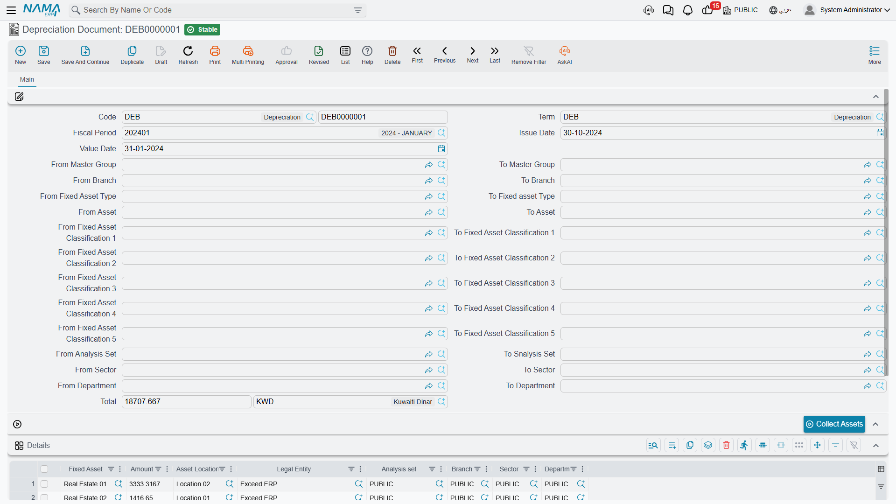
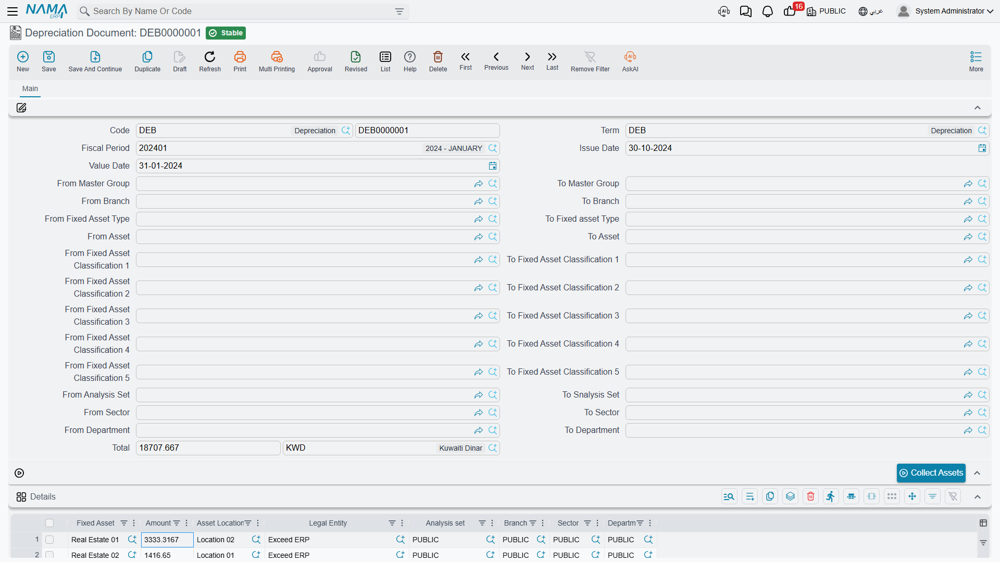
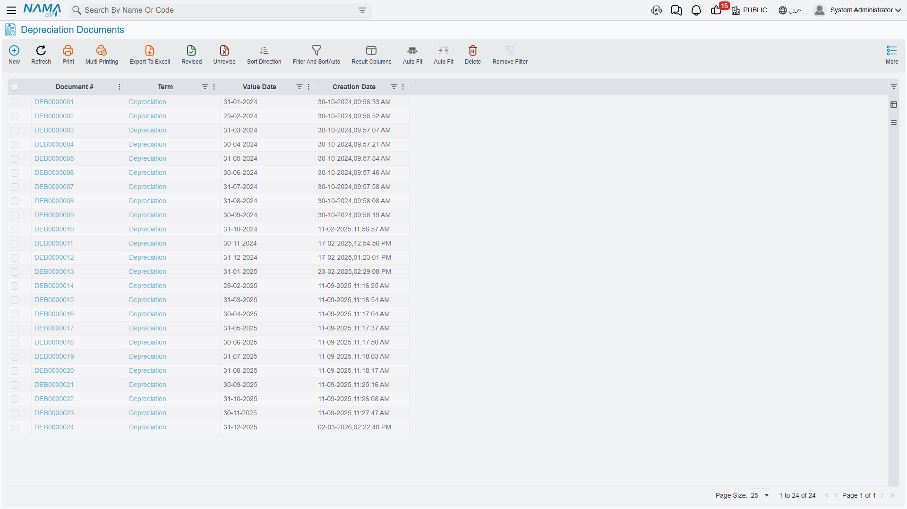

# The Depreciation Document

The depreciation document is the period-end run: one document per fiscal period, holding one line
per asset, each line carrying that asset's charge for the period. It is the only document in the
module that books depreciation, and for most sites it is the single most routine thing anybody does
in Fixed Assets — twelve of them a year, each taking a couple of minutes.

You will find it at **Assets → Documents → Depreciation Document** (`الأصول > المستندات > سند إهلاك`).
It needs the `fixedassets` licence and nothing else.

## Running January 2026 for Al-Waha

Al-Waha Industries closes its books monthly, so on the last working day of January somebody opens a
new depreciation document and does this:

1. **Choose the book and the fiscal period.** The period is the whole point of the document; almost
   nothing else works until it is filled.
2. **Check the value date.** The system fills it from the period, and it must be the period's **last
   day** — 31 January 2026 here. A value date that is not the period end is refused on commit. The
   issue date is a plain document date and can be whatever day you are actually working on.
3. **Narrow the run, if you want to.** The header carries a long block of paired *from … to* fields:
   asset, fixed asset type, master group, branch, sector, department, analysis set and asset
   classifications 1 to 5. Each pair is a **code range** — everything from this code up to that code
   — so they are for slicing the register, not for picking individual assets. Leave them all empty
   and the run covers everything.
4. **Press *Collect Assets*** (تجميع الأصول). The system finds every asset that is due in this
   period and fills the grid with one line each, already carrying the computed instalment. For
   `MCH-0007` that line reads **3,600**.
5. **Review, and delete anything you do not want.** More on this below.
6. **Save and commit.**

The header total sums the lines. Its currency is forced to the legal entity's currency, so it is
always a local-currency figure.

## The Details Grid Is Read-Only by Design

| Column | |
|---|---|
| **Fixed Asset** | the asset being depreciated |
| **Amount** | its instalment for this period |
| **Asset Location** | copied from the asset |
| **Legal Entity / Analysis set / Branch / Sector / Department** | the asset's dimensions, copied onto the line |

You cannot type in this grid. The asset column and the amount column are locked, and the dimensions
and location are copied from the asset when the document is saved. The **only** editing action
available is deleting a line.

That is deliberate, and it is the right model: the instalment is not an opinion, it is the output of
the formula on
[How Depreciation Works](/modules/fixedassets/depreciation/fixedassets-depreciation-concepts.md).
If a figure is wrong, the input is wrong — the asset's remaining life, its salvage value or its
carrying amount — and the way to change it is a
[properties document](/modules/fixedassets/depreciation/fixedassets-properties-document.md) or an
[addition or deduction](/modules/fixedassets/depreciation/fixedassets-additions-and-deductions.md),
not a typed override here.

Deleting a line, on the other hand, is a real tool: it takes that asset out of *this* run. Be aware
of what that means, though — the asset then has a gap in its series, and the consecutiveness rule
will refuse to depreciate it in February until the gap is either filled or documented with a
[prevent depreciation document](/modules/fixedassets/depreciation/fixedassets-prevent-depreciation.md).

## Which Assets Turn Up

*Collect Assets* applies your from/to filters and then a fixed set of conditions that you cannot
change: status **Running**, method **Straight Line**, depreciation start date on or before the
period end, the period immediately following the asset's last depreciation, no prevention covering
it, and a computed instalment above zero. The full list, with the reasoning behind each condition,
is on the concepts page.

The practical version: if an asset you expected is missing, look at its status first, then at its
last depreciation period, then at its depreciation start date. Those three explain almost every
absence.

## What Committing Books

Committing creates an accounting business request (`طلب أعمال`) that is processed in the background,
so the document saves instantly and the entry appears a moment later. Per line, for the instalment
amount:

| | Account |
|---|---|
| **Debit** | the asset's **depreciation account** (حساب الإهلاك) — the expense |
| **Credit** | the asset's **accumulated depreciation account** (حساب الإهلاك التراكمي) |

For January 2026, `MCH-0007` contributes a debit and a credit of 3,600 each; the document as a whole
books the sum of all its lines.

The important detail is where those two accounts come from: **the asset**, through the accounts on
its master file (which it usually inherited from its
[fixed asset type](/modules/fixedassets/master-files/fixedassets-asset-types.md)). They are not
configurable on the term, which is why two assets on the same document can hit different accounts
and why setting the type's accounts up correctly at the start matters so much.

Alongside the entry, committing also:

- writes a dated entry onto each asset's value timeline;
- reduces each asset's remaining life by one;
- recomputes each asset's current instalment for next period;
- flips any asset that has now reached its salvage value to *Depreciated*.

If the accounting request fails, it is retried from the **Business Requests** list view — filter for
failed requests, select the rows and use the **More** menu → *Reprocess* / *Recommit*. The document
itself does not need to be touched.

## The Term, and the One Option Worth Knowing

This document does **not** require a term — it commits perfectly well without one, because it takes
its accounts from the asset. A term adds narration templates and a handful of options; the one that
changes behaviour for ordinary users is the one whose label lists four documents — *addition,
deduction, transfer and partial disposal* (السماح بعمل مستندات اهلاك سابقا لتاريخ سندات).

Normally the module insists you work strictly forwards: once an addition, deduction, transfer or
partial disposal exists on an asset, you cannot slip a depreciation run in behind it. With this
option on, you can — which is what you need when a late-arriving upgrade invoice was dated into a
month you have not depreciated yet. With it on, the run also re-derives each line's instalment when
the document is saved and drops any line whose instalment has fallen to zero or below.

Sites that also run Contracting get depreciation as a project cost source; those options live on the
same term and are covered with the rest of the module's accounting wiring in
[Depreciation and Disposal Terms](/modules/fixedassets/document-terms/fixedassets-terms-depreciation-and-disposal.md).

## Correcting a Run

There is no reversing document and no credit note. A wrong run is un-committed or deleted, and
re-entered.

Three rules govern that:

- **Newest first.** An asset's value timeline is a chain, and you cannot pull a link out of the
  middle. If `MCH-0007` has been depreciated in January, February and March, the January document
  will not come apart until March and February have been undone. The message names the document that
  is in the way.
- **The fiscal period cannot be changed on an existing document.** The system says so plainly and
  asks you to delete and re-insert instead. Do that rather than looking for a way round it.
- **Un-committing puts everything back.** The dated entry is removed, the asset's previous values are
  restored, remaining life goes back up, the instalment is recomputed, an asset that had flipped to
  *Depreciated* returns to *Running*, and the accounting entry is withdrawn through a business
  request of its own.

::: warning Deleting a run is a real reversal
Un-committing or deleting a depreciation document does not just remove a piece of paper — it removes
that period's charge from every asset on it and rewinds each asset's remaining life. On a document
covering four hundred assets that is four hundred rewinds. Make sure you mean it, and re-run the
period afterwards.
:::

## Period Closing Depends on This Document

Fixed Assets participates in fiscal-period closing: a period will not close while a running asset
whose depreciation start date falls inside it was not depreciated in the previous period, and the
close fails naming the asset. That check is the main reason to run depreciation as part of the
month-end routine rather than when somebody remembers.

Two options on the
[module configuration](/modules/fixedassets/fixedassets-configuration.md) relax it — one allows
closing with un-depreciated assets outstanding, the other allows closing for assets that carry a
prevention record. Turn them on only if you have decided, deliberately, that the register may lag
the ledger.

## Finding Runs Afterwards

The list view is where you check that a period has been run at all, and it is the fastest way to see
the shape of a month: one row, one period, one total. To see the same information asset by asset,
use the module's
[reports](/modules/fixedassets/reports/fixedassets-reports.md), or the asset's own Statistics page.

If the register and the ledger have genuinely diverged — usually after documents were removed
directly in the database, or after a bad import — there are administrator utilities for rebuilding
an asset's depreciation history; see
[Fixed Assets Module Utilities](/admin/reprocessing/fixed-asset-utilities.md). That is a repair
tool, not part of normal operation.

## When There Are Many Periods to Run

If you have twelve months of arrears to work through, you do not have to create twelve documents by
hand. The
[aggregated depreciation document](/modules/fixedassets/depreciation/fixedassets-aggregated-depreciation.md)
takes a period range and creates the individual runs for you.
