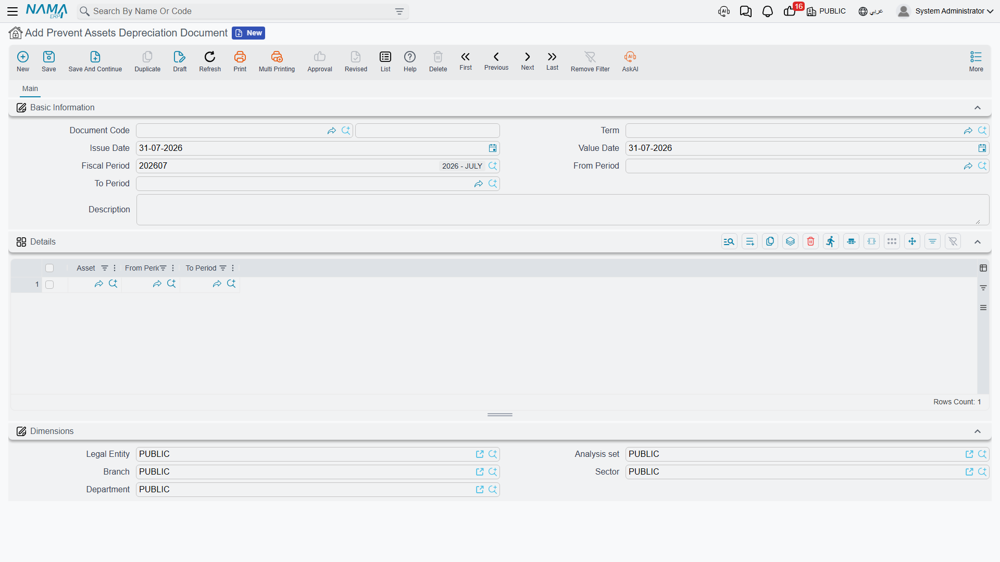

# Freezing an Asset's Depreciation

Sometimes an asset should not be depreciated for a while. A production line is mothballed for six
months while the plant is re-tooled. A vehicle is impounded pending a court case. An asset's
ownership is disputed and the auditors want it left alone until the dispute is settled.

The obvious move — leaving the asset off the monthly run — does not work, and it is worth
understanding why before reaching for the document that does.

## Why You Cannot Simply Skip a Period

An asset's depreciation series has to be **consecutive**. The run will only depreciate an asset in
the period immediately following the one it was last depreciated in, and it checks that on commit.
So if you delete `MCH-0012`'s line from the February run and try again in March, March is refused:
the asset's last depreciation was January, and February is missing.

Worse, that refusal does not go away by itself. There is no "resume" button, and no later period
will ever be the period immediately after January. A silently skipped period parks the asset outside
the depreciation series for good.

The **prevent assets depreciation document** is how you skip a period *on the record*. It declares
that named assets must not be depreciated across a stated range of periods, and the depreciation run
then treats that range as a documented gap rather than a hole — it excludes those assets while the
block is running, and picks them up cleanly in the first period after it ends.

You will find it at **Assets → Documents → Prevent Assets Depreciation Document**
(`الأصول > المستندات > مستند منع اهلاك اصول`), under the `fixedassets` licence.

## Filling It In

The screen is short. Under **Basic Information** you have the document code and book, the term, the
issue date, the value date, the fiscal period, a description field, and the pair that does the real
work: **From Period** (من فترة) and **To Period** (الي فترة).

The details grid then lists the assets, each with its own From Period and To Period. In practice you
set the range once on the header, because the header values are pushed down onto every line each
time the document is saved — so the header is the range and the grid is the list of assets it
applies to.

There is a **Dimensions** group at the bottom, as on every document in the module.

The document needs no term settings and produces **no accounting entry at all**. Nothing is booked;
nothing is deferred to a suspense account. It only changes what the depreciation run is willing to
collect.

## The Range Has to Butt Up Against the Asset's History

Three checks are run when you commit, and all three are about keeping the asset's timeline
continuous:

- **The asset must already exist financially.** It must have an opening or purchase document dated
  before the period — you cannot pre-emptively freeze an asset that has never been capitalised.
  *"The asset does not have opening or purchase document before fiscal period …"*
- **There must be no gap in front of the block.** The From Period has to follow the asset's last
  used period immediately. If the asset was last depreciated in January and you try to block it from
  April, the commit is refused and tells you to cover the gap — February and March have to be part
  of the block, or depreciated, before April can be blocked.
- **The block must be clear of other transactions.** If the asset has any document dated inside the
  range you are blocking, the commit is refused and names it.

Between them, these mean a prevention is planned *forward* from where the asset stands today, not
patched in afterwards. Decide to freeze the asset before the period you want to skip, not after.

The document must also be **committed** to have any effect. An entered-but-uncommitted prevention is
invisible to the depreciation run — every check the run performs looks only at committed prevention
lines.

## What Happens While the Block Is On

Take `MCH-0012`, Al-Waha's forklift, taken out of service for the second quarter of 2026 while the
warehouse is rebuilt. A prevention document is committed covering April, May and June.

- The **April, May and June runs do not collect it.** It is not on the list, and no line for it can
  be added by hand, because the grid is not typeable.
- **Committing the prevention writes a zero-valued entry** onto the asset's value timeline for each
  line. That entry is what makes the gap a documented one: it changes no value at all, but it stands
  in the timeline as the record of the block, and it is what the consecutiveness check reads later.
- **July collects it again**, at the instalment implied by its state — which is exactly where it was
  in March, because nothing was charged in between. Its remaining life has not moved either: only a
  depreciation entry reduces remaining life, and there were none. The asset's life has effectively
  been pushed out by three months, which is normally the intended outcome.

## Period Closing While Assets Are Frozen

Fiscal-period closing normally refuses to close a period in which a running asset was not
depreciated. A frozen asset trips that check, which would leave you unable to close April at all.

The [module configuration](/modules/fixedassets/fixedassets-configuration.md) has an option for
exactly this case: allow closing when the asset is prevented from depreciation. It relaxes the close
only for assets that carry a prevention record, which is narrower and safer than the general
"allow closing with un-depreciated assets" option next to it. If you use prevention documents at
all, this is the option to turn on.

## Ending a Block Early, or Extending It

There is no "release" document. To change a block you un-commit or delete the prevention document
and enter it again with the range you want — subject to the same rule as everything else in this
folder: the asset's timeline comes apart newest-first, so if depreciation has already been run after
the block ended, those runs have to be undone first.

::: tip A prevention is also the tool for an asset that fell out of the series
If you find an asset that no depreciation run will collect because its first period was missed, a
prevention document covering the missing periods is what restores it: the run treats the block as
the asset's documented history and resumes in the first period after it. The same constraints apply
— the block has to start immediately after the asset's last activity and be clear of other
documents.
:::
