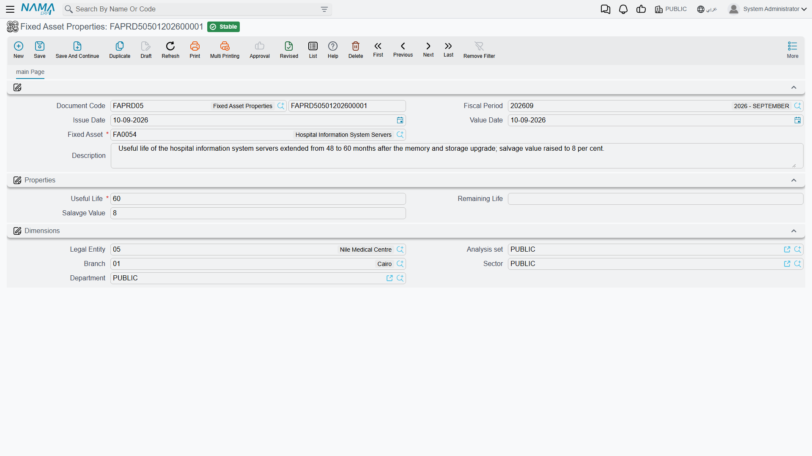
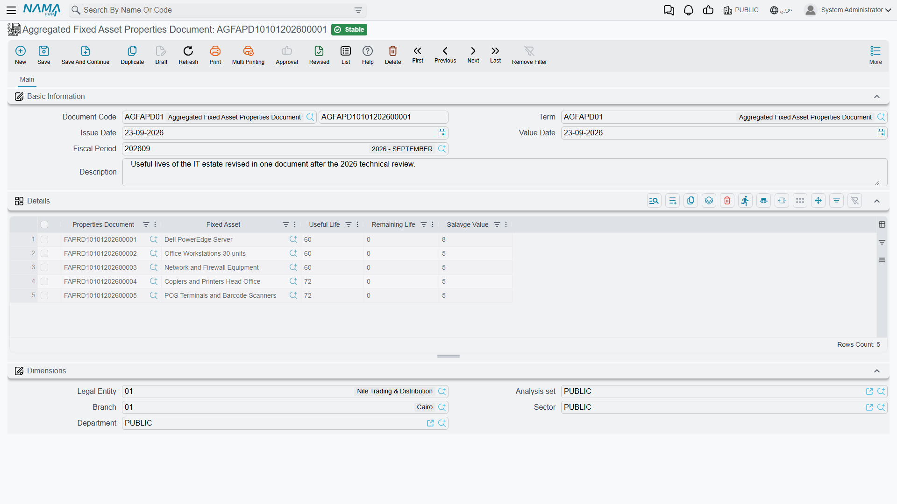

# Re-estimating an Asset's Life and Salvage Value

Useful life and salvage value are estimates, and estimates get revised. An engineering review says
the machine has three more years in it, not five. A change of policy raises the scrap value the
fleet is expected to fetch. A machine that was going to be worked hard is now on light duty.

The **fixed asset properties document** is where those revisions are recorded. One document, one
asset, and a very short list of things it can change.

**Assets → Documents → Fixed Asset Properties** (`الأصول > المستندات > خصائص أصل ثابت`), licence
`fixedassets`.

## Exactly Three Things

The screen is one page. The top block carries the document code and book, the fiscal period, the
issue date, the value date, the **Fixed Asset** (الأصل الثابت) it applies to and a description. Then
a **Properties** (الخصائص) group with three fields, and a Dimensions group at the bottom.

Those three fields are the entire reach of the document:

| Field | |
|---|---|
| **Useful Life** (العمر الإفتراضي) | the asset's total expected life, in periods. Required. |
| **Remaining Life** (العمر المتبقي) | how many periods it still has to run |
| **Salvage Value** (قيمة الأصل كخردة) | what it is expected to be worth at the end |

Everything else about the asset is out of reach here. This document cannot change the depreciation
method, the accounts, the asset type, any classification, the location, the custodian, the
dimensions, the acquisition cost or the accumulated depreciation. Those live on the asset's master
file or are moved by the documents that own them —
[transfers](/modules/fixedassets/movement/fixedassets-transfer-document.md) for location and
dimensions, [additions and deductions](/modules/fixedassets/depreciation/fixedassets-additions-and-deductions.md)
for cost.

::: tip Remaining Life is the field that changes the money
The instalment is *(current value − salvage) ÷ **remaining life***, so the two fields that move it
are **Remaining Life** and **Salvage Value**. Useful Life is the asset's headline figure — it is
consumed when the asset is first capitalised, to seed the remaining life — and changing it here on
a running asset is a reference change, not an arithmetic one. If you want the charge to change,
change the remaining life.
:::

## The Worked Example

`MCH-0007` reaches the end of December 2026 having been depreciated twelve times:

| | |
|---|---|
| Cost | 240,000 |
| Accumulated depreciation | 43,200 |
| Book value | **196,800** |
| Salvage value | 24,000 |
| Remaining life | **48** periods |
| Instalment | **3,600** |

An engineering review on 1 January 2027 concludes the machine will only last another **30** months,
and that the scrap market has moved — it should be carried at a salvage of **30,000**, not 24,000.

1. Create a properties document with **value date 1 January 2027**. It has to be dated after the
   asset's last depreciation entry of 31 December 2026 — more on that below.
2. Asset `MCH-0007`; **Remaining Life** 30; **Salvage Value** 30,000. (Useful Life, being required,
   is set to 42 to keep the master file coherent — 12 periods run plus 30 to go.)
3. Commit.

A dated entry goes onto the asset's value timeline, the asset's properties are updated, and the
instalment is re-derived on the spot:

> (196,800 − 30,000) ÷ 30 = 166,800 ÷ 30 = **5,560**

From January 2027 every depreciation run books 5,560 instead of 3,600, and the machine finishes 18
periods earlier than it was going to. The twelve entries of 2026 stay exactly as they were.

## It Is Not Retroactive — and It Cannot Be Made So

No entry is restated, no catch-up charge is created, and the system will not let you date the
document into the past to fake one.

The rule that enforces it is the same one that governs the whole module: **no entry may already
exist for this asset after the document's value date**. `MCH-0007` has been depreciated up to 31
December, so the properties document goes after that — 1 January is the natural date. Try to date it
into November and the commit is refused, naming the document that already sits on the later date.
The same check runs again if you edit a committed document and move its value date back across other
entries.

If you genuinely need the new life applied to periods that have already been run, there is only one
route: cancel the depreciation runs concerned — newest first — enter the properties document at the
date you want, and re-run them.

Two more checks apply on commit:

- **The salvage value must be at least the module's minimum.** The
  [module configuration](/modules/fixedassets/fixedassets-configuration.md) carries a minimum salvage
  value, and a lower figure is refused. Neither life figure may be negative.
- **The asset's status must be Running or Not Depreciable.** You cannot re-estimate an asset that is
  still in its initial state, one that has been disposed of, or one that is already fully
  depreciated. For a fully depreciated asset that is still in service, the way back is an
  [addition that adds life](/modules/fixedassets/depreciation/fixedassets-additions-and-deductions.md),
  not this document.

## No Term Settings, No Journal Entry

The properties document needs a **book** and nothing else. It does not require a term, it has no
term options to configure, and it produces **no accounting entry at all**.

That is correct, not an omission. The document does not move any value — it changes the rate at
which value will be charged in future, and the money is booked, period by period, by the
[depreciation runs](/modules/fixedassets/depreciation/fixedassets-depreciation-document.md) that
follow.

Cancelling it removes the dated entry, restores the properties the asset had before, and recomputes
the instalment from those. As always, a later entry blocks the cancellation until it has been undone
itself.

## Re-estimating a Whole Fleet

Al-Waha's twelve delivery vans were all bought on a 60-month life. A policy review re-assesses the
lot at 24 remaining months with a 5,000 salvage each. Twelve separate documents would be tedious and
easy to get wrong.

The **aggregated fixed asset properties document**
(`الأصول > المستندات > سند خصائص أصل مجمع`) is one screen with one grid: asset, useful life,
remaining life and salvage value per line, plus the generated document reference. On commit it
creates **one properties document per line** and lets each of them do the real work — its own dated
entry, its own instalment recalculation, its own validation.

It needs one piece of configuration first. Its term carries two fields:

| Term field | |
|---|---|
| **Fixed Asset Properties Book** (دفتر سند خصائص أصل ثابت) | the book the generated documents are written into. **Required** — without it the commit fails and says so. |
| **Fixed Asset Properties Term** (توجيه سند خصائص أصل ثابت) | the term applied to the generated documents. Optional, since the child needs no term. |

The aggregate itself validates only one thing: an asset may not appear twice in the grid. Everything
else — the value-date ordering, the asset's status, the salvage floor, negative lives — is checked by
each child as it is created.

That has one consequence worth planning for: **the batch is all or nothing**. If van number seven
already has a depreciation entry dated after your value date, that child fails and the whole
aggregated commit fails with it. Nothing is left half-applied, but you do have to fix the offending
van before the other eleven will go through.

Removing a line and re-committing deletes that van's generated document and reverses its effect;
cancelling the aggregate deletes all twelve.

## Actions on These Screens

Neither the properties document nor its aggregated form carries a button of its own — there is no
*collect* on either, so the lines of an aggregated re-estimate are typed or imported rather than
pulled from a range. The recalculation you are after happens on commit: the new life and salvage
value are written onto the assets, and the next depreciation run picks them up.
