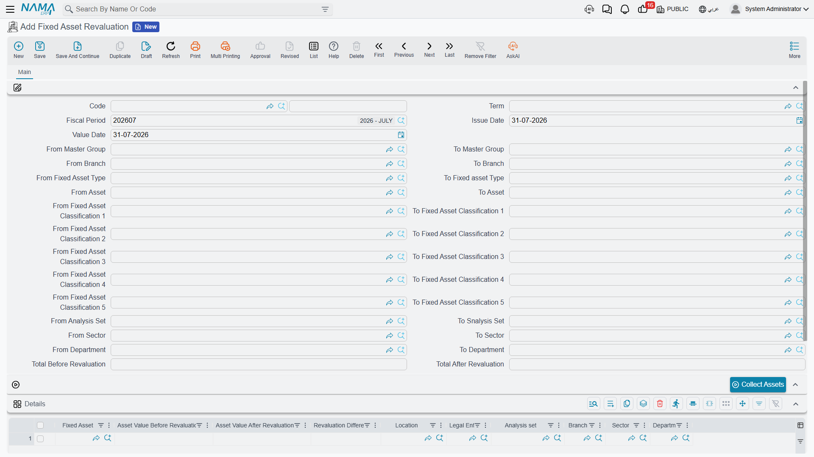

# Revaluation

Some assets do not lose value on a formula. Land, buildings and a few other categories are carried
at what a valuer says they are worth, re-appraised every so often, with the movement taken to a
revaluation gain or loss. Nama supports that, and it supports it as a **depreciation method**, not
as an occasional event you apply to an ordinary asset.

That distinction is the whole page. An asset is either a straight-line asset — the system computes
its charge from
[the formula](/modules/fixedassets/depreciation/fixedassets-depreciation-concepts.md) — or it is a
revaluation asset, in which case the system computes nothing at all and simply records the value you
give it.

## Setting an Asset Up for Revaluation

On the asset's master file, set **Asset Depreciation Method** (طريقة إهلاك الأصل) to **Revaluation**
(إعادة تقييم). Do it when the asset is created: once the asset has any history behind it the method
is locked.

From that moment the asset drops out of the ordinary depreciation cycle entirely. The
[depreciation run](/modules/fixedassets/depreciation/fixedassets-depreciation-document.md) does not
collect it, and if you managed to get a line for it onto a depreciation document the commit would
refuse it and point you at this document instead. Its remaining life and salvage value sit on the
master file untouched — nothing reads them for a revaluation asset.

## The Document

**Assets → Documents → Fixed Asset Revaluation** (`الأصول > المستندات > إعادة تقييم الأصول`),
licence `fixedassets`.

The header is the depreciation document's header — book and code, term, fiscal period, issue date,
value date, the same long block of paired *from … to* code ranges for asset, type, master group,
branch, sector, department, analysis set and classifications 1 to 5 — with the total replaced by two
figures: **Total Before Revaluation** (الإجمالي قبل إعادة التقييم) and **Total After Revaluation**
(الإجمالي بعد إعادة التقييم).

There is a **Collect Assets** (تجميع الأصول) button, which fills the grid with the revaluation-method
assets matching your ranges, each already carrying the value the last appraisal left behind. Assets
still in their initial state and assets that have been disposed of are excluded. The button works
from the **fiscal period**, so fill that in before pressing it, and press it before you start editing
lines — it rebuilds the grid rather than adding to it.

The grid then holds one line per asset:

| Column | |
|---|---|
| **Fixed Asset** (الأصل الثابت) | required |
| **Asset Value Before Revaluation** (قيمة الأصل قبل إعادة التقييم) | filled in for you from the asset's current value — you do not type it |
| **Asset Value After Revaluation** (قيمة الأصل بعد إعادة التقييم) | **the only figure you enter** |
| **Revaluation Difference** (فرق إعادة التقييم) | computed as *after − before*, as you type |
| **Location** and the five dimensions | copied from the asset |

An asset may appear only once on a document.

## What Gets Booked

Take Al-Waha's head office building, carried at a cost of **1,000,000** with **200,000** of
accumulated depreciation standing against it — a net book value of **800,000**. The valuer's report
for March 2026 puts it at **860,000**.

You enter one line: before 800,000, after 860,000, difference **+60,000**.

Committing creates an accounting business request that is processed in the background, and it
produces two pairs of lines:

| Account | Debit | Credit |
|---|---|---|
| Buildings — the asset's own cost account | 60,000 | |
| Revaluation surplus — from the term | | 60,000 |
| Accumulated depreciation — buildings | 200,000 | |
| Buildings — the asset's own cost account | | 200,000 |

Read the effect on the cost account: +60,000 −200,000, so the building account moves from 1,000,000
to **860,000**, and the accumulated depreciation account is emptied. After the document, the asset
account **alone** carries the appraised value. That restatement to net book value is deliberate and
it is what makes the next appraisal simple — there is no accumulated depreciation left to
reconcile against.

A downward movement is the mirror image. If the next valuation, in June, comes back at **800,000**,
the difference is **−60,000** and the entry is:

| Account | Debit | Credit |
|---|---|---|
| Revaluation loss — from the term | 60,000 | |
| Buildings — the asset's own cost account | | 60,000 |

There is no second pair this time: the accumulated depreciation was already cleared by the first
revaluation, so there is nothing left to eliminate. The clearing pair only appears when the asset
still carries accumulated depreciation from before its first appraisal — typically from an
[opening balance](/modules/fixedassets/acquisition/fixedassets-opening-balances.md) or from a life
as a straight-line asset.

A third appraisal in September at **830,000** simply books +30,000 to the cost account against the
revaluation surplus. The chain is *appraisal → appraisal → appraisal*: each document's "before"
figure is the value the previous one left.

Lines whose difference works out to zero are skipped — a re-appraisal that confirms the existing
value books nothing.

## Where the Accounts Come From

The asset's own cost account (حساب الأصل) is one side of every entry, and it comes from the asset,
exactly as it does for depreciation. The other side — the gain and the loss — comes from the
document's **term**, which is where you set the revaluation surplus and revaluation loss accounts.
That is the one piece of configuration this document genuinely needs; it is covered with the rest of
the module's accounting wiring in
[Depreciation and Disposal Terms](/modules/fixedassets/document-terms/fixedassets-terms-depreciation-and-disposal.md).

Two more options live on the same term:

- **Dimension From Document** (المحددات من المستند) — take the entry's dimensions from the document's
  own Dimensions group instead of from the asset. Off, the asset's dimensions are used.
- **Allow Straight Line And Change Depreciation Method** (السماح بالأصول ذات الإهلاك الثابت و تغيير
  طريقة الإهلاك) — see below.

The entry is always in the legal entity's ledger currency, and the subsidiary on it is the fixed
asset itself.

## Converting a Straight-Line Asset

Normally the document refuses a straight-line asset, and *Collect Assets* will not offer one. The
term option **Allow Straight Line And Change Depreciation Method** lifts that: with it on, the
collector offers straight-line assets too, and committing a revaluation for one of them **switches
that asset to the Revaluation method**.

Be deliberate about it. After the conversion the asset is no longer part of the depreciation cycle
at all — it will not appear on another depreciation run, and its remaining life stops meaning
anything. The one way back is to cancel the revaluation document, which restores the asset's
previous method along with everything else.

That is a genuine use for the option — a building that has been depreciated on a straight line and
is now moving to a revaluation policy — but it is not something to leave switched on by habit.

## Cancelling

Un-committing or deleting a revaluation removes its entry from the asset's value timeline, restores
the asset to what the previous entry left, reverts a converted depreciation method, and withdraws
the accounting entry through a business request of its own. As everywhere else in this folder, the
timeline comes apart newest-first: a revaluation with later documents behind it will not cancel
until those are undone.
