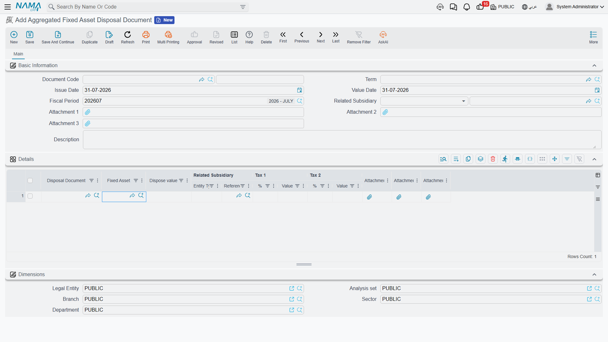

# Disposing of Many Assets at Once

Year-end tidying tends to arrive in batches. A plant closes and eleven machines go for scrap on the
same day; a fleet is replaced and nine vehicles are sold to the same dealer. Raising eleven separate
disposal documents by hand is a morning's work and eleven chances to mistype a value date.

The **Aggregated Fixed Asset Disposal Document** is the answer: one screen, one grid, one commit —
and behind it, one ordinary disposal document per line.

You will find it at **Assets > Documents > Aggregated Fixed Asset Disposal Document**, on the
`fixedassets` licence.

## It is a front end, not a document

This is the thing to understand before anything else, because it explains every other behaviour on
the page: **the aggregated document produces no accounting entry of its own.** It has no gain
account, no loss account, no proceeds account, and it books nothing.

What it does is generate a real
[fixed assets disposal document](/modules/fixedassets/disposal/fixedassets-disposal.md) for every line
you enter, and let *those* do the work. Each generated document reads its asset's ledger balances,
works out its own gain or loss, produces its own journal entry through a business request, and flags
its own asset as disposed. Everything on the disposal page applies to each of them individually —
including the rule that the asset's depreciation must be run and processed with no period skipped
between its last depreciation and the disposal.

The practical consequence is where you look when something goes wrong. A failed ledger entry belongs
to a *generated* document, not to the aggregate, and it is that document's code you will see in the
Business Requests list view.

## One term, one kind of disposal

The aggregated document's own term carries exactly two settings, both mandatory: the **Fixed Asset
Disposal Book** (دفتر سند التخلص من الأصل) and the **Fixed Asset Disposal Term**
(توجيه سند التخلص من الأصل) that every generated document will be created with. Leave either empty
and the commit fails, naming the term.

That single pair is used for **every line in the batch**. So a batch is not simply "a lot of
disposals" — it is *a lot of disposals of the same kind*. If, as recommended on the
[disposal page](/modules/fixedassets/disposal/fixedassets-disposal.md), you keep one term per reason —
sales here, write-offs there, donations somewhere else — then you need one aggregated document per
reason too, each pointing at its own aggregated term.

::: tip Setting the pair up
The aggregated document is wired into the standard aggregated-document setup wizard, so you do not
have to build the book-and-term pair by hand: the wizard creates the aggregate's own book and term
and the singular disposal book and term it points at, correctly linked, in one pass.
:::

## The screen

The header is small — document book and code, issue date, value date, fiscal period, three
attachments and a description, plus the **Dimensions** group carrying the legal entity, analysis set,
branch, sector and department.

One header field does real work: **Related Subsidiary** (الذمة المتعلق), the counterparty. Fill it and
it is pushed down onto every line when the document is saved, which is exactly what you want for a
fleet sold to one dealer. Leave it empty and each line keeps whatever counterparty you gave it
individually.

The counterparty here — on the header and on the lines — may be an **employee, a ledger account, a
safe deposit or a bank account**. If a disposal has to name a supplier or a third party as the
buyer — which is what submitting the sale as an electronic invoice requires — raise that one as an
individual disposal document instead.

The **Details** grid is where the batch lives, one row per asset:

| Column | What it holds |
|---|---|
| **Disposal Document** (سند تخلص من الأصل) | read-only — the document generated for this line. Empty until you commit; afterwards it is your link straight to the entry |
| **Fixed Asset** (الأصل الثابت) | the asset being retired. Required, and no asset may appear twice in the same batch |
| **Dispose value** (قيمة التخلص) | what you are getting for it, before tax; **0** for a scrap or a write-off. May not be negative |
| **Related Subsidiary** (الذمة المتعلق) | the counterparty for this line, overwritten from the header when the header carries one |
| **Tax 1 %** and **Tax 1 Value**, **Tax 2 %** and **Tax 2 Value** | the two tax pairs, per line |

Type the tax **percentages** on the lines. Saving works the values out from the dispose value, and
when the batch commits the server recalculates the tax properly on each generated document — against
the disposal term's tax plan and taxability — and writes the final figures back onto the line, so the
grid ends up agreeing with the documents it produced.

## A batch at Al-Waha

At the close of 2027 Al-Waha Industries retires two machines on the same day. The CNC cutting machine
`MCH-0007` is sold for **200,000** with the proceeds going to the company's bank account, and the
forklift `MCH-0012`, long past useful, is scrapped for nothing.

| Fixed Asset | Dispose value | Related Subsidiary |
|---|---|---|
| `MCH-0007` CNC Cutting Machine | 200,000 | the bank account receiving the money |
| `MCH-0012` Forklift | 0 | the bank account |

Committing produces two disposal documents, both created in the disposal book and term named on the
aggregated document's term. Each works itself out independently:

- `MCH-0007` — cost 270,000 on the ledger against accumulated depreciation of 93,900, so a book value
  of 176,100 and a **gain of 23,900**, credited to the term's gain account;
- `MCH-0012` — cost 60,000 against accumulated depreciation of 38,000, so a book value of 22,000 and,
  with nothing received, a **loss of 22,000**, debited to the term's loss account.

One term served both because the disposal term for a full disposal carries a gain account *and* a
loss account, and the machine that fetched nothing simply took the loss branch. Had the sale needed
a taxable term and the scrap a non-taxable one, the two would have had to go in separate batches.

## What blocks a commit

Every line is checked before anything is generated, and a failure on one line stops the whole batch:

| The rule | Note |
|---|---|
| An asset may not appear on two lines | *the asset is repeated* |
| The dispose value may not be negative | |
| Nothing may be recorded on the asset **after** this document — checked on lines that have not generated a document yet | the message names the blocking document |
| The asset may not be in its initial state | there is nothing on the books to remove |
| An asset newly added to the batch may not already have been disposed of | |

Beyond those, each generated document applies its own rules as it commits — most importantly the
depreciation-sequence rule. So the usual preparation for a batch is: run and process depreciation for
every asset in it so that no period is left un-depreciated before the disposal, then commit the
batch. Having depreciated the disposal's own period is fine, and does not block anything.

## What committing actually does

1. The disposal book and term are read from the aggregated document's term.
2. For every line, a disposal document is created — or, if the line already generated one, that same
   document is reopened and updated rather than replaced.
3. The line's asset, dispose value, counterparty and tax figures are copied onto it, along with the
   document's own header data.
4. Each generated document is then either **committed outright or left for review** — which of the
   two depends on the settings of the disposal book you chose. If your batch produces documents that
   sit waiting rather than posting, that book is where to look.
5. The line is stamped with a link to its document, and the recalculated tax values are read back
   onto the line.
6. Any document generated by an earlier version of the batch whose line you have since removed is
   deleted.

Because step 2 reuses existing documents, **editing a committed batch is safe**: change a value,
re-commit, and the same disposal documents are updated rather than duplicated.

Un-committing does the reverse — every generated disposal document is deleted, which unwinds its
ledger entry and restores its asset exactly as un-committing that document by hand would, and the
links on the lines are cleared. And if you take a **duplicate** of an aggregated document to reuse its
layout, the links are dropped from the copy, so the new batch starts clean instead of pointing at the
original's documents.

## Where to check the result

The aggregated screen tells you the batch was accepted. To see what it *did*, follow the **Disposal
Document** link on any line: that is the real document, carrying the real journal entry, and it is
where the gain or loss, the accounts and the processing status all live. The assets themselves show
the outcome too — status **Disposed**, a disposal date, a zero carrying amount — as described on the
[asset status page](/modules/fixedassets/master-files/fixedassets-asset-status.md).
