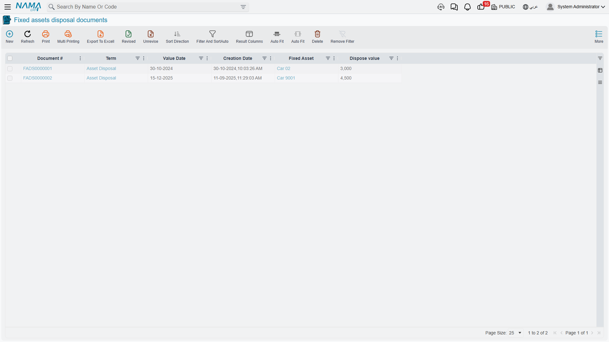

# Disposing of an Asset

Sooner or later every machine leaves. It is sold to somebody who still has a use for it, or it is
cut up for scrap, or it is given away, or it simply disappears in a fire. Whatever the story, the
accounting job is always the same three moves: take the asset's original cost off the books, take
the accumulated depreciation that sits against it off the books, and put whatever you got for it
somewhere — with the difference between the two landing in a gain or a loss account.

The **Fixed Assets Disposal Document** does exactly that, for one whole asset, in one commit.

You will find it at **Assets > Documents > Fixed assets disposal document**, on the `fixedassets`
licence.

## There is no "reason for disposal" field

This is the first thing to settle, because almost every reader arrives looking for it. The disposal
screen has no drop-down offering *Sale / Scrap / Donation / Loss*. There is no such list anywhere in
the module, and nothing in the document behaves differently depending on why the asset left.

What the system actually branches on is arithmetic: **did you get more than the asset was worth, or
less?** That is the only decision the document makes on its own. Everything else — which account the
money lands in, whether tax applies, which expense account absorbs a write-off — comes from the
**document term (توجيه)** you pick in the header.

So the business distinction is expressed in two places, and only two:

| You want to record | Pick a term that | And enter a dispose value of |
|---|---|---|
| **A sale** | points its proceeds side at a receivable or a bank account, and is marked taxable | the agreed selling price, before tax |
| **Scrap or write-off** | points its loss account at your "loss on disposal of fixed assets" account, and is not taxable | **0** |
| **A donation** | points its loss account at the donations or charitable-giving expense account | **0** |
| **Sale of a scrapped machine for its metal** | the sale term | the small amount actually received |

The practical consequence is that a company with three kinds of disposal keeps **three disposal
terms** and, usually, three document books to go with them — one per case. That is the pattern to
set up on day one; it is much easier than trying to reconstruct later which of last year's disposals
were sales and which were write-offs. What the terms themselves contain is covered on the
[depreciation and disposal terms page](/modules/fixedassets/document-terms/fixedassets-terms-depreciation-and-disposal.md).

::: tip Name the books after the reason
Because the term is doing the classifying, give the document books names that match — *Asset Sales*,
*Asset Write-offs*, *Asset Donations*. The book code then appears on every disposal in every list and
report, and you get your "reason" analysis for free.
:::

## Depreciation must be up to date first

This is the rule that stops more disposals than everything else on this page put together, so it is
worth understanding rather than just obeying.

The disposal does **not** work out the asset's book value from the asset screen. It goes to the
general ledger and asks two questions:

- what is the balance of this asset's **cost account**, for this asset, up to the document's value
  date?
- what is the balance of this asset's **accumulated depreciation account**, for this asset, up to
  the same date?

The difference between those two balances is the net book value it will use. That is a deliberate
design: the entry that removes the asset must remove exactly what is there, to the last unit, or the
cost account would never empty.

But it means the figures are only right if **every depreciation instalment up to the disposal has
actually been posted**. So before it will commit, the document checks that the asset has no
un-depreciated fiscal period sitting between its last depreciation entry and the period of the
disposal. If there is one, the commit is refused.

What the check is looking for is a **gap**, not a particular stopping point. It is perfectly fine —
and usually what you want — for the disposal's own period to have been depreciated already: an asset
sold on 31 December whose December instalment has been run and processed commits without complaint,
because nothing has been skipped. What it will not accept is a hole: depreciate up to October and
then try to dispose in December, and the commit is refused with a message saying the asset is not
depreciated up to the disposal's period.

::: tip What to do when a disposal is refused for this reason
1. Open the [depreciation document](/modules/fixedassets/depreciation/fixedassets-depreciation-document.md)
   and run every period the asset has missed, from its last depreciation forward. Running it up to
   the period before the disposal is enough to clear the check; running it through the disposal's own
   period as well is equally accepted, and is what gives you a full instalment in the year of sale.
2. Check that each of those runs has actually been **processed** — a depreciation document creates
   its ledger entry as a business request in the background. Until that request completes, the
   balances the disposal reads are still short. Failed requests are retried from the Business
   Requests list view: filter by failed status, select the rows, then **More → Reprocess** or
   **Recommit**.
3. Then commit the disposal.

Do not work around this by back-dating the disposal into an already-depreciated period. The document
also refuses to commit if anything at all has been recorded against the asset **after** its value
date, so back-dating simply swaps one refusal for another.
:::

The check only applies while the asset is still depreciating. An asset that has already reached the
end of its life, or one flagged as not depreciable, has nothing left to catch up on and goes through
without it.

## Filling in the document

The screen is a single page. The header carries the usual document block — document book and code,
issue date, value date, fiscal period — and then the four fields that matter:

- **Fixed Asset** (الأصل الثابت) — the asset being retired. Required. Note that the picker offers
  **every** asset in the register, including ones that have already been disposed of or that have
  never been brought into service; the status rules are enforced at commit, not in the searcher, so
  read the error message rather than assuming the pick was wrong.
- **Dispose value** (قيمة التخلص) — what you are getting for the asset, **excluding tax**. Enter
  **0** for a scrap, a write-off or a donation. It may not be negative.
- **Subsidiary** (الذمة) — the counterparty: who is buying it, or which account carries it. This is
  a reference to an **employee, safe deposit, bank account, ledger account, third party or
  supplier**. There is deliberately no customer here — an asset sale is not a sales invoice, and the
  module does not treat it as one. If your buyer is an ordinary trading customer, the usual answer is
  to set them up as a third party.
- **Value Date** (التاريخ الفعلي) — the cut-off for both balance queries above, and the date stamped
  on the asset as its disposal date. Get this right; it is the single most consequential field on
  the screen.

Two tax pairs sit below — **Tax 1** and **Tax 2**, each with a percentage and a value. You do not
normally type into them: choosing the term fills them from the tax plan the term points at, and
editing the dispose value recalculates them. If the term is not marked taxable, all four are zeroed
on save, whatever you typed.

::: info How the tax lands on the buyer
The proceeds side of the term is charged with the **net** dispose value only, and the tax is a
separate debit-and-credit pair. If the buyer is supposed to owe you the gross amount, the term's
proceeds side and its tax-1 debit side must both point at the **same** receivable account, so that
the two debits add up on the buyer's balance. If they point at different accounts, the receivable
shows the net and the tax sits somewhere else.
:::

Finally, the **Dimensions** group (المحددات) carries the legal entity, analysis set, branch, sector
and department. Whether the ledger entry takes its dimensions from here or from the asset record is
a term setting, so if your disposals are landing in the wrong branch, that is the switch to look at.

### Assets salvaged out of the disposal

Sometimes an asset does not vanish so much as decompose. You scrap a production line and keep three
motors that are worth registering as assets in their own right. The disposal document can create
those for you: a grid on the screen — headed **Created Assets From Disposal**
(الأصول الناتجه عند التخلص) — takes one line per new asset, with the same columns as a
[fixed asset purchase document](/modules/fixedassets/acquisition/fixedassets-purchase-document.md)
line: the asset, its count, unit price and value, useful life, salvage value, depreciation start
date, custodian and location.

Two things gate that grid. It only appears when the corresponding option is switched on in the
[fixed assets module configuration](/modules/fixedassets/fixedassets-configuration.md), and it also
requires the `createAssetsInDisposal` feature on the licence. If you fill it, the term must name a
**fixed asset purchase book and term** on its effects page — the commit is refused otherwise, because
those rows are turned into a real acquisition document behind the scenes.

That generated document is what the read-only **Generated Purchase Document**
(فاتورة المشتريات المنشأة) field on the header links to. Despite the label, it is not a supplier
invoice: it is the **fixed-asset acquisition document raised for the assets listed in the grid**, and
it is what actually brings them into the register.

## The arithmetic, and two worked entries

The rule is one line long:

> **gain or loss = dispose value − (cost balance − accumulated depreciation balance)**

Positive means a gain, credited to the term's gain account. Negative means a loss, debited to the
term's loss account at its absolute value. Exactly zero produces no gain or loss line at all. There
is no "disposal expenses" field anywhere on the document — if selling the machine cost you a
transporter, that is an ordinary expense recorded elsewhere, not something this document nets off.

### A sale at a gain

Al-Waha Industries' CNC cutting machine `MCH-0007` reaches the end of 2027 in this state — 240,000
originally, plus a 30,000 control-unit upgrade capitalised through an
[addition and deduction document](/modules/fixedassets/depreciation/fixedassets-additions-and-deductions.md),
and twenty-four periods of depreciation behind it:

| | |
|---|---|
| Cost on the ledger | 270,000 |
| Accumulated depreciation on the ledger | 93,900 |
| Net book value | **176,100** |

It is sold on **31 December 2027 for 200,000**. Depreciation for December has been run and processed,
so the two balances above are complete.

> 200,000 − (270,000 − 93,900) = 200,000 − 176,100 = **+23,900 → a gain**

| Account | Debit | Credit |
|---|---|---|
| Receivable or bank — from the term's proceeds side | 200,000 | |
| Accumulated depreciation — the asset's own account | 93,900 | |
| Asset cost — the asset's own account | | 270,000 |
| Gain on disposal — from the term | | 23,900 |
| **Total** | **293,900** | **293,900** |

Notice where each account comes from. The two big lines that clear the asset use the **asset's own**
cost and accumulated-depreciation accounts, exactly as they were used when the machine was bought and
depreciated. Only the proceeds line and the gain line come from the term. That is why a term can be
shared across dozens of assets with completely different cost accounts.

### A scrap at a loss

The forklift `MCH-0012` has cost 60,000 and accumulated depreciation 38,000, so a book value of
22,000. It is written off with a scrap term and a dispose value of **0**:

> 0 − (60,000 − 38,000) = **−22,000 → a loss of 22,000**

| Account | Debit | Credit |
|---|---|---|
| Accumulated depreciation — the asset's own account | 38,000 | |
| Loss on disposal — from the term | 22,000 | |
| Asset cost — the asset's own account | | 60,000 |
| **Total** | **60,000** | **60,000** |

There is no proceeds line at all. A line was built for the dispose value, found to be zero, and
dropped — which is exactly what you want on a scrap, and the reason a scrap term does not need a
proceeds account configured.

The entry itself is created as a **business request** processed in the background, so the document
saves and commits instantly and the ledger catches up a moment later. If a request fails — a closed
period, a missing account on the term — the disposal is still committed and the failure waits for you
in the Business Requests list view.

## What happens to the asset

Committing the disposal rewrites the asset record:

| On the asset | Becomes |
|---|---|
| Status | **Disposed** (تم التخلص منه) |
| Disposal value | the dispose value you entered |
| Disposal date | the document's value date |
| Current system value | 0 — the value it held is kept separately as the value before disposal |
| Remaining life | 0 |
| Current instalment | 0 |

The asset is **not deleted and not archived**. It stays in the register, on the list screen, in
reports and in its own history, with the status telling the story. What changes is which screens will
still accept it: depreciation only collects assets that are actively depreciating, so a disposed asset
silently drops out of every future run — there is no separate flag to set. Revaluation, stocktaking,
additions and deductions, and transfers all refuse it outright with a message saying the asset has
been disposed of. The full picture is on the
[asset status page](/modules/fixedassets/master-files/fixedassets-asset-status.md).

The list screen shows the asset and the dispose value alongside the usual document columns, which is
enough to reconcile a period's disposals at a glance.

## Selling an asset electronically

An asset sale is a real sale, and in countries with mandatory e-invoicing it has to be reported as
one. The disposal document is built for that: it presents itself to the tax authority as a
single-line invoice whose net value is the dispose value, carrying the two taxes. Three actions on
the screen support it — one that validates the document against the authority's rules before you
submit, and two that open the submitted invoice on the authority's portal.

The one constraint to know in advance is the counterparty. The receiver reported to the authority is
the document's subsidiary, so it has to be a party the authority can identify — a **supplier, a third
party or an employee**. A disposal booked against a bank account or a plain ledger account has nobody
to name as the buyer and cannot be submitted.

There is no payment schedule on a disposal. If the buyer pays in instalments, the receivable created
here is settled the ordinary way, through receipts against the third party.

## Actions on this screen

The disposal document has no buttons of its own. Everything you have read above happens because of
what you type and what the commit does: the book value is worked out as the fields fill, the gain or
loss falls out of the arithmetic, and the asset's status changes on commit. To reverse it you
un-commit or delete the document — there is no reverse button, and none is needed.

## Undoing a disposal

There is no "reverse" button, and there does not need to be one: **un-commit the document, or delete
it**, and everything it did is unwound.

1. The asset's status goes back to whatever it was immediately before the disposal — the document
   remembers it, so an asset that was fully depreciated returns as fully depreciated rather than as
   running.
2. The disposal value and the disposal date are cleared.
3. The disposal's entry in the asset's history is deleted and the asset is re-pointed at the entry
   before it, so the carrying amount, the remaining life and the instalment all come back.
4. A delete request goes to the ledger, removing the journal entry.
5. The acquisition document generated for salvaged assets, if there was one, is deleted with it.

Two situations stop it, and both are protecting you from a worse mess:

- **Something happened to the asset after the disposal.** If any later entry exists on the asset —
  because you disposed of it, un-did nothing, and then somehow recorded another document against it —
  the un-commit is refused and the message names the blocking document. Deal with that document
  first.
- **The generated acquisition document is still tied up elsewhere.** If the assets created out of the
  disposal have gone on to be used by other documents, the disposal cannot be deleted until those
  links are gone.

You do not always have to un-commit. A committed disposal can simply be **edited** — including
changing the asset it points at. Doing so restores the previous asset completely, exactly as an
un-commit would, before applying everything to the new one. That is the clean fix for the classic
mistake of disposing of the wrong asset out of a pair of near-identical machines.

## Where to go next

- Only some of a countable asset is leaving — three desks out of ten — on the
  [partial disposal page](/modules/fixedassets/disposal/fixedassets-partial-disposal.md).
- A whole batch of assets going at once, on the
  [aggregated disposal page](/modules/fixedassets/disposal/fixedassets-aggregated-disposal.md).
- The item leaving is a laptop or a phone issued to an employee, not a registered asset: that is the
  [custody disposal](/modules/fixedassets/custody/fixedassets-custody-disposal.md) instead.
- If a disposal's ledger entry needs rebuilding after the accounts on a term were corrected, the
  administrative [fixed asset utilities](/admin/reprocessing/fixed-asset-utilities.md) can replay the
  effects in bulk.
