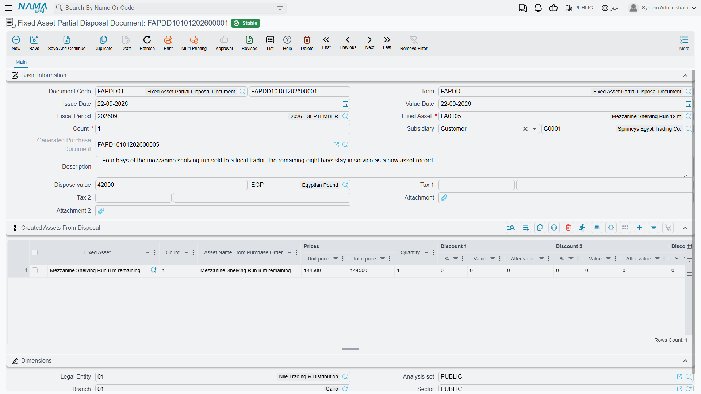
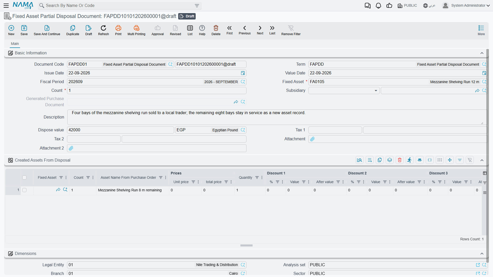

# Partial Disposal

Not every asset record is one thing. When Al-Waha Industries bought ten identical office desks in a
single delivery, registering ten separate assets would have meant ten depreciation lines every month
for the rest of the decade, for no analytical gain whatsoever. So the desks were entered as **one
countable asset** — `FRN-0021`, *Office Desks (10)* — with a count of ten.

That works beautifully until three of the desks are sold off. The asset is not leaving; only part of
it is. That is what the **Fixed Asset Partial Disposal Document** is for.

You will find it at **Assets > Documents > Fixed Asset Partial Disposal Document**, on the
`fixedassets` licence.

## What "partial" means here

It means **a number of units out of a countable asset**. Nothing else.

It is *not* a percentage of the asset's value — you cannot dispose of "40% of a machine". It is *not*
a named part or component — the document has no component structure at all, and the
[components](/modules/fixedassets/master-files/fixedassets-components.md) you define for maintenance
have no bearing on it. If you want to write off a machine's damaged control unit, that is a deduction
on an
[addition and deduction document](/modules/fixedassets/depreciation/fixedassets-additions-and-deductions.md),
not a partial disposal.

So the asset you point this document at has to be marked **countable**, and the count you enter has
to be available. The picker on the screen offers exactly the assets that qualify: countable ones that
are currently depreciating. If the asset you expect is missing from the list, the answer is almost
always that it was never flagged as countable when it was registered.

Everything else on this page — how the money is worked out, what the entry looks like, when the
commit is refused — follows the same logic as a
[full disposal](/modules/fixedassets/disposal/fixedassets-disposal.md), including the rule that
depreciation must be run and processed with no period skipped before the document. Read that page first;
this one only covers the differences.

## The screen

The header is the full disposal's header with two changes:

- **Count** (العدد) — how many units are leaving. Required.
- **Dispose value** (قيمة التخلص) — here it is an amount with its own currency field, which arrives
  filled with the currency you are working in. As on the full disposal, this is what you receive,
  before tax, and it is **0** for a scrap.

The **Subsidiary** (الذمة) names the counterparty, the **Value Date** (التاريخ الفعلي) is the cut-off
for the ledger balances the document reads, and the **Dimensions** group carries the legal entity,
analysis set, branch, sector and department. Partial-disposal entries always take their dimensions
from the document.

Tax on a partial disposal is handled through **Tax 1** — its percentage and value are filled from the
term's tax plan when you pick the term, and recalculated when you change the dispose value.

There is no "reason" here either. Just as with a full disposal, a sale and a scrap are told apart by
which document term you choose and what you put in the dispose value.

::: info One account for both gain and loss
The partial disposal's term differs from the full disposal's in one way that matters when you set it
up. Its accounting page holds a **proceeds side** and a single group titled *Profit & Loss Account*
(حساب المكسب - الخسارة) — one account that is credited when the units go out at a gain and debited
when they go out at a loss. Separate gain and loss accounts, which the full disposal supports, are
not available here. If your chart of accounts insists on the two being separate, use a full disposal
for the last of the units and keep partial disposals for the cases where the direction is predictable.
:::

## The arithmetic

The document reads the same two ledger balances a full disposal reads — the asset's cost account and
its accumulated depreciation account, for this asset, up to the value date — and takes each one
**pro-rata to the asset's count**:

- **cost removed** = cost balance ÷ count × units disposed
- **accumulated depreciation removed** = accumulated depreciation balance ÷ count × units disposed

and then, exactly as before:

> **gain or loss** = dispose value − (cost removed − accumulated depreciation removed)

### Three desks out of ten

`FRN-0021` stands at cost **40,000** and accumulated depreciation **12,000**, so a carrying amount of
**28,000** across ten desks. Three of them are sold to a staff member for **9,000**.

| | Calculation | Result |
|---|---|---|
| Cost removed | 40,000 ÷ 10 × 3 | **12,000** |
| Accumulated depreciation removed | 12,000 ÷ 10 × 3 | **3,600** |
| Book value of the three desks | 12,000 − 3,600 | 8,400 |
| Gain | 9,000 − 8,400 | **+600** |

| Account | Debit | Credit |
|---|---|---|
| Receivable or bank — from the term's proceeds side | 9,000 | |
| Accumulated depreciation — the asset's own account | 3,600 | |
| Asset cost — the asset's own account | | 12,000 |
| Profit and loss on disposal — from the term | | 600 |
| **Total** | **12,600** | **12,600** |

Had the three desks been given away instead, the dispose value would have been 0 and the same single
term account would have been **debited** with 8,400 as a loss.

### What the asset looks like afterwards

| On `FRN-0021` | Before | After |
|---|---|---|
| Cost | 40,000 | **28,000** |
| Accumulated depreciation | 12,000 | **8,400** |
| Carrying amount | 28,000 | **19,600** |
| Current count | 10 | **7** |
| Disposed count | 0 | **3** |
| Status | Running Depreciation | **Running Depreciation** |

The status does not change. The asset is still there, still depreciating, just smaller — which is the
whole point of the document.

## What happens to the depreciation schedule

This is the part people get wrong when they first meet the document, so it is worth stating flatly:
**the remaining life does not change, and the monthly instalment does.**

The partial disposal touches none of the asset's properties — not the useful life, not the remaining
life, not the salvage value. What it changes is the carrying amount, and the instalment is recomputed
from that every period as *(carrying amount − salvage value) ÷ remaining life*, exactly as described
on the
[depreciation concepts page](/modules/fixedassets/depreciation/fixedassets-depreciation-concepts.md).

Suppose the desks were registered with no salvage value and had 40 periods still to run:

- before: 28,000 ÷ 40 = **700** a period
- after: 19,600 ÷ 40 = **490** a period

The seven remaining desks finish depreciating on exactly the same date the ten would have. Only the
size of each instalment falls, and it falls by the same 30% the value did.

## Actions on this screen

The partial disposal screen has no buttons of its own. The quantity you type drives everything: the
proportion of cost and accumulated depreciation to remove, the gain or loss, and — if you asked for
one — the new asset record for the salvaged part. All of it happens on commit.

## What blocks a commit

| The rule | Why it is there |
|---|---|
| The asset must be **countable** | there is nothing to take a count out of otherwise |
| The count must be consistent with what the asset actually holds | you cannot dispose of more units than exist, or more than are currently in |
| Nothing may be recorded on the asset **after** the document's value date | the pro-rata figures are computed against balances at that date; a later document would be built on the wrong base |
| The asset may not be in its initial state, and may not already be fully disposed of | there is no value on the books to take out |
| Depreciation must be sequential up to the document's period | the accumulated depreciation removed must be the real posted figure |
| If the created-assets grid is filled, the term must name a fixed asset purchase book and term | those rows become a real acquisition document |

The depreciation rule is the only one with an escape hatch. The partial disposal's term carries an
option — written in Arabic as *السماح بعمل سند تخلص جزئي لاصل رغم عدم إنشاء سند الاهلاك للشهور
السابقة* — which lets the document commit even when earlier periods have not been depreciated.

::: tip Think before switching that option on
It does not change the arithmetic; it only removes the check. The accumulated depreciation the entry
takes out is still whatever is actually posted in the ledger up to the value date, so with earlier
periods missing you will remove less depreciation than the desks really carry, and the gain will come
out correspondingly higher. Use the option when you genuinely need to record a disposal ahead of a
backlog, and expect to fix the difference afterwards; do not leave it switched on as a convenience.
:::

## Assets salvaged out of a partial disposal

The partial disposal carries the same **Created Assets From Disposal** grid
(الأصول الناتجه عند التخلص) as the full one: a place to register whatever you are keeping out of the
units that left.

Each row is a fixed-asset purchase line — the new asset, its count, unit price and value, useful life,
salvage value, depreciation start date, custodian and location. On commit they are turned into a real
acquisition document, which the read-only field in the header then links to. Fill the grid and the
term must name the purchase book and term that document will use.

## Undoing a partial disposal

Un-commit or delete the document and everything reverses: the entry it created is removed from the
ledger by a delete request, its entry in the asset's history is deleted, the carrying amount and the
instalment are recomputed without it, the disposed count comes back down and the current count goes
back up. As with the full disposal, the un-commit is refused if anything has been recorded against
the asset since — sort that document out first.

::: tip Retiring the last of the units
A partial disposal is designed for taking a slice off an asset that carries on. When the last units
are going and the asset record itself should close, use the
[full disposal document](/modules/fixedassets/disposal/fixedassets-disposal.md) instead: it clears the
whole remaining balance to the last unit and sets the asset's status to disposed, which is what the
register — and everything that reads it — expects to see at the end.
:::
