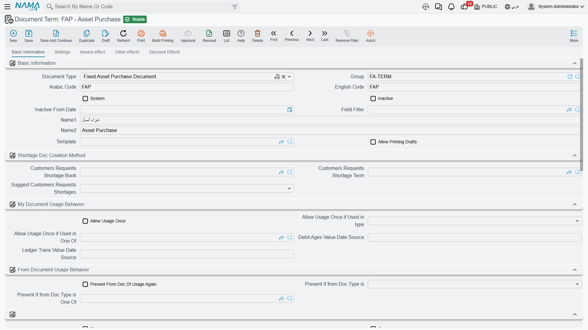

# Terms for Acquiring Assets

Everything in this group answers one question: **when an asset arrives, who gets credited?** The asset
side of the entry is never in doubt — it is the asset's own cost account, taken from its accounts bag.
What the term supplies is the other half: the supplier who is owed, the tax authority, the discounts,
the suspense account that carries an opening balance.

If you have not read [how terms work](/modules/fixedassets/document-terms/fixedassets-terms-basics.md),
start there — in particular the section on the asset as the account source, because it explains why
these screens have fewer account boxes than you expect.

## The Fixed Asset Purchase Term

This is the term that does real work. Al-Waha Industries buys `MCH-0007` from Gulf Machinery Trading
for 240,000 plus 15% VAT, and the term decides everything about the resulting entry except the asset
account itself.

The screen has four pages.

### Page 1 — Settings

The first page carries the term's own identity — its document type, code and name — followed by the
tax behaviour that every purchase on this term inherits:

| Option | What changes |
|---|---|
| Taxable (`خاضع للضريبة`) | Turns the tax columns on for documents using this term |
| Tax Plan (`سياسة الضريبة`) | The plan the header taxes are computed from |
| Is tax modifiable (`الضريبة قابلة للتعديل`) | Whether the user may type over a computed tax value |
| Header taxes editable per line | Whether a line may depart from the header's taxes |
| Prevent adding tax 1 to 4 | Blocks a specific tax from being added on a line, whatever the plan says |
| Link with invoice lines in the accounting document | Ties each ledger line back to the invoice line that produced it, so the entry can be read line by line |

And the one option people come to this screen for:

**Create Asset If Not Found** (`إنشاء الأصول إذا لم تكن موجودة`) decides whether the purchase document
may **create the fixed asset record itself**. With it off — the normal setting — every line must point
at an asset that already exists in its initial state, and committing a line with an empty asset fails.
With it on, a line that names no asset produces one at commit time, taking the name, type,
classifications, custodian and location from the line's own columns.

::: tip Which setting do you want?
Use two terms. Keep a plain purchase term with the option **off** for the everyday case where the asset
records were prepared in advance, and a second term with it **on** for bulk arrivals where you are
creating the register as you buy. Do not run existing assets through the creating term: that term is
for lines that bring their own asset data with them.
:::

### Page 2 — Invoice effect

The credit side lives here. This is the account that faces the asset — normally the suppliers control
account, so that committing the purchase leaves the supplier owed.

Alongside it:

- **Shorten ledger** — collapses the entry into fewer lines instead of one per invoice line.
- **Pay installments in order** — forces the payment schedule to be settled oldest first.
- **Update asset dimensions from the invoice** — pushes the line's legal entity, sector, branch,
  department and analysis set onto the asset itself, so the asset inherits the dimensions of the
  document that bought it.

### Pages 3 and 4 — Other effects and Discount effects

Page 3 holds the cash side and four tax account groups, named `tax1` to `tax4` on the screen. Each
group is a full account side, so a tax can be routed to a different account per term.

Page 4 holds the discount accounts: a line-discount side, an invoice-discount side, and seven further
discount slots under the group titles `additionalDiscount2` to `additionalDiscount8`. It also carries
the *other side* of each tax and discount, and the external-effect lines grid for entries that must
reach accounts outside this document's normal reach.

### Worked example — `MCH-0007`

Term `FAPD-01`: taxable, 15% VAT plan, Create Asset If Not Found **off**, credit side = the suppliers
control account, tax 1 debit = VAT input.

Purchase document dated 1 January 2026, one line: `MCH-0007`, value 240,000, useful life 60 months,
salvage value 24,000.

| | Debit | Credit |
|---|---|---|
| `MCH-0007` cost account — *from the asset* | 240,000 | |
| VAT input — *from the term's tax 1 debit* | 36,000 | |
| Gulf Machinery Trading — *from the term's credit side* | | 276,000 |

Only two of those three lines were decided by the term. The first came from the machine.

## Offers, Orders and the Initial Receipt

The Fixed Asset Purchase Offer, the Purchase Order and the Initial Receipt are configured through one
shared arrangement, and it is a short one: document type, code, name, and the same tax settings as
the purchase term's first page.

There is deliberately nothing else, because **none of these three documents reaches the ledger**. They
compute prices, discounts and taxes so that you can compare a quotation against another and carry the
figures forward — but nothing is booked until a purchase document is raised. Treat the tax figures on
an offer or an order as informational: they tell you what the invoice will look like, they do not
create a liability.

The Purchase Request shares the same configuration too, and needs even less: a request records what
somebody wants, with no prices and no effects at all.

## The Opening Term

The opening document brings assets you already own into Nama — a machine bought in 2023 with 120,000
already depreciated elsewhere. Its entry is built entirely from the asset's own accounts and from the
mediator account you type on the document, so **the opening term carries no account sides at all**.

What it does carry is four switches, and they exist because legacy data never arrives clean. Each one
changes how the system derives dates and remaining life from what you typed:

- One makes the asset's last-depreciation date the end of the **document's own month** rather than the
  end of the previous fiscal period — useful when your go-live date sits mid-period.
- One handles assets that arrive **already fully depreciated**: it forces remaining life to zero and
  back-computes the depreciation start date from the useful life.
- One derives the depreciation start date from the **difference between useful life and remaining
  life**, for registers that recorded remaining life but not a start date.
- One tells the system to **keep the remaining life you typed** instead of recomputing it from the
  dates on the line.

Pick the pair that matches the shape of the data you are importing, load a handful of assets, and check
the resulting instalments before you load the rest. The Opening Update term, used for correcting an
opening after the fact, carries no accounting configuration.

## The Delivery and Receipt of Custodies Term

This document hands everything an employee holds — fixed assets and custody items alike — to somebody
else. Its term is two pages, one for each side of the hand-over, and each page carries a debit and a
credit account side.

The amount is the same on every side you configure: the total value of the **custody items** on the
document. Fixed assets on the document move custodian without contributing a value, so a hand-over of
machinery alone moves the paperwork without moving money.

That symmetry is worth understanding before you configure it. Each side you fill in is posted with that
same total, so configure the pair that represents the entry you actually want — filling in all four
sides books the value twice.

The page also carries **Change Custodian In Asset** (`تغيير مسؤول العهدة في الأصل`), which decides
whether the hand-over rewrites the custodian shown on the fixed asset's own record, or merely adds a row
to its custody history.

## The Creation Document Term

The Fixed Asset Creation Document generates purchase documents for the assets it creates, and its term
exists to say which **book and term those generated purchase documents should use**. Point it at the
purchase term you configured above and the generated documents will be wired exactly like a hand-typed
purchase.

## Documents in This Group with No Term

The **Fixed Asset Receipt Document** (`مستند أستلام أصل`) — the note that records who took delivery and
where the asset ended up — has no term and no Term field on its screen. It writes a custodian and a
location onto the asset and books nothing, so there is nothing to configure. See
[receipts](/modules/fixedassets/acquisition/fixedassets-receipts.md) for how it is used.
