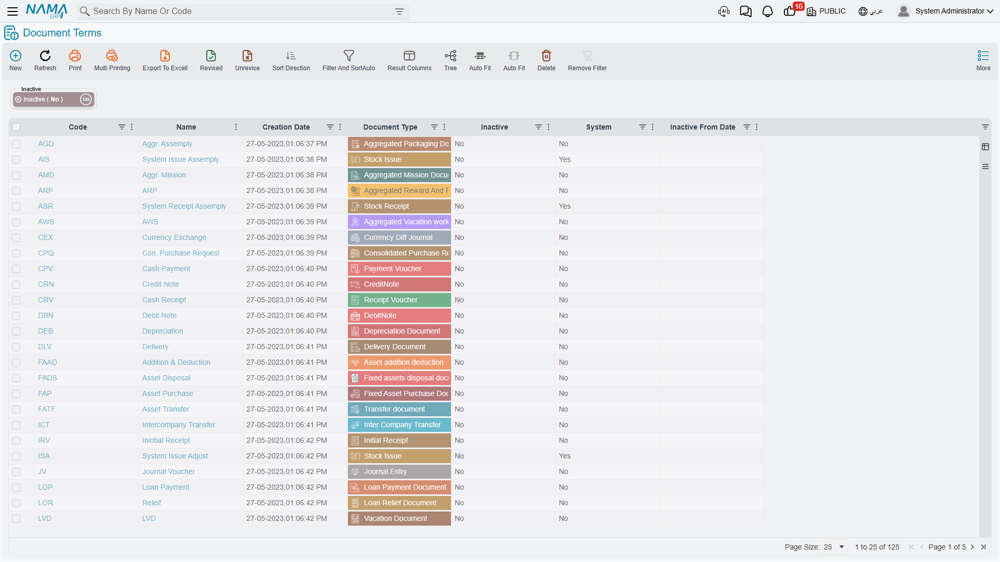

# How Fixed Asset Document Terms Work

A fixed asset document knows *what* happened. When Al-Waha Industries buys the CNC cutting machine
`MCH-0007` for 240,000, the purchase document knows the asset, the supplier, the value and the date.
What it does not know is **which accounts** that 240,000 should touch, or whether the machine's
record should be created on the spot, or what to do with the VAT.

That is the document term's job. The book gives a document its number and its scope; the **term**
(`توجيه المستند`) gives it its accounting wiring and its behaviour switches. Two purchase documents
in the same book but on different terms can post to completely different accounts.

## Where Terms Live and How a Document Finds One

Fixed Asset terms are not in the Fixed Assets menu. They are ordinary **Document Term** records kept
with all the other modules' terms, and what makes one a Fixed Assets term is its **Document Type** —
pick *Fixed Asset Purchase Document* and the record grows the purchase-specific pages; pick
*Fixed assets disposal document* and you get the disposal's pages instead. The screen you are looking
at is chosen entirely by that field.

A document then picks its term in the **Term** field on its header, next to the book and code. Most
Fixed Assets documents have that field. A few do not — the asset receipt document, the offer and the
two movement documents never ask for one, because they have nothing to wire.

::: tip One term per accounting story
Terms are cheap and they are the natural place to separate stories that share a screen. Al-Waha keeps
two disposal terms — one that debits a customer receivable for machines it sells, and one that debits
a scrap-loss account for machines it throws away. Same document type, same screen, different accounts.
:::

## The Account Side — One Block, Repeated Everywhere

Every "debit", "credit", "gain account" or "loss account" group on a Fixed Assets term screen is the
same standard block of fields. Learn it once and every term screen in the module becomes readable:

| Field | What you are answering |
|---|---|
| Side Configuration (`الجانب المحاسبي`) | Whether this side is used at all, and how it behaves |
| Account Source type (`نوع مصدر الحساب`) | Where the account comes from — a fixed account you name here, or an account looked up from something on the document |
| Account (`الحساب`) | The fixed account, when you are naming one directly |
| Reference Type (`نوع المرجع`) and Reference Source Field (`الحقل مصدر المرجع`) | When the account comes from a reference — say, from the supplier on the document, or from the employee holding the item |
| Subsidiary account type (`نوع الحافظة`) | Which slot of that reference's accounts bag to read |
| Bag Account Id (`كود الحساب من الحقيبة`) | Which account inside the bag, when the bag holds several |
| Narration template / query (`قوالب واستعلامات الشرح`) | The wording written on the ledger line |
| Analysis set source | Where the analysis set on the line comes from |

The account-source idea is what makes one term serve hundreds of assets. You do not name the machinery
cost account on the purchase term — you tell the term "take the account from the fixed asset", and each
document line then reaches into its own asset's accounts.

## The Asset Is the Account Source for Almost Everything

This is the single fact that explains most Fixed Assets terms, and it is why so many of them look
half-empty.

Every fixed asset carries an accounts bag, normally inherited from its
[asset type](/modules/fixedassets/master-files/fixedassets-asset-types.md). Three slots in that bag
have a fixed meaning in this module:

| Slot | Label | What the module posts to it |
|---|---|---|
| Main Account | `حساب الأصل` — the asset account | The asset's cost: acquisition, letter-of-credit cost, additions and deductions, opening, disposal |
| Account 01 | `حساب الإهلاك` — the depreciation account | The depreciation expense of each period |
| Account 02 | `حساب الإهلاك التراكمي` — the accumulated depreciation account | Accumulated depreciation, and its reversal on disposal |

Because the module already knows where to find these, **the term never has to name them**. When
`MCH-0007` is depreciated for 3,600 in January 2026, both accounts in that entry come from the machine
itself. The term's contribution is the wording on the line and, in some documents, the *other* side —
the supplier who is owed, the customer who is buying, the account that absorbs a gain.

So when a term screen offers you only one account side, that is usually not an omission. It is the
module telling you that the asset supplies the other one.

The remaining slots in the accounts bag carry no built-in Fixed Assets meaning. They are spare
addresses a term can be pointed at, nothing more.

## What Each Document Type's Term Controls

This is the table most readers come here for. It is grouped by the job you are doing, not by the menu.

### Acquisition

| Document | Term? | What the term controls |
|---|---|---|
| Fixed Asset Purchase Document (`سند شراء أصل ثابت`) | Yes | The supplier/payable side, the tax and discount account sides, the tax settings, and whether the document creates the asset record itself |
| Fixed Asset Purchase Order (`أمر شراء أصل`) | Yes | Tax settings only — the order books nothing |
| Fixed Asset Offer (`عرض سعر أصل`) | Yes | Tax settings only |
| Fixed Asset Purchase Request (`طلب شراء أصل`) | Shares the order's term | Nothing needs configuring — a request has no financial effect |
| Fixed Asset Initial Receipt (`سند استلام أصل مبدئي`) | Yes | Tax settings only |
| Fixed Asset Opening Document (`أفتتاح أصل ثابت`) | Yes | Four switches that decide how dates and remaining life are derived for legacy assets. No accounts — the entry uses the asset's own accounts and the mediator account typed on the document |
| Fixed Asset Opening Document Update (`تعديل أفتتاح أصل ثابت`) | Yes | No accounting configuration |
| Custodies Delivery Receipt Document (`سند استلام وتسليم عهد`) | Yes | The accounts for each side of a hand-over, and whether the hand-over changes the custodian recorded on the fixed asset |
| Fixed Asset Creation Document (`سند إنشاء أصول`) | Yes | The book and term used for the purchase documents it generates |

### Depreciation and value changes

| Document | Term? | What the term controls |
|---|---|---|
| Depreciation Document (`سند إهلاك`) | Yes | Line wording, the analysis-set source, the contracting-cost sides, and three behaviour switches. The two accounts come from the asset |
| Aggregated Depreciation Document (`سند إهلاك مجمع`) | Yes | The book and term used for the depreciation documents it generates |
| Fixed Asset Revaluation (`إعادة تقييم الأصول`) | Yes | The gain account and the loss account, the dimension source, and whether straight-line assets may be converted |
| Asset addition deduction (`سند الإضافة و الإستبعاد`) | Yes | The account facing the asset, eight tax account sides, two discount-value sides, and the switches that decide whether each tax lands in the asset's value |
| Aggregated Addition Deduction Document (`مستند إضافة واستبعاد مجمع`) | Yes | The book and term of the documents it generates |
| Fixed Asset Properties (`خصائص أصل ثابت`) | Yes | Nothing — the document changes life and salvage values only and never reaches the ledger |
| Aggregated Fixed Asset Properties Document (`سند خصائص أصل مجمع`) | Yes | The book and term of the documents it generates |

### Disposal

| Document | Term? | What the term controls |
|---|---|---|
| Fixed assets disposal document (`تخلص من الأصل`) | Yes | The proceeds side, a separate gain account and loss account, the tax pairs, the dimension source, and the book and term for assets recovered from the disposal |
| Fixed Asset Partial Disposal Document (`سند تخلص جزئي من أصل`) | Yes | The proceeds side, a single account used for both gain and loss, one tax pair, and the recovered-asset book and term |
| Aggregated Fixed Asset Disposal Document (`سند تخلص مجمع`) | Yes | The disposal book and term of the documents it generates — both are mandatory |

### Movement

| Document | Term? | What the term controls |
|---|---|---|
| Transfer document (`سند نقل الأصل`) | Yes | One switch: whether the transfer produces an accounting entry at all. There are no account sides — a transfer moves value between the asset's own accounts |
| Aggregated Fixed Asset Transfer Document (`سند نقل أصل مجمع`) | Yes | The book and term of the documents it generates |
| Aggregated Fixed Asset Transfer Request (`طلب نقل أصل مجمع`) | Shares the aggregated transfer's term | The book and term of the requests it generates |

### Custody

| Document | Term? | What the term controls |
|---|---|---|
| Custody purchase document (`شراء عهدة`) | Yes | The two sides of the purchase entry, the tax and cash sides, and the tax and payment settings |
| Custody Delivery Document (`تسليم عهدة`) | Yes | One pair of account sides for moving the custody's value onto its holders |
| Custody transfer document (`نقل عهدة`) | Yes | Two pairs — one for the holders the item leaves, one for the holders it joins |
| Custody Disposal (`تخلص من العهدة`) | Yes | Two pairs — one clearing the custody's carried value, one for the disposal value |

### Letters of credit

| Document | Term? | What the term controls |
|---|---|---|
| Fixed Asset ProformaInvoice (`فاتوره اعتماد مبدئية`) | Not required | The proforma invoice books nothing |
| Fixed Asset Expense Document (`مصروف اعتماد أصل`) | Yes | Both sides of the expense entry, four tax pairs, a discount pair, and whether a line is excluded from the landed cost |
| Fixed Asset Letter of Credit cost (`سند تكليف اعتماد أصل`) | Yes | The clearing account only — the asset side comes from each asset |

## Nine Documents Have No Term at All

Some Fixed Assets documents have no term configuration in existence:

- Fixed Asset Transfer Request (`طلب نقل أصل`)
- Fixed asset Letter of Credit (`اعتماد أصول`)
- Fixed Asset Receipt Document (`مستند أستلام أصل`)
- Fixed Asset Return Document (`سند رجوع أصول`) and Fixed Asset Out Document (`سند خروج أصول`)
- FixedAssets Taking Document (`مستند جرد أصول`)
- Prevent Assets Depreciation Document (`مستند منع اهلاك اصول`)
- Maintenance Record (`سجل صيانة`) and Maintenance Record Request (`طلب سجل صيانة`)

For a user this is good news rather than a gap. None of these nine reaches the ledger, and none of
them has a Fixed Assets setting worth switching. They still take a **book**, so they are still
numbered, still scoped and still subject to whatever approval rules you put on the book — but there
is no accounting to wire and nothing you have to set up before you can use them. If someone asks you
"which term should the stocktaking document use", the answer is: none exists, and none is needed.

## Where Several Documents Share One Term

Three groups of document types are configured through a single term class, which means the pages you
see are the same pages — but a term record still belongs to exactly one document type, so you cannot
point one term record at two of them:

- **Purchase Request, Purchase Order and Purchase Offer** share one configuration. Whatever tax
  settings you learn on one, you already know on the other two.
- **Aggregated Transfer Document and Aggregated Transfer Request** share one configuration: in both
  cases the only thing to set is the book and term of the documents that the aggregate generates.
- **Full disposal and partial disposal** are built on a common base, which is why their tax settings,
  dimension handling and recovered-asset settings look alike — while their gain and loss handling does
  not (see [the disposal terms](/modules/fixedassets/document-terms/fixedassets-terms-depreciation-and-disposal.md)).

## Reading the Rest of This Section

The three pages that follow walk the term screens by area:

- [Acquisition terms](/modules/fixedassets/document-terms/fixedassets-terms-acquisition.md) — buying,
  opening balances, and handing assets over.
- [Depreciation and disposal terms](/modules/fixedassets/document-terms/fixedassets-terms-depreciation-and-disposal.md) —
  the accounts behind the numbers that move every month, and the gain and loss on the way out.
- [Custody and letter-of-credit terms](/modules/fixedassets/document-terms/fixedassets-terms-custody-and-lc.md) —
  the two chains that keep their own accounting.

::: info The entry appears in the background
Whatever a term is configured to book, the entry is created as a **business request** and processed in
the background. If a term is missing an account it needs, you will see the failure in the Business
Requests view rather than at the moment you commit — fix the term, then select the row and use
More → Reprocess.
:::
