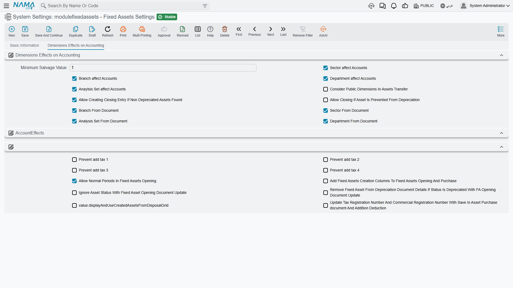
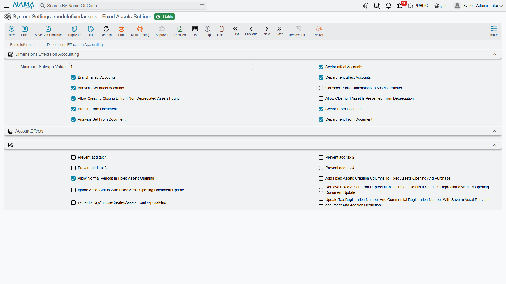

# Module Configuration

Most of what the Fixed Assets module does is decided document by document, on the document's term (توجيه). A small set of decisions, though, has to be the same everywhere: whether a ledger entry inherits the branch from the asset or from the document that moved it, whether a closing entry may be created while assets are still undepreciated, whether asset purchase documents may create asset records on the fly. Those live on the module's own settings record.

**There is exactly one such record per database.** It is not per company, not per branch: the settings apply to every legal entity and every branch alike, and there is no override. It is created for you at installation, so you never add a new one — you open the existing one, change what you need and save.

You reach it from **Assets → Settings**. The screen is a single tab holding twenty-two options. They are set out below grouped by what they affect rather than by where they sit on the page, because several of them only make sense next to each other.

## The Salvage Floor

**Minimum Salvage Value** — *أقل قيمة للخردة*

The lowest salvage (scrap) value the module will accept on a document line. It ships set to **1**, which is a deliberate nudge: a salvage value of zero would let an asset depreciate to nothing, and most policies want a token residual left on the books. Enter a purchase or opening line with a salvage value below this floor and the document refuses to commit.

The floor is checked on document lines only. Nothing stops the asset master itself from carrying a lower figure that a document put there earlier.

## Which Dimensions Reach the Ledger

Five options together decide how much of an asset's analytical identity travels onto its journal entries. All four of the first group ship switched **on**.

**Sector affect Accounts** — *تأثير القطاع على الحسابات*
**Branch affect Accounts** — *تأثير الفرع على الحسابات*
**Department affect Accounts** — *تأثير الإدارة على الحسابات*

With one of these on, the corresponding dimension on the ledger entry is read from the fixed asset record. Switch it off and the entry simply carries no value for that dimension — the module does not fall back to anything else.

There is a fourth option in the same set, sitting with the three above, that does the same job for the **analysis set**. Its label is wrong in both languages and reads as though the analysis set affects itself; what it actually controls is whether the analysis set on the entry is taken from the asset, exactly as its three siblings do for sector, branch and department.

The reason these four exist at all is that a fixed asset is a long-lived thing whose analytical home can change. Al-Waha Industries wants its machinery depreciation charged to the department that operates the machine, so it leaves the department option on and lets each machine's own record decide. A company that reports assets centrally would switch them off and keep the entries clean.

**Consider Public Dimensions In Assets Transfer** — *اعتبار محددات العام عند نقل الأصول*

When a transfer document looks for the asset's previous position in order to move it, it matches on the asset's dimensions. Switch this on and the match also accepts entries whose dimension was left public (empty), instead of demanding an exact match. It is the option to reach for when transfers of older assets — registered before the company started filling dimensions consistently — refuse to find their starting point.

## Where a Dimension Comes From: the Asset or the Document

Four more options invert the previous set, one dimension at a time.

**Sector From Document** — *القطاع من المستند*
**Branch From Document** — *الفرع من المستند*
**Department From Document** — *الإدارة من المستند*
**Analysis Set From Document** — *المجموعة التحليلية من المستند*

Switch one on and the ledger entry takes that dimension straight from the header of the document being processed, overriding the "affect accounts" option above it. Leave it off and the older behaviour applies: the term's own setting wins if it has one, otherwise the asset supplies the value, otherwise the dimension is not stamped at all.

The distinction matters in practice. Al-Waha's depreciation runs are raised centrally, so if branch came from the document, every machine's depreciation would land on head office. Al-Waha therefore leaves *Branch From Document* off and lets each machine's own branch carry through. A company whose asset records are not maintained with dimensions, and which prefers to state the analytical home on each document instead, does the opposite.

::: info Transfers are the exception
Transfer documents always work from the "to" side of the transfer itself, so these four options do not redirect them.
:::

## Closing the Period

Two options control how strict the module is when the accounting department tries to close a fiscal period.

**Allow Creating Closing Entry If Non Depreciated Assets Found** — *السماح بعمل قيد ختامي إذا وجد اصول غير مُهلكة*

Off by default, and deliberately so. With it off, creating a closing entry fails if there is a running asset whose depreciation start date falls before the end of the period and which was not depreciated in the previous period. It is the module's safety net against closing a year with a month of depreciation missing. Switch it on only when you have accepted that the register and the ledger may be out of step.

**Allow Closing If Asset Is Prevented From Depreciation** — *السماح بعمل قيد ختامي إذا تم منع الأصل من الإهلاك*

The natural companion to the option above. Al-Waha has an idle machine that has been deliberately frozen with a prevent-depreciation document; without this option, that machine would block every closing entry for the rest of its idle life. Switch this on and assets named on a prevent-depreciation document are exempted from the check. See [Preventing Depreciation](/modules/fixedassets/depreciation/fixedassets-prevent-depreciation.md).

## Taxes on Asset Purchases

Further down the screen sits the group that governs purchase behaviour, beginning with four independent switches — one per tax slot.

**Prevent add tax 1** — *منع إضافة ضريبة 1*
**Prevent add tax 2** — *منع إضافة ضريبة 2*
**Prevent add tax 3** — *منع إضافة ضريبة 3*
**Prevent add tax 4** — *منع إضافة ضريبة 4*

Each one stops that tax from being added into the value at which the asset is capitalised. This is a real accounting choice, not a formatting one: recoverable VAT should not sit inside the cost of the machine, while a non-recoverable import tax usually should.

The setting is combined with the matching option on the purchase document's term, and either one is enough to switch the behaviour on. Set it here when the policy is company-wide; set it on the term when only certain document books need it. See [Terms Behind Acquisition](/modules/fixedassets/document-terms/fixedassets-terms-acquisition.md).

## Opening Balances

**Allow Normal Periods In Fixed Assets Opening** — *السماح بالفترات العادية في افتتاحي الاصول*

Off by default. With it off, a Fixed Asset Opening document may only be issued in a fiscal period whose type is *opening* — which is what you want on go-live, because the opening entries belong outside the trading periods. Companies that keep bringing legacy assets in months after go-live switch it on so that an opening document can be issued in an ordinary month. See [Opening Balances](/modules/fixedassets/acquisition/fixedassets-opening-balances.md).

**Ignore Asset Status With Fixed Asset Opening Document Update** — *تجاهل حالة الأصل مع تعديل افتتاح أصل ثابت*

An opening-update document normally refuses to touch an asset whose status has moved on. Switch this on and it will edit the asset regardless of where the asset has got to. It is a correction tool: use it when an opening figure was wrong and the asset has since started depreciating, and expect the asset's whole history to be replayed from the corrected opening.

**Remove Fixed Asset From Depreciation Document Details If Status Is Depreciated With FA Opening Document Update** — *حذف الأصل الثابت من سندات الإهلاك إذا تم إهلاكه عند حفظ سند تعديل افتتاح أصل ثابت*

The companion clean-up. When correcting an opening leaves an asset fully depreciated, saving the update also drops that asset's line out of depreciation documents where it no longer belongs, instead of leaving lines behind that would fail on the next run.

## Creating Asset Records from Documents

**Add Fixed Assets Creation Columns To Fixed Assets Opening And Purchase** — *إضافة أعمدة إنشاء الأصول إلى سندات الشراء و الإفتتاح*

This is the most visible option on the screen, because it changes what people see. Switch it on and the detail grids of the Fixed Asset Purchase and Fixed Asset Opening documents gain the columns needed to describe an asset that does not exist yet — asset type, Arabic and English name, serial number, market value, coding group and the five classification levels — and the documents will create the asset record for you at commit time.

Switch it off and those columns are gone; every line must point at an asset record somebody created beforehand, in its initial state.

Which one you want is a genuine policy decision and it is worth making it early. Registering assets first gives you control over coding and classification but front-loads the work; creating them from the purchase is faster but means the quality of your register depends on the quality of the invoice line. This is the same question the setup wizard asks as *"Create fixed assets from purchase and opening documents"* — answering it there writes this very option.

::: warning Creating assets from a document is not a per-line safety net
With this behaviour switched on, the purchase document's term also decides whether a line may create an asset. A line that points at an *existing* asset while asset creation is enabled will rewrite that asset's descriptive fields from the line — including with blanks where the line is empty. Point lines at existing assets only when the line's asset columns are filled in the way you want the asset to end up.
:::

## The Disposal Grid

One further option controls whether the Disposal document shows and uses its grid of **assets created by this disposal** — the asset records raised for parts salvaged out of the asset being disposed of, so that a scrapped machine's reusable motor stays on the register as an asset in its own right. Its label is missing from the shipped translations, so on screen it reads as a raw name; it sits with the options above, and switching it on turns that grid on and brings its validation with it. See [Disposing of an Asset](/modules/fixedassets/disposal/fixedassets-disposal.md).

## Copying the Supplier's Registration Numbers

**Update Tax Registration Number And Commercial Registration Number With Save In Asset Purchase document And Addition Deduction** — *نسخ بيانات التسجيل الضريبي والسجل التجاري في سندات الشراء والإضافة والاستبعاد للأصل مع الحفظ*

With this on, saving a Fixed Asset Purchase or an Addition and Deduction document copies the supplier's tax registration number and commercial registration number onto the document. That is what e-invoicing needs, and it is why most installations that submit asset purchases to a tax authority switch it on. With it off, those fields are cleared on save.

## After You Change Something

The settings are read when a document is processed, not when it was typed, so a change takes effect on the next commit. It does **not** reach back and rewrite entries that already exist: switching a dimension option on today does not stamp the department onto last year's depreciation entries. Where the change matters historically, the way to apply it is to regenerate the accounting effects of the documents concerned — from the document, or in bulk from its list view.
