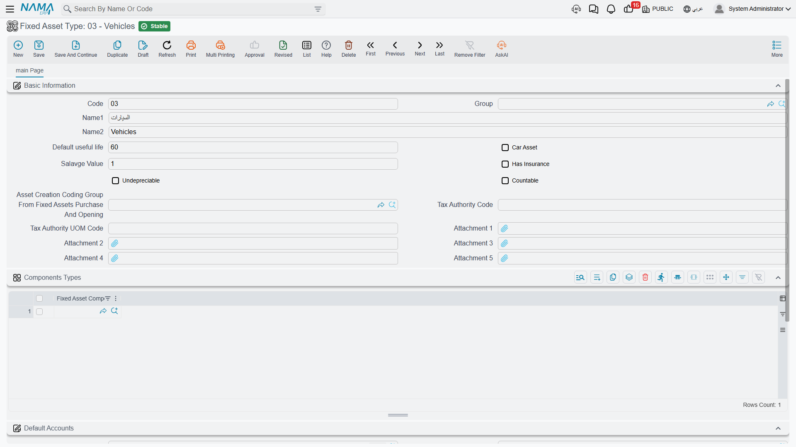
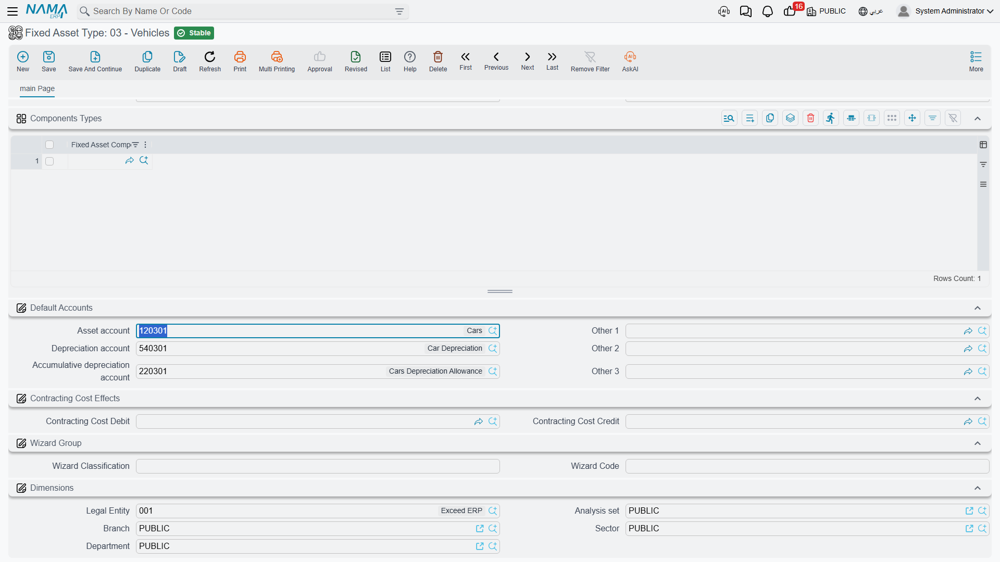
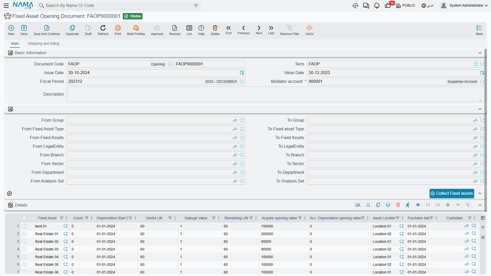

# Getting Started

Setting up Fixed Assets in a fresh database is not hard, but the order matters more than in most modules. Almost everything an asset knows about itself — its accounts, its expected life, its residual value, even its components — is copied down from something you set up earlier. Build the pieces in the wrong order and you end up creating assets that carry no accounts, then discovering it after the first depreciation run refuses to commit.

This page walks the setup as Al-Waha Industries would actually do it, in the order that avoids rework.

> **Al-Waha Industries** is going live on **1 January 2026**. It runs one plant in Riyadh with two halls, and its asset register holds machinery, vehicles and office furniture. Some of those assets were bought years ago and are already part-depreciated; the CNC cutting machine `MCH-0007` is bought new on the first day of the new system.

## Two Decisions to Make Before You Type Anything

Both of these are cheap to decide now and expensive to change once assets exist.

### The fiscal-period rhythm

The module depreciates **once per fiscal period**, and it counts an asset's useful life and remaining life in **periods, not years**. When you tell it that the CNC machine has a useful life of 60, you are saying sixty fiscal periods. The arithmetic that derives an asset's remaining life from its dates also works in months.

So the module expects a **monthly** fiscal calendar, and that is the shape to set up in the accounting module before you start. Sixty means five years only if a period is a month.

The practical consequences of a monthly rhythm are worth knowing in advance:

- An asset acquired on any day of a period takes a **full instalment** for that period. There is no part-month proration.
- Depreciation is run period by period, in order. You cannot skip March and run April.
- Closing a fiscal period is blocked while a running asset has not been depreciated in the previous period — unless you have deliberately relaxed that in [Module Configuration](/modules/fixedassets/fixedassets-configuration.md).

### Whether asset records are created before the document or by it

Every asset's cost arrives on a document — a purchase document for new assets, an opening document for assets you already own. What differs between installations is whether that document *finds* an asset record that somebody created earlier, or *creates* it.

Both work. Registering the assets first gives you control over coding, classification and accounts, and is the right choice when the register is being built deliberately by the finance team. Letting the documents create the records is faster and suits companies whose asset list arrives as a spreadsheet of invoice lines.

Switch it with the **Add Fixed Assets Creation Columns To Fixed Assets Opening And Purchase** option on the settings record; the setup wizard asks you the same question as *"Create fixed assets from purchase and opening documents"*.

Change your mind later and nothing breaks, but the assets created under the old regime keep whatever coding and classification they were given, so a register built both ways tends to be a register that reads inconsistently. Decide once.

While you are on that screen, settle the dimension questions too — whether the branch, sector, department and analysis set on a fixed asset's journal entries come from the asset record or from the document that moved it. Those are read every time a document is processed, so getting them right before the first entries exist saves regenerating them later. All of the options are explained in [Module Configuration](/modules/fixedassets/fixedassets-configuration.md).

## Step 1 — Asset Types, and Their Accounts

Start here, always. The **fixed asset type** (نوع أصل) is the template every asset of a family copies from, and the three accounts it carries are the ones the whole module will post against.

Al-Waha creates three types to begin with:

| Code | Name | Default useful life | Salvage value |
|---|---|---|---|
| `FAT-MCH` | Machinery & Equipment | 60 | as per asset |
| `FAT-VEH` | Vehicles | 60 | 12,000 |
| `FAT-FRN` | Furniture | 120 | 0 |

On each type, the part that must not be skipped is the **default accounts** group. The module never lets a document term choose an asset's own accounts; it always reads them off the asset record, and the asset record inherits them from its type.

Three of the slots carry meaning for the module:

| Slot | What the module uses it for |
|---|---|
| **Asset account** (حساب الأصل) | The asset's cost. Debited on acquisition, credited on disposal. |
| **Depreciation account** (حساب الإهلاك) | The depreciation expense, debited every period. |
| **Accumulative depreciation account** (حساب الإهلاك التراكمي) | The contra-asset, credited every period and cleared on disposal. |

For `FAT-MCH`, Al-Waha points them at machinery cost, depreciation expense, and accumulated depreciation — machinery. Every asset it later gives that type to inherits all three.

Two more things on the type are worth filling now:

- **Default useful life** — copied onto purchase and opening document lines, so the person recording an invoice does not have to remember that machinery runs 60 periods.
- **Salvage value** — copied onto asset **purchase** lines. Opening lines do not take it from the type, so on an opening document you enter the residual value yourself.

The type also carries flags that describe the family — car asset, has insurance, undepreciable, countable — and a list of component types. All of those are copied onto an asset the moment you choose its type. There is a subtlety: **the type's accounts are re-applied every time an asset is saved**, so treat the type as the authority on accounts rather than editing them asset by asset. The full picture is in [Asset Types](/modules/fixedassets/master-files/fixedassets-asset-types.md).

::: tip Land and other assets that never depreciate
Mark the type **undepreciable** and the assets that inherit it will never be collected by a depreciation run — and, unlike ordinary assets, they can be saved without accounts at all.
:::

## Step 2 — Classifications

The five classification levels (تصنيف أصل ثابت 1..5) are how Al-Waha will slice its register in reports: level 1 = **Production Equipment**, level 2 = **Cutting Machines**, and so on down to whatever depth the company actually uses.

Be clear about what they are for. They **group, filter and report**. They resolve no accounts, supply no defaults and change no behaviour. If you are looking for a place to hang different depreciation accounts off, that place is the asset type, not a classification.

Two rules govern the chain: a classification records the level above it as its parent, and each level carries the asset type it belongs to, which must match the level above. Choosing a classification on an asset auto-fills the levels above it and the asset type. You do not have to use all five — start with one and add depth when a report demands it. See [Classifications](/modules/fixedassets/master-files/fixedassets-classifications.md).

## Step 3 — Locations

An **asset location** (موقع أصول) is a physical place, and locations form a tree: site, then building, then hall. Al-Waha sets up `LOC-R` — Riyadh Plant, with `LOC-R2` — Riyadh Plant, Hall 2 and `LOC-R3` — Hall 3 beneath it.

The vocabulary you build here is what the movement documents will speak. Note that an asset's location field is never typed on the asset — it is the destination of the newest location entry, written by the purchase, receipt, opening and transfer documents. Build the tree to whatever depth your people will actually record. See [Locations](/modules/fixedassets/master-files/fixedassets-locations.md).

## Step 4 — Component Types

A **component type** (نوع مكون أصل) names a maintainable part: a spindle, a control unit, a coolant pump, an engine, a compressor. Each one lists the maintenance types that apply to it.

Components exist for one purpose: **maintenance history**. They carry no cost and no depreciation of their own; the CNC machine's spindle is not a separate asset, it is a thing you can record a service against. Set component types up now only if Al-Waha intends to use the maintenance side of the module — and if it does, set them up *before* creating assets, because listing the component types on an asset type means every asset of that type is born with its component grid already filled.

One rule to plan around: **a maintenance record cannot be committed for an asset that has no components.** If maintenance is in scope, components are not optional. See [Components](/modules/fixedassets/master-files/fixedassets-components.md) and [Maintenance](/modules/fixedassets/maintenance/fixedassets-maintenance-overview.md).

## Step 5 — Document Books and Terms

Now wire up the accounting. Every fixed-assets document is issued from a **document book**, and the book carries a **term** (توجيه) that says which accounts the document's entries hit.

Remember the division of labour: **the asset's own accounts come from the asset**, so a term never configures the asset side. What each term configures is everything else — the supplier or cash side of a purchase, the depreciation expense pairing, the gain and loss accounts of a disposal, the tax and discount accounts.

For a first go-live, Al-Waha needs at minimum:

| Document | What its term has to settle |
|---|---|
| Fixed Asset Purchase | The credit side — the supplier control account — plus the tax accounts, and whether the document may create asset records. |
| Fixed Asset Opening | Nothing on the accounts side: the opening document builds its three entry lines itself, and you name the balancing suspense account on each document. |
| Depreciation | The expense pairing is read from the asset; the term is where the depreciation run's other settings live. |
| Disposal | The proceeds account, and separate gain and loss accounts. |

If the installation ran the setup wizard, some of this already exists: the wizard imports a default set of asset types and creates a purchase term whose credit side points at the supplier, and a disposal term with its gain and loss accounts filled. Check what it made before building your own.

Start reading at [How Fixed Assets Terms Work](/modules/fixedassets/document-terms/fixedassets-terms-basics.md), which explains what a term controls in this module and which documents have one at all; the accounts themselves are covered in [Terms Behind Acquisition](/modules/fixedassets/document-terms/fixedassets-terms-acquisition.md) and [Terms Behind Depreciation and Disposal](/modules/fixedassets/document-terms/fixedassets-terms-depreciation-and-disposal.md).

## Step 6 — The Assets Themselves

With the master files in place, the asset records are quick. Give an asset a code and names, choose its type — and watch the accounts, the flags and the component grid arrive from the type — then pick its classifications, its dimensions and, if you know it, its main custodian.

What you will **not** find is anywhere to type the cost, the useful life, the salvage value or the location. A new asset is saved with status **Initial** (إبتدائى), no value and no instalment. It is a shell waiting for a document. That is exactly as intended, and it is why this step is short. See [The Fixed Asset Record](/modules/fixedassets/master-files/fixedassets-asset-master.md).

Companies that also run the Contracting module have one more route, and it is worth knowing what it is *not*. The **Fixed Asset Creation Document** is not a general bulk-registration screen: it is the document that capitalises a finished contracting project as an asset of your own — it names the project on each line, takes the asset's code from the line, copies the project contract's terms onto the asset, and refuses to create a second asset for a project that already has one. It creates the asset records in their initial state and then generates a purchase document that brings them into service. Note that it does **not** set the asset's cost; assets created this way arrive at zero, and the value has to reach them through that generated purchase document or through an addition afterwards. Its menu item only appears with a Contracting licence. See [The Creation Document](/modules/fixedassets/master-files/fixedassets-creation-document.md).

## Step 7 — Opening Balances

Now bring in the assets Al-Waha already owned. The **Fixed Asset Opening Document** (افتتاح أصل ثابت) is where a machine bought in 2023 and already part-depreciated joins the new system without pretending it was bought yesterday.

You state, per asset: the original acquisition value, the accumulated depreciation already taken, the useful life and salvage value, the depreciation start date, the purchase date and the location. The header names a **mediator account** — the suspense account the whole opening batch balances against.

There are three things to get right on this document.

1. **The fiscal period must be an opening period**, unless you have switched on *Allow Normal Periods In Fixed Assets Opening*. That is the module insisting that opening balances belong outside the trading periods.
2. **Accumulated depreciation may not exceed cost minus salvage.** The document checks it, and a rejected line is nearly always a legacy figure that already wrote the asset below its residual value.
3. **Enter the salvage value yourself.** Unlike a purchase line, an opening line does not take it from the asset type.

There is a **Collect Fixed assets** button that pulls every asset still in its initial state within the ranges you name at the top of the document, pre-filled with the useful life and salvage from each asset's type. Use it, then correct the figures rather than typing every line.

When the document commits, each asset takes its opening cost and accumulated depreciation, its status moves to **Running Depreciation**, and — this is the part people miss — the module works out the date up to which the asset is considered already depreciated, so the very next depreciation run picks up cleanly from the first period of the new system. Corrections afterwards go through the **Opening Update** document, which edits the original rather than adding a second opening. See [Opening Balances](/modules/fixedassets/acquisition/fixedassets-opening-balances.md).

New purchases, of course, do not come this way. `MCH-0007` arrives on a purchase document on 1 January 2026 at 240,000 — see [The Purchase Document](/modules/fixedassets/acquisition/fixedassets-purchase-document.md).

## Step 8 — The First Depreciation Run

The moment of truth. At the end of January 2026, Al-Waha creates a **Depreciation Document** (سند إهلاك) for the January period.

The routine is: choose the fiscal period, use **Collect Assets** to pull in every eligible asset, review the lines, commit. For `MCH-0007` the line reads:

> (240,000 − 24,000) ÷ 60 = **3,600**

and the entry debits the depreciation expense account and credits accumulated depreciation, both taken from the machine's own record. Every other asset on the run does the same with its own accounts, which is why step 1 mattered.

Check three things on the first run before you trust the setup:

- **Is everything there that should be?** An asset is collected only if it is running, depreciable, has not already been depreciated for this period, and its depreciation start date has been reached. An asset missing from the first run is nearly always an asset still sitting in its initial state because no purchase or opening document ever gave it a cost.
- **Do the instalments look right?** A zero instalment means either no remaining life or a book value already at the salvage value.
- **Did the entries actually post?** Committing the document raises a **business request** (طلب أعمال) that is processed in the background, so the journal appears a moment after the save. If it does not, open the Business Requests list view, filter for failures, select the rows and use the **More** menu → *Reprocess* or *Recommit*.

Once the first run is clean, the rhythm is set: one depreciation document per period, before the period is closed. See [Running Depreciation](/modules/fixedassets/depreciation/fixedassets-depreciation-document.md), and [Aggregated Depreciation](/modules/fixedassets/depreciation/fixedassets-aggregated-depreciation.md) when the register grows large enough that you want one action to produce many documents.

## What to Set Up Only When You Need It

The rest of the module is optional and can wait until there is a reason:

- **Custody** — a separate register for laptops, phones and tools issued to staff, with its own licence. It is not a fixed asset register and nothing in it is depreciated. Start at [Custody](/modules/fixedassets/custody/fixedassets-custody-overview.md).
- **Letters of credit** — the chain that lands imported machinery at its true cost including freight, duty and clearance. Start at [Letters of Credit](/modules/fixedassets/letters-of-credit/fixedassets-lc-overview.md).
- **Maintenance** — types, checklists, plans and records. Start at [Maintenance](/modules/fixedassets/maintenance/fixedassets-maintenance-overview.md).
- **Stocktaking** — counting the register against reality once a year. See [Stocktaking](/modules/fixedassets/movement/fixedassets-stocktaking.md).

And when you want to see the register from the outside, the five shipped reports are described in [Reports](/modules/fixedassets/reports/fixedassets-reports.md).
