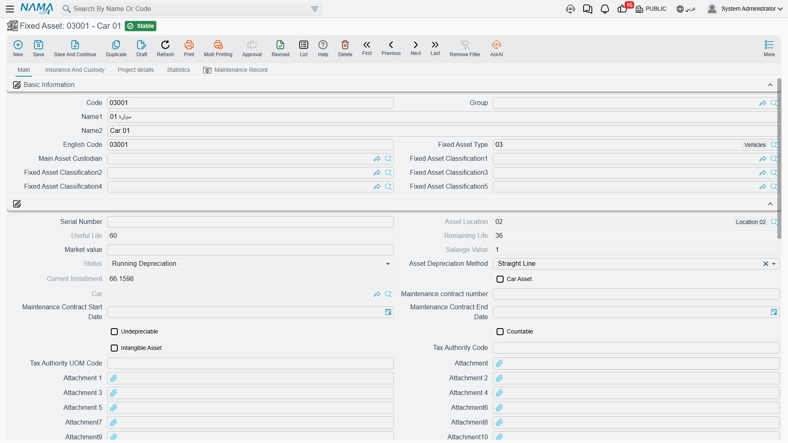
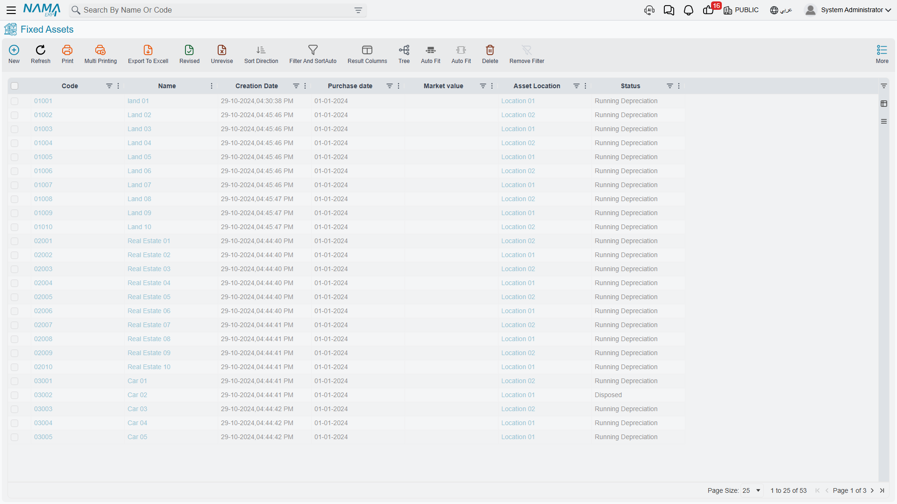
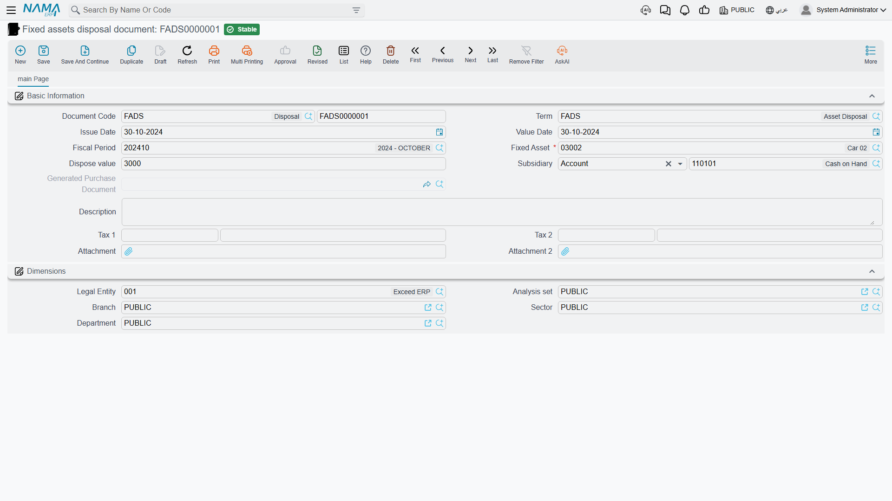

# Fixed Assets Module Overview

The general ledger knows that you own machinery worth 2,400,000 and that 400,000 of depreciation has piled up against it. What it cannot tell you is *which* machine, standing *where*, held by *whom*, with how many months of life left, and what would happen to the profit and loss account if you sold it tomorrow. That is the gap the Fixed Assets module fills: a register that keeps one record per owned thing, and a set of documents that move those records — and the ledger — together, so that the two can never drift apart.

This page is the map of the whole module. It explains the shape of the register, walks one machine from the day it was bought to the day it was sold, and then lists the menu folders and the licences that switch each part on.

Throughout, we follow one worked example:

> **Al-Waha Industries** runs a plant in Riyadh. On 1 January 2026 it buys a **CNC cutting machine** from Gulf Machinery Trading for **240,000**, expects **60 months** of service out of it and expects to scrap it for **24,000** at the end. The machine is registered as asset **`MCH-0007`**, type **Machinery & Equipment**, sitting in **Riyadh Plant, Hall 2**.

## The Register Is a Master File and a Stack of Documents

The single most useful thing to understand before you open any screen is that the module has exactly two kinds of object, and they play very different roles.

The **fixed asset record** is the identity of the thing: its code and names, its type, its serial number, its classifications, where it sits, who holds it, its insurance paperwork, and the ledger accounts it will be posted against. All of that you type.

The **financial picture on the same screen** — acquisition cost, additions, deductions, accumulated depreciation, current book value, remaining life, the current depreciation instalment, the disposal value — you never type. Those figures are written by documents, and only by documents. Open a fixed asset record and try to correct its accumulated depreciation and you will find there is nothing to type into: the fields are there to be read.

That is the whole design in one sentence: **the asset record is a report on itself, and the documents are the only way to change it.** Behind the scenes every document that touches an asset writes a transaction row, and the asset's numbers are then rebuilt by replaying all of its rows in date order. It is why the figures always add up, why a back-dated document reshapes everything after it, and why the module refuses to let you delete a document that has later transactions sitting on top of it.

A practical consequence worth carrying into every other page: **if a number on an asset looks wrong, do not go looking for the field — go looking for the document that wrote it.** The asset's own Statistics page carries an *Asset Transactions* list that shows exactly that history, one row per financial event, each naming the document that caused it.

The full field-by-field tour of the screen is in [The Fixed Asset Record](/modules/fixedassets/master-files/fixedassets-asset-master.md).

## The Life of MCH-0007, End to End

Here is the whole module in one story. Every step links to the page that covers it properly.

### 1. It is bought — 1 January 2026

Al-Waha raises a purchase request, collects two quotations, issues an order to Gulf Machinery Trading, and finally records the supplier's invoice on a **Fixed Asset Purchase Document**. Only that last document is financial; everything before it is paperwork that carries information forward. The purchase document is where the money lands: 240,000 against the machine's cost account, the supplier credited, and the machine's own record filled in — cost 240,000, useful life 60, salvage 24,000, depreciation starting 1 January 2026, location Hall 2.

The asset's status moves from **Initial** to **Running Depreciation**. That change matters more than it looks: an asset in its initial state is a shell that documents can fill, while a running asset is a live thing that the depreciation run will pick up every period. See [The Acquisition Cycle](/modules/fixedassets/acquisition/fixedassets-acquisition-cycle.md) and [The Purchase Document](/modules/fixedassets/acquisition/fixedassets-purchase-document.md).

Assets that Al-Waha already owned before it started using Nama do not come in this way. They come in through the [Opening Document](/modules/fixedassets/acquisition/fixedassets-opening-balances.md), which states an original cost, the depreciation already taken elsewhere, and the date up to which it was taken.

### 2. It depreciates — every month

Once a fiscal period closes, somebody runs a **Depreciation Document** for that period, collects the eligible assets into it, reviews the lines and commits. For `MCH-0007` in January 2026 the charge is:

> (240,000 − 24,000) ÷ 60 = **3,600**

The module has no table of depreciation formulas. It has one rule, applied once per fiscal period: **the current book value, minus the salvage value, divided by the remaining life** — with life counted in fiscal periods, and the remaining life reduced by one after every run. For a machine whose numbers never change, that produces exactly the flat instalment you would expect from straight line. Its real virtue shows up the moment something *does* change, which happens in step 3.

After twelve periods the machine carries **43,200** of accumulated depreciation and a book value of **196,800**, with **48** periods of life left. See [How Depreciation Works](/modules/fixedassets/depreciation/fixedassets-depreciation-concepts.md) and [Running Depreciation](/modules/fixedassets/depreciation/fixedassets-depreciation-document.md).

### 3. It is upgraded — January 2027

The machine gets a new control unit costing **30,000**, and the cost is genuine capital spending, not a repair. Al-Waha records it on an **Addition and Deduction Document**, which raises the asset's cost to 270,000. Nothing is recalculated backwards; instead the *next* instalment is derived afresh from the new numbers over the life that is left:

> (196,800 + 30,000 − 24,000) ÷ 48 = **4,225** per period

The machine still finishes its life on the same date — it simply depreciates faster from here on. That prospective re-levelling, with no catch-up entry ever posted, is the behaviour to expect from every value change in the module: additions, deductions, revaluations and life changes all work this way. See [Additions and Deductions](/modules/fixedassets/depreciation/fixedassets-additions-and-deductions.md).

::: tip Maintenance is not the same thing
Servicing the machine — the quarterly inspection, replacing the coolant pump — is recorded as maintenance, and maintenance cost is history, not capital. It does not touch the asset's value or its depreciation. Only an addition document capitalises. See [Maintenance](/modules/fixedassets/maintenance/fixedassets-maintenance-overview.md).
:::

### 4. It moves — mid-2027

The machine is wheeled from Hall 2 to Hall 3. Al-Waha records a **Transfer Document**, and the interesting part is what it books: **nothing**. A move that changes only the physical location leaves the ledger untouched, because no account and no accounting dimension changed. Change the department or the accounts on the same document and one entry appears; move the machine to Al-Waha's Jeddah company and two entries appear, one in each company, joined through a mediator account, with the receiving company taking the machine at its net book value of **176,100**. See [Transferring an Asset](/modules/fixedassets/movement/fixedassets-transfer-document.md) and [Transfers Between Companies](/modules/fixedassets/movement/fixedassets-intercompany-transfers.md).

### 5. It is sold — 31 December 2027

By the end of 2027 the machine has cost 270,000, accumulated depreciation of 93,900, and a book value of **176,100**. A buyer pays **200,000**, and Al-Waha records a **Disposal Document**:

> 200,000 − 176,100 = **23,900 gain**

| | Debit | Credit |
|---|---|---|
| Receivable | 200,000 | |
| Accumulated depreciation | 93,900 | |
| Asset cost account | | 270,000 |
| Gain on disposal | | 23,900 |

There is no "reason" list on the document. A sale, a scrap and a donation are the same document with a different term and a different value — enter 0 as the disposal value and the whole book value falls into the loss account instead. One rule surprises people and is worth knowing now: **a disposal will not commit while the asset's depreciation is behind.** The document reads the posted balances of the asset's cost and accumulated-depreciation accounts, so it insists that no fiscal period has been left un-depreciated before the disposal. See [Disposing of an Asset](/modules/fixedassets/disposal/fixedassets-disposal.md).

After the disposal the machine's status is **Disposed** and nothing else in the module will accept it.

## Statuses Are the Module's Traffic Lights

Because so much of the module's behaviour is gated by the asset's status, it is worth meeting the five of them here.

| Status | Arabic | What it means |
|---|---|---|
| Initial | إبتدائى | Registered but not yet in service — waiting for a purchase or opening document to give it a cost. |
| Running Depreciation | جارى الإهلاك | Live and being depreciated period by period. |
| Depreciated | مهلك | Fully written down: remaining life is zero or the book value has reached the salvage value. |
| Not Depreciable | غير قابل للإهلاك | Marked as never depreciating — land, for instance. |
| Disposed | تم التخلص منه | Retired. No further document will act on it. |

The useful part of the status is not the label but what it blocks — a purchase document only accepts an asset that is still initial, a depreciation run only collects running assets, and nothing at all touches a disposed one. The table of what each status prevents is in [Asset Statuses](/modules/fixedassets/master-files/fixedassets-asset-status.md).

## The Menu, Folder by Folder

By default everything sits under **Assets** (الأصول), in seven folders.

| Folder | What lives there |
|---|---|
| **Master Files** | Asset types, the fixed assets themselves, component types, the five classification levels, asset locations, and the Fixed Asset Creation Document — a document filed among the master files, which turns a finished contracting project into an asset. |
| **Documents** | The working documents: depreciation, revaluation, prevent-depreciation, additions and deductions, the properties document, the purchase chain (request, offer, order, purchase, initial receipt), opening and opening update, and the disposal documents — each with an aggregated variant that runs many assets in one action. |
| **Custody Of Assets** | Stocktaking, transfers and transfer requests, the delivery/receipt of custodies, the asset receipt document, and the movement-out and return documents. |
| **Fixed Asset Letter of Credits** | The expense item catalogue, the letter of credit, the proforma invoice, the expense document and the cost document — the chain that lands imported machinery at its true landed cost. |
| **Custodys** | The custody register: custody types, custodies and the four custody documents. *(The plural is spelled that way in the menu.)* |
| **Fixed Asset Maintenance** | Maintenance plans, records and record requests, maintenance types, checklists and checklist items. |
| **Settings** | The module's own settings record — one per database. See [Module Configuration](/modules/fixedassets/fixedassets-configuration.md). |

A customer's menu can be edited afterwards, so treat this as the shipped starting point rather than a fixed truth.

## The Four Licences

The module ships as one base licence plus three sub-module licences. Quote the codes exactly as written.

| Licence code | What disappears without it |
|---|---|
| `fixedassets` | Everything: the asset register, asset types, classifications, locations, component types, and every depreciation, purchase, opening, transfer, movement, stocktaking and disposal document. Without this code there is no module. |
| `fixedassets-custody` | The whole **Custodys** folder — custody types, custodies, custody purchase, delivery, transfer and disposal — plus the **Custodies Delivery Receipt Document** that sits in the Custody of Assets folder. |
| `fixedassets-lc` | The **Fixed Asset Letter of Credits** folder: the letter of credit, the proforma invoice, the expense document and the cost document — **and the Fixed Asset Receipt Document**, which is filed under Custody of Assets. That last one catches people out: a customer holding only the base licence looks for the asset receipt document in its menu folder and does not find it. |
| `fixedassets-maintenance` | The whole **Fixed Asset Maintenance** folder: plans, records, record requests, types, checklists and checklist items. |

Note the mixed folder: **Custody of Assets** draws items from all three of the base, custody and letter-of-credit licences, so it never appears or disappears as a block.

There is also one item in the Assets menu that none of these four codes controls. The **Fixed Asset Creation Document**, in the Master Files folder, is gated by the **`contracting`** licence, because it is the document that capitalises a finished contracting project as an asset of your own. Without a Contracting licence its menu item is simply not there, whatever fixed-assets licences you hold. See [The Creation Document](/modules/fixedassets/master-files/fixedassets-creation-document.md).

## Two Things to Know Before You Start

**Effects are processed, not written on the spot.** Committing a document that has an accounting effect creates a **business request** (طلب أعمال) that the server processes in the background. The document saves instantly; the journal entry appears a moment later. When a posting is missing, that is where to look — open the Business Requests list view, filter for the failed ones, select the rows and use the **More** menu → *Reprocess* or *Recommit*. This module raises only accounting requests; nothing in Fixed Assets creates an inventory transaction, and no asset document moves stock.

**The accounts come from the asset, not from the term.** In most Nama modules the document term chooses both sides of an entry. Here the asset side is different: the module always takes the asset's own cost account and its own accumulated-depreciation account, straight from the asset record — which is itself inherited from the asset type. The term configures the *other* side: the supplier, the cash, the depreciation expense, the gain and loss accounts, the taxes. Getting the accounts onto the asset types before anyone creates an asset is therefore the first job of a new installation, and it is the subject of [Getting Started](/modules/fixedassets/fixedassets-getting-started.md).

## Where to Go Next

- Setting up a fresh database, in order: [Getting Started](/modules/fixedassets/fixedassets-getting-started.md)
- The settings record and all of its options: [Module Configuration](/modules/fixedassets/fixedassets-configuration.md)
- The asset record itself: [The Fixed Asset Record](/modules/fixedassets/master-files/fixedassets-asset-master.md)
- How depreciation actually computes: [How Depreciation Works](/modules/fixedassets/depreciation/fixedassets-depreciation-concepts.md)
- How the accounting wiring is configured: [How Fixed Assets Terms Work](/modules/fixedassets/document-terms/fixedassets-terms-basics.md)
- What the module can print and report: [Reports](/modules/fixedassets/reports/fixedassets-reports.md)
- Imported machinery and landed cost: [Letters of Credit](/modules/fixedassets/letters-of-credit/fixedassets-lc-overview.md)
- Laptops, phones and tools issued to staff: [Custody](/modules/fixedassets/custody/fixedassets-custody-overview.md)
- Database repair scripts for support staff: [Fixed Asset Utilities](/admin/reprocessing/fixed-asset-utilities.md)
