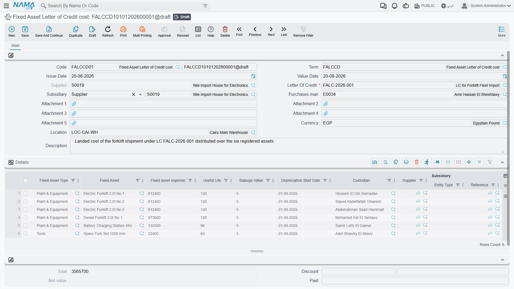
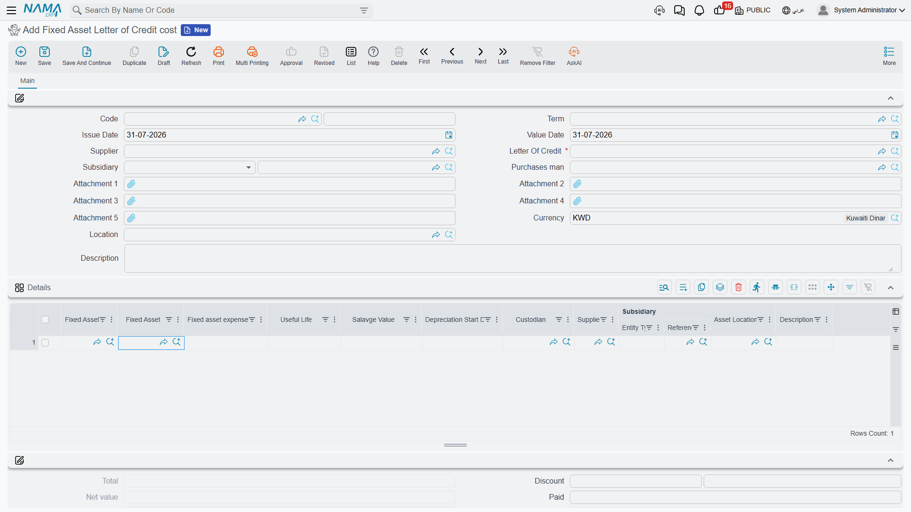

# The Cost Document

Up to this point the import has cost 615,000 and nobody owns a press. The money is sitting in a
holding account, split eight ways across two machines and four kinds of expense, and the two asset
records are still empty shells in their initial state.

The **Fixed Asset Letter of Credit cost** document is what ends that. It adds up everything that was
distributed to each machine, writes the total onto the machine as its cost, puts it into service,
starts its depreciation clock — and closes the letter of credit. It is the only document in the chain
that changes an asset.

Find it at **Assets › Fixed Asset Letter of Credits › Fixed Asset Letter of Credit cost**.

## Picking the credit does most of the typing

Choose **Letter Of Credit** and the document builds itself. It reads the credit's
[proforma invoice](/modules/fixedassets/letters-of-credit/fixedassets-lc-proforma-invoice.md), lays
out one detail row per machine — one row per named asset, and as many rows as the quantity for a line
that names only an asset type — then reads every committed
[expense document](/modules/fixedassets/letters-of-credit/fixedassets-lc-expenses.md) on the credit
and fills in what each machine has accumulated.

The picker only offers credits that are still open. A credit whose cost document has already been
committed is closed and does not appear.

For `LC-2026-004` two rows appear, already carrying:

| Fixed Asset | Fixed asset expense |
|---|---|
| `PRS-0001` Press A | 369,000 |
| `PRS-0002` Press B | 246,000 |

That figure is recalculated from the distributed lines on **every save**, and the saved value is the
one that counts — what you see the instant you pick the credit is a preview to tell you the document
found something. Save it, and read the column again before committing.

## The header

| Field | Notes |
|---|---|
| **Code** (Book / Code) | the book that numbers the document |
| **Term** | required — it decides which account the cost is credited out of. See [Custody and letter-of-credit terms](/modules/fixedassets/document-terms/fixedassets-terms-custody-and-lc.md) |
| **Issue Date**, **Value Date** | the value date becomes each asset's purchase date |
| **Letter Of Credit** — required | the credit being closed |
| **Supplier** | filled from the credit, not editable |
| **Subsidiary**, **Purchases man** | reference fields for reporting |
| **Location** | a default location for the assets on this document |
| **Attachment 1 – 5**, **Description** | the customs release, the delivery note, notes |

The totals area shows the document's **Total** — the sum of the machines' landed costs, 615,000 for
this shipment — and the dimensions group behaves as it does elsewhere. The document works in the
ledger's main currency; the distributed expense lines keep their own currencies underneath and are
converted line by line.

## The lines: cost in, depreciation parameters out

Half the grid is filled for you and half is yours to fill.

**Filled by the system:**

| Column | |
|---|---|
| **Fixed Asset Type** and **Fixed Asset** | taken from the proforma invoice. The asset picker offers only assets of that type that are still in their **initial** status — an asset already capitalised by a purchase or an opening document cannot be capitalised again here |
| **Fixed asset expense** (تكلفة الأصل الثابت) | the computed landed cost. Read-only — this is the arithmetic of the whole chain, not something to override |

**Filled by you, once per machine:**

| Column | |
|---|---|
| **Useful Life** | how many periods the machine will be depreciated over |
| the salvage value (قيمة الأصل كخردة) | what it is expected to be worth at the end. It may not equal the computed cost |
| **Depreciation Start Date** | required, unless the asset is marked as not depreciable |
| **Custodian** | the employee the machine is handed to |
| **Asset Location** | where it physically goes |
| **Supplier**, **Subsidiary**, **Description** | reference |

Al-Waha completes the two rows as:

| Asset | Landed cost | Useful life | Salvage | Depreciation starts | Custodian | Location |
|---|---|---|---|---|---|---|
| `PRS-0001` Press A | 369,000 | 120 | 36,900 | 1 March 2026 | Khaled Al-Mutairi | `LOC-R2` Riyadh Plant, Hall 2 |
| `PRS-0002` Press B | 246,000 | 120 | 24,600 | 1 March 2026 | Khaled Al-Mutairi | `LOC-R2` Riyadh Plant, Hall 2 |

## How each figure is arrived at

The document does not trust the preview. On every save it goes back to the credit and recomputes:

1. It collects **every** distributed line belonging to this letter of credit, across every committed
   expense document — ignoring dimension filters, because a shipment's costs may have been entered
   under different branches.
2. It drops the lines whose expense item or term said **Do Not Affect On Cost**. Those costs stay in
   the ledger where the expense document put them; they never become asset value.
3. Each surviving line contributes its expense value, plus the taxes flagged as included in cost,
   less its discount.
4. Lines that name a **specific asset** are totalled per asset, and that total is the asset's cost.
5. Lines that name only an **asset type** are totalled per type and then divided by the number of
   rows of that type on this document — which is how a batch line on the proforma invoice becomes a
   cost per individual unit.
6. The document's **Total** is the sum of the lines.

For the presses this is simply the two columns from the previous page added up: 300,000 + 24,000 +
36,000 + 9,000 = **369,000** for Press A, and 200,000 + 16,000 + 24,000 + 6,000 = **246,000** for
Press B.

## What commit does to the assets

Committing writes, per line:

| On the asset | Value |
|---|---|
| the asset's cost | **369,000** for Press A, **246,000** for Press B |
| **status** | initial → **Running**, or **Not Depreciable** for an asset flagged as such |
| **purchase date** | the document's value date |
| **depreciation start date** | 1 March 2026 |
| **custodian** and **location** | as entered on the line, recorded as the asset's current location |

and the machine's useful life and salvage value are recorded as the asset's properties, which is what
the depreciation run reads from March onwards. Press A's first instalment is
(369,000 − 36,900) ÷ 120 = **2,767.50** a period, and Press B's is
(246,000 − 24,600) ÷ 120 = **1,845.00** — see
[Depreciation Concepts](/modules/fixedassets/depreciation/fixedassets-depreciation-concepts.md) for
how that is recomputed each period.

Finally, `LC-2026-004` moves to **Closed**.

## What reaches the ledger

The entry clears the holding account onto the assets' own accounts:

| | Account | Debit | Credit |
|---|---|---|---|
| Dr | `12310 Machinery` — the main account of `PRS-0001` | 369,000 | |
| Dr | `12310 Machinery` — the main account of `PRS-0002` | 246,000 | |
| Cr | `13910 Assets under letters of credit` — one line per distributed expense line, each at its own currency and rate | | 615,000 |
| | | **615,000** | **615,000** |

The debit side is the **asset's own main account**, taken from the asset record — which normally
inherited it from its
[Fixed Asset Type](/modules/fixedassets/master-files/fixedassets-asset-types.md). Different types of
machine therefore land on different cost accounts automatically, with no per-document configuration.
The credit side is the account the document's term names, and it is the same holding account the
expense documents debited, so the two entries cancel out and the holding account returns to zero for
this import.

The entry is created as a business request processed in the background; a failure appears in the
Business Requests list view and is retried from there.

## Actions on this screen

The cost document has no buttons of its own, and it does not need one: picking the **Letter Of
Credit** in the header is what builds the lines and brings the distributed cost across. If a figure
looks wrong, the answer is upstream — on the proforma invoice or on the expense documents — not on a
button here.

## What stops it committing

The cost document is the strictest document in the chain, because it is the last chance to catch a
mistake before it becomes an asset's permanent cost.

| It is refused when | What to do |
|---|---|
| a depreciable asset has no **Depreciation Start Date** | fill it in |
| a machine's remaining life works out to zero | give it a useful life |
| the salvage value equals the computed cost | there would be nothing to depreciate — correct one of them |
| the asset already carries an entry from another document | that machine was already capitalised elsewhere; it cannot be capitalised twice |
| the same asset appears on two lines | remove the duplicate |
| a line's asset type disagrees with the asset's own type | correct the line |
| an asset that received expenses is **not on the document** | add it — a machine that was charged must be capitalised |
| an asset type that received expenses is **not on the document** | the same, for batch lines |
| the number of distinct asset types on the document does not match the number in the distributed expenses | usually the same problem seen from the other side |

Those last three are the coverage checks, and they are the reason the document builds itself from the
credit rather than being typed by hand: every currency of cost that went into the holding account has
to come out onto a machine, or the holding account would never clear.

## Undoing it

Cancelling the cost document reverses everything: the assets' cost and properties entries are
removed, the machines go back to their initial state, and the credit returns to **Initial**, open
again.

That is the route for a late invoice. A demurrage bill arriving three weeks after the presses were
capitalised is handled by cancelling the cost document, entering an extra expense document, and
committing the cost document again with the new figures — not by editing the assets. Deleting the
cost document is blocked while any of its assets carries an entry from another document, for the same
reason.

Once the credit is closed and the presses are running, the letter of credit remains as the record of
how the two figures were arrived at: which invoices, from which parties, spread by which rule. That
is usually the first thing an auditor asks for, and it is the reason the chain is four documents long
rather than one.
