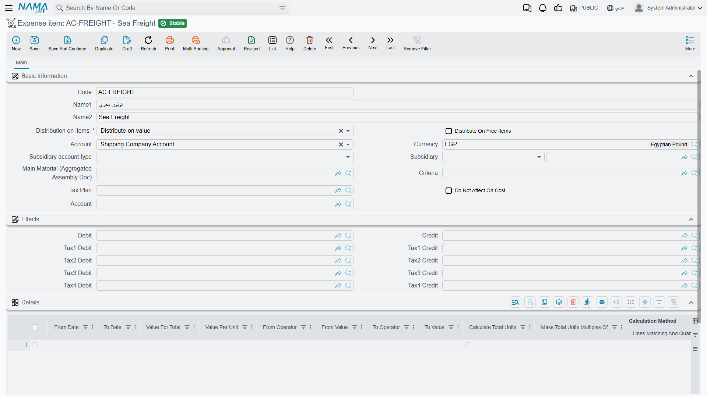
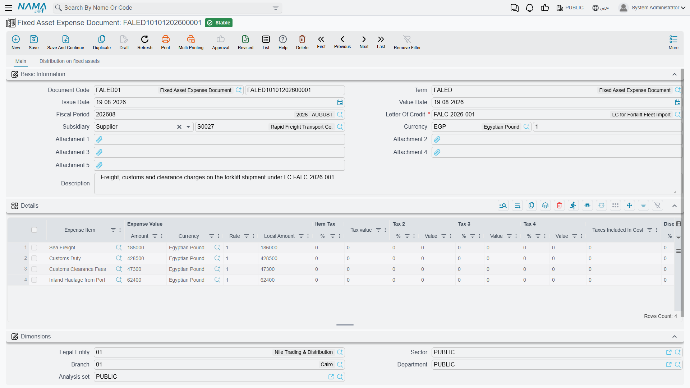
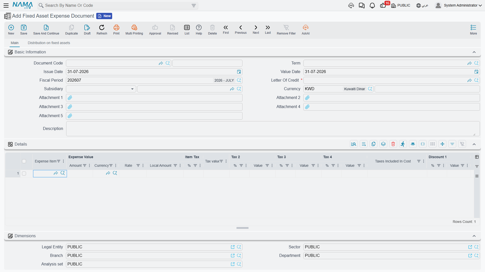
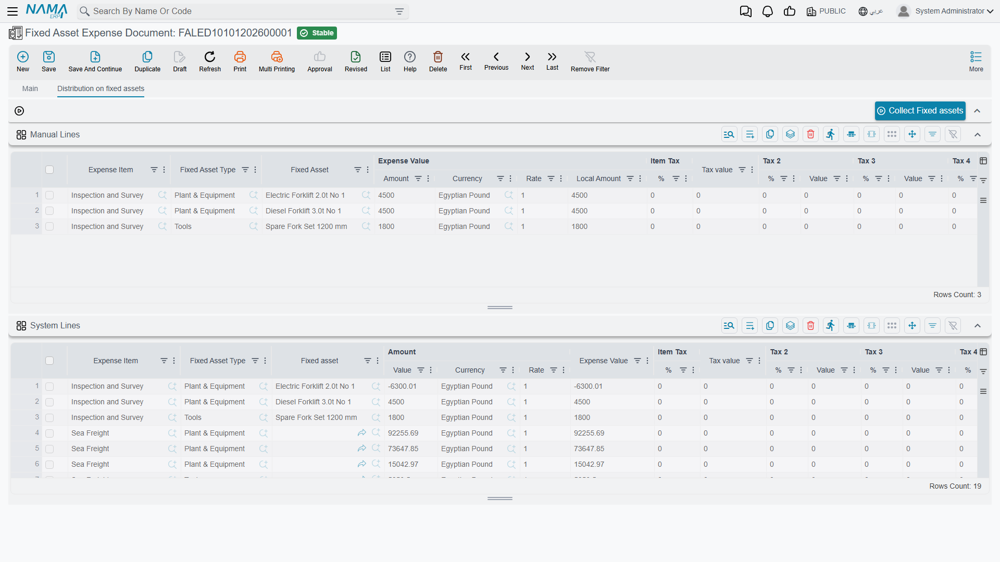
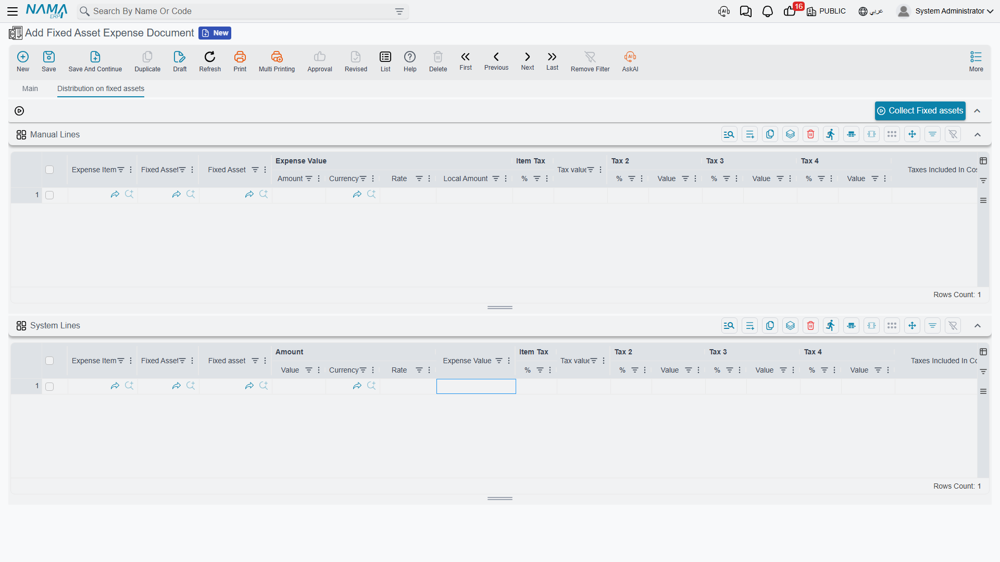

# Expenses and Distribution

This is where the import stops being paperwork and starts being money. Every invoice that lands on
the shipment — the supplier's own invoice, the shipping line's, the insurer's, the customs
declaration, the clearance agent's bill, the bank's commission — is entered on a **Fixed Asset
Expense Document**, and each one is immediately split across the machines listed on the
[proforma invoice](/modules/fixedassets/letters-of-credit/fixedassets-lc-proforma-invoice.md).

You can raise as many expense documents on one credit as you like, and in practice you raise one per
invoice as it arrives, over weeks. The split happens per document, per line, and the results
accumulate on the credit until the
[cost document](/modules/fixedassets/letters-of-credit/fixedassets-lc-cost-document.md) collects
them.

::: danger The line everyone forgets
The supplier's goods value goes on an expense document like every other cost. The proforma invoice's
500,000 is a distribution base; it capitalises nothing on its own. Omit the goods line and the two
presses will be capitalised at freight and customs only.
:::

## First, the expense item

Before any of this works you need a small master file for each *kind* of expense you will charge:
customs duty, ocean freight, marine insurance, clearance fees, bank commission, inland haulage — and
the goods value itself. That file is the **Expense item** (بند مصروف), and it sits in the same menu
folder as the letter of credit, at **Assets › Fixed Asset Letter of Credits › Expense item**. It is a
shared file: the supply-chain letter-of-credit chain uses the very same records for imported goods,
so a site that imports both stock and machinery keeps one catalogue of expense items and two sets of
document books.



An expense item is a tiny record and only a handful of its fields matter for imported assets:

| Field | What to put in it |
|---|---|
| **Code**, **Name (Arabic)**, **Name (English)** | `FREIGHT` — الشحن / Ocean freight |
| **Distribution on items** — required | how this cost is spread over the machines. The whole point of the file; see the table below |
| **Account** | the account the cost is debited to — normally a single "assets under letters of credit" holding account shared by every expense item. It must be a **detailed** account: an account that carries a subsidiary type is rejected when you save |
| **Tax Plan** | if the expense is taxed, the plan that supplies the percentages |
| **Do Not Affect On Cost** | tick it for a cost that is booked but must **not** be folded into the machines' value — a demurrage penalty, a fine. The entry still reaches the ledger; the cost document simply ignores it |
| **Currency** | optional, a convenience default |

Al-Waha's catalogue for this import is four records, all pointing their **Account** at
`13910 Assets under letters of credit`:

| Code | Name | Distribution |
|---|---|---|
| `GOODS` | قيمة البضاعة / Goods value | Distribute on value |
| `FREIGHT` | الشحن / Ocean freight | Distribute on value |
| `CUSTOMS` | الجمارك / Customs duty | Distribute on value |
| `CLEAR` | التخليص / Clearance fees | Manual |

::: info The expense item's account is the debit; the credit is chosen on the document
The expense item supplies the account the cost is **debited** to. Who is **credited** — the supplier,
the bank, the customs agent, a specific account — is chosen on each expense-document line, not here.
Unlike the supply-chain purchase documents, the fixed-asset chain does not copy any credit-side
setting down from the expense item onto the line, so the line is where that decision is made and the
only place it takes effect.
:::

## The distribution rules

**Distribution on items** is the field that makes an expense item worth having. It decides what the
cost is proportional to:

| Distribution | Arabic label | Spread in proportion to | Use it for |
|---|---|---|---|
| **Distribute on value** | توزيع على القيم | each line's total price on the proforma invoice | the goods value, customs duty, insurance, bank commission — anything charged *ad valorem*. The safe default |
| **Distribute On Weight** | توزيع على الوزن | the **Weight** column | sea and road freight, port handling |
| **Distribute On Volume** | توزيع على الحجم | the **Volume** column | air freight and container space |
| **Distribute On Area** | توزيع على المساحة | the **Area** column | costs charged by floor or deck space |
| **Distribute On Length** | توزيع على الطول | the **Length** column | over-length surcharges |
| **Distribute On Density** | توزيع على الكثافة | the **Density** column | specialist freight tariffs quoted on density |
| **Distribute on quantity** | توزيع على الكميات | each line's quantity | a per-unit charge on a batch line |
| **Manual** | يدوي | nothing — you type the amount per machine | an invoice the supplier already itemised per machine |

Two of them deserve a note.

**Distribute on quantity** behaves differently from what its name suggests when the proforma lines
name specific assets: those lines are always quantity 1, so the cost is split equally between them
regardless of size or value. That is genuinely what you want for a per-machine flat fee, and is
genuinely not what you want for freight.

**Manual** is the escape hatch, and it is the right answer more often than people expect. When the
clearance agent's bill says "Press A: 9,000, Press B: 6,000", no formula will reproduce that as
faithfully as typing it.

Whichever basis you pick, the column it reads has to be filled on the proforma invoice. Choosing
*Distribute On Weight* on a shipment whose lines carry no weights leaves that cost with nothing to
divide by.

## The expense document



### The header

**Document Code** and its book, **Term**, **Issue Date**, **Value Date**, **Fiscal Period**, the
**Letter Of Credit** (required — this is what tells the document which machines to divide over), an
optional **Subsidiary**, the document **Currency** and **Currency Rate**, five attachment slots for
scans of the invoices, and a description. Picking the credit pulls its currency in.

The document's [term](/modules/fixedassets/document-terms/fixedassets-terms-custody-and-lc.md) is
what tells the system how to build the accounting entry, so unlike the proforma invoice this document
does need one.

### The lines — the costs as invoiced



One line per invoice, or per invoice line:

| Column | Notes |
|---|---|
| **Expense Item** — required | which kind of cost this is, and therefore how it will be spread |
| **Expense Value** — Amount, Currency, Rate, Local Amount | the invoiced amount. Each line carries **its own** currency and rate, so freight in euros and customs duty in local currency can sit on the same document. Leave the currency blank and the header's is used at rate 1 |
| **Item Tax** 1 to 4, each a percentage and a value | filled from the expense item's tax plan and the term's |
| **Taxes Included In Cost** | the part of the tax that is capitalised rather than reclaimed |
| **Discount 1** — percentage and value | a discount on the invoice line |
| the credit-side column (الجانب الدائن) | who is owed this money — see below |
| **Subsidiary**, **Subsidiary account type**, **Account** | the counterparty, when the credit side calls for a specific one |
| **Reference 1**, **Reference 2**, **Description** | the supplier's invoice number and any note |

The credit-side column is the one to get right, because it is what turns "40,000 of freight" into a
real liability to a real party:

| Choice | Credits |
|---|---|
| **Supplier Account** | the supplier named on the letter of credit |
| **Bank Account** | the bank account named on the letter of credit |
| **Customs Company Account** | the customs party named on the letter of credit |
| **Insurance Company Account** | the insurance party named on the letter of credit |
| **Specific Account** | the account typed on this line |
| **Specefic Subsidiary** | the account on this line if there is one, otherwise the line's subsidiary |
| **Current User Subsidiary** | the employee record of whoever entered the document |

The first four are why it is worth filling in the parties on the credit: with them set, the whole
line reduces to "credit the customs company" and the system finds the rest.

Al-Waha's expense document for `LC-2026-004`, all in the ledger currency:

| Line | Expense item | Amount | Credited to |
|---|---|---|---|
| A | `GOODS` Goods value | 500,000 | Supplier Account → Gulf Machinery Trading |
| B | `FREIGHT` Ocean freight | 40,000 | Specific Account → `21450 Freight payable` |
| C | `CUSTOMS` Customs duty | 60,000 | Customs Company Account → Al-Faris Clearance |
| D | `CLEAR` Clearance fees | 15,000 | Customs Company Account → Al-Faris Clearance |
| | **Total** | **615,000** | |

### The distribution page

The second page is where the split is set up and where the result is read back.



It carries one button, **Collect Fixed assets** (تجميع الأصول الثابته), and two grids.

Pressing **Collect Fixed assets** reads the credit's proforma invoice and, **for every line whose
expense item distributes manually**, creates one row per machine in the **Manual Lines** grid — the
asset type and the asset already filled in, the amount left for you. Al-Waha presses it once and gets
two rows for the `CLEAR` line, and types 9,000 against Press A and 6,000 against Press B.

The manual amounts have to add up. Per expense item, the total of the manual rows must equal the
total of the document lines using that item — 9,000 + 6,000 = 15,000. If they do not, the commit is
refused and the message names the expense item and both totals.

The second grid, **System Lines**, is the answer: one row per machine per expense item, showing the
amount, its currency and rate, and the expense value in the ledger's currency. It is read-only,
because it is computed.

::: info System Lines are produced on commit, not on save
A saved draft shows an empty System Lines grid. The distribution runs when the document is committed.
That is normal and is not a sign that anything is wrong — commit the document and the grid fills.
:::



## The by-value calculation, line by line

Here is the whole of Al-Waha's shipment worked out. The formula is the same every time:

```
                        the expense line's local amount  ×  this machine's base
share of one machine  =  ──────────────────────────────────────────────────────
                            the total of that base over all proforma lines
```

The base comes from the proforma invoice, which lists Press A at 300,000 and Press B at 200,000, so
for a value-based expense item:

- Press A's share of everything = 300,000 ÷ 500,000 = **0.60**
- Press B's share of everything = 200,000 ÷ 500,000 = **0.40**

**Line A — Goods value, 500,000, distributed on value**

- Press A: 500,000 × 300,000 ÷ 500,000 = **300,000**
- Press B: 500,000 × 200,000 ÷ 500,000 = **200,000**

**Line B — Ocean freight, 40,000, distributed on value**

- Press A: 40,000 × 0.60 = **24,000**
- Press B: 40,000 × 0.40 = **16,000**

**Line C — Customs duty, 60,000, distributed on value**

- Press A: 60,000 × 0.60 = **36,000**
- Press B: 60,000 × 0.40 = **24,000**

**Line D — Clearance fees, 15,000, distributed manually**

Not calculated at all — taken straight from the Manual Lines grid:

- Press A: **9,000**
- Press B: **6,000**

**Eight system lines, and the totals per machine:**

| Expense item | `PRS-0001` Press A | `PRS-0002` Press B | Line total |
|---|---|---|---|
| Goods value | 300,000 | 200,000 | 500,000 |
| Ocean freight | 24,000 | 16,000 | 40,000 |
| Customs duty | 36,000 | 24,000 | 60,000 |
| Clearance fees | 9,000 | 6,000 | 15,000 |
| **Landed cost** | **369,000** | **246,000** | **615,000** |

Those two totals, 369,000 and 246,000, are what the cost document will write onto the presses.

### When the shares do not divide evenly

Each share is rounded to the number of decimal places the line's currency uses, and rounded shares
rarely add back up to the invoice exactly. The system does not leave the difference lying around: it
compares the sum of the distributed shares against the expense line's own amount and puts the whole
difference on the **first** system line of that expense line.

Al-Waha's shipment splits cleanly at every amount, so nothing shows. Change the clearance fee to
15,000.05 and split it evenly between two identical machines, and it does:

- each machine's raw share is 15,000.05 × 0.5 = 7,500.025, which rounds to **7,500.03**;
- the two rounded shares sum to 15,000.06 — one unit more than was invoiced;
- the difference, −0.01, is applied to the first line, leaving **7,500.02** and **7,500.03**.

Total distributed: 15,000.05, exactly the invoice. This is worth knowing when you read the System
Lines grid and one machine's share looks a fraction off the percentage you expected. The distribution
always ties back to the invoice to the last decimal, and the first machine on the list absorbs the
remainder.

## What reaches the ledger

The expense document posts. One debit-and-credit pair per system line — that is, per machine per
expense item — plus any tax and discount lines the term configures:

| | Account | Debit | Credit |
|---|---|---|---|
| Dr | `13910 Assets under letters of credit` — the `GOODS` item's account | 500,000 | |
| Dr | `13910 Assets under letters of credit` — `FREIGHT` | 40,000 | |
| Dr | `13910 Assets under letters of credit` — `CUSTOMS` | 60,000 | |
| Dr | `13910 Assets under letters of credit` — `CLEAR` | 15,000 | |
| Cr | Gulf Machinery Trading | | 500,000 |
| Cr | `21450 Freight payable` | | 40,000 |
| Cr | Al-Faris Clearance (60,000 + 15,000) | | 75,000 |
| | | **615,000** | **615,000** |

The debits sit in the holding account, waiting. Nothing has touched a press yet — as far as the asset
register is concerned, `PRS-0001` and `PRS-0002` are still empty records in their initial state. The
cost document is what moves 615,000 out of the holding account and onto the machines.

Each line is booked at **its own** currency and rate, so a euro freight invoice and a local-currency
customs bill on the same document each convert at the rate on their own line. The entry is created as
a business request processed in the background: the document saves instantly, and a failed entry is
retried from the Business Requests list view rather than re-keyed.

## What stops an expense document committing

| It is refused when | Because |
|---|---|
| the credit has no proforma invoice | there is nothing to distribute over |
| the details grid is empty | there is nothing to distribute |
| a line has no expense value | the same |
| an expense item distributes on value and the proforma total is zero | there is nothing to divide by |
| an expense item is set to **Manual** and the Manual Lines grid has no rows for it | the amounts were never typed |
| the manual rows for an expense item do not add up to the document lines using that item | the split would not equal the invoice |
| the credit is already closed | the import has been capitalised; cancel the cost document first |

An expense document belonging to a closed credit also cannot be deleted, for the same reason:
its figures are already inside somebody's asset cost.

Cancelling a committed expense document reverses its ledger entry and clears its distributed lines,
which removes those costs from anything the cost document recalculates afterwards.

Next: [The Cost Document](/modules/fixedassets/letters-of-credit/fixedassets-lc-cost-document.md).
