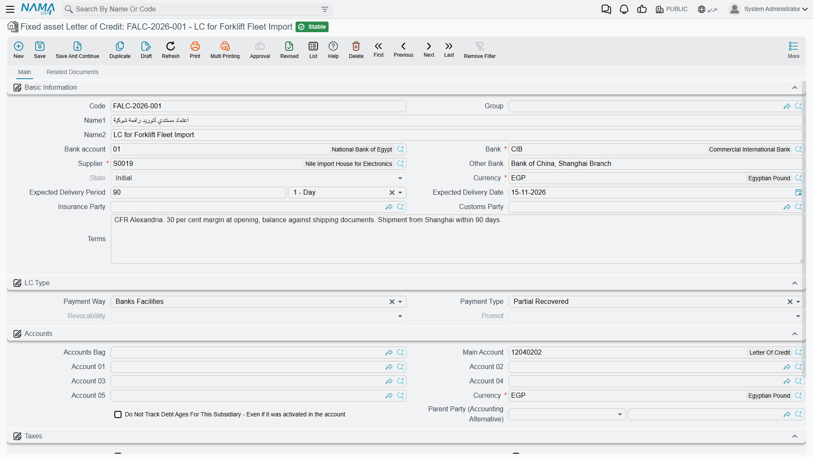
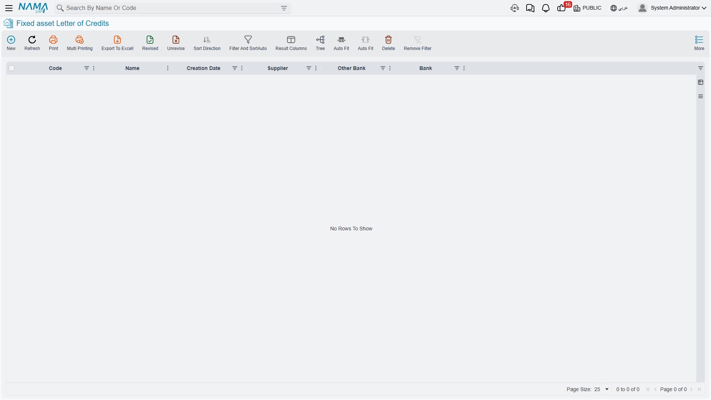

# Importing Assets on a Letter of Credit

A press bought from a factory down the road costs what the invoice says it costs. A press bought from
a factory on another continent costs the invoice, plus the sea freight, plus the marine insurance,
plus the customs duty, plus the clearance agent's fee, plus the bank's commission for opening the
credit — and every one of those arrives as a separate invoice, from a separate party, sometimes in a
separate currency, weeks apart. None of them is addressed to a machine. They are all addressed to a
*shipment*.

That is the problem this chain of four documents exists to solve. It gathers everything spent on one
import, spreads it across the machines in the container in whatever proportion is fair for that kind
of cost, and then writes the resulting figure onto each machine as its cost. Freight goes by weight
if you want it to; customs duty goes by value; the clearance agent's bill can be split by hand
because the agent itemised it per machine. When the last document commits, each asset carries a cost
that includes its own share of everything, and the credit closes.

::: danger The one rule that catches everybody
The proforma invoice's value is a **distribution base, not a cost**. It never capitalises by itself.

The proforma invoice tells the system *how to split* what you spend — 300,000 for Press A against
200,000 for Press B means Press A takes 60 % of everything and Press B takes 40 %. It does not tell
the system that you spent 500,000. If you want the supplier's goods value in the assets' cost, you
must enter it as an **expense line** on an expense document, exactly like freight and customs. Skip
that step and the two presses will be capitalised at freight and customs only, with the machines
themselves missing.
:::

Everything described on these five pages requires the `fixedassets-lc` licence. Without it the whole
**Fixed Asset Letter of Credits** menu folder — the credit, the proforma invoice, the expense
document and the cost document — is not there, and imported assets have to be brought in through the
ordinary [purchase document](/modules/fixedassets/acquisition/fixedassets-purchase-document.md)
instead, with landed cost worked out by hand.

## The four documents, in order

```
Fixed asset Letter of Credit          the file card for one import deal
        │                              (a master file — it is never committed)
        │  exactly one
        ▼
Fixed Asset ProformaInvoice           the machines and their supplier prices
        │                              = the distribution base. Books nothing.
        │  as many as you need
        ▼
Fixed Asset Expense Document          every cost that lands on the shipment
        │                              goods value, freight, customs, clearance…
        │                              spreads each cost over the machines. Posts.
        ▼
Fixed Asset Letter of Credit cost     sums each machine's share, writes it as the
                                       asset's cost, starts depreciation, closes
                                       the credit. Posts.
```

The credit itself is a **master file**, not a document — it has no book, no term and no accounting
effect. It is the peg all the paperwork hangs on, and it is also the thing that tells you, at any
moment, how much has been spent on this import so far.



Only the last document, the cost document, capitalises anything. Everything before it either records
information or books cost into a holding account and waits.

## The whole shipment, end to end

Al-Waha Industries is importing two hydraulic presses for the Riyadh plant under credit
**`LC-2026-004`**. The presses will become assets `PRS-0001` (Press A) and `PRS-0002` (Press B), both
of type `FAT-MCH — Machinery & Equipment`. Both asset records already exist, in their initial state,
waiting to be given a cost.

**Step 1 — open the credit.** A Fixed asset Letter of Credit record named `LC-2026-004`: the supplier, the
bank, the currency, the customs agent who will clear the shipment. Nothing is booked. See
[The Letter of Credit](/modules/fixedassets/letters-of-credit/fixedassets-letter-of-credit.md).

**Step 2 — enter the proforma invoice.** One line per press, carrying the supplier's price:

| Line | Asset | Price |
|---|---|---|
| 1 | `PRS-0001` Press A | 300,000 |
| 2 | `PRS-0002` Press B | 200,000 |
| | **Invoice total** | **500,000** |

Those 500,000 buy nothing and book nothing. They establish that Press A is 60 % of this shipment and
Press B is 40 %. See
[The Proforma Invoice](/modules/fixedassets/letters-of-credit/fixedassets-lc-proforma-invoice.md).

**Step 3 — enter the costs as they arrive.** Each invoice becomes a line on an expense document,
naming an expense item that carries its own distribution rule:

| Expense item | Amount | Spread by | Owed to |
|---|---|---|---|
| Goods value | 500,000 | value | the supplier |
| Ocean freight | 40,000 | value | the freight forwarder |
| Customs duty | 60,000 | value | the clearance agent |
| Clearance fees | 15,000 | manually | the clearance agent |
| **Total to capitalise** | **615,000** | | |

Note the first row. The supplier's own 500,000 is entered here, as an ordinary expense line — that is
the step people skip. See
[Expenses and Distribution](/modules/fixedassets/letters-of-credit/fixedassets-lc-expenses.md).

**Step 4 — commit the cost document.** It reads everything that was distributed to each press and
writes it as that press's cost:

| Asset | Share | Landed cost |
|---|---|---|
| `PRS-0001` Press A | 60 % | **369,000** |
| `PRS-0002` Press B | 40 % | **246,000** |
| | | **615,000** |

Both presses move out of their initial state and into service, both start depreciating from the date
on the document, and `LC-2026-004` closes. See
[The Cost Document](/modules/fixedassets/letters-of-credit/fixedassets-lc-cost-document.md).


## Why the goods value is entered twice-looking

Newcomers find it strange to type 500,000 on the proforma invoice and then type 500,000 again on an
expense document. It stops being strange once you see what the two figures are for.

The proforma invoice answers **"in what proportion?"**. It is a ratio expressed in money, and any
column on it can serve as the ratio instead — weight, volume, area, length. If the presses had been
listed with weights of 12 tonnes and 8 tonnes, the freight could have been split 60/40 on weight
without a price appearing anywhere.

The expense document answers **"how much, and who is owed it?"**. Every line there is a real invoice
from a real party, and every line produces a real accounting entry: the cost goes into a holding
account for assets under credit, and the party is credited. The goods value is a real invoice from a
real supplier, so it belongs there like everything else.

The cost document then answers **"what does each machine cost?"**, by adding up what was distributed
to it, moving the holding account onto the assets' own cost accounts.

::: tip A quick check before you commit the cost document
Add up the amounts on your expense documents. If the total does not look like what the shipment
actually cost you — invoice, freight, duty, agent, bank — something is missing, and the missing piece
is very often the supplier's own invoice.
:::

## What each document does and does not do

| Document | Books to the ledger? | Changes the assets? |
|---|---|---|
| Fixed asset Letter of Credit | no | no |
| Fixed Asset ProformaInvoice | no | no |
| Fixed Asset Expense Document | yes — cost into a holding account, party credited | no |
| Fixed Asset Letter of Credit cost | yes — holding account onto the assets' cost accounts | yes — writes the cost, puts them into service |



Both posting documents create their entries as **business requests** processed in the background, so
saving is instant and a failed entry is retried from the Business Requests list view rather than by
re-typing the document.

## The one button in the chain

Three of the four documents have no buttons at all: the credit is a peg, the proforma invoice is a
price list, and the cost document builds itself the moment you name the credit. The only button in
the whole chain sits on the **expense document**, on its distribution page: **Collect Fixed assets**
(تجميع الأصول الثابته), which creates the manual-distribution rows for the expense items you have
chosen to split by hand. Everything else follows from the credit reference you pick and from
committing the documents in order.

## The order things have to happen in

The chain is strict about sequence, and the reasons are worth knowing before you hit them:

1. **The credit before anything else.** Every one of the three documents requires a letter of credit
   and refuses to be committed without one.
2. **The proforma invoice before any expense document.** An expense document cannot be committed
   while its credit has no proforma invoice — there would be nothing to distribute over. There is
   exactly one proforma invoice per credit.
3. **All the expense documents before the cost document.** The cost document reads what has already
   been distributed. An expense document committed afterwards is not in the figures, and the cost
   document then refuses to commit if an asset or an asset type that received expenses is not on it.
4. **The cost document last, once.** It closes the credit, and a closed credit accepts no further
   expense documents.

If a late invoice turns up after the credit is closed, cancel the cost document. That reverses the
capitalisation, puts the assets back into their initial state and reopens the credit, so the extra
expense document can be entered and the cost document committed again.

## Where the assets come from

The presses have to exist as [asset records](/modules/fixedassets/master-files/fixedassets-asset-master.md)
before the cost document can name them, and they have to be in their **initial** status — an asset
that has already been capitalised by a purchase or an opening document cannot be capitalised again
here. The practical order is: create the two asset records with their code, name, type and
classifications, leave them untouched otherwise, and let the letter-of-credit chain give them their
cost. [Asset status](/modules/fixedassets/master-files/fixedassets-asset-status.md) explains what
each state allows.

From the cost document onwards the two presses are ordinary fixed assets. They depreciate by the
rules on [Depreciation Concepts](/modules/fixedassets/depreciation/fixedassets-depreciation-concepts.md),
they can be transferred, revalued and disposed of, and nothing about them remembers that they arrived
on a credit — except the credit itself, which keeps the full breakdown of what each of them cost and
why.
