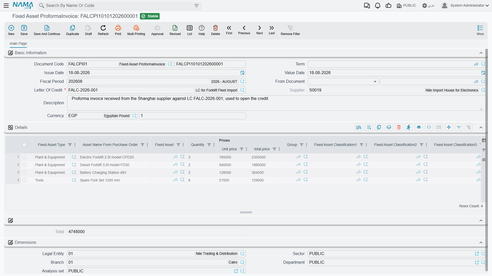
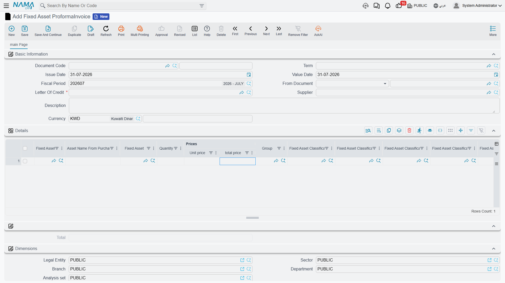

# The Proforma Invoice

The **Fixed Asset ProformaInvoice** is the shortest document in the chain and the most
misunderstood. It lists the machines coming in under the credit and what the supplier is charging for
each of them, and then it does nothing at all — no accounting entry, no change to any asset, no value
written anywhere.

That is not a limitation. It is the document's whole purpose. What it produces is a **ratio**.

::: danger Say it once more
The prices on this invoice are a **distribution base, not a cost**.

Listing Press A at 300,000 and Press B at 200,000 tells the system that Press A takes 60 % of
whatever is spent on this shipment and Press B takes 40 %. It does not tell the system that 500,000
was spent. The supplier's 500,000 becomes cost only when it is entered as an expense line on an
[expense document](/modules/fixedassets/letters-of-credit/fixedassets-lc-expenses.md).
:::

Find it at **Assets › Fixed Asset Letter of Credits › Fixed Asset ProformaInvoice**.

## One invoice, one credit

A letter of credit holds **exactly one** proforma invoice. Committing a second one against a credit
that already has one is refused, and the message points at the letter-of-credit field. If the
supplier revises the pro-forma — a machine added, a price corrected — you edit the existing invoice
rather than entering a second one.

The credit must also still be open. A proforma invoice cannot be committed against a credit that has
already been closed by its cost document.

::: tip Pick the letter of credit before you type anything else
Choosing the credit is what pulls the currency and the supplier onto the document, so it belongs
first — before the detail lines. Enter it, then fill the grid.
:::

## The header

| Field | What it does |
|---|---|
| **Document Code** (Book / Code) | the book that numbers the document |
| **Term** | optional on this document; it books nothing, so most installations leave it |
| **Issue Date** and **Value Date** | the supplier's invoice date and the date the document counts from |
| **Fiscal Period** | the period the document belongs to |
| **Letter Of Credit** — required | the credit this invoice belongs to |
| **Supplier** | filled in from the credit and not editable — the credit already decided who the supplier is |
| **Currency** and **Currency Rate** | the invoice's own currency, pushed in from the credit when you pick it |
| **Description** | free text |

The dimensions group at the bottom — legal entity, sector, branch, department, analysis set — behaves
as it does on every other document.

## The lines: one row per machine

Each line answers two questions: *which asset is this?* and *how big is it, in whatever units the
costs will be split by?*

### Naming the asset

Every line names **either** a specific **Fixed Asset** **or** a **Fixed Asset Type** — never both,
and never neither. Committing a line that has both filled in, or a line that has neither, is refused.

The two styles mean different things:

- **A named asset** is the normal case for machinery. The asset record already exists, in its initial
  state, and this line says "this machine, at this price". A line that names an asset always has a
  **quantity of 1** — the system forces it on save, because a specific asset record is one specific
  machine.
- **An asset type only** is for a batch of identical, not-yet-individual items: fifteen identical
  motors coming in as one line of the supplier's invoice. The costs distributed to that line are
  divided across however many rows of that type the cost document ends up carrying.

The same asset cannot appear on two lines. If it did, its share of the shipment would be counted
twice.

For `LC-2026-004` the two presses already exist as asset records, so both lines name an asset:

| Line | Fixed Asset | Qty | Unit price | Total price |
|---|---|---|---|---|
| 1 | `PRS-0001` Press A | 1 | 300,000 | 300,000 |
| 2 | `PRS-0002` Press B | 1 | 200,000 | 200,000 |
| | | | **Total** | **500,000** |

### Prices

You may type the **unit price** and let the line price compute, or type the **total price** directly.
On every save the system recalculates: a line whose total price does not equal quantity × unit price
is corrected to quantity × unit price, and the invoice **Total** is the sum of the lines. With
quantities of 1 on both presses, unit price and line price are the same figure.

That total, 500,000, is the denominator of everything that follows. Distributing an expense **on
value** means multiplying it by 300,000 ÷ 500,000 for Press A and 200,000 ÷ 500,000 for Press B.

::: info A zero invoice total blocks value-based distribution
If the invoice total is zero — the machines listed with no prices — an expense item set to distribute
on value cannot be committed, because there is nothing to divide by. The expense document is refused
with a message naming the expense item. Either give the lines prices, or distribute those costs by
weight, volume or by hand instead.
:::

### The measurement columns

Beside the prices sit **Weight**, **Volume**, **Length**, **Area** and **Density**. These are the
alternative bases. Ocean freight is charged by container space, not by invoice value, so splitting it
by value quietly over-charges the expensive machine and under-charges the heavy one. Fill in the
weights and the freight can be split by weight instead; fill in the volumes and it can be split by
volume.

Nothing forces you to fill them. They are only needed if some expense item on this import is set to
distribute by one of them — and if it is, and the column is empty on every line, that cost has
nothing to divide by.

For the presses, weight would be the honest basis for freight:

| Line | Asset | Price | Weight |
|---|---|---|---|
| 1 | `PRS-0001` Press A | 300,000 | 12,000 kg |
| 2 | `PRS-0002` Press B | 200,000 | 8,000 kg |

which happens to give the same 60/40 split as value in this particular shipment. On a shipment with
one cheap heavy machine and one expensive light one, the two bases would pull hard in opposite
directions — which is precisely why both exist.

### The descriptive columns

The rest of the grid carries information forward rather than driving arithmetic: the asset's
**Group**, its five **Fixed Asset Classification** levels, a technical-specifications column for the
supplier's model and configuration text, and an **Asset Name From Purchase Order** column for the
description the machine was ordered under, which is rarely the description it will be registered
under.

## Actions on this screen

The proforma invoice has no buttons of its own. It is the shortest screen in the chain precisely
because there is nothing to generate: you list the machines and their prices, and the proportions
that the rest of the chain relies on fall out of those figures.

## What happens on commit

Very little, and that is by design. The document is validated — one asset or one type per line, no
repeated assets, a credit that is still open, no second invoice on the same credit — and then it is
recorded against the credit. No entry reaches the ledger. No asset is touched. The
[letter of credit](/modules/fixedassets/letters-of-credit/fixedassets-letter-of-credit.md) now points
at this invoice, and the expense documents can start arriving.

From here on the invoice is consulted, never changed by anything else. Every expense document reads
its lines to know what to divide by, and the cost document uses it to know which machines the credit
covers.

Next: [Expenses and Distribution](/modules/fixedassets/letters-of-credit/fixedassets-lc-expenses.md),
where the money actually appears.
