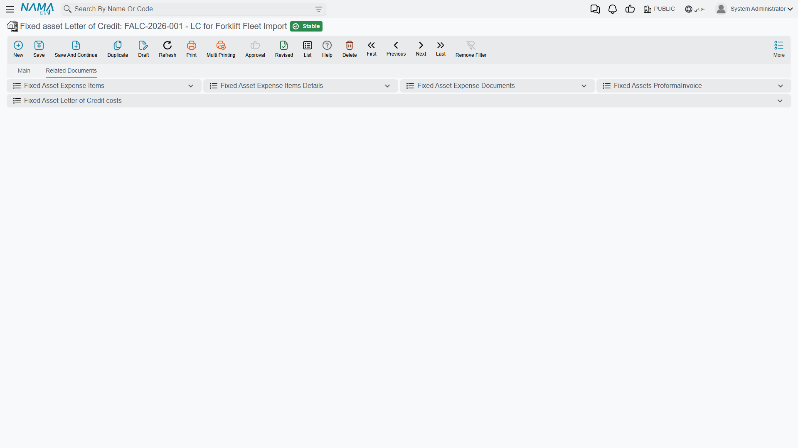

# The Letter of Credit

Everything about one import deal has to hang off a single peg: the proforma invoice, half a dozen
expense invoices from four different parties, and finally the document that turns all of it into
asset cost. The **Fixed asset Letter of Credit** is that peg.

It is deliberately a **master file**, not a document. There is no book, no
[document term](/modules/fixedassets/document-terms/fixedassets-terms-basics.md), no commit and no
accounting entry. You open it the way you open a supplier or a warehouse: fill it in, save it, and
from then on every document of the import points at it. The record's second job is to be the thing
you look at when somebody asks "how much have we spent on the Riyadh presses so far?" — it carries
its own running breakdown.

You find it at **Assets › Fixed Asset Letter of Credits › Fixed asset Letter of Credit**, in the
same folder as the three documents and the expense item file. The folder needs the `fixedassets-lc`
licence.

## Opening `LC-2026-004`

Al-Waha Industries is importing two hydraulic presses. The credit is opened before anything else
exists — before the proforma invoice, before a single invoice has arrived.

### Who is involved

The header names every party the import will owe money to, and it names them here rather than on the
invoices because the expense documents look them up from the credit. A freight or customs invoice
therefore does not have to repeat who the customs agent is; it just says "credit this to the customs
company" and the system reads the name off the credit.

| What you fill in | Why it matters later |
|---|---|
| **Code**, **Name (Arabic)** and **Name (English)** | how the credit is found and printed — `LC-2026-004`, *Presses – Riyadh Plant* |
| **Group** | the coding group that numbers the record |
| **Supplier** — required | the party the goods value is owed to. Copied automatically onto the proforma invoice and the cost document |
| the supplier's bank — required | the bank on the other side of the credit |
| **Bank account** | your own account the credit is drawn on. An expense line can be credited straight to it |
| **Other Bank** | the correspondent bank, as a free note |
| **Customs Party** | the clearance agent. An expense line credited to the customs company lands on this party |
| **Insurance Party** | the insurer. Same idea for the marine insurance invoice |

For `LC-2026-004` the supplier is **Gulf Machinery Trading**, the customs party is **Al-Faris
Clearance**, and the bank account is the plant's current account.

::: tip Fill in the parties even when you are not sure
The customs and insurance parties cost nothing to set and save real work later. If they are blank,
every expense line has to name an account or a subsidiary by hand instead of simply saying "credit
the customs company".
:::

### The commercial terms

The rest of the first group records the deal itself: the **Currency** the credit is opened in, an
**Expected Delivery Period** (a number and a unit, defaulting to months) and an **Expected Delivery
Date**, and a long free-text **Terms** field for the shipping and payment conditions as agreed with
the bank. A small **LC Type** group classifies how the credit is funded — whether it runs on supplier
facilities or bank facilities, and whether it is fully covered, partly covered or uncovered. These
are reference and filtering fields; they describe the deal rather than drive it.

The **Currency** matters more than the rest. It is the credit's currency, and it is pushed onto the
proforma invoice and onto every expense document the moment you pick the credit on them. Individual
expense lines can still be entered in another currency — freight in euros, customs duty in the local
currency — but the credit's currency is the starting point.

### The accounts block, and using the credit as a subsidiary

The credit carries a full set of accounts — accounts bag, main account, accounts 01 to 05, its own
currency, a parent party — and a tax-exemption block, exactly like a supplier or a customer. That is
not decoration: a letter of credit is one of the things the accounting module can analyse a control
account by. If you want an "assets under letters of credit" account whose balance can be read per
credit rather than as one lump, this is what makes it possible, and the expense documents' holding
entries are what fill it.

Last comes the **Dimensions** group — legal entity, sector, branch, department, analysis set —
which behaves as it does everywhere else in the system.

## The related documents page

The second page is a reading page. It gathers, filtered to this credit and nothing else:

- the **proforma invoice**, with its total;
- every **expense document** raised on the credit;
- every **cost document**;
- a summary of **expense items** — one row per kind of expense with the total distributed under it,
  which is the fastest answer to "how much freight has this shipment cost so far?";
- the **detail behind that summary** — every distributed line: which expense item, which asset type,
  which asset, the amount, the currency and rate, the net value.

Those last two lists are the useful ones during an import. They are the same distributed lines that
the cost document will later add up per asset, so what you see there is what each press is going to
be capitalised at. If a figure looks wrong at this stage, it is far cheaper to fix the expense
document than to unwind a committed cost document.

::: info The lists are built on commit, not on save
A distributed line only exists once its expense document has been committed. A draft expense document
contributes nothing to these lists — which is exactly the point of looking at them: they show
committed cost.
:::

## Actions on this screen

The letter of credit itself has no buttons of its own — it is the peg the other documents hang from,
not a document that generates anything. What looks like an action on it is the **Related Documents**
page described above: those grids are live lists of the expense, proforma and cost documents raised
against this credit, and opening one from there is how you move around the chain.

## The state of the credit, and what closes it

A read-only status field on the header tells you where the credit stands. In fixed assets it has
exactly two meaningful positions:

| State | Meaning |
|---|---|
| **Initial** (مبدئى) | the credit is open. Proforma invoices, expense documents and the cost document can all be entered against it |
| **Closed** (مغلقة) | the import is finished and capitalised |

Nothing on the credit itself moves it between the two. **Committing a cost document closes it**, and
**cancelling that cost document reopens it**. That single rule explains most of the behaviour people
notice:

- The letter-of-credit picker on a **cost document** offers only credits that are not closed — a
  closed credit has already had its cost document, and there is nothing left to capitalise.
- A **proforma invoice** cannot be committed unless the credit is still open.
- An **expense document** of a closed credit can be neither committed nor deleted. A late freight
  invoice therefore needs the cost document cancelled first: cancel it, the credit reopens, enter the
  expense, then commit the cost document again with the corrected figures.

## Finding credits later

The list screen is the ordinary one, and the fields worth filtering on are the supplier, the customs
and insurance parties, the currency, the dimensions and the state — the last of these separating
imports still in flight from imports already capitalised.

There is one credit per import deal, and it stays for good. Long after the presses are running, the
credit is where the answer lives to "what did we actually pay to get that machine into the hall, and
to whom".

Next: [The Proforma Invoice](/modules/fixedassets/letters-of-credit/fixedassets-lc-proforma-invoice.md),
which lists the machines the credit covers.
