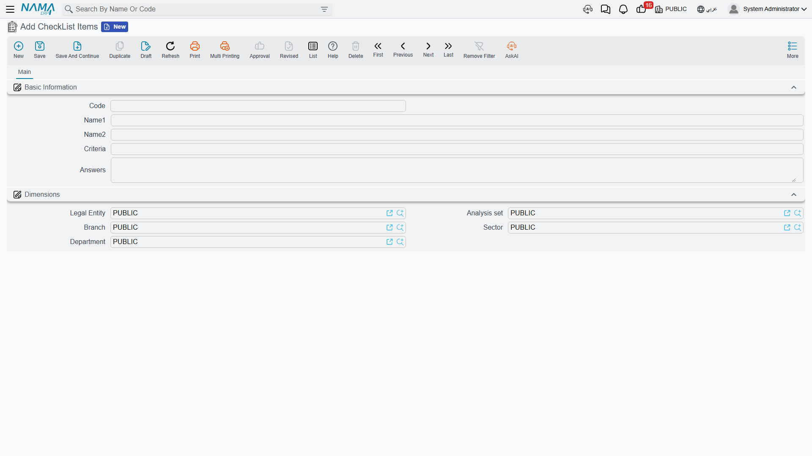
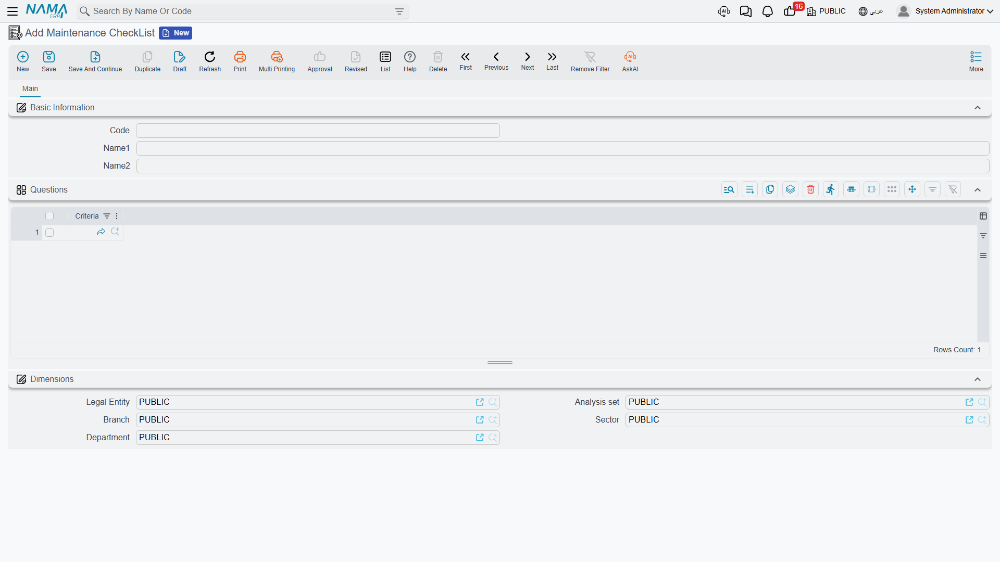

# Checklists and Checklist Items

Ask a technician to "service the CNC machine" and you will get a different job every quarter,
depending on who turns up. Hand him a sheet with four questions on it and you get the same job every
quarter, plus a written answer to each question that is still there in two years' time when
somebody asks whether the coolant was ever actually changed.

That sheet is a **Maintenance CheckList**, and the questions on it are **CheckList Items**. Both are
master files under **Assets > Fixed Asset Maintenance**, both need the `fixedassets-maintenance`
licence, and the relationship between them is simply that a checklist is a named bundle of items.

## CheckList Items — one question each

A checklist item is a single reusable inspection point. It is deliberately tiny, because the whole
point is that the same question is reused on every sheet that needs it: *"Are the guards and way
covers intact?"* belongs on the routine inspection, on the annual overhaul, and on the post-repair
sign-off, and you want to write it once.

Find them at **Assets > Fixed Asset Maintenance > CheckList Items**.

| Field | What it is for |
|---|---|
| **Code** | Your identifier, e.g. `CLI-01`. |
| **Name1 / Name2** | The Arabic name and the English name — a short handle for the item, e.g. "Spindle vibration". |
| **Criteria** (السؤال) | The question itself, as the technician will read it on the record. |
| **Answers** (الاجابات) | The answers you expect, written as **one line separated by commas**. |

### How the answers behave

This is worth being exact about, because the field looks more restrictive than it is.

The Answers field is **a list of suggestions, not a list of permitted values**. When a technician
fills in a maintenance record, the Result column on the checklist grid is an ordinary text box with
a type-ahead: as he starts typing, the values you listed here are offered to him. He can pick one,
or he can type something entirely different — "spindle bearing noisy on the X axis, flagged for the
annual overhaul" — and that text is saved exactly as typed.

There is no pass/fail model behind it. Nothing scores the answers, nothing totals them, nothing
raises a flag or blocks a commit because an answer came back the wrong way. The value of the field
is consistency of wording: give the technicians `OK,Marginal,Out of range` and next year's report is
readable, because four different people wrote the same three words.

::: tip Write the answers so they read well in a search
Because answers end up as free text, the words you suggest become the words you will later search
for. Short, distinct and consistent beats descriptive — `Replaced` is easier to find in a year's
records than `Was replaced during the visit`.
:::

## Maintenance CheckLists — the sheet

A checklist gathers items into the inspection sheet for one kind of job. Find it at
**Assets > Fixed Asset Maintenance > Maintenance CheckList**.

The screen is a code, an Arabic and an English name, and a grid called **Questions** whose single
column picks a checklist item. Order the lines the way you want the technician to work through them
— top to bottom is how they will land on the record.

That is the whole master file. It has no validation, no options and no effects of its own; it
exists to be pulled onto documents.

## How a checklist reaches a document

Three routes, all ending in the same place — the **checkList Items** grid on a maintenance record or
a maintenance record request, one line per question with the Result column blank and waiting.

1. **You pick the checklist directly.** The Maintenance CheckList field in the record's header
   explodes its questions onto the grid the moment you choose it.
2. **The maintenance type brings it.** A
   [maintenance type](/modules/fixedassets/maintenance/fixedassets-maintenance-types.md) names a
   default checklist; choosing a plan line whose maintenance type carries one fills the grid
   without your having to name the checklist at all.
3. **The request brings it.** When a record is raised from a maintenance record request, the whole
   grid comes across with it — questions *and* any answers already recorded on the request.

::: info The questions are copied, not linked
The grid on the document holds its own copy of each question. Edit the master checklist next month
— add a question, remove one, reword one — and records already created keep exactly the sheet they
were filled in against. That is the behaviour you want from a service history: the record shows what
was actually asked on the day.
:::

## Al-Waha's CNC inspection sheet

The four items behind the `MCH-0007` example:

| Code | Criteria | Answers |
|---|---|---|
| `CLI-01` | Is the spindle vibration within tolerance? | `OK,Marginal,Out of range` |
| `CLI-02` | Coolant level and condition | `OK,Topped up,Replaced` |
| `CLI-03` | Are the guards and way covers intact? | `Yes,No` |
| `CLI-04` | Control-unit error log reviewed and cleared? | `Yes,No` |

They are bundled into checklist `CL-CNC` — **CNC Routine Inspection**, in that order — and
`CL-CNC` is set as the default checklist on maintenance type `MT-90D` — Periodic Maintenance.

The consequence is that nobody at Al-Waha ever builds an inspection sheet by hand. The plan line
says Periodic Maintenance; the record picks the plan line up; the four questions arrive; the
technician answers `OK`, `Replaced`, `Yes`, `Yes` on 1 April; and that quartet is still readable on
the record years later, next to the contractor's name and the 1,800 the visit cost. What that 1,800
does — and does not do — to the machine's value is covered on the
[maintenance records](/modules/fixedassets/maintenance/fixedassets-maintenance-records.md) page.
