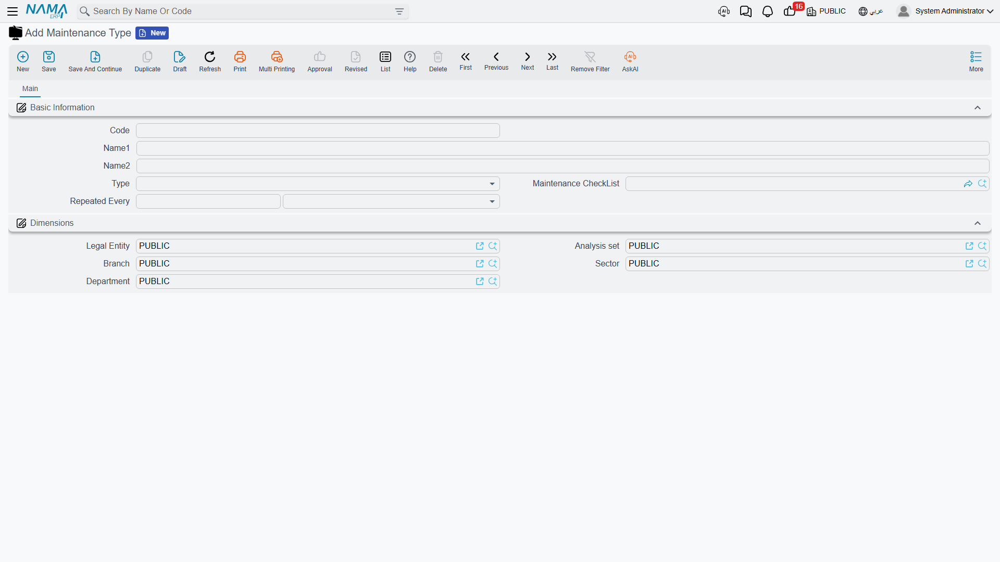

# Maintenance

A CNC machine that cost 240,000 does not survive five years on its own. Somebody greases it,
changes its coolant, checks the spindle for vibration and replaces the filters — and somebody else,
two years later, wants to know whether any of that actually happened, who did it, and what it cost.

That second question is what the Maintenance area answers. It is the service history of the
register: a permanent, searchable log of what was done to each machine, against which part of it,
by which contractor, on which date, with the inspection sheet the technician filled in on the day.

## What it is, and what it is not

It is worth being precise about the shape of this feature before you set it up, because it decides
how you will use it.

**Scheduling is by calendar dates that you type.** You build a plan and write in it that the CNC
machine is due on 1 April, 30 June, 28 September and 27 December. There is no meter reading, no
running-hours counter and no usage trigger anywhere in the module — an asset has no odometer field,
and nothing counts cycles.

**Nothing generates a maintenance record for you.** No background job watches due dates, sends a
reminder or creates a document when a date arrives. The plan is a worklist a human works through:
you open it, look for lines still marked *Planned* whose date has passed, and raise the records
yourself. What the system does give you is a **next expected maintenance date** stamped onto the
asset's own component line, so that anyone opening the machine's record can see when it is next
due without going to the plan at all.

**Maintenance cost is recorded for history.** The Maintenance Value field on a record is a fact
about the job — useful in a search, useful when you compare contractors, useful when you argue
about a service contract. It does not reach the general ledger, and it does not change the
machine's cost, book value or depreciation instalment by so much as one unit. When money spent on
an asset genuinely belongs in its cost — a rebuilt control unit that extends the machine's life,
not an oil change — that is capitalised with the
[addition and deduction document](/modules/fixedassets/depreciation/fixedassets-additions-and-deductions.md),
which is a different document with its own accounting.

So: maintenance here is a **log with a calendar**, and it is very good at being that.

## The five pieces and the order to build them

Everything in this area lives under **Assets > Fixed Asset Maintenance**, and it all needs the
`fixedassets-maintenance` licence — without it the whole folder disappears from the menu.

The pieces stack, smallest first:

1. **CheckList Items** — one reusable inspection question each. *"Is the spindle vibration within
   tolerance?"* Each item also carries the answers you expect to hear.
2. **Maintenance CheckList** — a named bundle of those questions. The inspection sheet for one kind
   of job.
3. **Maintenance Type** — the *kind* of maintenance: routine periodic service, preventive overhaul,
   emergency repair. A type points at the checklist that goes with it, and carries the interval at
   which it recurs.
4. **Maintenance plan** — the calendar. One plan holds many planned visits, each a line saying
   *which asset, which type of maintenance, on what date, by which contractor*.
5. **Maintenance Record** (and the **Maintenance Record Request** that can precede it) — the job
   itself, closed off at the end of the visit with the checklist filled in.

## Maintenance always targets a component, never the whole asset

This is the one structural rule that catches people out, and it is better learned here than at the
moment a commit is refused.

Maintenance is not filed against "the CNC machine". It is filed against **a component of** the CNC
machine — its spindle, its control unit, its coolant pump. Components are listed in the *Asset
Components* grid on the asset itself, and they exist purely for this: they carry no cost, no value
and no depreciation of their own. See
[components](/modules/fixedassets/master-files/fixedassets-components.md) for how they are set up
and how an asset type can seed them automatically.

Two consequences follow, and both are enforced when you commit a record:

- The **Component Type** on the record must be one of the components listed on the asset. An asset
  with no components at all cannot take a maintenance record — set its components up first.
- The **Maintenance Type** on the record must be one that the component type allows. Each component
  type carries its own list of permitted maintenance types; if that list is empty, anything is
  allowed.

The pay-off is that history lands in a useful place. When the record commits, the machine's spindle
line — not the machine as a whole — is stamped with the dates of the visit and the date the next
one is expected.

## The life of one plan: `MCH-0007` in 2026

Al-Waha Industries runs the CNC cutting machine `MCH-0007` at the Riyadh plant. Here is the whole
area working, once.

**Setup, done once.** Four checklist items are written — spindle vibration, coolant level and
condition, guards and way covers, control-unit error log. They are bundled into a checklist called
**CNC Routine Inspection**. A maintenance type **Periodic Maintenance** is created, its nature set
to *Periodic*, its default checklist set to CNC Routine Inspection, and its interval set to
**90 days**. On the asset, the spindle component line already names Periodic Maintenance as its
maintenance type.

**The calendar.** A plan `MP-CNC-2026` is created with four lines, one per quarter — 1 April,
30 June, 28 September and 27 December — each naming `MCH-0007`, Periodic Maintenance, and Gulf
Machinery Trading as the contractor. All four lines start life as *Planned*.

**The first visit.** In late March the plant engineer raises a **Maintenance Record Request** for
the April visit: the asset, the spindle, Periodic Maintenance, the contractor, an estimated 1,800.
Choosing the checklist fills the request's grid with the four questions, unanswered. The request
records the ask and nothing more — it books nothing and changes nothing.

On 1 April the contractor comes. A **Maintenance Record** is raised from the request, which copies
everything across including the four questions. The technician types the results, records that work
ran from 09:00 to 13:30, and confirms the cost at 1,800. Because the maintenance type repeats every
90 days, the record proposes **30 June 2026** as the next expected date — matching the second line
of the plan.

**What commit does.** Plan line one flips from *Planned* to *Executed* and is stamped with the
record that closed it. On the asset, the spindle component line now carries 1 April as both the
maintenance start and end date, 30 June as the next expected date, and a link back to the record.
No journal entry is produced, and the machine's 3,600 monthly depreciation instalment is exactly
what it was the day before.

Three more visits follow the same path, and by the end of the year the plan reads as a completed
year of service and the asset carries the full history.

## No buttons in this area either

None of the maintenance screens — component type, checklist item, checklist, maintenance type, plan,
request or record — carries a button of its own. In particular there is **no button that turns
a plan into records**: a plan line is closed by somebody raising a maintenance record for that visit,
by hand. What does happen for you is the copying: the checklist you pick on a record brings its
questions across, the asset you pick narrows the component-type lookup, and the maintenance type
fills in the next expected date from its repeat interval.

## Reading the history back

Two places show it, and they answer different questions.

The **Maintenance Records list** is the cross-asset view: filter by contractor, by date range, by
maintenance type, by asset, and read costs across the whole register.

The asset's own **Maintenance Record** page is the per-machine view: every record raised against
that asset, plus the maintenance plans it appears in.

And the component grid on the asset's main page is the "when is this next due" view — one line per
maintainable part, each carrying the dates its last record wrote.

## Where to go next

- [Maintenance types](/modules/fixedassets/maintenance/fixedassets-maintenance-types.md) — the
  kinds of maintenance and the repeat interval behind the next-due date.
- [Checklists](/modules/fixedassets/maintenance/fixedassets-maintenance-checklists.md) — the
  inspection questions and how answers are recorded.
- [Maintenance plans](/modules/fixedassets/maintenance/fixedassets-maintenance-plans.md) — the
  calendar of visits and how a record closes a line.
- [Maintenance records](/modules/fixedassets/maintenance/fixedassets-maintenance-records.md) — the
  request, the record, the checklist and the dates written back.
