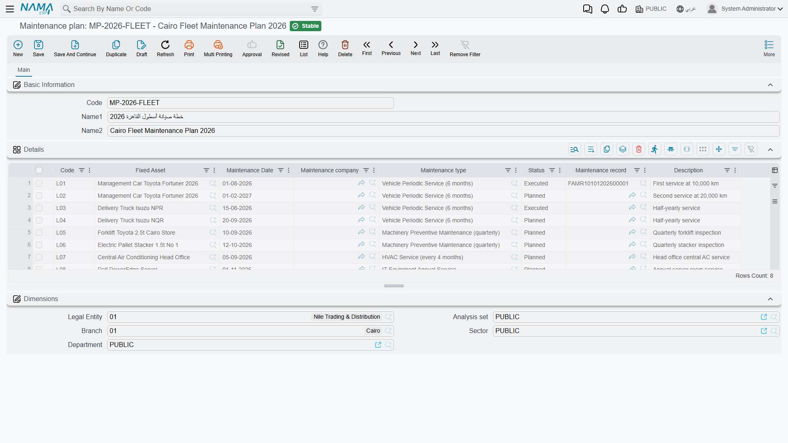

# Maintenance Plans

A maintenance plan is the year's service calendar written down: *this machine, this kind of
maintenance, on this date, by this contractor* — repeated for as many visits as you intend to make.

It is worth saying at the outset what kind of object this is, because it shapes how you use it. The
plan is a **master file**, not a document. It has no book, no document code, no value date, no
fiscal period and no
[document term](/modules/fixedassets/document-terms/fixedassets-terms-basics.md); it books nothing, generates nothing, and reminds nobody. It is a worklist that people read and work
through, and its lines are ticked off — automatically — by the maintenance records that carry them
out.

Find it at **Assets > Fixed Asset Maintenance > Maintenance plan**, under the
`fixedassets-maintenance` licence.

## How to organise plans

There is no rule about what one plan covers, and the system imposes none. In practice three shapes
work:

- **One plan per asset per year** — `MP-CNC-2026` holding the CNC machine's four quarterly visits.
  Easiest to read, easiest to hand to the person responsible for that machine.
- **One plan per contractor** — every visit Gulf Machinery Trading owes you this year, across all
  the machines they service. Convenient when you negotiate the contract renewal.
- **One plan per plant per year** — everything due at the Riyadh plant in 2026, however many assets
  that touches.

Since a line names its own asset, all three are equally valid. Pick the one that matches the person
who will actually work the list.

## The screen

A code, an Arabic and an English name, the **Details** grid that holds the visits, and the usual
dimensions group.

Each line of the Details grid is one planned visit:

| Column | What it holds |
|---|---|
| **Code** | The line's identifier inside this plan. Unique within the plan, and generated for you if you leave it blank — see below. |
| **Fixed Asset** | The machine due for service. |
| **Maintenance Date** | The planned date. Required. |
| **Maintenance company** | The contractor who is expected to do the work. |
| **Maintenance type** | Which kind of maintenance this visit is. Required. |
| **Status** | *Planned*, *Executed* or *Cancelled*. Starts as Planned. |
| **Maintenance record** | Filled in by the system: the record that carried the visit out. |
| **Description** | Free notes — the access arrangements, the part that needs ordering first. |

### Line codes, and why they matter

The line code is the handle a maintenance record uses to find its line, so it earns a moment's
attention.

Leave it blank and the system writes one for you when you save, built from the line's position and
its planned date: line 1 dated 1 April 2026 becomes `0120260401`, line 2 dated 30 June 2026 becomes
`0220260630`. Ugly, but unambiguous and sortable.

Type your own if you prefer something a human can say out loud — `CNC-Q1`, `CNC-Q2`. The one rule
the plan enforces is that **no two lines in the same plan may share a code**; save with a duplicate
and you are told which code is repeated.

### The three statuses

| English | Arabic | Meaning |
|---|---|---|
| Planned | مخطّطة | Scheduled and still outstanding. Every new line starts here. |
| Executed | منفذه | Done — written by the maintenance record that carried it out. |
| Cancelled | ملغي | Called off. Set by hand when a visit will not happen. |

*Cancelled* has one piece of teeth to it: a maintenance record that points at a cancelled plan line
is refused at commit. So cancelling a line genuinely takes it out of play rather than merely
labelling it.

## Working the list

Nothing pushes a due visit at you, so build the habit of pulling. Open the plan (or the plans list),
filter the Details grid on **Status = Planned**, sort by **Maintenance Date**, and everything at or
before today's date is work that is owed.

Two other places show the same information from the other end. The asset's **Maintenance Record**
page lists the plans that asset appears in, and — usually more useful day to day — the component
grid on the asset's main page carries a **next expected maintenance date** written there by the last
record. That date is a per-machine reminder that does not require anyone to open a plan at all.

## Actions on this screen

The maintenance plan has no buttons of its own. There is no *generate the year's visits* button and
no scheduler behind it: you add one row per planned visit, with its asset, component, type and due
date, and save. The plan lines are then closed off by maintenance records as the visits actually
happen — which is what the next section describes.

## How a record closes a line

The link between a plan and the work is made on the **record**, not on the plan. A maintenance
record has two fields for it: **Maintenance Plan**, and **plan Line Code**.

Fill both, and on commit the record does two things:

1. Every line on that plan whose code matches flips to **Executed** and is stamped with this record
   in its Maintenance record column.
2. The asset's component line is stamped with the visit's dates — covered on the
   [maintenance records](/modules/fixedassets/maintenance/fixedassets-maintenance-records.md) page.

Use the suggestion list on the plan Line Code field rather than typing. It offers exactly the codes
on the chosen plan that are neither executed nor cancelled — that is, the visits still outstanding —
so picking from it guarantees you are closing a real line. A code typed by hand that matches no line
on the plan is accepted quietly, and simply closes nothing.

Un-commit the record and the plan line goes back to **Planned** with its Maintenance record column
cleared. Point a committed record at a different plan line and the old line is released back to
Planned before the new one is marked Executed, so the plan never ends up with two lines claiming the
same record.

## Al-Waha's 2026 plan for `MCH-0007`

The CNC cutting machine is serviced every 90 days by Gulf Machinery Trading. One plan,
`MP-CNC-2026`, four lines, all left without codes so the system numbers them:

| Code | Fixed Asset | Maintenance Date | Maintenance company | Maintenance type | Status |
|---|---|---|---|---|---|
| `0120260401` | `MCH-0007` | 1 April 2026 | Gulf Machinery Trading | Periodic Maintenance | Planned |
| `0220260630` | `MCH-0007` | 30 June 2026 | Gulf Machinery Trading | Periodic Maintenance | Planned |
| `0320260928` | `MCH-0007` | 28 September 2026 | Gulf Machinery Trading | Periodic Maintenance | Planned |
| `0420261227` | `MCH-0007` | 27 December 2026 | Gulf Machinery Trading | Periodic Maintenance | Planned |

The dates are 90 days apart because that is the interval on the Periodic Maintenance type — but note
that the engineer typed them, one by one. The interval did not lay them out; it will, however, keep
proposing the next one as each record is written, which is how the plan for 2027 gets drafted
without arithmetic.

On 2 April, after the first visit has been recorded and committed, the top line reads:

| Code | Maintenance Date | Status | Maintenance record |
|---|---|---|---|
| `0120260401` | 1 April 2026 | **Executed** | `FAMR-000031` |

Three lines still say *Planned*, and the machine's spindle component now shows 30 June as its next
expected maintenance date.
