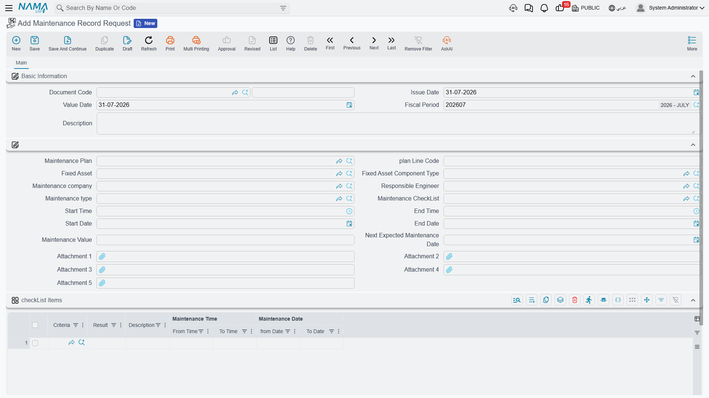
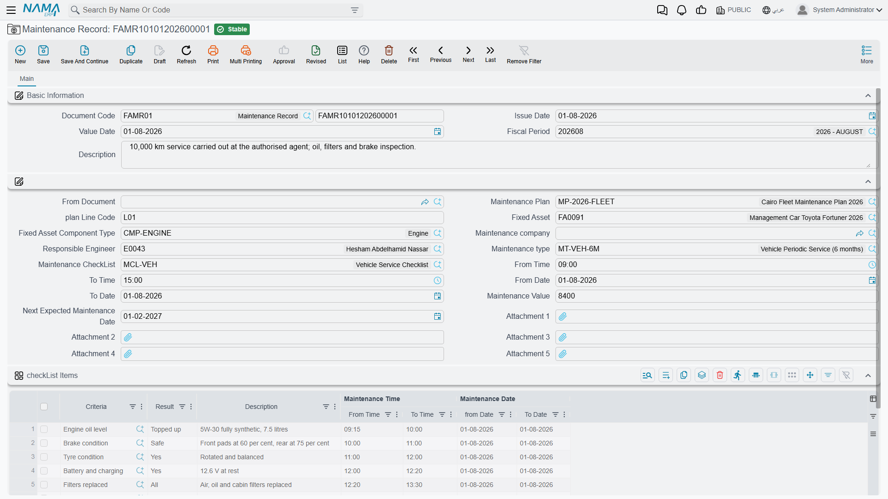
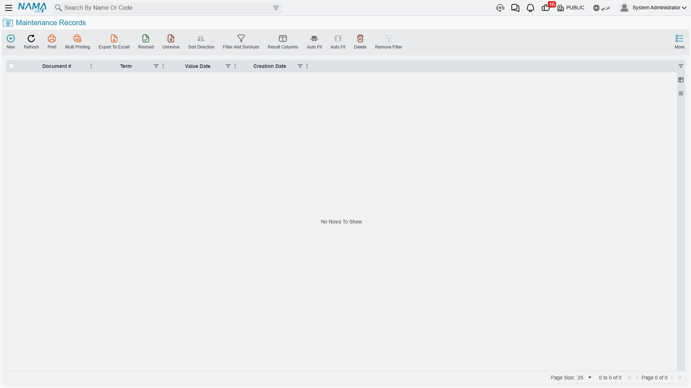

# Maintenance Records and Requests

Everything else in this area is preparation. The **Maintenance Record** is the thing itself: the
document a technician closes at the end of a visit, saying what was done, to which part of which
machine, by whom, between which hours, against which inspection sheet, at what cost, and when the
next visit is expected.

Ahead of it, optionally, sits the **Maintenance Record Request** — the ask, raised before the work
happens. The two screens are almost identical, which is deliberate: the request is a draft of the
record, and the record is normally created *from* it.

Both live under **Assets > Fixed Asset Maintenance** and need the `fixedassets-maintenance` licence.
Both are documents — they have a book, a code, an issue date, a value date and a fiscal period — but
neither carries a document term and neither produces an accounting entry.

## The request: recording the ask

**Assets > Fixed Asset Maintenance > Maintenance Record Request.**

A request is raised when the work has been identified but not yet done: the plant engineer sees the
April visit coming up on the plan, or an operator reports a noise. It captures the scope — the
asset, the component, the kind of maintenance, the proposed contractor and engineer, the window it
should happen in, an estimated value, and the checklist the job will be inspected against.

Committing a request **changes nothing at all**. It does not touch the plan, the asset, the
component line or the ledger, and no line anywhere is marked as satisfied when the work is
eventually done. Its value is that it exists as a record of the ask, that it can be circulated and
approved like any other document, and that everything on it can be poured into the record with one
field.

## The record: what was actually done

**Assets > Fixed Asset Maintenance > Maintenance Record.**

The top of the screen is the ordinary document block: **Document Code** (book and code), **Issue
Date**, **Value Date**, **Fiscal Period** and **Description**.

Below it, the fields that describe the job:

| Field | What it is for |
|---|---|
| **From Document** | Points at the maintenance record request this record fulfils. Choosing it copies the request across — see below. This field is on the record only; a request has nothing to be raised from. |
| **Maintenance Plan** | The plan the visit belongs to. |
| **plan Line Code** | Which line of that plan is being carried out. Use the suggestion list — it offers exactly the plan's outstanding lines. |
| **Fixed Asset** | The machine. |
| **Fixed Asset Component Type** | Which part of it. The picker offers only the components listed on that asset. |
| **Maintenance company** | The contractor who did the work. |
| **Responsible Engineer** | The employee who owns the job internally. |
| **Maintenance type** | The kind of maintenance. The picker offers only the types the component type allows. |
| **Maintenance CheckList** | The inspection sheet. Choosing it fills the grid below with its questions. |
| **From Date / To Date**, **From Time / To Time** | When the work ran. |
| **Maintenance Value** | What the visit cost. Recorded as history — see the section on cost below. |
| **Next Expected Maintenance Date** | When the next visit is due. Proposed from the maintenance type's interval; overwrite it freely. |
| **Attachment 1–5** | The contractor's report, photographs, the signed job sheet. |

Then the **checkList Items** grid — the inspection sheet, one line per question:

| Column | What it holds |
|---|---|
| **Criteria** (السؤال) | The question, brought in with the checklist. |
| **Result** (الإجابة) | What the technician found. A text box with the item's suggested answers offered as you type. |
| **Description** | Anything worth saying about that particular point. |
| **Maintenance Date — from / to**, **Maintenance Time — from / to** | Per-question timings, for jobs where individual tasks are worth timing separately. |

Finally the dimensions group, as on every document.

### Raising a record from a request

Fill in **From Document** with the request and the system copies over the responsible engineer, the
maintenance company, the value, the plan, the checklist, the asset, the plan line code, the
maintenance type, the start and end dates and times, the five attachments, and the whole checklist
grid — questions and any answers already on it.

What it does not copy is the date arithmetic. The next expected maintenance date on the request was
calculated from the *request's* value date; if the record carries a different value date, re-pick
the maintenance type — or type the date — so that what gets stamped onto the asset is measured from
the day the work actually happened.

## Actions on these screens

Neither the maintenance request nor the maintenance record carries a button of its own. The two
pieces of automation that make the record quick to fill are not buttons: choosing the **Fixed Asset**
narrows the component-type lookup to that asset's own components, and choosing the **Maintenance
CheckList** — or a plan line — copies its questions onto the record ready to be answered. Picking the
**Maintenance Type** also fills in the next expected maintenance date from the type's repeat interval.
Everything the record does to the asset and to the plan happens on commit.

## Two rules that decide whether a record will commit

Both are about components, and both are worth knowing before your first record rather than after.

**The component type must belong to the asset.** Every maintenance record is filed against a part of
the machine, so the Fixed Asset Component Type field has to be filled in and has to match one of the
lines in the asset's Asset Components grid. The screen does not mark the field as required, but a
commit without it is refused, and so is a commit against an asset that has no components at all. If
you are meeting the message *"Fixed asset component type does not belong to fixed asset"*, the fix
is on the asset, not on the record — go and define its
[components](/modules/fixedassets/master-files/fixedassets-components.md) first.

**The maintenance type must be allowed for that component type.** Each component type carries its
own list of permitted maintenance types; if that list is not empty, the record's maintenance type
has to be on it. An empty list means anything is allowed.

One further check applies to the record only: a plan line that has been **cancelled** will not
accept a record. Reinstate the line, or point the record at a different one.

## What committing a record does

Three things, none of them financial.

1. **The plan line closes.** Every line on the named plan whose code matches the record's plan line
   code becomes **Executed** and is stamped with this record.
2. **The asset's component line is updated.** The system finds the component line on the asset that
   matches the record's component type — and whose maintenance type either matches the record's or
   is blank — and writes onto it the maintenance start date, the maintenance end date, the next
   expected maintenance date, and a link back to this record. That is where the "when is this next
   due" answer lives, readable from the asset without opening a plan.
3. **Nothing else.** No journal entry, no business request, no change to the asset's cost,
   accumulated depreciation, book value, remaining life or depreciation instalment.

Un-commit the record and all of it is undone: the plan line goes back to **Planned** with its record
cleared, and the component line's three dates and record link are wiped. Edit a committed record and
point it at a different plan line and the old line is released back to Planned before the new one is
marked Executed.

## Maintenance cost is history, not value

The **Maintenance Value** field holds what the visit cost. It is saved, it is searchable, it prints,
and it is exactly the number you want when you compare this quarter's service bill with last
quarter's or one contractor with another.

It is not accounting. The maintenance record posts nothing to the general ledger, and the amount
does not touch the asset: cost stays where it was, accumulated depreciation stays where it was, and
next month's depreciation instalment is calculated as though the visit never happened. The contractor's
invoice reaches the ledger through the ordinary purchasing and payables route, as an expense, like
any other service you buy.

That is the right treatment for maintenance in the ordinary sense — an oil change does not make a
machine more valuable. When money spent on an asset genuinely *does* belong in its cost, because it
extends the machine's life or its capacity rather than restoring it, that is a different document:
the [addition and deduction document](/modules/fixedassets/depreciation/fixedassets-additions-and-deductions.md)
adds the amount to the asset's cost base and re-derives the instalment from it. Recording an upgrade
as a maintenance record files it as a story; recording it as an addition files it as money.

::: info Spare parts are not part of this document
There is no item, quantity or warehouse field on a maintenance record and no link to a stock
document. If parts were drawn from your own stores, issue them with the appropriate supply-chain
document; the two are not connected, so note the issue reference in the record's description if you
want to be able to find it later.
:::

## Al-Waha's first visit on `MCH-0007`

**25 March 2026 — the request.** The plant engineer raises a Maintenance Record Request against
`MCH-0007`, component type **Spindle**, maintenance type **Periodic Maintenance**, plan
`MP-CNC-2026`, plan line code `0120260401`, contractor Gulf Machinery Trading, responsible engineer
Khaled Al-Mutairi, estimated value **1,800**. Choosing the maintenance type proposes a next expected
date of 23 June — 90 days from the request's own date. Choosing the CNC Routine Inspection checklist
fills the grid with its four questions. Commit: nothing moves.

**1 April 2026 — the record.** Maintenance Record `FAMR-000031` is created with value date 1 April
and **From Document** set to the request. Everything copies across. The engineer re-picks the maintenance type
so that the next expected date is recalculated from 1 April, giving **30 June 2026** — the second
line of the plan. The technician's results go into the grid:

| Criteria | Result | Description |
|---|---|---|
| Is the spindle vibration within tolerance? | OK | |
| Coolant level and condition | Replaced | 20 litres, new filter fitted |
| Are the guards and way covers intact? | Yes | |
| Control-unit error log reviewed and cleared? | Yes | Two over-travel warnings from February |

Work ran from 09:00 to 13:30 on 1 April, and the confirmed cost is **1,800**.

**Commit.** Plan line `0120260401` becomes *Executed* and names this record. On the asset, the
Spindle component line now reads: maintenance start 1 April 2026, maintenance end 1 April 2026, next
expected 30 June 2026, with a link to the record. The Maintenance Record page on the asset shows the
visit in its list.

And the machine's numbers are untouched: cost 240,000, accumulated depreciation 10,800 after three
periods, instalment 3,600 for April as it was for March. The 1,800 is a fact about the machine's
service history, and nothing more.

