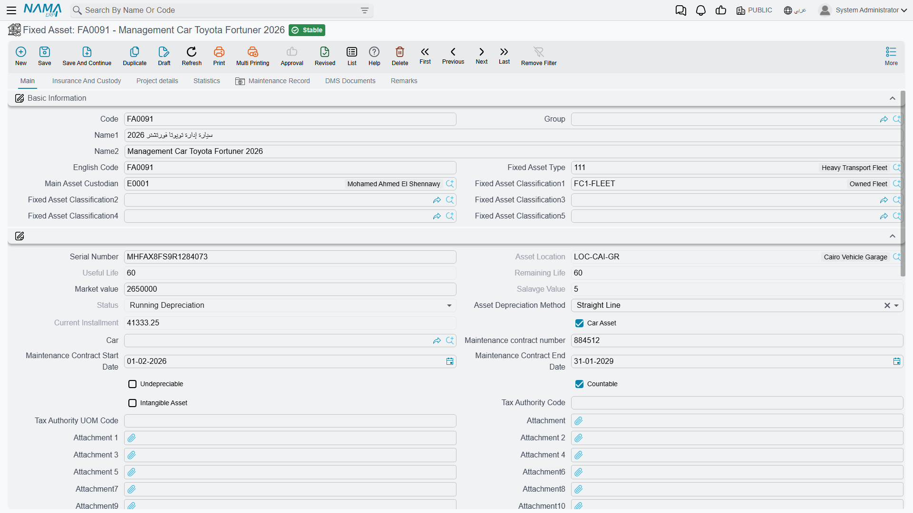
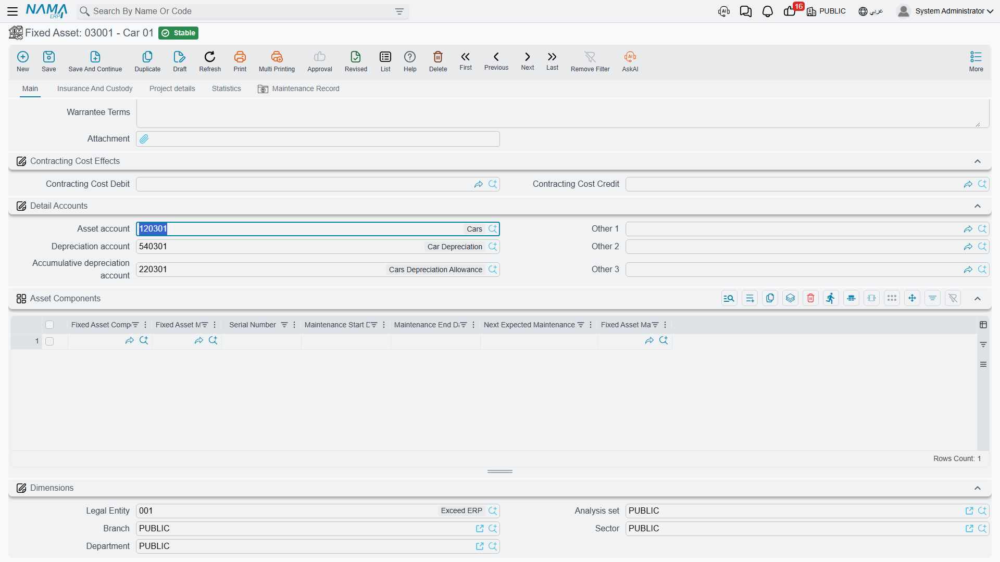
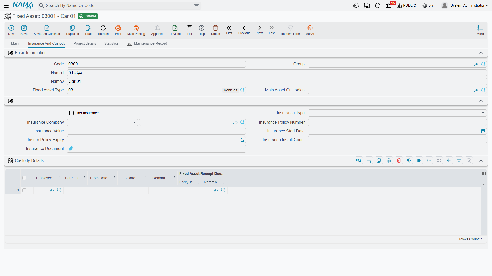
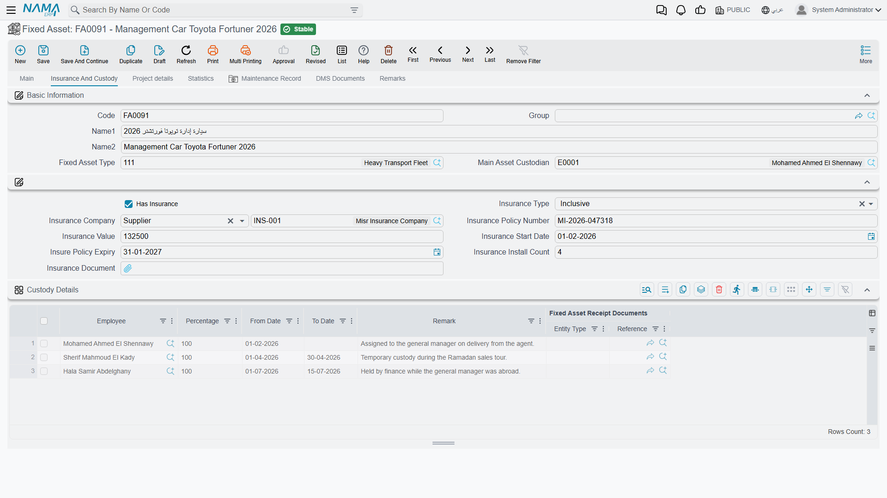
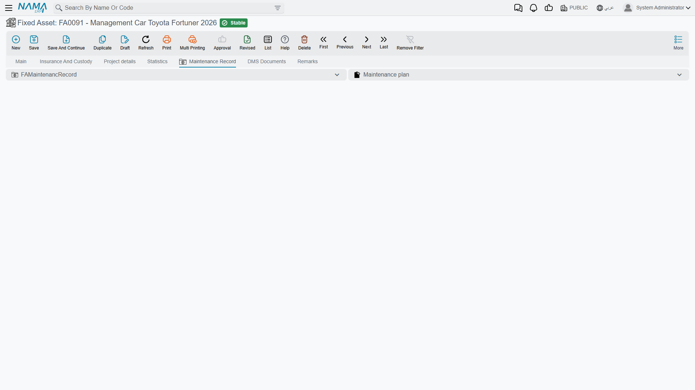

# The Fixed Asset Record

There is one rule that explains the whole of this screen, and reading it first will save you an hour of hunting for a field that does not exist:

> **The financial fields on a fixed asset are written by documents. You never type them.**

Cost, additions, deductions, accumulated depreciation, book value, remaining life, the current instalment, the disposal value, the purchase date, the location — none of them can be edited here. They are outputs. Behind the record sits a transaction history, one row per financial event, and every time a document touches the asset the whole history is replayed in date order and the figures on the screen are rebuilt from it. That is why they always reconcile, and why correcting a wrong number means finding the document that wrote it, not editing the asset.

What you *do* type is the asset's identity: its code and names, its type, its serial number, its classifications, who holds it, its insurance paperwork, and the accounts it posts against. Roughly speaking, the top half of the first page is yours and everything else is a report.

> The record we walk through is **`MCH-0007` — CNC Cutting Machine / ماكينة قص CNC**, bought by Al-Waha Industries on 1 January 2026 for **240,000**, with a **60-month** life and a **24,000** salvage value, standing in **Riyadh Plant, Hall 2**. We look at it as it stood at the end of December 2026, after twelve depreciation runs.

| | |
|---|---|
| Menu | **Assets → Master Files → Fixed Asset** (`الأصول > الملفات > أصل ثابت`) |
| Kind | Master file |
| Licence code | `fixedassets` |

The list carries the purchase date, the market value, the location and the status as columns, which makes it a usable working register on its own: filter by status to find everything still waiting for a purchase document, or by location to see what is standing in a hall.

The record itself has five pages. We take them in screen order.

## Page 1 — Main

### Basic Information

The identity block, and all of it is yours to fill.

| Field | Arabic label | Notes |
|---|---|---|
| Code | الكود | `MCH-0007`. Auto-coded when a document creates the asset, using the coding group on its type. |
| Group | المجموعة | The master group the asset is filed under. |
| Name1 / Name2 | الاسم العربي / الاسم الإنجليزي | Arabic name first, English name second. |
| English Code | الكود الإنجليزي | An alternative code. |
| Fixed Asset Type | نوع أصل | `FAT-MCH`. Choosing it fills the accounts, the behaviour flags and the components grid — see [Fixed Asset Types](/modules/fixedassets/master-files/fixedassets-asset-types.md). |
| Main Asset Custodian | مسؤل العهدة الأساسي | The employee responsible for the asset. Khaled Al-Mutairi holds `MCH-0007`. |
| Fixed Asset Classification 1…5 | تصنيف أصل ثابت 1..5 | Five reporting levels; picking a lower level fills the ones above it. See [Classifications](/modules/fixedassets/master-files/fixedassets-classifications.md). |

### The Block Underneath

The group below carries no heading on screen, and it mixes fields you type with figures you only read. This is the part of the record people most often try to edit, so the "typed?" column matters.

| Field | Arabic label | Typed? |
|---|---|---|
| Serial Number | الرقم المسلسل | Yes — although a purchase document will overwrite it with the serial number on its line. |
| Asset Location | موقع الاصل | **No.** Written by the documents that move the asset. See [Locations](/modules/fixedassets/master-files/fixedassets-locations.md). |
| Useful Life | العمر الإفتراضي | **No.** In months. `60` for `MCH-0007`. |
| Remaining Life | العمر المتبقي | **No.** In months, reduced by one after every depreciation run. `48` at the end of 2026. |
| Market value | القيمة السوقية | Yes — a free reference figure. Depreciation ignores it entirely. |
| Salvage Value | قيمة الأصل كخردة | **No.** `24,000`. |
| Status | الحالة | **No.** `Running Depreciation`. See [Asset Statuses](/modules/fixedassets/master-files/fixedassets-asset-status.md). |
| Asset Depreciation Method | طريقة إهلاك الأصل | Yes — straight line or revaluation, and only until the asset has its first transaction. |
| Current Installment | قسط الإهلاك | **No.** `3,600`, recomputed after every event. |
| Car Asset / Car | سيارة / السيارة | Yes. The Car field only becomes available once Car Asset is ticked. |
| Undepreciable | غير قابل للإهلاك | Yes. Land and similar assets. An undepreciable asset needs no depreciation accounts and is never collected by a depreciation run. |
| Countable | له عدد | Yes. Marks the record as a number of identical units rather than a single thing. |
| Tax Authority Code | كود مصلحة الضرائب | Yes — the item code the asset carries on an electronic invoice, used when the asset is sold. |
| Attachments | مرفق، مرفق 1..10 | Yes — the invoice, the certificate, the photographs. |

There is also a unit-of-measure code for the tax authority beside the tax authority code, used for the same electronic-invoice purpose.

Two buttons sit under this block. **Generate Car** (إنشاء سيارة) creates a vehicle record carrying the asset's code, names and custodian, and links the two together — useful when a van in the asset register also has to exist in the fleet. It only does anything when **Car Asset** is ticked and no car is linked yet; untick the flag and pressing it simply clears the link.

When the Real Estate module is installed, **Create Real Estate** (تحويل لعقار) turns the asset into a property. It asks two questions — the estate type (building, land, floor, block or rental unit, with rental unit offered by default) and the master group the new record should sit in — and then opens the new estate in a popup, pre-filled with the asset's code, names and market value and pointing back at the asset. The asset has to be saved before you press it; the estate itself is not created until you save what the popup opens. The bulk form of the same conversion is **Create Real Estates** (تحويل لعقارات) on the list screen: select the assets, answer the same two questions, and the records are created for you.

### Purchase Price Information

| Field | Arabic label | Where it comes from |
|---|---|---|
| Purchase Invoice | فاتورة مشتريات | **Read-only.** The Fixed Asset Purchase Document that brought the asset into service — the fastest way to get from an asset to the paperwork that created it. |
| Purchase date | تاريخ الشراء | **Read-only.** The value date of that document. |
| Supplier | مورد | Typed, but also pushed here by the purchase or opening document. |
| Tax Plan | سياسة الضريبة | Typed, when the sales-tax feature is on. |

For `MCH-0007` this group reads: purchase invoice `FAPD-0031`, purchase date 1 January 2026, supplier Gulf Machinery Trading.

### Detail Accounts

The three accounts every posting in the module reaches for:

| Slot | Arabic label | Used for |
|---|---|---|
| Asset account | حساب الأصل | Cost. Debited on acquisition and on an addition, credited on disposal. |
| Depreciation account | حساب الإهلاك | The depreciation **expense**, debited by each run. |
| Accumulative depreciation account | حساب الإهلاك التراكمي | The contra account, credited by each run and cleared on disposal. |

They arrive from the asset type, and you may override any of them on this asset — an account you enter here is kept and is never replaced by the type's. What you cannot do is empty one: blank it, save, and the type's account is copied back into the empty slot on the very next save. To remove an account for good, take it off the Fixed Asset Type or move the asset to a different type.

Three further slots labelled Other 1, Other 2 and Other 3 sit alongside. Fixed Assets does not use them by itself; they are spare slots a document term can be pointed at.

A depreciable asset will not save until the first three are filled. An undepreciable asset needs none of them.

### Asset Components

The maintainable parts of the machine — spindle, control unit, coolant pump — each with its own serial number and its own maintenance dates. The lines arrive from the asset type and you can add to them. They carry no cost and no depreciation of their own; they exist so that maintenance can be recorded against a *part* rather than against the whole machine. See [Components and Component Types](/modules/fixedassets/master-files/fixedassets-components.md).

### Dimensions

The five dimensions — Legal Entity (الشركة), Analysis set (المجموعة التحليلية), Branch (الفرع), Sector (القطاع), Department (الإدارة). They say which company and which part of the business owns the asset, and whether a ledger line takes its dimension from the asset or from the document is a module setting. A transfer document rewrites them.

When the Contracting module is installed, a **Contracting Cost Effects** group appears with a debit and a credit side, read by the depreciation document when its term is set to take the contracting cost sides from the asset.

## Page 2 — Insurance and Custody

The top of the page repeats the asset's identity, then comes the insurance file: whether the asset is insured, the insurance type and company, the policy number, the insured value, the start date, the policy expiry, the number of instalments and the policy document itself. All of it is typed. If the asset is linked to a car record, the insurance details are copied from the car when you pick it — and the asset pushes them back onto the car when you save.

Below that sits the **Custody Details** grid (تفاصيل العهد) — and this one is a history, not a data-entry grid.

| Column | Arabic label | Meaning |
|---|---|---|
| Employee | الموظف | Who held the asset. |
| Percentage | نسبة | The share of the asset that employee holds. |
| From Date / To Date | من تاريخ / إلى تاريخ | The period they held it. An open line has no end date. |
| Remark | ملحوظة | Free text. |
| Fixed Asset Receipt Documents | مستندات استلام الأصول | The document that opened the line. |

Two documents write here. The **Delivery/Receipt of Custodies** document closes the outgoing holder's line the day before its value date and opens a new one for the incoming holder; whether the Main Asset Custodian on page 1 changes too depends on the term and on whether the current custodian is the person handing over. The **Fixed Asset Receipt** document adds a line per receipt line with its percentage. Cancelling either document removes the line it added. See [Receipts](/modules/fixedassets/acquisition/fixedassets-receipts.md) and [The Delivery and Receipt Document](/modules/fixedassets/acquisition/fixedassets-delivery-receipt.md).

## Page 3 — Project Details

This page matters to contracting companies and to nobody else. It names the contracting **Project** the asset came out of, and carries a grid of the project's contract terms — the term code, the standard term, its description and the warranty start and end dates that the project contract promised.

The grid is filled for you. It is written when a [Fixed Asset Creation Document](/modules/fixedassets/master-files/fixedassets-creation-document.md) turns a finished project into an asset, and it can be refreshed at any time with the **Update Project Terms** (تحديث بنود المشروع) button on this page, which re-reads every contract on the asset's project and re-collects the terms flagged to be transferred to the asset. Pressing it replaces whatever the grid held.

## Page 4 — Statistics

This is the financial report on the asset, and **every field on it is read-only**. Here is `MCH-0007` at the end of December 2026:

| Field | Arabic label | Value | What it is |
|---|---|---|---|
| Opening Document | سند الإقتتاح | — | The opening document, for assets brought in from a previous system. |
| Openning Cost | قيمة الإقتناء | 240,000 | The acquisition cost, from the purchase or opening document. |
| Acquire opening value | قيمة الأقتناء الأفتتاحية | — | The cost stated on an opening document. |
| Acc. Depreciation opening value | قيمة الأهلاك التراكمي الأفتتاحية | — | The depreciation already taken before the asset entered Nama. |
| Additions | الإضافات | 0 | Everything capitalised onto the asset since. |
| Deductions | الإستقطاعات | 0 | Everything written off its value. |
| Year Depreciation | إهلاك السنة الحالية | 43,200 | Depreciation charged inside the current fiscal year. |
| Total Depreciation | مجمع الإهلاك | 43,200 | Accumulated depreciation. A revaluation resets this to zero. |
| Total Cost | إجمالي قيمة الأصل | 240,000 | Acquisition cost plus additions minus deductions. |
| Current System Value | القيمة الدفترية الحالية | 196,800 | The book value — total cost minus accumulated depreciation. |
| Fixed Asset System Value Before Disposal | قيمة الأصل الدفترية قبل التخلص | — | Filled at disposal; the book value at the moment the asset left. |
| Useful Life | العمر الإفتراضي | 60 | In months. |
| Depreciation Start Date | تاريخ بداية الاهلاك | 01/01/2026 | The first period the asset may be depreciated in. |
| Remaining Life | العمر المتبقي | 48 | In months. |
| Current Installment | قسط الإهلاك | 3,600 | (196,800 − 24,000) ÷ 48 = 3,600. |
| Market value | القيمة السوقية | — | Free reference figure. |
| Last Depreciation Date | تاريخ اخر إهلاك | 31/12/2026 | Stops the same period being charged twice. |
| Disposal Value | قيمة التخلص من الأصل | — | Filled by a disposal document. |
| Disposal Date | تاريخ التخلص من الأصل | — | Likewise. |

For a **countable** asset the page also carries a block of unit counters — how many units have been added to the record, how many have been disposed of, how many are currently out on loan, and how many remain. They are maintained by the movement and partial-disposal documents. The counters never enter the depreciation arithmetic; the only place a count affects money is a [partial disposal](/modules/fixedassets/disposal/fixedassets-partial-disposal.md), which removes cost and accumulated depreciation pro-rata.

### Where to Look for History

Three lists at the bottom of the Statistics page are the most useful part of the whole record.

**Asset Transactions** (حركات الأصل) is the asset's financial ledger — one row per event, in date order, showing the value date, the addition, the deduction, the depreciated value, the running accumulated depreciation, the resulting asset value, the remaining life, the salvage value and, crucially, **the document that caused it**. When a figure on this page looks wrong, this is where you find out why. For `MCH-0007` it holds thirteen rows at the end of 2026: the purchase, and twelve depreciation runs of 3,600.

**Fixed Asset Locations** (مواقع الأصل الثابت) is the movement history — from where, to where, on what date, by which document.

**Custodies Delivery Receipt Documents** (سندات استلام وتسليم عهد) lists the handovers recorded against the asset.

## Page 5 — Maintenance Record

Two lists: the **maintenance records** carried out on this asset, and the **maintenance plans** that schedule them. Nothing is entered here — the page answers "when was this machine last serviced, and when is it next due". The dates that end up stamped on the components grid come from these records. See [Maintenance](/modules/fixedassets/maintenance/fixedassets-maintenance-overview.md).

## What the Screen Refuses to Save

Four checks run when you commit an asset, and they are worth knowing because the messages are terse.

1. **A depreciable asset needs its three accounts.** No asset account, depreciation account or accumulative depreciation account, no save. Tick Undepreciable and the requirement disappears.
2. **A component may not be repeated.** The same combination of component type and maintenance type cannot appear twice in the components grid — *"Fixed asset component type … is repeated"*.
3. **The classification chain must hold together.** If you fill both a classification and the level above it, the upper one must genuinely be the parent of the lower one.
4. **The depreciation method is locked once the asset has moved.** As soon as a single transaction exists against the asset, the method can no longer be changed — *"Cannot change depreciation method … because it used in fixed asset transactions entries by document …"*. Deciding between straight line and revaluation is therefore a decision to take before the asset is put into service.

Beyond commit time, the module also protects the asset's history: a document cannot be deleted or re-dated in a way that would jump it over a later transaction on the same asset. If a correction is refused with a message naming another document, that other document is the one standing in the way.

## Reading an Asset in Practice

Put together, an experienced user reads `MCH-0007` in three glances:

1. **Page 1** — what is it, whose is it, where does it post to.
2. **Page 4** — what is it worth now, and how much life is left.
3. **The Asset Transactions list** — how it got that way, and which document to open next.

Everything else on the module's menu is a way of writing rows into that third list.
