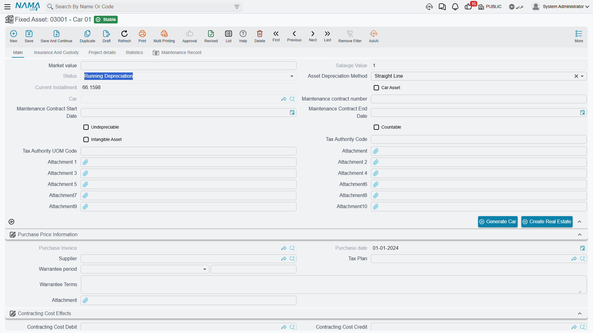

# Asset Statuses

The Status field on a fixed asset is one word, it cannot be typed, and it decides more about what you are allowed to do than any other field on the record. Half the "the system will not let me" questions in this module are answered by looking at it.

There are five values.

| Status | Arabic | What it means |
|---|---|---|
| Initial | إبتدائى | Registered, but not yet in service. The record exists; it has no cost, no life and no instalment. |
| Running Depreciation | جارى الإهلاك | Live. It has a cost and remaining life, and every depreciation run will pick it up. |
| Depreciated | مهلك | Fully written down — either the remaining life reached zero or the book value reached the salvage value. |
| Not Depreciable | غير قابل للإهلاك | Marked as never depreciating. Land is the standard case. |
| Disposed | تم التخلص منه | Retired. Nothing in the module will touch it again. |

## How an Asset Moves Between Them

`MCH-0007` passes through four of the five in its lifetime, and the transitions are all driven by documents.

**Born initial.** Whether you create the asset by hand or a document creates it for you, it starts as **Initial**. At this point it is a shell: identity, type, accounts and classifications, but no money. An initial asset is deliberately inert — it is waiting for the document that will give it a cost.

**Put into service.** A **Fixed Asset Purchase Document** (240,000, 60 months, salvage 24,000, depreciation starting 1 January 2026) or a **Fixed Asset Opening Document** fills in the cost, the life and the depreciation start date, and the asset becomes **Running Depreciation** — unless it is flagged undepreciable, in which case it becomes **Not Depreciable** instead and stays there.

**Depreciating.** Each run reduces the remaining life by one and adds to accumulated depreciation. The status stays Running while there is still life left and still value above the salvage figure.

**Written down.** When the remaining life reaches zero, or the book value falls to the salvage value, the asset becomes **Depreciated** and the instalment becomes zero. `MCH-0007` would reach this after sixty runs, at a book value of 24,000.

**Retired.** A **Disposal Document** — the sale on 31 December 2027 for 200,000 — makes the asset **Disposed**, and that is the end of the line.

Two of these moves run backwards as well:

- **Cancelling the document that put the asset into service returns it to Initial.** Un-committing the purchase or opening document empties the asset again.
- **A depreciated asset can come back to life.** Capitalise an upgrade with an addition, or extend the remaining life with a properties document, and the asset has value and life again — so its status returns to **Running Depreciation** and the next depreciation run collects it.

## What Each Status Blocks

This is the part worth keeping. Read it as "you cannot do X while the asset is Y".

| You want to… | Initial | Running | Depreciated | Not Depreciable | Disposed |
|---|---|---|---|---|---|
| Run depreciation on it | ✗ *"Cannot Depreciation because the status is Initial"* | ✔ | ✗ *"The Asset … is already depreaciated"* | ✗ — undepreciable assets are never depreciated | ✗ |
| Have it collected automatically into a depreciation document | ✗ skipped | ✔ | ✗ skipped | ✗ skipped | ✗ skipped |
| Have it collected into a revaluation document | ✗ skipped | ✔ | ✔ | — | ✗ skipped |
| Record an addition or a deduction | ✗ | ✔ | ✔ | ✔ | ✗ |
| Record a partial disposal | ✗ | ✔ | ✔ | ✔ | ✗ |
| Dispose of it | ✗ — there is nothing to dispose of | ✔ | ✔ | ✔ | ✗ |
| Pick it on an opening document | ✔ | ✔ | ✔ | ✔ | ✗ excluded from the picker |
| Count it on a stocktaking sheet | ✔ | ✔ | ✔ | ✔ | ✗ excluded |

Three of those rows deserve a sentence of their own.

**Nothing acts on a disposed asset.** This is not a rule per document; it is a single check that every Fixed Assets document runs before it touches an asset — *"Cannot make action on asset … because it is disposed"*. If an asset was disposed of by mistake, the way back is to reverse the disposal document, not to work around it.

**An initial asset accepts almost nothing.** Additions, deductions, partial disposals and depreciation all refuse it, because there is no value to add to, deduct from or write down. The only documents that will accept an initial asset are the ones designed to bring it into service: the purchase document, the opening document and the letter-of-credit cost document.

**The depreciation method is a gate too.** Even a perfectly healthy Running asset will be refused by the depreciation document if its method is revaluation — those assets are handled by the [revaluation document](/modules/fixedassets/depreciation/fixedassets-revaluation.md) instead, which is a different way of arriving at the same result.

## Using Status as a Working Filter

Status is an indexed column on the register, so it is the fastest way to answer the questions that come up at period end.

- **Filter for Initial** to find assets someone created but never brought into service — records that will silently sit out every depreciation run until a purchase or opening document is raised for them.
- **Filter for Running Depreciation** to see the population a depreciation run should collect. If the count does not match the lines in the document, the difference is usually assets whose depreciation start date is later than the period, or assets held back by a [prevent-depreciation record](/modules/fixedassets/depreciation/fixedassets-prevent-depreciation.md).
- **Filter for Depreciated** for assets still standing in the plant with no book value left — the natural candidates for a disposal or a life extension.
- **Filter for Disposed** to reconcile what left the register in a period against what the ledger shows.

For what the module does with each of those documents, start at [The Fixed Asset Record](/modules/fixedassets/master-files/fixedassets-asset-master.md) and follow the links from there.
