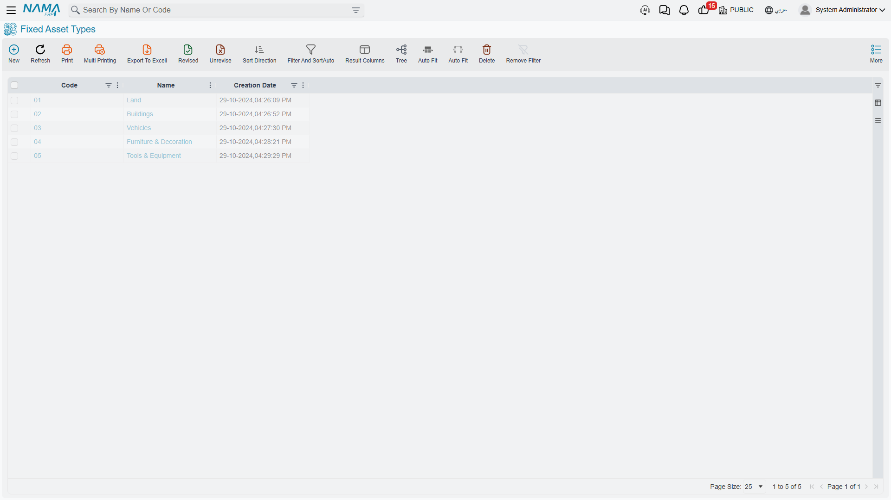

# Fixed Asset Types

Al-Waha Industries owns forty machines. Every one of them has to be posted to the same cost account, depreciated into the same expense account, and accumulated against the same contra account. Every one of them is expected to last five years and to be worth a tenth of its price at the end. Typing that set of decisions forty times is how registers go wrong.

The **Fixed Asset Type** (نوع أصل) exists so that you decide it once. It is the accounting template for a family of assets — machinery, vehicles, buildings, computers — and it is the first master file a finance manager sets up, before anybody creates a single asset.

> Throughout this page we build **`FAT-MCH` — Machinery & Equipment / آلات ومعدات**, the type that the CNC cutting machine `MCH-0007` belongs to.

| | |
|---|---|
| Menu | **Assets → Master Files → Fixed Asset Type** (`الأصول > الملفات > نوع أصل`) |
| Kind | Master file |
| Licence code | `fixedassets` |

## What a Type Actually Decides

The type screen is a single page, and it holds four different kinds of decision. It is worth separating them, because they reach the asset by different routes and at different moments.

### The Accounts

The **Default Accounts** group (الحسابات الافتراضية) is the reason the type exists. It holds the same account slots that the asset itself carries, and the module uses exactly three of them:

| Slot | Arabic label | What the module does with it |
|---|---|---|
| Asset account | حساب الأصل | The cost account. Debited when the asset is acquired, credited when it is disposed of. |
| Depreciation account | حساب الإهلاك | The depreciation **expense** account, debited by every depreciation run. |
| Accumulative depreciation account | حساب الإهلاك التراكمي | The contra account, credited by every depreciation run and cleared on disposal. |

For `FAT-MCH` those are `12310 Machinery`, `51100 Depreciation expense — machinery` and `12319 Accumulated depreciation — machinery`.

Three further slots (Other 1, Other 2, Other 3 — أخرى 1/2/3) sit alongside them. Nothing in Fixed Assets reaches for them by itself; they are spare slots that a document term can be pointed at if an installation needs a fourth or fifth account on the asset. Treat them as reserve, not as part of the standard setup.

Every account you pick here has to be a **subsidiary account whose subsidiary type accepts fixed assets** — the searcher enforces it, so if an account you expect does not appear in the list, that is the reason.

::: info Why the accounts live on the asset and not on the term
In most Nama modules the document term decides both sides of an entry. Fixed Assets is different: the asset side is always read from the asset record itself, which inherited it from this type. The term supplies the *other* side — the supplier, the cash, the gain and loss accounts. That is why an asset type with no accounts produces assets that cannot be saved.
:::

### The Depreciation Defaults

Two fields carry the family's normal expectations:

| Field | Arabic label | Meaning |
|---|---|---|
| Default useful life | العمر الافتراضي | The service life, **counted in months** — not years. For `FAT-MCH` it is `60`. |
| Salvage Value | قيمة الأصل كخردة | What the asset is expected to be worth when its life is over. For `FAT-MCH`, `24,000`. |

These two are *defaults for documents*, not values written onto the asset. Choosing `FAT-MCH` on a **Fixed Asset Purchase Document** line fills both the useful life and the salvage value on that line. Choosing it on a **Fixed Asset Opening** line fills the useful life; the salvage value on an opening line is typed by hand. Either way it is the document line that ends up carrying the numbers, and the document that writes them onto the asset — see [The Purchase Document](/modules/fixedassets/acquisition/fixedassets-purchase-document.md) and [Opening Balances](/modules/fixedassets/acquisition/fixedassets-opening-balances.md).

Creating an asset by hand from the register does **not** give it a useful life from its type. A hand-made asset stays in its initial state with no life and no instalment until a purchase or opening document gives it both.

### The Behaviour Flags

Four switches describe how the family behaves, and all four are copied onto the asset when you choose the type:

| Flag | Arabic label | Effect on the asset |
|---|---|---|
| Countable | له عدد | The asset represents a number of identical units, so the count register and partial disposal apply to it. Ten identical desks held as one record is the classic case. |
| Undepreciable | غير قابل للإهلاك | The family is never depreciated — land is the usual example. Such assets do not need depreciation accounts and are never collected by a depreciation run. |
| Car Asset | سيارة | Members of the family are vehicles, which unlocks the link to the car record. |
| Has Insurance | له تأمين | Members of the family are normally insured, so the insurance page on the asset is expected to be filled. |

### The Numbering

**Asset Creation Coding Group From Fixed Assets Purchase And Opening** (مجموعة التكويد عند الإنشاء من الفواتير و افتتاح الأصول) is the master group that new assets of this family are filed under when a document creates them automatically, and it is what gives them their code. It has to be a leaf group defined for fixed assets. Set it once and every machine bought on a purchase document comes out with a code in the machinery series.

### The Component Types

The **Components Types** grid (أنواع المكونات) lists the maintainable parts a member of this family normally has. For `FAT-MCH` that is the spindle, the control unit and the coolant pump.

The grid is a template in the fullest sense: pick `FAT-MCH` on a new asset and those three lines appear on the asset's own components grid, ready to be given serial numbers. See [Components and Component Types](/modules/fixedassets/master-files/fixedassets-components.md).

## What Happens the Moment You Choose a Type

Everything above arrives at once. Open a new fixed asset, pick `FAT-MCH`, and before you have typed anything else the screen fills with:

1. the three accounts (and any of the spare slots the type holds);
2. the Countable, Undepreciable, Car Asset and Has Insurance flags;
3. the components grid, one line per component type on the type;
4. the contracting cost sides, if the Contracting module is installed.

The same copy happens on the server whenever a document creates an asset for you, so an asset born on a purchase document is set up identically to one you made by hand.

## Overriding the Type on a Single Asset

The common question is whether an individual asset may depart from its family. It may — with one wrinkle worth knowing before you try.

**You can override any account on the individual asset.** Put a different accumulated-depreciation account on `MCH-0007` and it stays there. The type's value is copied into the asset's account slots on every save, but only into the slots that are **empty** — a value you entered is never replaced.

**You cannot clear an account back to empty.** Blank an account on the asset, save, and the type's value comes straight back in, because the same blanks-only copy runs again on the very next save. If an account genuinely must not be there, remove it from the Fixed Asset Type or point the asset at a different type.

The same rule read from the other side answers the second-most-common question: **changing the accounts on a type does not reach the assets that already exist.** Their slots are already filled, so the copy passes over them. A new account on `FAT-MCH` will show up only on assets created afterwards, and on any asset whose matching slot is still blank. Correcting a whole family after the fact is an editing job on the assets, not a one-line fix on the type.

::: warning A depreciable asset cannot be saved without its three accounts
The asset account, the depreciation account and the accumulative depreciation account are all required before a depreciable asset will commit. In practice that means the type must supply them — otherwise whoever creates the asset has to type all three every time.
:::

## What the Type Does Not Decide

**The depreciation method.** There is no method field on the type. Every asset is born on the straight-line method and is switched to revaluation, if it needs to be, on the asset record itself — and only before the asset has any transactions. See [How Depreciation Works](/modules/fixedassets/depreciation/fixedassets-depreciation-concepts.md).

**Classifications.** The five classification levels each carry a type, but they exist for grouping and reporting; they supply no accounts and no defaults of their own. See [Classifications](/modules/fixedassets/master-files/fixedassets-classifications.md).

**Anything financial.** The type never books, never holds a balance, and is never touched by a document. It is read at the moment an asset is created or saved, and that is all.

## Actions on This Screen

The fixed asset type has no buttons of its own. Everything it does, it does by being *chosen*: the
moment an asset picks a type, the type's accounts, depreciation defaults and numbering are copied
down. There is no button that pushes a changed type back onto assets already created from it, which
is why the section on overriding the type on a single asset matters as much as it does.

## Setting Up FAT-MCH, Start to Finish

1. **Assets → Master Files → Fixed Asset Type**, new record. Code `FAT-MCH`, Arabic name `آلات ومعدات`, English name `Machinery & Equipment`.
2. Default useful life `60` — remember this is sixty **months**.
3. Salvage Value `24,000`.
4. Countable off (each machine is a single unit), Undepreciable off, Car Asset off, Has Insurance on.
5. Asset Creation Coding Group: the `MCH` group, so machines created by documents come out as `MCH-0007`, `MCH-0008` and so on.
6. Default Accounts: `12310 Machinery`, `51100 Depreciation expense — machinery`, `12319 Accumulated depreciation — machinery`.
7. Components Types: `Spindle`, `Control Unit`, `Coolant Pump`.
8. Save.

From here on, any machine bought at Al-Waha is created by choosing `FAT-MCH` and nothing else: the accounts, the flags, the code series and the component list all follow. The next page walks the asset record those settings land on — [The Fixed Asset Record](/modules/fixedassets/master-files/fixedassets-asset-master.md).
