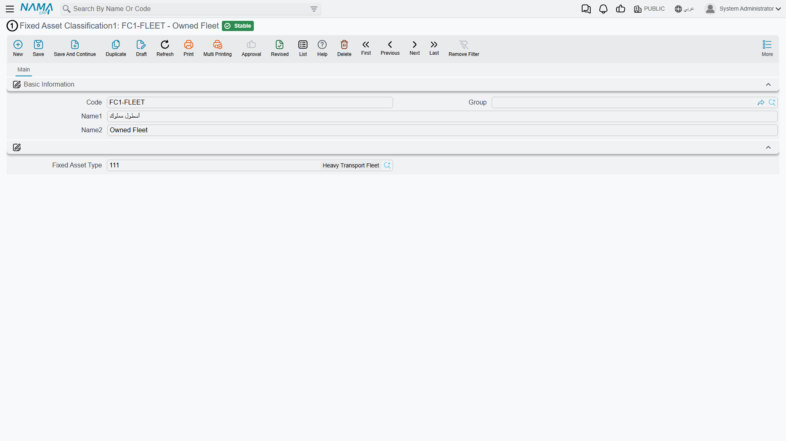
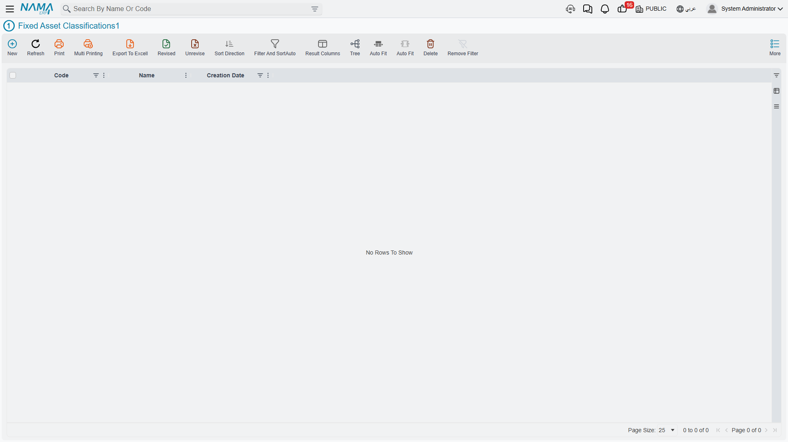

# Classifications

Al-Waha Industries has three hundred assets and one asset type for all of its machinery. That is fine for the accounting — every machine posts to the same three accounts — but it is useless the moment the plant manager asks what the company has invested in cutting equipment specifically, or the insurer asks for a schedule of production equipment by sub-family.

The five **Fixed Asset Classification** levels exist for exactly that. They are five independent master files that chain into each other, giving you a five-level tree to slice the register with.

| | |
|---|---|
| Menu | **Assets → Master Files → Fixed Asset Classification 1…5** (`الأصول > الملفات > تصنيف أصل ثابت 1..5`) |
| Kind | Five master files |
| Licence code | `fixedassets` |

## Be Clear About What They Are For

Before setting them up it is worth stating plainly what they do *not* do, because the name suggests more than the system delivers:

- They **do not resolve accounts.** No posting anywhere in the module looks at a classification. The accounts always come from the asset, which inherited them from its [type](/modules/fixedassets/master-files/fixedassets-asset-types.md).
- They **supply no defaults.** Choosing a classification never fills a useful life, a salvage value, a depreciation method or anything else on the asset.
- They **change no behaviour.** No document, no validation and no calculation behaves differently because of them.

What they are is a set of indexed labels on the asset record: something to group by, filter on, print in a report, and use as a range when collecting assets into a document. That is a genuinely useful thing to have, and it is all they are.

## The Chain

Each level is its own master file, and each level from 2 downwards points at its parent.

| Field | Arabic label | Present on |
|---|---|---|
| Code | الكود | all five |
| Group | المجموعة | all five |
| Name1 / Name2 | الاسم العربي / الاسم الإنجليزي | all five |
| Fixed Asset Type | نوع أصل | all five |
| Fixed Asset Classification 1…4 | تصنيف أصل ثابت 1..4 | the higher levels, on the levels below them |
| Fixed Classification Parent | تصنيف الأعلى | levels 2 to 5 |

So a level-3 record names its type, its level-1 classification and its immediate parent; a level-5 record names levels 1 to 3 plus its parent at level 4. The screens carry no dimensions group — these are pure lookup records.

Al-Waha's tree for the CNC machine reads:

| Level | Code | Name |
|---|---|---|
| 1 | `C1-PROD` | Production Equipment / معدات إنتاج |
| 2 | `C2-CUT` | Cutting Machines / ماكينات قص |
| 3 | `C3-CNC` | CNC / تحكم رقمي |

## How They Land on an Asset

On the asset's main page the five classification fields sit under Basic Information, and they fill each other in. Pick `C3-CNC` at level 3 and levels 2 and 1 are filled from the record's own parentage, along with the asset type — you never have to walk the tree downwards by hand.

Two rules apply when you save the asset:

- **The chain must be consistent.** If both a classification and the level above it are filled, the upper one has to be the lower one's actual parent. Setting level 3 to `C3-CNC` and level 2 to something that is not its parent is refused.
- **Levels may be left empty.** Filling level 3 without level 1 is allowed. The tree is a convenience, not a mandate — a company that only ever wants one level of grouping can use level 1 and ignore the rest.

When a document creates an asset for you, the classifications on the document line are copied onto the new asset, so a purchase document raised for ten identical machines produces ten identically classified records.

## Where They Earn Their Keep

**As report and list criteria.** All five levels are indexed reference columns on the fixed asset, so they are available as criteria and as columns everywhere the register is listed or reported. "Show me every asset with classification 1 = Production Equipment, grouped by classification 2" is the shape of question they exist to answer, and it is how the [module's reports](/modules/fixedassets/reports/fixedassets-reports.md) are normally narrowed down.

**As collection ranges on documents.** When a depreciation or revaluation document collects the assets it is going to work on, it accepts a from-code and to-code range on each of the five levels alongside the other filters. Al-Waha can run one depreciation document for `C1-PROD` and another for the office furniture, keeping two reviewers on two clean sets of lines instead of one document with three hundred rows. See [Running Depreciation](/modules/fixedassets/depreciation/fixedassets-depreciation-document.md).

**As the grouping in an asset schedule.** Because the classification is on the asset and not on the transaction, an asset register printed by classification stays stable over time — moving a machine between departments changes its dimensions, not its classification.

## Actions on These Screens

None of the five classification screens carries a button of its own. They are code-and-name lists:
type the record, save it, and it becomes available on the asset's classification fields and in report
filters.

## A Practical Way to Set Them Up

Decide the levels top-down before you create any record, and keep them shallow:

1. **Level 1 — the family a manager thinks in.** Production Equipment, Vehicles, Buildings, Office Equipment. Five to ten records.
2. **Level 2 — the sub-family that gets asked about.** Cutting Machines, Presses, Forklifts.
3. **Level 3 and below — only if a real question needs them.** Most installations stop at two levels, and there is nothing wrong with that.

Because classifications feed nothing but selection, adding a level later costs only the work of classifying the existing records; nothing recalculates and nothing needs reposting. That makes them the safest part of the setup to start small on — the opposite of the [asset types](/modules/fixedassets/master-files/fixedassets-asset-types.md), where the accounts you pick on day one are the accounts every posting will use.
