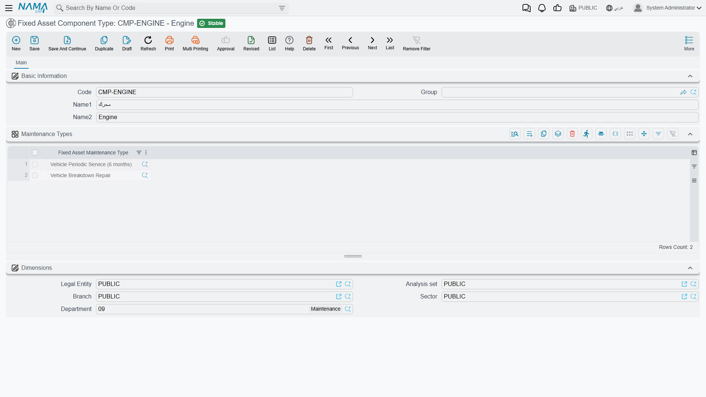
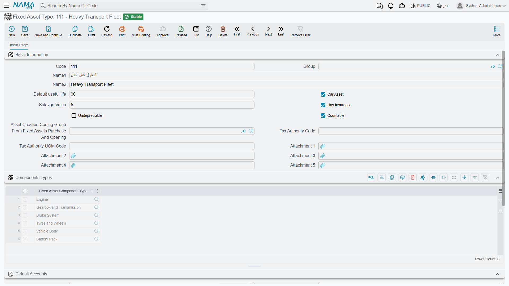
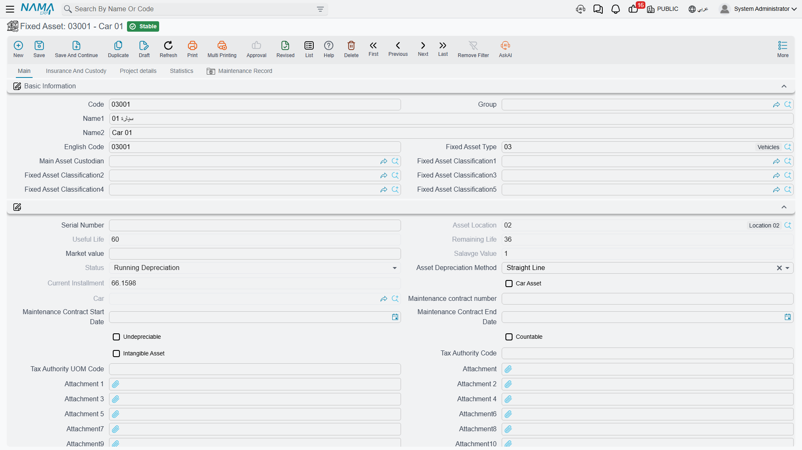

# Components and Component Types

The CNC machine `MCH-0007` is one asset, one cost, one depreciation schedule. But it is not one *thing* to the maintenance engineer: the spindle is serviced every quarter, the control unit is inspected annually, and the coolant pump is replaced when it fails. Recording all of that against "the machine" loses the only information the engineer cares about — which part was serviced, and when the next visit for that part is due.

**Components** are how the module keeps that detail. Each asset carries a grid of its maintainable parts, and each part can have its own serial number, its own maintenance history and its own next-due date.

::: info Components carry no money
A component is not a smaller asset. It has no cost, no value and no depreciation of its own — there is not even an amount field on the line. The machine's 240,000 belongs to the machine. Components exist so that maintenance can be recorded against a part, and for nothing else. If a component is genuinely replaced with something worth capitalising, that is an [addition](/modules/fixedassets/depreciation/fixedassets-additions-and-deductions.md) on the asset, not a change to this grid.
:::

## The Component Type Catalogue

A **Fixed Asset Component Type** (نوع مكون أصل) is the reusable definition of a kind of part — Spindle, Control Unit, Coolant Pump, Engine, Compressor, Lift Motor.

| | |
|---|---|
| Menu | **Assets → Master Files → Fixed Asset Component Type** (`الأصول > الملفات > نوع مكون أصل`) |
| Kind | Master file |
| Licence code | `fixedassets` |

The screen holds the code, the master group and the two names, plus one grid that does the real work: **Maintenance Types** (أنواع الصيانة). Each line names one [maintenance type](/modules/fixedassets/maintenance/fixedassets-maintenance-types.md) that this kind of part can undergo.

For Al-Waha's `CT-SPINDLE — Spindle / عمود الدوران` that list holds **Periodic Maintenance / صيانة دورية** and **Emergency Repair / إصلاح طارئ**. The effect is a shorter, safer list everywhere a maintenance type has to be chosen for a spindle — and a check at commit time, so a record naming a maintenance type the component type does not accept is refused with *"Fixed asset maintenance type … does not belong to fixed asset component type …"*.

A component type with an empty maintenance-types grid places no restriction at all; anything is allowed.

## Putting Components on an Asset

You rarely fill the grid on the asset by hand. The **Fixed Asset Type** carries its own Components Types grid, and choosing the type on an asset expands that list into the asset's components.

Because `FAT-MCH — Machinery & Equipment` lists Spindle, Control Unit and Coolant Pump, every machine created with that type arrives with those three lines already in place. From there you add, remove or edit lines to match the actual machine.

| Column | Arabic label | Filled by |
|---|---|---|
| Fixed Asset Component Type | نوع مكون الأصل | You (or the asset type). Required. |
| Fixed Asset Maintenance Type | نوع الصيانة | You. The list offered is limited to the maintenance types the chosen component type accepts. |
| Serial Number | الرقم المسلسل | You — the part's own serial number, which is often the one that matters when a warranty claim is made. |
| Maintenance Start Date | تاريخ بدء الصيانة | The maintenance record. |
| Maintenance End Date | تاريخ انتهاء الصيانة | The maintenance record. |
| Next Expected Maintenance Date | تاريخ الصيانة التالية المتوقعة | The maintenance record. |

The last three are stamped onto the line when a maintenance visit is recorded, which is the whole point of the grid — see below.

**One rule at save time:** the pair of component type and maintenance type must be unique across the grid. Two lines both saying "Spindle / Periodic Maintenance" are refused with *"Fixed asset component type … is repeated"*. If a machine genuinely has two spindles, distinguish them by giving each line a different maintenance type, or record the second one as its own component type.

## Why the Grid Has to Be Filled Before Maintenance Can Be Recorded

This is the practical rule that catches new installations, and it is worth stating flatly:

> **A maintenance record or maintenance record request cannot be committed for an asset that has no components.** The record names a component type, and that component type must appear on the asset's grid. Leaving it empty fails too.

So the order of setup is: component types → the asset type's component list → the assets → then maintenance. An engineer who opens a maintenance record for a machine whose grid is empty will be stopped with *"Fixed asset component type … does not belong to fixed asset …"*, and the fix is on the asset, not on the record.

## What a Maintenance Visit Writes Back

Recording a [maintenance record](/modules/fixedassets/maintenance/fixedassets-maintenance-records.md) closes the loop. When Al-Waha's quarterly service on `MCH-0007`'s spindle is committed — start date 1 April 2026, end date 1 April 2026, next expected 30 June 2026 — the module finds the matching line on the components grid and writes onto it:

- the maintenance start date,
- the maintenance end date,
- the next expected maintenance date,
- and a link to the record itself.

Cancelling the record clears all four again. Editing it moves the dates to the new values.

The result is that the components grid on the asset becomes a live status board: for every part of the machine, when it was last serviced and when it is next due. That, rather than any scheduling engine, is what the maintenance side of Fixed Assets gives you — the next-due date is a note written by the last visit, not a job that will fire on its own. See [How Maintenance Works](/modules/fixedassets/maintenance/fixedassets-maintenance-overview.md).

## Actions on These Screens

The component type catalogue has no buttons of its own, and neither does the components grid on the
asset — there is no *copy the components from the type* button, which is why the grid has to be filled
in per asset. The one thing that fills itself is the other direction: a committed maintenance record
writes the last and next visit dates back onto the component row.

## Al-Waha's Setup for the CNC Machine

1. Create three component types: `CT-SPINDLE — Spindle`, `CT-CTRL — Control Unit`, `CT-PUMP — Coolant Pump`. On each, list the maintenance types it accepts — Periodic Maintenance for all three, plus Emergency Repair on the spindle and the pump.
2. On the asset type `FAT-MCH`, add those three component types to the Components Types grid.
3. Create `MCH-0007` and pick `FAT-MCH`. The three lines appear.
4. Type each part's serial number on its line, and pick **Periodic Maintenance** as the maintenance type on the spindle line.
5. Save. From now on the machine's [maintenance plan](/modules/fixedassets/maintenance/fixedassets-maintenance-plans.md) can schedule visits against the spindle, and each completed visit stamps its dates back onto that line.
