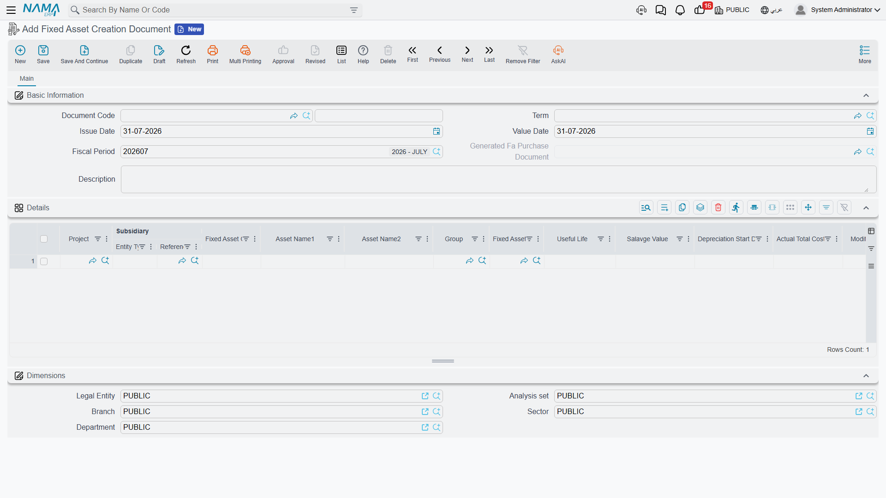

# The Fixed Asset Creation Document

A contracting company spends a year building a warehouse. Costs pile up against the project — materials, subcontractors, supervision — and then the company decides not to hand the building over to a customer but to keep it and use it. At that moment the warehouse has to stop being a project and start being a fixed asset on the company's own books, with a code, a life and a depreciation start date.

The **Fixed Asset Creation Document** (سند إنشاء أصول) is the document that makes that statement. It is not a general-purpose "create assets in bulk" screen: it is the contracting capitalisation document, and it is the only document in Fixed Assets that knows what a project is.

| | |
|---|---|
| Menu | **Assets → Master Files → Fixed Asset Creation Document** (`الأصول > الملفات > سند إنشاء أصول`) |
| Kind | A document — with a book, a term, an issue date, a value date and a fiscal period — that the menu files under Master Files |
| Licence code | **`contracting`** |

::: warning This document needs the Contracting licence
Alone among the items in the Assets menu, this one is gated by the **`contracting`** licence rather than a fixed-assets one. A customer who bought Fixed Assets but not Contracting will not find `سند إنشاء أصول` in the menu at all. That is consistent with what the document is for — its central column is a contracting project, and without Contracting there would be nothing to put in it.
:::

> Al-Waha Industries finishes project **`P-2026-014` — Riyadh Warehouse / مستودع الرياض** and keeps it. The warehouse becomes asset **`BLD-0003`**, type **Buildings**, useful life **300 months**, salvage value **250,000**, depreciation starting **1 October 2026**. Total project cost: **8,400,000**.

## Where the Document Comes From

The intended way in is not the menu. On the Contracting **Project** screen there is a button, **Create Fixed Asset Creation Doc** (إنشاء سند أصل ثابت), which opens a new creation document in a popup with one detail line already pointing at the project you were looking at. You complete the asset details and save.

Reaching the document from the Assets menu and picking the project by hand does exactly the same thing — the button is a shortcut, not a different process.

## The Screen

### Header

The standard document header — document code (book and code), **term** (توجيه المستند), issue date, value date, fiscal period and description. The value date is the one that matters: it is copied onto the purchase document this one generates.

One header field is an output rather than an input: **Generated Fa Purchase Document** (سند شراء أصول المنشأ) shows the purchase document that this document produced when it was committed. Until then it is empty.

### The Details Grid

One row per asset to be created.

| Column | Arabic label | What it does |
|---|---|---|
| Project | المشروع | The contracting project being capitalised. This is the pivot of the whole document. |
| Fixed Asset Code | كود الأصل | The code the new asset will carry — `BLD-0003`. Leave it empty and the asset is auto-coded from its type's coding group instead. |
| Asset Name1 / Asset Name2 | الإسم العربي للأصل / الإسم الإنجليزي للأصل | The new asset's Arabic and English names. |
| Group | المجموعة | The master group to file the asset under, used when the type carries no coding group. |
| Fixed Asset Type | نوع أصل | The most important column: it gives the new asset its accounts, its coding group and its Countable, Car Asset, Has Insurance and Undepreciable flags. See [Fixed Asset Types](/modules/fixedassets/master-files/fixedassets-asset-types.md). |
| Useful Life | العمر الإفتراضي | In **months**. `300` for the warehouse. |
| Salvage Value | قيمة الأصل كخردة | `250,000`. |
| Depreciation Start Date | تاريخ بداية الاهلاك | `01/10/2026`. |
| Fixed Asset | الأصل الثابت | An output — the asset the row created. Fill it in advance and that existing asset is updated instead of a new one being created. |

Below the grid sits the usual Dimensions group.

There are no action buttons on this screen. Nothing is collected, nothing is generated on demand — everything happens when you commit.

## The One Rule It Enforces

**One fixed asset per project.** At commit the document checks whether any other asset in the database already points at the project on the line, and refuses if one does — *"There is another asset … depend on this project …"*.

The check spans the whole database regardless of company or branch, so an asset belonging to a different legal entity still blocks you. This is deliberate: the point of the document is to say "this project became that asset", and that sentence only makes sense once.

## What the Term Must Carry

The [term](/modules/fixedassets/document-terms/fixedassets-terms-acquisition.md) for this document has just two settings, and both are mandatory:

| Term field | Arabic label | What it is |
|---|---|---|
| Fixed Asset Purchase Document Book | دفتر شراء أصل ثابت | The document book of the Fixed Asset Purchase Document that this document generates. |
| Fixed Asset Purchase Document Term | توجيه شراء أصل ثابت | The term of that generated purchase document — and this is where all the real accounting configuration lives. |

Leave either empty and the commit stops with a message telling you to fill the purchase document's book and term on this document's term.

The book you choose has one consequence worth thinking about in advance. If it is an ordinary document book, the generated purchase document is a normal, editable document. If it is a system book, the generated document is locked as a finished record and cannot be opened and changed afterwards. The next section explains why that choice matters more than it looks.

## What Committing Actually Does

Two phases, in order.

**Phase 1 — one asset record per row.** For every line, a fixed asset record is created carrying the names you typed, the code from the line, and everything the Fixed Asset Type supplies: the accounts (into whatever slots are still empty), the coding group and the four behaviour flags. The new asset is linked to the project, and its status is **Initial** (إبتدائى).

At the same time the asset's **Project Terms** grid is filled: every contract on the project is read, and each contract term flagged to be transferred to the asset becomes a row carrying its term code, standard term, description and warranty dates. For `P-2026-014` that brings across the structural warranty and the MEP warranty from contract `PC-2026-041`. The same collection can be re-run later from the **Update Project Terms** button on the asset — see [The Fixed Asset Record](/modules/fixedassets/master-files/fixedassets-asset-master.md).

**Phase 2 — one generated purchase document for the whole document.** The module creates a [Fixed Asset Purchase Document](/modules/fixedassets/acquisition/fixedassets-purchase-document.md) in the book and term from the creation document's term, copies the value date, issue date, fiscal period, dimensions and description across, builds one purchase line per creation line, and **commits it**. It is never left as a draft.

That generated purchase document is what actually puts the assets into service:

- status moves from Initial to **Running Depreciation** (جارى الإهلاك), or to **Not Depreciable** for an undepreciable type;
- the purchase date is set to its value date, and the asset's Purchase Invoice field points at it;
- useful life, remaining life, salvage value and depreciation start date are written onto the asset.

The pointer to it appears in the **Generated Fa Purchase Document** field on the header.

## It Does Not Set the Asset's Cost

This is the part to plan for, and it is better known before you commit than after.

The creation document's grid has no price. The asset's acquisition cost comes from the price on the purchase line, and the creation document has no column that feeds it — so **the assets it creates arrive with a cost of zero**. `BLD-0003` is created, is set to Running Depreciation, has a 300-month life and a salvage value of 250,000, and has nothing on its cost account. Left like that it would depreciate nothing sensible.

The 8,400,000 has to reach the asset by one of two routes, and you choose between them when you choose the book on the term:

1. **Price the generated purchase document.** Open the Fixed Asset Purchase Document that the commit produced, enter the value against the line, and re-commit it. This is the natural route, because it puts the cost where the accounting entry is made — and it is available only when the term's purchase book is an ordinary book. Pick an ordinary book if this is how you intend to work.
2. **Add the value afterwards with an addition.** Raise an [Addition and Deduction Document](/modules/fixedassets/depreciation/fixedassets-additions-and-deductions.md) against `BLD-0003` for 8,400,000. This works whatever book the term uses, and it is the route to take when the generated purchase document is locked by a system book.

Either way the arithmetic lands where you expect it: with a cost of 8,400,000, a salvage value of 250,000 and 300 months of life, the warehouse depreciates

> (8,400,000 − 250,000) ÷ 300 = **27,166.67** per period

from October 2026 onward.

Treat the creation document, then, as the document that *identifies* the asset — its code, its type, its life, its project and its warranties — and the purchase document or the addition as the one that *values* it.

## Accounting, Editing and Cancelling

**The creation document books nothing itself.** Every ledger effect comes from the generated purchase document, using the accounts on the purchase term — normally the asset's own cost account against the payable or capital-work-in-progress account chosen there. Whether that entry appears immediately or as a background business request (طلب أعمال) is decided by the purchase term as well.

**Editing** the creation document re-runs the whole process: the assets are updated and the generated purchase document is rebuilt in place.

**Cancelling** it deletes the generated purchase document and the assets it created. That is the right behaviour for a mistake and a dangerous one for a document that has been in use, so treat cancellation as an undo for something committed by accident, not as a way of correcting a live asset.

## Actions on This Screen

The creation document has no buttons of its own. Choosing the project is what fills the screen, and
committing it is what creates the asset and writes the project terms across. The one button in this
story sits elsewhere — **Update Project Terms** (تحديث بنود المشروع) on the asset's *Project Details*
page, which re-collects those terms later if the contracts change.

## Two Things It Is Often Confused With

**It is not how a supplier purchase is recorded.** Buying a machine from Gulf Machinery Trading is a [Fixed Asset Purchase Document](/modules/fixedassets/acquisition/fixedassets-purchase-document.md), which does carry a price and does book the supplier. Use the creation document only when the asset came out of a project you built.

**It is not what a disposal generates.** A disposal document can recognise new assets salvaged out of the asset being retired — a still-serviceable sub-unit, a trade-in vehicle — and what it generates for them is a **Fixed Asset Purchase Document**, not a creation document. See [Disposing of an Asset](/modules/fixedassets/disposal/fixedassets-disposal.md).

Finally, no printed form ships for this document. If you need a paper record of the capitalisation, print the generated purchase document instead — see [Print Forms](/modules/fixedassets/reports/fixedassets-print-forms.md).
