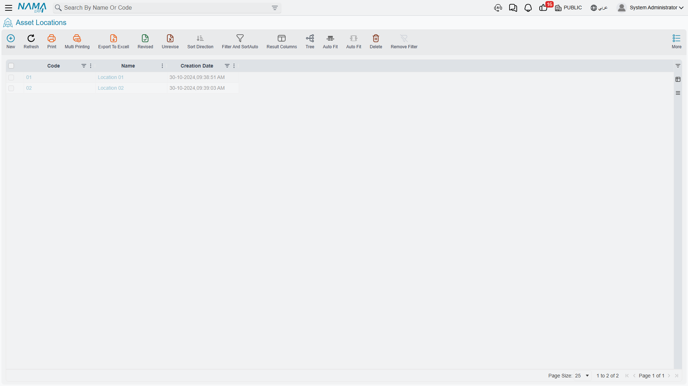
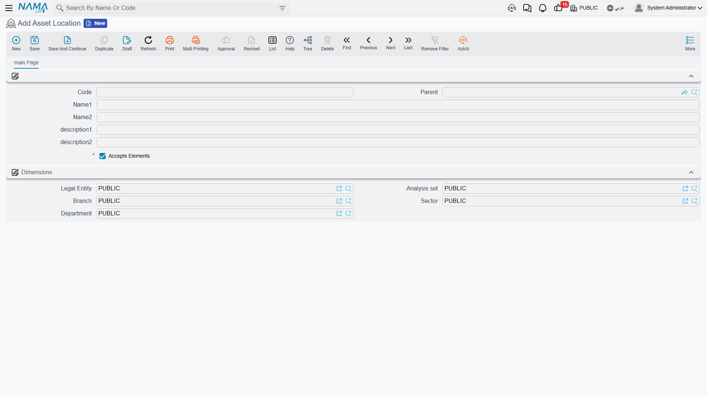
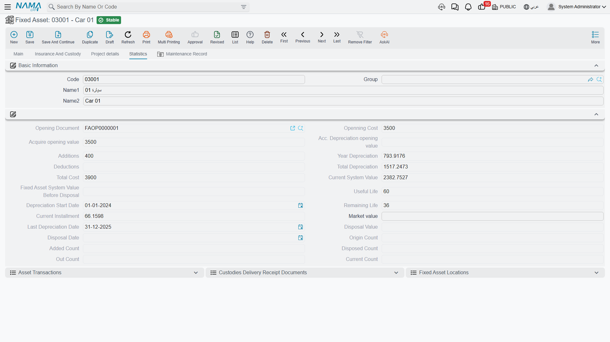

# Asset Locations

An asset register that cannot tell you where the machine is standing is only half a register. The **Asset Location** master file (موقع أصول) is the vocabulary the module uses to answer that question — a tree of physical places, from the site down to the room.

| | |
|---|---|
| Menu | **Assets → Master Files → Asset Location** (`الأصول > الملفات > موقع أصول`) |
| Kind | Master file, hierarchical |
| Licence code | `fixedassets` |

Al-Waha Industries keeps a small tree:

```
RIYADH — Riyadh Plant / مصنع الرياض
   ├── LOC-R1 — Riyadh Plant, Hall 1 / مصنع الرياض – صالة 1
   ├── LOC-R2 — Riyadh Plant, Hall 2 / مصنع الرياض – صالة 2
   └── LOC-R3 — Riyadh Plant, Hall 3 / مصنع الرياض – صالة 3
JEDDAH — Jeddah Branch / فرع جدة
```



## The Record Itself

The screen is deliberately thin — a location is a label with a place in a tree, nothing more.



| Field | Arabic label | Notes |
|---|---|---|
| Code | الكود | `LOC-R2`. |
| Parent | المجموعة الأعلي | The location above this one. Leaving it empty makes this a root. |
| Name1 / Name2 | الاسم العربي / الاسم الإنجليزي | Arabic name first, English name second. |
| Description 1 / 2 | الوصف 1 / الوصف 2 | Free text — a bay number, a gate, a floor plan reference. |
| Dimensions | الشركة، المجموعة التحليلية، الفرع، القطاع، الإدارة | Legal entity, analysis set, branch, sector, department. |

There is no validation on the record and no behaviour behind it. Build the tree as deep or as flat as your plant needs; the module never walks it, it only records which node an asset is sitting on.

::: tip Locations are not dimensions
It is tempting to model branches and departments as locations. Do not — the asset already carries its five dimensions, and those are what the ledger uses. A location is a physical place; changing it on its own books nothing. Use dimensions for the accounting picture and locations for the floor plan.
:::

## The Location Field on the Asset Is Not Typed

Open `MCH-0007` and you will find **Asset Location** (موقع الاصل) on the main page showing `LOC-R2` — and no way to edit it. Like every other moving part of the asset record, the location is written by documents.

Underneath, the module keeps a **location history**: one row per move, each recording where the asset came from, where it went, on what date, and which document did it. The field on the asset is simply the destination of the newest row.



The history is on the asset's Statistics page as the **Fixed Asset Locations** list (مواقع الأصل الثابت), showing the creation date, the value date, the from-location, the to-location and the originating document.

## Which Documents Write It

Four documents put rows into that history:

| Document | What it records |
|---|---|
| **Fixed Asset Purchase Document** | The asset's first location — wherever the purchase line says it was delivered. This is how `MCH-0007` arrived in Hall 2 on 1 January 2026. |
| **Fixed Asset Opening Document** | The same, for assets brought in from a previous system. |
| **Fixed Asset Transfer Document** | Every subsequent move. This is the document you use to put the machine in Hall 3. |
| **Letter of Credit Cost Document** | The landing location of imported machinery, at the moment its cost is settled. |

One more document touches the field without writing history: the **Fixed Asset Receipt** document sets the asset's location from its line as part of signing for delivery. It records who received the asset and where it went, and books nothing.

And two documents that look as though they should move an asset do not: the **movement out** and **movement in** documents send countable units away temporarily and bring them back, adjusting the unit counters only. The asset's location, and its depreciation, carry on unchanged. See [Sending Assets Out and Back](/modules/fixedassets/movement/fixedassets-movement-in-out.md).

## Moving MCH-0007 from Hall 2 to Hall 3

The move itself is a **Fixed Asset Transfer Document**: the asset, from `LOC-R2`, to `LOC-R3`, with a value date. On commit:

1. A new row is added to the location history — from `LOC-R2`, to `LOC-R3`, dated today, naming this transfer.
2. The **Asset Location** field on the asset becomes `LOC-R3`.
3. **Nothing is booked.** Neither the legal entity, nor any accounting dimension, nor any of the asset's three accounts changed, so there is no ledger entry to make. A pure location move is free.

That third point is the one people find surprising, and it is worth carrying: the transfer document is not a *location* document, it is a document that can change location, dimensions, accounts and custodian at once — and it books something only when the change reaches the accounting. The full picture, including what happens when the machine moves to another company, is in [Transferring an Asset](/modules/fixedassets/movement/fixedassets-transfer-document.md).

::: info Back-dated moves
The location on the asset is the destination of its **latest** row. If you record a transfer dated before a move that is already on file, the history gains the row in its proper place but the asset's current location does not change — correctly, because a later move already decided where the machine is now.
:::

## Reading the History

Because every row names its document, the location list on the Statistics page is the fastest audit trail in the module. A machine that turned up in the wrong hall is one click from the transfer that put it there; a machine whose history is empty was never given a location by its purchase document, which is usually the real complaint behind "the location field is blank and I cannot fill it".

The fix in that case is not on the asset. It is a transfer document that moves the machine to where it actually is.
