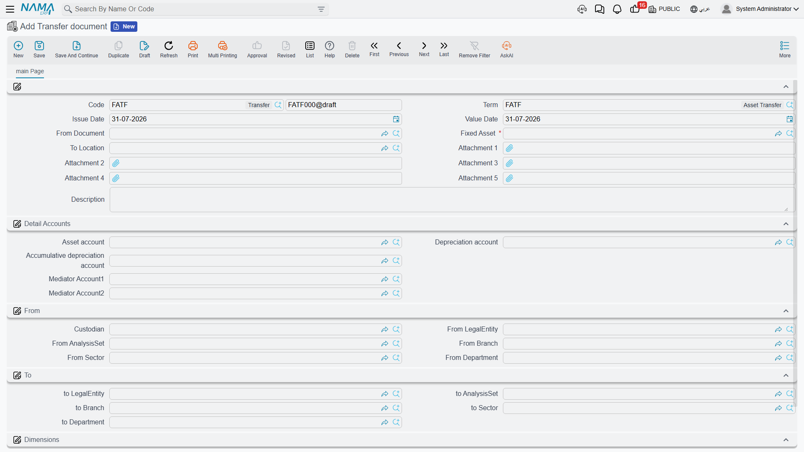

# Transfers Between Companies

Moving a machine between two branches of one company is bookkeeping housekeeping: the same balances
sit under a different label. Moving it between two **companies** is a sale in everything but name.
One legal entity has to stop carrying the asset and the other has to start, each in its own set of
books, and the two sets of books have to agree.

Nama handles this with the ordinary
[transfer document](/modules/fixedassets/movement/fixedassets-transfer-document.md). You do not
choose an inter-company mode — you simply set a different company in the **إلى / To** group, and the
document changes shape underneath you: instead of one journal entry it produces **two**, one in each
company, joined by a pair of mediator accounts.

## The one rule that governs the whole thing

Everything below follows from a single decision the module makes: **the receiving company takes the
asset at net book value.**

Gross cost and accumulated depreciation do not cross the boundary. As far as the Jeddah company's
ledger is concerned, it has just acquired a machine at 176,100 and has never depreciated it. The
history stays behind in the company that owned it.

That is the same convention an accountant would apply to any transfer of a used asset between related
entities, and once you have it, the two entries below are the only sensible entries there could be.

## Before you can commit: mediator accounts

The two entries are separate — separate companies, separate ledgers — so each needs a balancing
counterpart. That counterpart is the **mediator account** (حساب وسيط الشركة): an inter-company
account through which the transfer passes.

There are two of them, and they are not interchangeable:

| Field | Whose account it is |
|---|---|
| **Mediator Account 1** (حساب وسيط الشركة 1) | The **source** company — the one the asset is leaving |
| **Mediator Account 2** (حساب وسيط الشركة 2) | The **destination** company — the one receiving it |

You do not normally type them. Each legal entity's own record carries a mediator account, and the
transfer falls back to it when the field on the document is empty. Setting it once per company is the
right way to work; the fields on the document exist for the case where a particular move should pass
through a different inter-company account.

What you cannot do is skip it. If the companies differ and neither the document nor the legal entity
supplies a mediator account, the commit is refused with *"You must specify mediator account for legal
entity …"*, naming the company that is missing one.

::: warning Set the document's own legal entity to the company the asset is leaving
The transfer works out how much to move by reading the balances the asset has already accumulated in
the ledger — gross cost on its cost account, accumulated depreciation on its accumulated-depreciation
account — as at the value date, in the company named in the document's own **المحددات / Dimensions**
group.

On an inter-company move it is tempting to file the document under the receiving company. Do not. The
balances live in the source company; if the document's dimensions name anything else the lookup comes
back empty, every line is zero, and the transfer commits with no entry at all. Source company in the
Dimensions group, destination company in the *To* group.
:::

## The two entries, worked

`MCH-0007` at the end of December 2027, after its upgrade and two years of depreciation:

| | |
|---|---|
| Cost | 270,000 |
| Accumulated depreciation | 93,900 |
| **Net book value** | **176,100** |

Al-Waha Industries transfers it to its Jeddah company. The document names Al-Waha Industries in the
Dimensions group and Al-Waha Jeddah in the *To* group.

**Entry one — in Al-Waha Industries**, which is losing the machine. It clears both of the asset's
balances and parks the difference on the inter-company account:

| Account | Debit | Credit |
|---|---|---|
| Accumulated depreciation | 93,900 | |
| Inter-company (Mediator Account 1) | 176,100 | |
| Asset cost | | 270,000 |
| **Total** | **270,000** | **270,000** |

The machine is now completely off Al-Waha Industries' books. What is left is a 176,100 receivable
from the sister company, sitting on the mediator account.

**Entry two — in Al-Waha Jeddah**, which is gaining it:

| Account | Debit | Credit |
|---|---|---|
| Asset cost | 176,100 | |
| Inter-company (Mediator Account 2) | | 176,100 |

Jeddah now carries the machine at 176,100 gross, with nothing in accumulated depreciation, and a
176,100 payable to Riyadh on its own mediator account.

The accounts used on each side are the ones on that side of the document: entry one uses the
accounts the asset was sitting on before the move, entry two uses the accounts in the **Detail
Accounts** group — which is why, on an inter-company transfer, you should check those accounts
belong to the receiving company's chart before committing.

::: info The mediator accounts are the settlement, not the payment
Nothing here moves money. The two mediator balances are a matched pair — a receivable in one company
and a payable in the other — and they stay open until the two companies settle with each other. That
settlement is an ordinary accounting-module matter: a payment voucher, a netting entry at
consolidation, or whatever your group does with inter-company balances. The fixed-assets module's job
ends when the machine is on the right books.
:::

## What the register says afterwards, and what the ledger says

This is the part that catches people out, so it is worth stating flatly. There is **one** asset
record. The transfer changes which company it belongs to — but it does not rewrite its history.

| | The asset record shows | The receiving company's ledger shows |
|---|---|---|
| Cost | 270,000 | 176,100 |
| Accumulated depreciation | 93,900 | nil |
| Book value | 176,100 | 176,100 |

The two agree on the number that matters — the carrying amount — and disagree on how it is composed,
by design. The register keeps the machine's whole life, from a 240,000 purchase in January 2026
onward, because that is what a fixed-asset register is for. The ledger of a company that has owned
the machine for one day records what it paid for it.

## Depreciation afterwards

Depreciation carries on from the register's figures, not the ledger's. The instalment is unchanged —
the same 4,225 a period the machine was charging in Riyadh — and the remaining life is unchanged too.
The machine will finish depreciating on exactly the date it was always going to. What changes is
where the charge lands: the depreciation entry now uses the asset's new dimensions, so the expense
appears in Jeddah.

If you want the receiving company to depreciate the machine over a fresh life instead — a common
group policy — that is a separate decision made with a
[properties document](/modules/fixedassets/depreciation/fixedassets-properties-document.md) after the
transfer, which re-derives the instalment from a new remaining life.

## Sequencing an inter-company move

1. **Depreciate the asset up to the month of the move.** The transfer will not commit unless
   depreciation is current, and you want the accumulated figure the transfer moves to be the real one.
2. **Check that both companies have a mediator account**, or fill the two fields on the document.
3. **Set the document's Dimensions group to the source company.**
4. **Pick the destination location** — it brings the destination company, branch, sector, department
   and analysis set with it — and check the three accounts in the Detail Accounts group are the
   receiving company's.
5. **Commit, then watch the queue.** Two ledger requests are produced and processed in the background;
   both should appear as processed. The More menu on the document lists the ledger transactions it
   created, and a failure is retried from the **Business Requests** list view with **More →
   Reprocess**.
6. **Check both sides.** The source company's asset cost account should be clear of the machine, and
   the two mediator balances should be equal and opposite.

Un-committing reverses the lot: both entries are removed and the asset goes back to the company,
location, dimensions and accounts it had before. If the move later stops being inter-company —
somebody corrects the destination to a branch of the same company — the second entry is removed and a
single intra-company entry replaces the first.

Moving several assets between companies at once is possible with the aggregated transfer document
described on the
[transfer document page](/modules/fixedassets/movement/fixedassets-transfer-document.md); the mediator
requirement is checked row by row, so one line missing an account blocks the whole batch.
