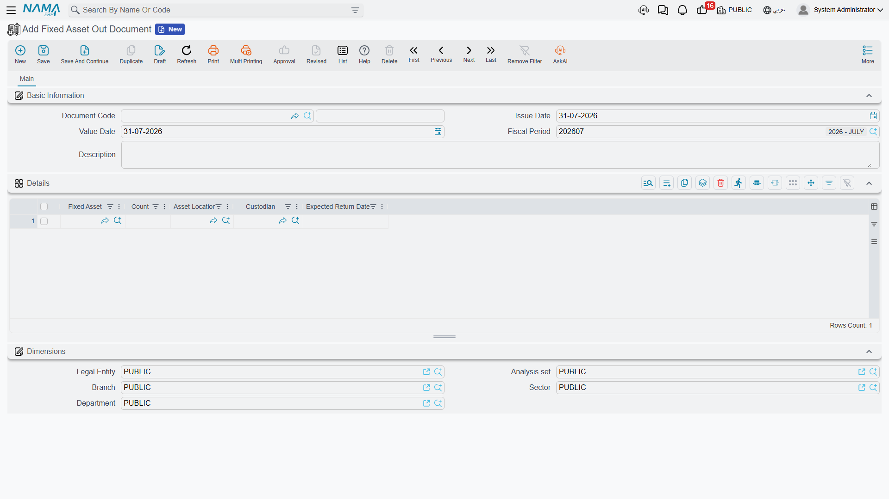
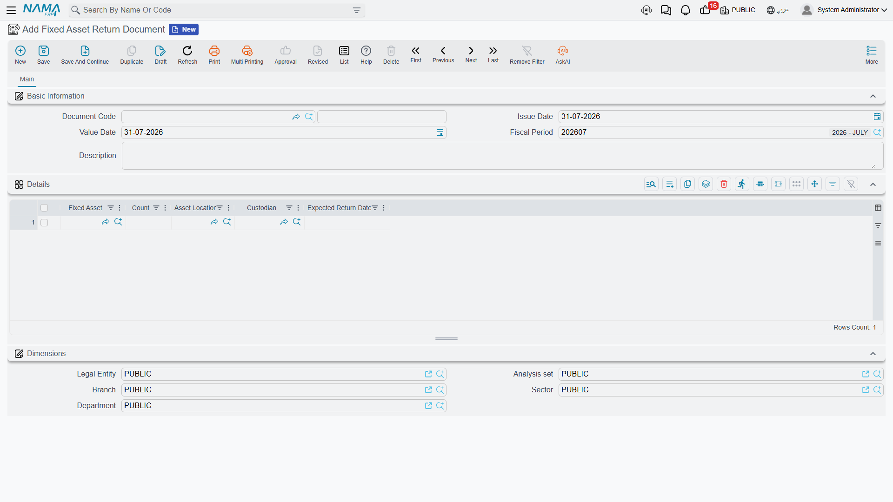

# Sending Assets Out and Bringing Them Back

Al-Waha Industries is exhibiting at a trade fair in Dammam. Three of the ten office desks held as
asset `FRN-0021` go on the lorry on 1 March and come back on the 10th. They were never sold, never
reassigned, never even moved in any sense the asset register cares about — for nine days they were
simply *not on the premises*.

That is the entire purpose of the pair of documents on this page. **سند خروج أصول / Fixed Asset Out
Document** records units leaving; **سند رجوع أصول / Fixed Asset Return Document** records them coming
back. Between them they maintain one number: how many units of an asset are currently outside.

## What they do not do

State this plainly to anyone who mistakes these for transfers, because the mistake is easy to make —
both documents sit in the same menu folder as the transfer document, and both talk about locations
and custodians.

An out or return document **does not**:

- change the asset's location — after sending the desks out, the register still shows them at
  `LOC-R2`, Riyadh Plant, Hall 2;
- change the asset's dimensions, its accounts or who holds it;
- produce any journal entry. There is no term on these documents and no accounting behind them;
- pause, reduce or otherwise affect depreciation. `FRN-0021` charges exactly the same instalment in
  March as in February, whether three desks are in Dammam or all ten are in the hall.

If the desks are genuinely relocating, that is a
[transfer](/modules/fixedassets/movement/fixedassets-transfer-document.md). If they are not coming
back at all, that is a
[partial disposal](/modules/fixedassets/disposal/fixedassets-partial-disposal.md). These two documents
are for the case in between: gone for a while, and expected back.

## Countable assets only

The whole mechanism is about counting units, so it only works on assets that *have* units. An asset
is countable when it is registered as such — ten identical desks under one code, two hundred stacking
chairs, a pool of hand tools. The asset picker on both documents shows only assets that are
**countable** and **in service**, and a line naming anything else is refused with *"Fixed asset must
be countable"*.

A single CNC machine is not countable, so `MCH-0007` never appears on these documents. A machine that
leaves the site for a fortnight of external repair is recorded — if you want it recorded at all — with
a note or a maintenance record, not here.

## The out document

You will find it at **الأصول > عهد الأصول > سند خروج أصول** (Assets > Custody Of Assets > Fixed Asset
Out Document), under the `fixedassets` licence. There is no term and no attachment; it is deliberately
a light document.

The header is book and code, issue date, value date, fiscal period and a description, plus the
document's own dimensions. Everything else is in the **التفاصيل / Details** grid:

| Column | What to put in it |
|---|---|
| **الأصل الثابت / Fixed Asset** | The countable asset. Required |
| **العدد / Count** | How many units are going out. Required |
| **موقع أصول / Asset Location** | Where they are going, recorded on the line |
| **مسئول العهدة / Custodian** | Who is taking them, recorded on the line |
| **تاريخ الإعادة المتوقع / Expected Return Date** | When you expect them back, recorded on the line as a note |

For the trade fair, one line: `FRN-0021`, count 3, expected back on 10 March.

Commit it and the asset's **Out Count** — visible on the asset's **الإحصائيات / Statistics** page —
becomes 3. The **Current Count** stays at 10, because the company still owns ten desks; three of them
just happen to be in Dammam.

## The return document

**سند رجوع أصول / Fixed Asset Return Document** is the same screen with the same grid, and it is the
only way the out count comes down.

On 10 March you enter one line — `FRN-0021`, count 3 — and commit. Out Count returns to 0 and the
asset is fully accounted for on site again.

Partial returns are perfectly normal: send thirty chairs out, bring twenty back on Tuesday and ten on
Friday, with a return document for each.

## The counting is checked across the whole timeline

The two documents are validated together rather than one at a time, and the check is stricter than it
first appears. Every out and return document that touches an asset is replayed in value-date order,
and the document you are committing is rejected if the running total ever goes wrong:

- you cannot have more units outside than the asset has. A second out document for eight of the ten
  desks while three are already away is refused, naming the totals — *"Total count is 10, and total
  count outside is 11"*;
- you cannot bring back more than went out. A return for four desks when three are away is refused
  the same way;
- the same asset may not appear twice in one grid, and the grid may not be empty.

Because it is the whole timeline that is replayed, a **back-dated** document can be refused because
of something that happens *later*. Insert an out document dated 5 March for the remaining seven desks
and the check fails at 10 March, where the return of three would push the running total past what the
asset holds. When a rejection makes no sense against today's position, look forward as well as back.

Un-committing a document removes its units from the running total and recomputes the counters from
what is left, so corrections are safe — you are never patching a stored total by hand.

## Reading the counters

The four counters live on the asset's **الإحصائيات / Statistics** page, and the two you will actually
use are:

- **العدد بالخارج / Out Count** — units outside the premises right now, maintained by these two
  documents;
- **العدد الحالي / Current Count** — units the register says you hold, which purchases and openings
  raise and [partial disposals](/modules/fixedassets/disposal/fixedassets-partial-disposal.md) lower.

Subtract one from the other and you have what should be findable on site — which is exactly the
figure a
[stocktake](/modules/fixedassets/movement/fixedassets-stocktaking.md) is trying to confirm.

::: tip Close out the loans before you count
An asset showing units out is an asset whose count sheet will not balance. Chase the outstanding
return documents before a stocktake rather than explaining the difference afterwards, and treat
anything still out well past the date it was expected back as a question for the custodian named on
the line rather than a shortage.
:::
