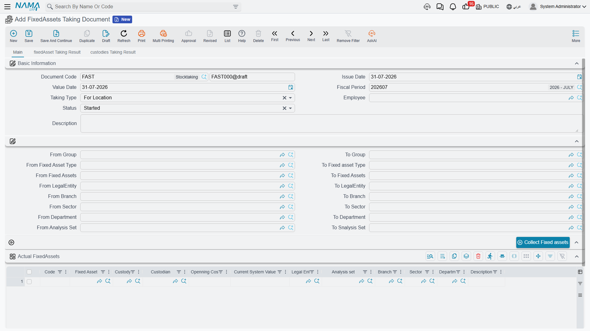
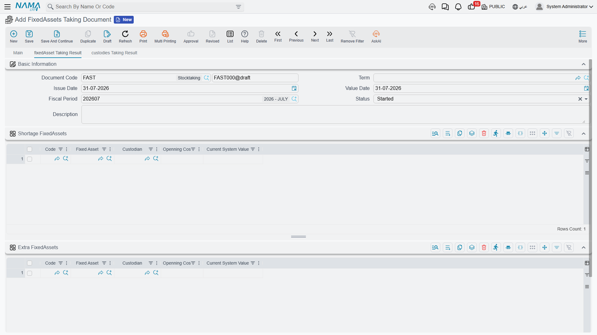
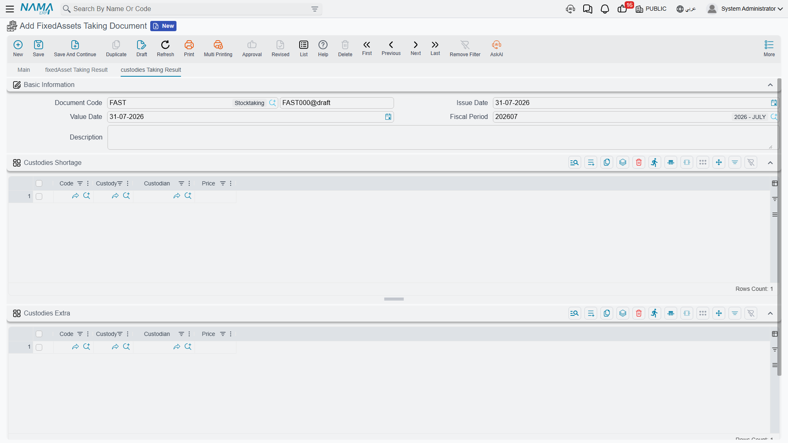

# Stocktaking Fixed Assets

Once a year somebody walks the plant with a scanner and finds out what is actually there. The
register says Al-Waha Industries holds forty assets and twelve custody items at the Riyadh plant. The
count finds thirty-eight assets, one of them a desk that belongs to Dammam, and a printer that is
signed out to another department altogether.

The **مستند جرد أصول / FixedAssets Taking Document** is where that comparison happens. It is worth
being blunt about what it is, because the name says "document" and people expect documents in this
module to do something:

> **The taking document is a reconciliation report that you save.** It compares what the register
> expects against what you counted, and produces four lists: assets missing, assets found
> unexpectedly, custody items missing, custody items found unexpectedly. It writes nothing back. No
> asset is written off, no asset is created, no custodian is corrected, no journal entry and no
> business request is produced. Committing it changes nothing at all.

That is not a shortcoming — it is the right division of labour. Deciding that a missing forklift
should be scrapped is an accounting decision with a gain or loss attached, and it belongs on a
disposal document with a term behind it, not on a count sheet. What the taking document owes you is
an accurate, dated list of the differences, and it delivers that.

You will find it at **الأصول > عهد الأصول > مستند جرد أصول** (Assets > Custody Of Assets >
FixedAssets Taking Document), under the `fixedassets` licence. It uses no document term.

## Two ways to scope a count

The header carries **نوع الجرد / Taking Type**, and it decides what the register is expected to
produce:

| Taking Type | The expected list is |
|---|---|
| **للموقع / For Location** | Every asset and custody item filed under the document's own **المحددات / Dimensions** — company, sector, branch, department, analysis set — that has not been disposed of |
| **للموظف / For Employee** | Every asset and custody item held by the **Employee** named in the header |

For Location is the annual count of a site or a branch. Note what drives it: the **document's own
dimensions**, set in the Dimensions group at the bottom of the page. Set the Dimensions group to
Riyadh Plant and you are counting everything the register files under Riyadh Plant. Leave a dimension
blank and it simply is not used to narrow the list.

For Employee is the other common case — a laptop-and-phone check on somebody who is leaving, or a
periodic confirmation of what an engineer is signed for. It pulls both the assets and the
[custody items](/modules/fixedassets/custody/fixedassets-custody-overview.md) that person holds, and
the employee is required.

The header also carries **الحالة / Status**, with two values: **بدأ / Started** and **منهي / Ended**.
A new document starts as *Started*, and that matters — see the comparison section below.

## Building the count sheet

The **الاصول الحالية / Actual FixedAssets** grid is the count itself: one row per thing the team
physically found. There are three ways to fill it, and a real count usually uses all three.

**1. Press تجميع الأصول الثابته / Collect Fixed assets.** The button pre-fills the grid with assets
from the register so the team has something to walk with. Above it sit sixteen From/To range fields —
group, asset type, asset code, company, branch, sector, department, analysis set — which narrow what
the button pulls in. Each range is a code comparison, and a blank field means no bound on that side,
so *From Fixed Asset* `FA-1000` and *To Fixed Asset* `FA-1999` pulls that block of codes and nothing
else. Assets that have been disposed of are never collected.

The ranges are a convenience for filling the sheet, and only that. They narrow what the button pulls
in; they do not narrow what the count is compared against. That comparison always uses the taking
type and the header dimensions.

**2. Scan into the الكود / Code column.** This is the real workflow. Point a barcode scanner at an
asset tag or a custody label and the code goes into the Code column, which looks the value up — first
among custody items, then among fixed assets — and fills in the reference, the custodian, the
acquisition cost and the current book value. With barcode mode on, the grid advances to the next row
by itself, so a two-person team can work a hall without touching the keyboard.

**3. Pick a line by hand.** Choose the **الأصل الثابت / Fixed Asset** or the **عهدة / Custody** on the
row and the same details are filled in.

Two rules apply to the grid: every row needs either an asset or a custody item, and the same code
cannot be counted twice — a repeated scan is rejected with *"Can not stocktaking this item twice"*,
which is exactly what you want when two people are scanning the same hall.

::: tip There is no "not found" tick — absence is the shortage
This is the one mechanic everybody has to be told. The count sheet lists what you **found**. If the
team collected the register's expectation into the grid and then could not find two of the machines,
they **delete those two rows**. What is left in the grid is the count; anything the register expected
that is no longer in the grid becomes a shortage. Nothing is marked as missing — it is simply absent.
:::

## How the differences are worked out

The comparison runs when the document's **Status** is set to **منهي / Ended**, and it re-runs on
every save from then on. While the status is *Started* the four result grids stay as they are, which
is what lets a count run over several days without half-finished results confusing anybody.

When it runs, the system builds the expected list from the taking type and the header dimensions,
projects the count sheet into its own list, and compares them:

- expected but not counted → **shortage**;
- counted but not expected → **extra**.

Assets and custody items are compared separately, which is why there are four result grids on two
pages rather than two on one.

Page 2, **نتائج جرد الاصول / fixedAsset Taking Result**, holds **الناقص من الاصول / Shortage
FixedAssets** and **الزائد من الاصول / Extra FixedAssets**. Each line shows the asset, its custodian,
its **قيمة الإقتناء / Openning Cost** and its **القيمة الدفترية الحالية / Current System Value** — so
the shortage list doubles as the value of the problem. Those value columns settle when the document
is saved, so read them from a saved document rather than mid-entry.

Page 3, **نتائج جرد العهد / custodies Taking Result**, does the same for custody items in
**الناقص من العهد / Custodies Shortage** and **الزائد من العهد / Custodies Extra**, showing the item,
its holder and its price.

::: info Only two kinds of difference exist
Missing and unexpected. An asset found in the wrong place is not reported as "wrong location" — it
appears as an **extra** on the count where it was found, and as a **shortage** on the count of the
place it should have been. This is worth knowing before you plan a site-by-site count: run all the
sites before drawing conclusions, and match the extras of one against the shortages of another.
:::

## A count at the Riyadh plant

Al-Waha counts the Riyadh plant on 30 June 2026.

1. A new taking document, value date 30 June, **Taking Type = For Location**, Dimensions group set to
   the Riyadh Plant branch, status **Started**. The register holds forty assets and twelve custody
   items there.
2. The team sets the asset-code range to the plant's block and presses **Collect Fixed assets**;
   thirty-eight rows arrive in the count sheet.
3. Over two days they scan. Everything on the sheet is confirmed except the forklift `MCH-0012`,
   which nobody can find, and one cabinet — those two rows are deleted. They also scan a desk
   `FRN-0058` that carries a Dammam tag, and a printer that turns out to be custody item `CDY-0041`
   held by another department. Both are added as new rows.
4. Status is set to **Ended** and the document saved. The results come out as:
   - *Shortage FixedAssets* — `MCH-0012` (book value 22,000), the cabinet, and the two plant assets
     that fell outside the collected code range and were never scanned;
   - *Extra FixedAssets* — `FRN-0058`;
   - *Custodies Extra* — `CDY-0041`.
5. The document is committed. **Every asset record is exactly as it was.**

## Acting on the findings

The count is the beginning of the work, not the end of it. Each kind of difference has a document
that resolves it:

| Finding | What resolves it |
|---|---|
| An asset genuinely gone | A [disposal document](/modules/fixedassets/disposal/fixedassets-disposal.md) — for `MCH-0012`, a scrap at a disposal value of 0, taking the 22,000 book value as a loss |
| Some units of a countable asset gone | A [partial disposal](/modules/fixedassets/disposal/fixedassets-partial-disposal.md) |
| An asset found somewhere else | A [transfer document](/modules/fixedassets/movement/fixedassets-transfer-document.md) — `FRN-0058` back to Dammam, or its dimensions corrected to where it really is |
| Something real that was never registered | A [purchase](/modules/fixedassets/acquisition/fixedassets-purchase-document.md) if it was bought and not recorded, or an [opening document](/modules/fixedassets/acquisition/fixedassets-opening-balances.md) if it predates the register |
| A custody item with the wrong holder, or gone | A [custody delivery or transfer](/modules/fixedassets/custody/fixedassets-custody-delivery-and-transfer.md), or a [custody disposal](/modules/fixedassets/custody/fixedassets-custody-disposal.md) |

Two things make that follow-up smoother. First, settle the
[out and return documents](/modules/fixedassets/movement/fixedassets-movement-in-out.md) before you
count — units that are legitimately off site will otherwise read as shortages. Second, run the
[fixed assets reports](/modules/fixedassets/reports/fixedassets-reports.md) for the same dimensions
before the count, so the team walks in with the register's expectation on paper as well as on the
scanner.

Keep the committed taking document. It is the dated evidence of what was found, and every disposal
and transfer raised afterwards refers back to it.
