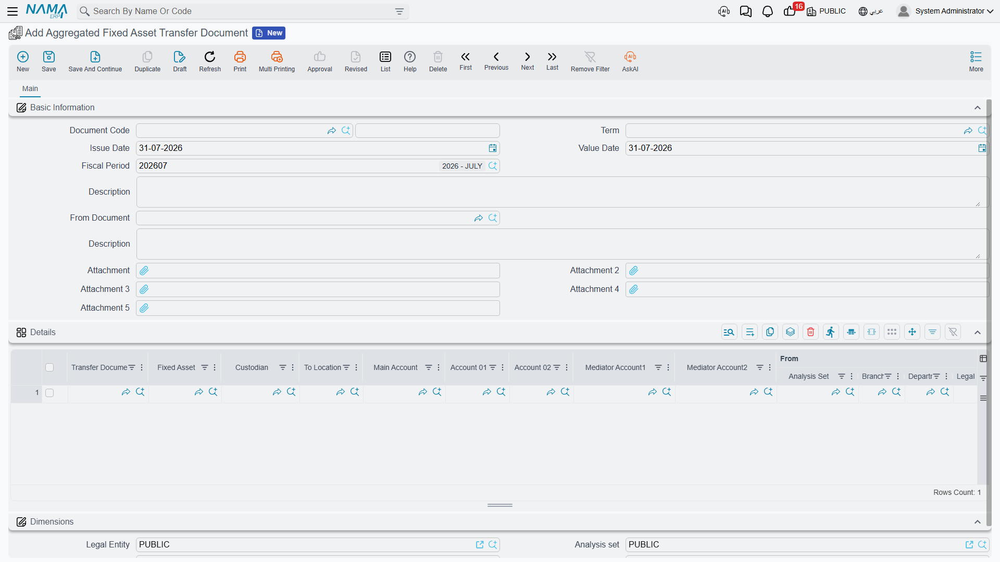

# Moving an Asset: The Transfer Document

Al-Waha Industries wheels the CNC cutting machine `MCH-0007` from Hall 2 to Hall 3 of the Riyadh
plant. Twenty metres, half an hour, two technicians. Later that year the same machine is shipped to
the Dammam workshop, which is a different branch of the same company. Later still, the group decides
the machine belongs to its Jeddah company instead.

All three moves are recorded with the same document — **سند نقل الأصل / Transfer document** — and all
three produce completely different accounting. The first books nothing at all. The second books one
journal entry. The third books two. Nobody chooses that on the screen: **what a transfer books is
decided entirely by what the transfer changes.**

That single rule explains almost everything on this page, so start with it:

| What changed between the old position and the new one | What is processed |
|---|---|
| The physical location only | Nothing. The asset record and its history are updated, the ledger is untouched |
| An accounting-relevant dimension (branch, sector, department, analysis set) or one of the asset's accounts, inside the same company | **One** entry, moving gross cost and accumulated depreciation from the old dimension/account to the new one |
| The company (legal entity) | **Two** linked entries, one in each company, joined by mediator accounts |

Which of the four dimensions count as accounting-relevant is a decision you make once, in
[module configuration](/modules/fixedassets/fixedassets-configuration.md). If your installation does
not treat sector as accounting-relevant, then a sector-only move behaves like a pure location move
and books nothing.

## Where the document lives

You will find it under **الأصول > عهد الأصول > سند نقل الأصل** (Assets > Custody Of Assets >
Transfer document). It needs the `fixedassets` licence — the plain module licence, not the custody
one, even though the menu folder is called Custody Of Assets.

A document term is **optional** here. Without a term the transfer behaves normally and books whatever
its changes call for; the one thing a term can do is switch the accounting off entirely, which the
[section on suppressing the entry](#Turning-the-accounting-off) below covers.

## Reading the screen

The document is one page, and it is built around a *from* and a *to*.

The top group carries the usual document identity — book and code, issue date, value date — plus two
fields that do the real work:

- **From Document** (بناءا على) — an existing [transfer request](/modules/fixedassets/movement/fixedassets-transfer-requests.md),
  if the move was asked for on paper first. Picking one copies the asset, the locations, both
  dimension sets and the accounts onto this document so nothing is typed twice.
- **Fixed Asset** (الأصل الثابت) — the machine being moved. Choosing it fills in almost everything
  else: the *From* dimensions, the accounts, and the asset's current location.
- **To Location** (إلي موقع) — where it is going.

There is no *From Location* box to fill. The system knows where the asset is, because it knows the
last transfer that touched it, and it writes that in for you.

::: tip The destination location drives the destination dimensions
When you pick **To Location**, the system reads that location's own master record and copies its
company, branch, sector, department and analysis set into the whole *To* group. This is the intended
way to work: set up each [asset location](/modules/fixedassets/master-files/fixedassets-locations.md)
with the dimensions that belong to it, and afterwards a transfer is a single choice. You can still
override any of the five by hand — the *To* group is fully editable — but if you find yourself
overriding them often, the location master file is what needs fixing.
:::

Below that sit four groups:

| Group | What it holds |
|---|---|
| **الحسابات / Detail Accounts** | The three accounts the asset should sit on from now on — **Asset account** (حساب الأصل), **Depreciation account** (حساب الإهلاك) and **Accumulative depreciation account** (حساب الإهلاك التراكمي) — plus **Mediator Account 1** and **Mediator Account 2**, which only come into play when the company changes |
| **من / From** | Where the asset is now: its custodian and its five current dimensions. Filled from the asset |
| **إلى / To** | Where it is going: the five destination dimensions |
| **المحددات / Dimensions** | The document's *own* dimensions — the ones the document is filed under. These matter more than they look; see below |

The accounts are pre-filled from the asset, so leaving them alone means "keep the asset where it is
in the chart of accounts". Changing one of them is a real event: the entry the transfer produces
moves the balances off the old account and onto the new one.

::: warning The document's own legal entity decides which ledger is read
The **Dimensions** group at the bottom is not decoration. When the transfer works out how much cost
and accumulated depreciation to move, it reads the posted balances of the asset **in the company
named in that group**. Set it to the company the asset is *leaving*. If it names some other company —
the destination, or whatever your user defaults to — the lookup finds nothing, every line comes out
at zero, and the document commits without an entry.
:::

## The three outcomes, worked

The machine in these examples is `MCH-0007`, and we join it at the end of December 2027, after its
control-unit upgrade and two years of depreciation:

| | |
|---|---|
| Cost | 270,000 |
| Accumulated depreciation | 93,900 |
| Book value | **176,100** |
| Location | `LOC-R2` — Riyadh Plant, Hall 2 |
| Branch | Riyadh Plant |

### Hall 2 to Hall 3 — nothing is booked

You raise a transfer, pick `MCH-0007`, set **To Location** to `LOC-R3` (Riyadh Plant, Hall 3). That
location carries the same company, branch, sector and department as Hall 2, so the *To* group comes
back identical to the *From* group. The accounts are untouched.

On commit the asset's location changes to Hall 3, a row is added to the asset's location history,
and **that is all**. No entry, no business request, nothing for the accountant to review. This is the
common case and it is meant to be cheap: a plant that shuffles equipment between halls every week can
record all of it without generating a single journal entry.

### Riyadh to the Dammam workshop — one entry

Now the machine is shipped to the Dammam workshop, a different branch of Al-Waha Industries. You pick
`LOC-D1` as the destination and the *To* group comes back with branch **Dammam Workshop**.

Because branch is accounting-relevant in this installation, the transfer moves the machine's two
balances across:

| | Account | Dimensions | Debit | Credit |
|---|---|---|---|---|
| 1 | Asset cost | Dammam Workshop | 270,000 | |
| 2 | Asset cost | Riyadh Plant | | 270,000 |
| 3 | Accumulated depreciation | Riyadh Plant | 93,900 | |
| 4 | Accumulated depreciation | Dammam Workshop | | 93,900 |

The entry nets to zero — nothing is gained or lost, the machine simply now belongs to a different
branch in the ledger as well as on the shop floor. Gross cost and accumulated depreciation both
travel, which is why the branch trial balance still shows the machine at 176,100 net.

If the machine had never been depreciated, the accumulated-depreciation lines would come out at zero
and be dropped, leaving a two-line entry.

### To the Jeddah company — two entries

The third case is different enough to have its own page. The short version: the asset arrives in the
receiving company at **net book value** — 176,100 — with its accumulated depreciation starting again
from nothing, and the two companies are joined through a pair of mediator accounts. See
[transfers between companies](/modules/fixedassets/movement/fixedassets-intercompany-transfers.md)
for the entries and the setup they need.

::: info Where Thread 1 actually goes
On the [disposal page](/modules/fixedassets/disposal/fixedassets-disposal.md), `MCH-0007` is sold on
31 December 2027 rather than moved to Jeddah. The inter-company move is the other fork in the same
story, at the same numbers — one machine, one book value of 176,100, two possible endings.
:::

## What the transfer writes back

Committing the document does three things to the asset record: it sets the **location**, it sets the
**five dimensions**, and it sets the **three accounts** — all from the *To* side of the document. It
also writes a row into the asset's location history, which is what you read on the asset's Statistics
page when someone asks where a machine has been.

There is one condition on the write-back. The asset takes its header values from its **latest**
movement. Enter a back-dated transfer behind one that is already recorded, and the history gains a row
in the right chronological place while the asset's own location and dimensions stay as the later
document left them. That is correct behaviour — the most recent move is the one that describes where
the thing is now — but it does surprise people who expect the last document *entered* to win.

Who holds the asset is a separate question, handled by the
[delivery and receipt of custodies document](/modules/fixedassets/acquisition/fixedassets-delivery-receipt.md).
The **Custodian** field in the *From* group records who was holding the machine when the move was
raised, and it is part of the paper trail rather than a way to reassign it.

::: warning Committing a transfer clears the asset's custodian
Watch for this one. Every committed transfer wipes the **Custodian** on the asset record and leaves it
empty — and there is no field on the transfer screen that sets a new one. The machine arrives in its
new department with nobody shown as holding it.

After each transfer, put the custodian back: either raise a
[delivery and receipt of custodies document](/modules/fixedassets/acquisition/fixedassets-delivery-receipt.md)
for the new holder — the proper route, because it also books the value and writes the custody history —
or set the field by hand on the asset. If your company transfers assets often, ask your administrator
about adding the new-custodian field to the transfer screen with a screen modifier.
:::

## Actions on this screen

The transfer document has no buttons of its own. Everything it does happens when it is committed —
the location, custodian and dimensions are written onto the asset, and the accounting entry is
raised. The screen's conveniences are not buttons either. Picking the **asset** fills the *from*
location, the custodian, the asset's accounts and both sets of dimensions from the asset's own
record, so an unchanged dimension needs no typing at all. Picking the **destination location** then
overwrites the *to* dimensions with that location's, which is why you should choose the location
before correcting a destination dimension by hand.

## What stops a transfer from committing

The transfer sits in the middle of an asset's timeline, so most of its rules are about not tearing a
hole in that timeline. All failures are reported together, so you see the full list at once.

1. **A transfer can never be an asset's first document.** The system needs a previous position to
   move the asset *from*. If you get *"The first transaction for the asset can not be transfer"*, the
   asset was never brought into service — it still needs a
   [purchase](/modules/fixedassets/acquisition/fixedassets-purchase-document.md) or an
   [opening document](/modules/fixedassets/acquisition/fixedassets-opening-balances.md).
2. **The asset must be in service.** An asset still in its initial state cannot be transferred, and a
   disposed asset cannot be transferred at all. The
   [asset status page](/modules/fixedassets/master-files/fixedassets-asset-status.md) lists what each
   status blocks.
3. **Nothing may exist after this date.** A later transfer, or a later document that changed the
   asset's value — depreciation, an addition or deduction, a revaluation, a properties change — will
   block the commit, naming the document that is in the way. Un-commit that later document, insert
   the transfer, re-commit.
4. **Depreciation must be current.** The asset has to be depreciable in the transfer's period, unless
   it is already fully depreciated and the last depreciation is genuinely behind the transfer date.
   In practice: run the [depreciation](/modules/fixedassets/depreciation/fixedassets-depreciation-document.md)
   up to the month of the move first, then transfer.
5. **Both companies need a mediator account** when the legal entity changes — see the
   [inter-company page](/modules/fixedassets/movement/fixedassets-intercompany-transfers.md).

The interlock works in both directions. Once a transfer exists, a depreciation dated *before* it is
refused as well, with a message naming the transfer. The order of documents on an asset's timeline is
never allowed to become ambiguous.

## Turning the accounting off

The transfer document's term has exactly one setting: **بدون تاثير محاسبي / Without Accounting
Effect**. Tick it and the document does all of its register work — location, dimensions, accounts,
history — and sends nothing to the ledger.

That is the right choice for organisations whose asset dimensions are purely analytical and whose
accountants do not want branch-to-branch entries cluttering the ledger. It is a per-term decision, so
you can keep a normal transfer book alongside a "no accounting" one and choose per document.

Because a term is optional on this document, a transfer entered without one behaves as though the box
were unticked: it books.

## Un-committing and reversing

Un-committing a transfer removes its ledger requests, restores the asset's location, dimensions and
accounts from the *previous* movement, and deletes the history row. The asset ends up exactly where
it was before, which is what you want when a move was recorded in error.

The one refusal you may meet is *"asset location changed by …"*. That means a **newer** movement
already exists, and rolling this one back would leave the newer one dangling. Un-commit the newer
document first.

There is also a **Regenerate Accounting Effects** action on the More menu for when a term or an
account was corrected after the fact: it rebuilds the entries from the document as it now stands. The
same menu shows the ledger transactions the document produced, which is the fastest way to see what a
particular transfer actually did.

::: info Entries are processed in the background
Like everything else in the module, the ledger side of a transfer is a business request. The document
saves immediately and the entry is produced by the request processor a moment later. If it fails —
a closed period, a missing account — the document stays committed and the request is retried from the
**Business Requests** list view with **More → Reprocess**. It is also worth remembering that the
balances are read *as at the transfer's value date* from ledger entries that have already been
processed, so a transfer
entered while an earlier document is still queued can read a stale figure. Let the queue drain before
transferring an asset that was only just bought.
:::

## Moving many assets at once

When a whole department relocates, entering one transfer per asset is not realistic. The **سند نقل
أصل مجمع / Aggregated Fixed Asset Transfer Document** is one screen with a grid: one row per asset,
each row carrying its own destination location, destination dimensions and accounts.

On commit it creates **one real transfer document per row**, and each of those does the full job
described above — history row, asset update, ledger entry if the change calls for one. The aggregate
itself books nothing; it is a factory.

Two consequences are worth knowing before you use it:

- The aggregate's own term names the **book and term** the generated transfers are created with.
  That is where *Without Accounting Effect* has to be set, if you want it — setting anything on the
  aggregate's term will not reach the children.
- Editing a committed aggregate re-commits its children, and cancelling it deletes them. The children
  are not independent documents you can maintain by hand afterwards.

Validation happens per row, and it is the same list as above with one addition: **an asset may not
appear twice in the grid**. That check exists because two transfers of the same asset on the same
date would produce exactly the ambiguity the timeline rules are designed to prevent.
