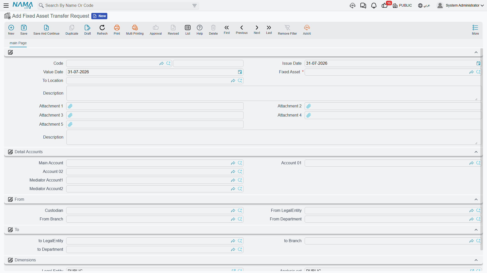
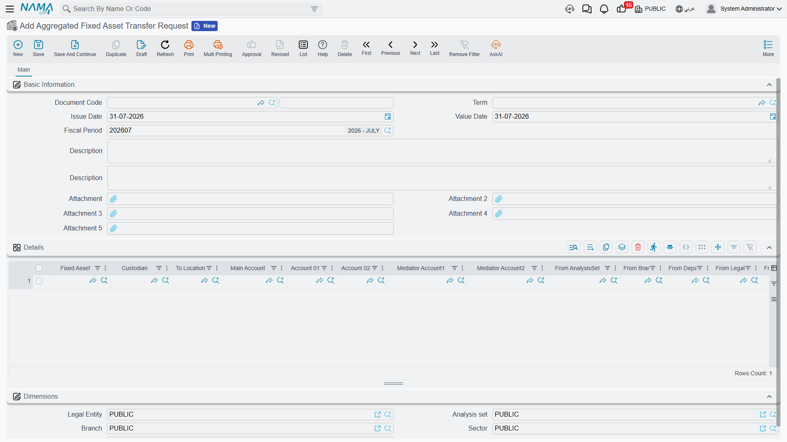

# Asking for a Move: The Transfer Request

In most plants the person who decides that a machine should move is not the person who is allowed to
change the asset register. The production manager wants the CNC machine `MCH-0007` in Hall 3; the
fixed-assets accountant is the one who records it, and only after depreciation for the month is
settled.

The **طلب نقل أصل / Fixed Asset Transfer Request** exists for the first half of that conversation. It
is the piece of paper that says "please move this asset, from here, to there, and hand it to this
person" — and it is honest about being nothing more than that.

## The request records intent and nothing else

Be clear about this before you design a process around it. A transfer request:

- makes no change to the asset — not its location, not its dimensions, not its accounts, not its
  custodian;
- produces no ledger entry and no business request;
- has no status of its own, and no validation at all. It will accept an asset that is disposed, an
  asset still in its initial state, a date in the past, a destination nobody approved. Nothing about
  it is checked, because nothing about it takes effect.

Everything that is checked is checked on the
[transfer document](/modules/fixedassets/movement/fixedassets-transfer-document.md), when the move is
actually recorded. That is the right place for it — but it does mean that a stack of approved
requests is not proof that the moves can be performed.

What the request *is* good for is the two things paper is good for: it can be routed through the same
approval machinery as any other document in Nama, and it saves the accountant from re-typing what the
requester already typed.

## Filling one in

The request is at **الأصول > عهد الأصول > طلب نقل أصل** (Assets > Custody Of Assets > Fixed Asset
Transfer Request), under the `fixedassets` licence. It needs no document term.

The screen is a simplified version of the transfer document:

| Group | Fields |
|---|---|
| Top | Book and code, issue date, value date, **Fixed Asset**, **To Location** (إلي موقع), description, five attachment slots |
| **الحسابات / Detail Accounts** | The asset's three accounts, labelled generically as **Main Account**, **Account 01** and **Account 02** — respectively the asset's cost account, its depreciation account and its accumulated-depreciation account |
| **من / From** | **Custodian**, and the company, branch and department the asset sits in today |
| **إلى / To** | The company, branch and department it should move to |
| **المحددات / Dimensions** | The document's own dimensions, for filing and access rights |

Two mechanics make it quick. Picking the **Fixed Asset** fills the whole *From* side, the accounts and
the custodian straight off the asset record. Picking **To Location** then fills the *To* side from that
location's own master record — the same behaviour the transfer document has, and the same reason to
keep your
[asset locations](/modules/fixedassets/master-files/fixedassets-locations.md)
properly set up.

Al-Waha's production manager raising the Hall 3 move types four things: the asset `MCH-0007`, the
destination `LOC-R3`, a value date, and a line of description saying why. The rest arrives on its own.

::: info The request covers three dimensions, not five
The *From* and *To* groups on the request offer company, branch and department. Sector and analysis
set are on the transfer document but not on the request, so a move that is purely a sector or
analysis-set reassignment is described on the document itself rather than requested on paper.
:::

## Turning a request into a move

There is no button. The accountant opens a new
[transfer document](/modules/fixedassets/movement/fixedassets-transfer-document.md) and picks the
request in the **بناءا على / From Document** field. That copies across the asset, both locations, both
dimension sets, the custodian and the three accounts — the whole request, in one click.

From there the transfer is an ordinary transfer: it is validated, it can be edited before committing,
and it books whatever its changes call for. The link back to the request is kept on the document as a
reference, which is what an auditor asking "who authorised this move?" wants to see.

Because the request is a reference rather than a work item, keep the tidying-up in your own process:
decide who closes the loop, and file requests once their document exists.

## Raising many requests at once

The **طلب نقل أصل مجمع / Aggregated Fixed Asset Transfer Request** is the same idea in bulk — one
screen, one grid, one row per asset. It is what you use when a department is relocating and forty
desks need requesting at once.

The grid carries, per row: the asset, its custodian, the destination location, the three accounts, and
the full five-dimension *From* and *To* sets — so unlike the single request, the aggregated one can
express a sector or analysis-set move.

Picking an asset in a row fills that row's custodian, dimensions and accounts from the asset record,
exactly as on the single request.

On commit the document creates **one transfer request per row**. Which book and which term those
requests are created with comes from the aggregated document's own term, on a page with two fields for
a book and a term: point them at the book and term you use for **transfer requests**, since requests
are what this document produces.

Editing a committed aggregate rebuilds its children; cancelling it deletes them; and a row you remove
takes its generated request with it. Treat the aggregate as the master copy and leave the individual
requests it produced alone.

Requests made this way are picked up one at a time on the transfer document, in the same way as
hand-typed ones. For moving many assets in one action — rather than requesting many — use the
aggregated *transfer document* instead, which is described on the
[transfer document page](/modules/fixedassets/movement/fixedassets-transfer-document.md).
